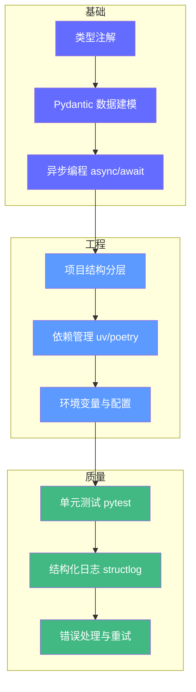

# Python 工程基础——智能体的"骨骼支架"

> Python 不仅是 Agentic AI 开发的首选语言，更是将想法快速固化为可测试、可维护、可扩展的生产级代码的唯一途径。

## 前置知识

- 无，从零开始
- 建议已了解：基本编程概念（变量、函数、循环）

## 核心概念

### 为什么选 Python

Agentic AI 工程的本质是**胶水 + 编排**——将 LLM API、向量库、外部工具、业务逻辑粘合在一起。Python 在这一场景中的优势是压倒性的：

| 维度 | Python | Node.js | Go | Java |
|------|--------|---------|----|------|
| AI 生态 | ★★★★★ | ★★★ | ★★ | ★★★ |
| 原型速度 | ★★★★★ | ★★★★ | ★★★ | ★★ |
| 类型安全 | ★★★ | ★★★★ | ★★★★★ | ★★★★★ |
| 异步支持 | ★★★★ | ★★★★★ | ★★★★ | ★★★ |
| 生产成熟度 | ★★★★ | ★★★★ | ★★★★★ | ★★★★★ |

**关键洞察**：对于 Agent 工程，"胶水 + 编排"场景下 Python 的原型速度远超其他语言，且拥有最完善的 AI 生态。

### 2026 年 Agentic AI 工程师必须掌握的 Python 能力



---

### 1. 类型注解——Agent 的第一道防线

Agent 系统中，类型注解不只是"好习惯"，而是**防止 LLM 产生幻觉参数的硬屏障**。

```python
# 差的写法——没有类型，LLM 无法理解工具的契约
def search(query, limit=5):
    return db.search(query)[:limit]

# 好的写法——完整的类型 + Pydantic 验证
from pydantic import BaseModel, Field

class SearchInput(BaseModel):
    """搜索工具的输入契约。"""
    query: str = Field(
        description="搜索关键词，尽量简洁，建议不超过 50 字",
        max_length=200,
        min_length=1,
    )
    limit: int = Field(
        default=5,
        ge=1, le=20,
        description="返回结果数量，1-20 之间",
    )
    category: str | None = Field(
        default=None,
        description="可选：按类别过滤，如 '技术文档'、'FAQ'",
    )

class SearchResult(BaseModel):
    """搜索工具的输出契约。"""
    title: str
    url: str
    snippet: str
    score: float = Field(description="相关度分数，0-1 之间", ge=0, le=1)

class SearchOutput(BaseModel):
    results: list[SearchResult]
    count: int
    error: str = Field(default="", description="错误信息，无错误则为空")
```

**为什么重要**：
- LLM 通过 Schema 理解工具的输入输出格式
- Pydantic 在运行时自动验证，防止类型错误
- `Field` 中的 `description` 直接作为 LLM 的工具描述

---

### 2. 异步编程——Agent 的并发引擎

Agent 系统大量调用外部 API（LLM、向量库、搜索服务），异步是**提升吞吐量的关键**。

```python
import asyncio
import aiohttp

async def fetch_url(session: aiohttp.ClientSession, url: str, timeout: float = 10.0) -> str:
    """异步获取 URL 内容——网络密集型操作。"""
    try:
        async with asyncio.timeout(timeout):
            async with session.get(url) as resp:
                resp.raise_for_status()
                return await resp.text()
    except asyncio.TimeoutError:
        return f"超时: {url}"
    except aiohttp.ClientError as e:
        return f"请求失败: {url} - {e}"

async def fetch_all(urls: list[str]) -> list[str]:
    """并发获取多个 URL——典型 Agent 工具调用场景。"""
    async with aiohttp.ClientSession() as session:
        tasks = [fetch_url(session, url) for url in urls]
        return await asyncio.gather(*tasks, return_exceptions=True)

# 同步 vs 异步性能对比
# 10 个 URL，每个耗时 ~200ms
# 同步: 10 × 200ms = 2000ms
# 异步: max(200ms) ≈ 250ms（含 overhead）
# 加速比: ~8x
```

**核心原则**：

| 任务类型 | 推荐方式 | 原因 |
|----------|----------|------|
| 网络 I/O（API 调用、HTTP 请求） | `async/await` | 不阻塞，高并发 |
| 向量检索 | `async` + 异步向量库 | 与 LLM 调用并行 |
| CPU 密集型（嵌入计算、图像处理） | 后台任务队列（Celery） | 不阻塞事件循环 |
| 数据库写入 | 异步 ORM 或连接池 | 避免锁等待 |

---

### 3. 项目结构分层——可维护性的基础

```
my-agent/
├── pyproject.toml          # 项目元数据 + 依赖锁定
├── .env.example            # 环境变量模板
├── .env                    # 本地配置（gitignore）
│
├── src/
│   └── my_agent/
│       ├── __init__.py
│       ├── main.py         # 入口：FastAPI 应用启动
│       ├── config.py       # 配置管理（Pydantic Settings）
│       │
│       ├── domain/         # 领域逻辑
│       │   ├── models.py   # 数据模型
│       │   └── services.py # 业务逻辑
│       │
│       ├── agents/         # 智能体实现
│       │   ├── graph.py    # LangGraph 状态图定义
│       │   ├── nodes.py    # 节点实现（检索、综合等）
│       │   └── prompts/    # 提示词模板
│       │       ├── system.txt
│       │       └── qa.txt
│       │
│       ├── tools/          # 工具封装
│       │   ├── search.py   # 搜索工具
│       │   ├── web.py      # 网络工具
│       │   └── database.py # 数据库工具
│       │
│       ├── rag/            # RAG 模块
│       │   ├── chunker.py  # 分块策略
│       │   ├── retriever.py# 检索器
│       │   └── vector_store.py # 向量库
│       │
│       ├── memory/         # 记忆模块
│       │   ├── short_term.py
│       │   └── long_term.py
│       │
│       └── guardrails/     # 安全护栏
│           ├── input.py    # 输入验证
│           └── output.py   # 输出验证
│
├── tests/                  # 测试
│   ├── test_tools.py
│   ├── test_agents.py
│   └── test_guardrails.py
│
└── scripts/                # 运维脚本
    ├── ingest.py           # 文档导入
    └── eval.py             # 评估运行
```

**分层原则**：
- **入口文件**只负责启动，不包含业务逻辑
- **领域逻辑**不依赖框架，保持可测试性
- **智能体图**只定义状态和流程，不实现具体功能
- **工具封装**是 LLM 与外部世界的接口层

---

### 4. 依赖管理与配置

```toml
# pyproject.toml
[project]
name = "my-agent"
version = "0.1.0"
requires-python = ">=3.12"
dependencies = [
    "langgraph>=0.2.0",
    "langchain>=0.3.0",
    "pydantic>=2.0",
    "pydantic-settings>=2.0",
    "fastapi>=0.115.0",
    "uvicorn[standard]>=0.30.0",
    "aiohttp>=3.10.0",
    "structlog>=24.0",
]

[project.optional-dependencies]
dev = [
    "pytest>=8.0",
    "pytest-asyncio>=0.24",
    "ruff>=0.6.0",
]
```

```python
# src/my_agent/config.py
from pydantic_settings import BaseSettings
from pydantic import Field

class Settings(BaseSettings):
    """应用配置——所有敏感信息通过环境变量注入。"""

    # LLM 配置
    openai_api_key: str = Field(..., description="OpenAI API Key")
    openai_model: str = Field(default="gpt-4o", description="使用的模型")

    # 数据库配置
    database_url: str = Field(..., description="PostgreSQL 连接字符串")

    # RAG 配置
    vector_store_type: str = Field(default="chromadb", description="向量库类型")
    embedding_model: str = Field(default="text-embedding-3-small")

    # 服务配置
    host: str = Field(default="0.0.0.0")
    port: int = Field(default=8000)

    # 安全配置
    max_query_length: int = Field(default=2000, description="最大查询长度")
    max_iterations: int = Field(default=20, description="最大迭代次数")

    model_config = {
        "env_file": ".env",
        "env_file_encoding": "utf-8",
        "extra": "forbid",  # 拒绝未知配置——防止拼写错误
    }

settings = Settings()
```

## 工程视角

### Python 版本选择

| 版本 | 推荐度 | 原因 |
|------|--------|------|
| 3.12+ | ★★★★★ | `uv` 原生支持、类型注解增强、性能优化 |
| 3.11 | ★★★★ | 兼容性好、性能提升 10-60% |
| 3.10 | ★★★ | 最低要求，`X | Y` 联合类型需要 `from __future__` |
| 3.9 及以下 | ★ | 不推荐，缺少现代类型语法 |

### 依赖管理工具对比

| 工具 | 速度 | 锁定 | 兼容性 | 推荐场景 |
|------|------|------|--------|----------|
| **uv** | ★★★★★ | 是 | Python 3.8+ | 新项目首选，速度比 pip/poetry 快 10-100x |
| poetry | ★★★ | 是 | Python 3.8+ | 已有项目继续使用 |
| pip + pip-tools | ★★ | 是 | 全兼容 | 简单场景 |
| conda | ★★ | 是 | 全兼容 | 需要非 Python 依赖（CUDA、C 库） |

### 常见反模式

| 反模式 | 症状 | 修复 |
|--------|------|------|
| 意大利面条代码 | 所有逻辑在 main.py，超过 500 行 | 按 domain/tools/agents 分层 |
| 硬编码密钥 | `api_key = "sk-xxx"` 直接写在代码里 | 用 `.env` + Pydantic Settings |
| 同步阻塞 | 多个 API 串行调用，总耗时 = 各耗时之和 | 改用 `asyncio.gather` 并行 |
| 无类型注解 | 函数签名 `def process(data):` | 所有函数加类型注解 |
| 裸 except | `except: pass` 吞掉所有异常 | 捕获具体异常类型 + 日志 |

## 面试视角

### Q: 为什么 Agent 项目首选 Python？

**满分回答框架**：
- Agent 本质是**胶水 + 编排**——连接 LLM、工具、知识库
- Python 的 AI 生态最完善（LangChain、Pydantic、FastAPI、aiohttp）
- 原型速度远超其他语言（写一个 LLM 调用 vs Java 的 boilerplate）
- 生产部署不输其他语言（FastAPI 性能接近 Go，Docker 容器化成熟）
- **但**对于高并发、低延迟场景（如实时推理服务），Go/Rust 更合适

### Q: 异步编程中如何避免阻塞事件循环？

**满分回答框架**：
- 网络 I/O：直接用 `async/await`（aiohttp、asyncpg）
- CPU 密集型：`asyncio.to_thread()` 或 Celery 后台队列
- 第三方同步库：`asyncio.to_thread()` 包装
- 避免在 async 函数中使用 `time.sleep()`（用 `asyncio.sleep()`）

---

## 实战环节：搭建 Agent 项目骨架

### 目标

完成一个结构清晰、可运行的 Python Agent 项目骨架，包含完整的依赖管理、配置、异步工具和测试。

### 环境要求

- Python 3.12+
- `uv` 包管理器（`curl -LsSf https://astral.sh/uv/install.sh | sh`）

### 步骤

**1. 初始化项目**

```bash
uv init my-agent
cd my-agent
uv add "langgraph>=0.2.0" "pydantic>=2.0" "pydantic-settings>=2.0" \
       "fastapi>=0.115.0" "uvicorn[standard]>=0.30.0" "aiohttp>=3.10.0" \
       "structlog>=24.0"
uv add --dev pytest pytest-asyncio ruff
```

**2. 创建目录结构**

```bash
mkdir -p src/my_agent/{domain,agents,tools,rag,memory,guardrails} tests scripts
touch src/my_agent/__init__.py
```

**3. 编写配置模块**

创建 `src/my_agent/config.py`（参考上文 Settings 类），创建 `.env.example`：

```bash
OPENAI_API_KEY=sk-xxx
DATABASE_URL=postgresql://localhost:5432/agent_db
```

**4. 编写第一个异步工具**

创建 `src/my_agent/tools/search.py`：

```python
import aiohttp
from pydantic import BaseModel, Field

class WeatherResult(BaseModel):
    city: str
    temperature: float
    description: str

async def search_weather(city: str) -> WeatherResult:
    """搜索指定城市的天气——异步工具示例。"""
    # 模拟 API 调用（实际应调用 OpenWeatherMap 等）
    import asyncio
    await asyncio.sleep(0.1)  # 模拟网络延迟
    return WeatherResult(city=city, temperature=25.0, description="晴天")
```

**5. 编写测试**

创建 `tests/test_tools.py`：

```python
import pytest
from src.my_agent.tools.search import search_weather

@pytest.mark.asyncio
async def test_search_weather():
    result = await search_weather("北京")
    assert result.city == "北京"
    assert result.temperature > 0
```

**6. 运行测试**

```bash
uv run pytest tests/ -v
```

### 验证成功

- [ ] `uv run pytest tests/ -v` 全部通过
- [ ] `uv run ruff check src/` 无 lint 错误
- [ ] 项目结构包含 domain/agents/tools/rag/memory/guardrails 目录
- [ ] `.env.example` 存在，`.env` 在 `.gitignore` 中

### 思考题

1. 如果一个工具既有同步版本又有异步版本，Agent 应该如何选择？
2. Pydantic Settings 的 `extra: "forbid"` 在生产环境有什么利弊？
3. 如何设计一个通用的重试装饰器，适用于所有异步工具？

---

*上一阶段：无（第一阶段） | [下一阶段：LLM 基础 →](/agentic-ai/02-llm-basics)*
