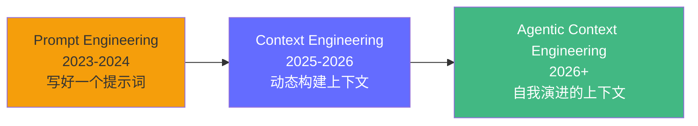
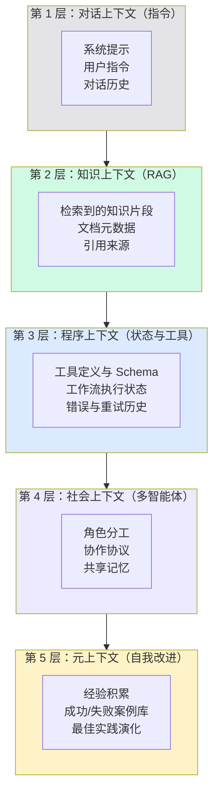
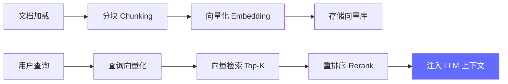
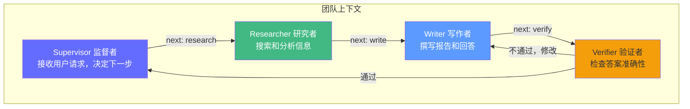

# Prompt 与 Context Engineering——给智能体"装好上下文"

> 2026 年，Prompt Engineering 已经进化为 Context Engineering——不只是写好提示词，而是系统性地将正确的信息在正确的时机传递给智能体。

## 前置知识

- LLM 基础（Token、函数调用、幻觉）
- Python 工程基础

## 核心概念

### 从 Prompt Engineering 到 Context Engineering



| 阶段 | 核心问题 | 方法 | 局限 |
|------|----------|------|------|
| Prompt Engineering | "怎么写好这个提示？" | 技巧：角色、约束、Few-shot | 静态、手动调优 |
| Context Engineering | "如何给 Agent 正确的上下文？" | 系统性构建、路由、选择性加载 | 需要工程实现 |
| Agentic Context Engineering | "如何让 Agent 自己改进上下文？" | 经验积累、自我演化 | 仍在探索 |

### Context 的 5 层架构



---

### 第 1 层：系统提示设计

#### 系统提示 = API 接口定义

好的系统提示不是"话术技巧"，而是**对 Agent 行为的精确规格说明**。

```
┌─────────────────────────────────────────────────────────┐
│                    系统提示模板                           │
├─────────────────────────────────────────────────────────┤
│  [角色]     你是谁，你的职责边界                         │
│  [约束]     你不能做什么，必须遵守的规则                  │
│  [工具策略] 何时使用哪个工具，何时不用                    │
│  [输出格式] 你的回复应该是什么样子                        │
│  [错误处理] 遇到问题时该怎么办                            │
│  [知识来源] 你被允许使用的信息来源                        │
└─────────────────────────────────────────────────────────┘
```

#### 完整示例

```python
SYSTEM_PROMPT = """你是 FDE 知识库问答助手。

## 角色
你是一个专业的 FDE（Frontier Deployment Engineer）知识库助手，
负责根据用户的问题，从检索到的知识片段中提取准确答案。

## 约束
1. 你必须仅基于下方【知识片段】中的信息回答
2. 如果知识片段中没有相关信息，回复："抱歉，我目前没有相关信息"
3. 不要使用知识片段之外的任何信息
4. 不要编造数据、引用或事实
5. 回答简洁，直接回答问题即可，不需要寒暄

## 工具使用策略
- 当用户询问具体事实（如"什么是 KV Cache"）时，先调用 knowledge_search
- 当用户要求执行操作（如"发送邮件"）时，必须先征得用户同意
- 当工具返回空结果时，不要自行编造答案
- 工具调用失败时，最多重试 1 次

## 输出格式
你的回答应包含：
1. 直接答案（1-3 句话，简洁明了）
2. 来源引用（格式："来源：[文档名称] - [章节]"）

## 错误处理
- 如果知识片段之间有矛盾，指出矛盾之处并给出两个版本
- 如果知识片段信息不完整，说明已知的部分和缺失的部分
- 如果用户的问题与知识完全无关，告知用户这超出你的知识范围

## 知识片段
{retrieved_context}
"""
```

#### 系统提示的 Token 消耗分析

| 部分 | Token 数 | 占比 |
|------|----------|------|
| 角色定义 | ~50 | 3% |
| 约束规则 | ~150 | 10% |
| 工具策略 | ~100 | 7% |
| 输出格式 | ~100 | 7% |
| 错误处理 | ~100 | 7% |
| 总计 | ~500 | 31% |

**优化建议**：将不变的规则放在 system 提示（只计费一次），将变化的知识放在 user 消息（每次计费）。

---

### 第 2 层：知识上下文（RAG）



这部分的技术细节在 [第六阶段：RAG 系统实战](/agentic-ai/06-rag-system) 中详细展开。

**Context Engineering 的视角**：RAG 的核心问题是**如何在有限的上下文窗口中注入最相关的知识**。

| 策略 | 方法 | 适用场景 |
|------|------|----------|
| 全量注入 | 所有检索结果放入上下文 | Top-5 文档块，< 5K tokens |
| 选择性注入 | 重排序后只保留 Top-3 | 上下文紧张时 |
| 分步注入 | 第一轮检索，不够再查 | 复杂查询 |
| 摘要注入 | 先摘要检索结果，再回答 | 大量文档 |

---

### 第 3 层：程序上下文

程序上下文让 Agent 理解**当前正在做什么、已经做了什么、下一步该做什么**。

#### 工具定义作为上下文

```python
# 工具描述——LLM 的理解依据
TOOLS_CONTEXT = """
可用工具：

1. knowledge_search(query: str, limit: int) -> list[Result]
   - 用途：搜索内部知识库
   - 适用场景：查找技术文档、FAQ、产品信息
   - 不适用：实时数据（天气、新闻）、执行操作

2. send_email(to: str, subject: str, body: str) -> bool
   - 用途：发送邮件（有副作用）
   - 注意：需要用户确认后才能执行
   - 适用场景：发送通知、报告、提醒

3. get_current_time() -> str
   - 用途：获取当前日期时间
   - 无参数，无副作用
"""

# 工作流状态作为上下文
WORKFLOW_STATE = """
当前任务状态：
- 用户请求："帮我查一下公司的 GPU 服务器配置"
- 已完成步骤：[1. 搜索知识库 → 找到 3 篇相关文档]
- 当前步骤：正在阅读文档并提取信息
- 已收集信息：公司使用 8 台 A100 服务器
- 剩余步骤：[2. 确认具体型号和数量]
"""
```

---

### 第 4 层：社会上下文（多智能体）

多智能体场景中，每个 Agent 需要知道**团队中其他 Agent 的存在和职责**。



```python
TEAM_CONTEXT = """
你是写作专家（Writer）角色。

团队成员：
- Supervisor：协调者，决定下一步由谁执行
- Researcher：负责搜索和分析，输出研究摘要
- Writer（你）：负责撰写最终回答和报告
- Verifier：负责检查答案的准确性和完整性

你的职责：
- 根据 Researcher 的研究摘要撰写回答
- 回答必须基于研究结果，不能编造
- 如果研究结果不充分，请求 Supervisor 让 Researcher 继续

协作协议：
- 收到 Researcher 的结果后，撰写回答
- 如果信息不足，返回"需要更多信息"给 Supervisor
"""
```

---

### 第 5 层：元上下文（自我改进）

最高层次的 Context Engineering——让 Agent 从**经验中学习**，不断优化自己的上下文。

```python
# 经验积累——记录成功和失败的模式
EXPERIENCE_CONTEXT = """
过往经验库：

成功经验：
- 搜索技术文档时，使用"产品名 + 版本号"作为关键词，准确率提升 40%
  示例：搜索 "vLLM 0.6 配置" 而不是 "vLLM 怎么配置"
- 用户问"如何"类问题时，优先提供步骤式回答（1. 2. 3.）

失败教训：
- 2026-01-15：用户要求发送邮件时未确认就执行，发送了错误内容
  原因：跳过了确认步骤
  修复：现在有副作用操作必须先确认
- 2026-01-20：检索时未加租户过滤，返回了其他部门的数据
  原因：元数据过滤被遗漏
  修复：所有检索必须包含 tenant_id 过滤
"""
```

#### ACE 框架（Agentic Context Engineering）

ACE 框架将上下文视为**可演进的 playbook**：

```
初始上下文 → Agent 执行 → 记录成功/失败 → 提炼规则 → 更新上下文 → 下一轮更聪明
```

## 工程视角

### 提示版本化管理

```
src/my_agent/agents/prompts/
├── v1/
│   ├── system.txt        # 初版：简单角色 + 约束
│   └── qa.txt            # 初版：简单问答
├── v2/
│   ├── system.txt        # 添加工具策略 + 错误处理
│   └── qa.txt            # 添加引用格式要求
└── v3/
    ├── system.txt        # 添加租户隔离 + 经验积累
    └── qa.txt            # 添加多轮对话支持
```

```python
# 提示加载器
from pathlib import Path

class PromptLoader:
    def __init__(self, version: str = "v3"):
        self.version = version
        self.prompts_dir = Path(__file__).parent / "prompts" / version

    def load(self, name: str) -> str:
        """加载指定版本的提示词模板。"""
        path = self.prompts_dir / f"{name}.txt"
        return path.read_text(encoding="utf-8")

loader = PromptLoader("v3")
system_prompt = loader.load("system")  # 加载 v3/system.txt
```

### Prompt 测试

```python
# 像测试代码一样测试提示
import pytest
from openai import AsyncOpenAI

@pytest.mark.asyncio
async def test_system_prompt_no_hallucination():
    """测试系统提示能否有效防止幻觉。"""
    client = AsyncOpenAI()
    system = load_prompt("system")

    # 问一个知识库里没有的问题
    response = await client.chat.completions.create(
        model="gpt-4o",
        messages=[
            {"role": "system", "content": system},
            {"role": "user", "content": "公司的食堂几点关门？"},
        ],
    )
    answer = response.choices[0].message.content
    # 应该回复"抱歉，我目前没有相关信息"或类似
    assert "抱歉" in answer or "没有" in answer or "不知道" in answer
```

## 面试视角

### Q: Context Engineering 和 Prompt Engineering 有什么区别？

**满分回答框架**：
- Prompt Engineering 关注**单个提示词的质量**（怎么写好一句话）
- Context Engineering 关注**整个上下文系统的构建**（给 Agent 什么信息、何时给、怎么给）
- 类比：Prompt Engineering 是写一条 SQL，Context Engineering 是设计整个数据管道
- Context Engineering 包含：提示设计、RAG 知识注入、工具定义、状态传递、多智能体协作协议、经验积累

### Q: 如何评估一个系统提示的好坏？

**满分回答框架**：
- **正确性**：是否防止了幻觉（注入攻击是否被拦截）
- **完整性**：是否覆盖了所有需要处理的场景
- **清晰度**：LLM 是否每次都产生一致的行为（可复现性）
- **Token 效率**：是否在达到目标的前提下尽可能精简
- **可维护性**：是否版本化、可测试、可 A/B 对比

---

## 实战环节：构建一个带上下文的 Agent

### 目标

为同一个 Agent 编写 3 个版本的系统提示，逐步增加上下文层次，对比效果。

### 环境要求

- Python 3.12+
- OpenAI API Key

### 步骤

**1. 编写 3 个版本的系统提示**

创建 `src/my_agent/agents/prompts/v1/system.txt`：

```
你是一个助手，回答问题。
```

创建 `v2/system.txt`：

```
你是 FDE 知识库问答助手。

约束：
1. 仅基于下方知识片段回答
2. 如果没有相关信息，回复"暂无相关信息"
3. 不要编造

知识片段：
{retrieved_context}
```

创建 `v3/system.txt`：

```
你是 FDE 知识库问答助手。

## 角色
根据检索到的知识片段回答用户关于 FDE 的技术问题。

## 约束
1. 必须仅基于知识片段，不编造
2. 无相关信息时回复"暂无相关信息"
3. 必须引用来源
4. 回答简洁（1-3 句话）

## 错误处理
- 知识片段有矛盾时，指出矛盾
- 信息不完整时，说明已知和缺失的部分

知识片段：
{retrieved_context}
```

**2. 编写测试对比脚本**

```python
# test_prompts.py
import asyncio
from openai import AsyncOpenAI
from pathlib import Path

VERSIONS = ["v1", "v2", "v3"]
TEST_QUERY = "什么是 KV Cache？"
MOCK_CONTEXT = """KV Cache 是大模型推理中的显存优化技术。
通过缓存 Attention 中的 Key 和 Value 矩阵，避免 Decode 阶段重复计算。
对于 Llama 3 70B，batch=128, seq_len=2048 时，KV Cache 约占用 80GB 显存。"""

async def test_version(version: str, query: str, context: str):
    client = AsyncOpenAI()
    prompt = Path(f"src/my_agent/agents/prompts/{version}/system.txt").read_text()
    prompt = prompt.replace("{retrieved_context}", context)

    response = await client.chat.completions.create(
        model="gpt-4o-mini",  # 用便宜模型测试
        messages=[
            {"role": "system", "content": prompt},
            {"role": "user", "content": query},
        ],
    )
    print(f"--- {version} ---")
    print(f"Prompt 长度: {len(prompt)} 字符")
    print(f"回答: {response.choices[0].message.content}")
    print()

async def main():
    for v in VERSIONS:
        await test_version(v, TEST_QUERY, MOCK_CONTEXT)

asyncio.run(main())
```

**3. 运行对比**

```bash
uv run python test_prompts.py
```

观察 3 个版本的回答差异，记录每个版本的：
- 回答准确性
- 是否引用来源
- 是否编造了知识
- Prompt 的 Token 消耗

### 验证成功

- [ ] v1 版本可能编造了信息（缺乏约束）
- [ ] v2 版本能基于知识回答，但格式不规范
- [ ] v3 版本能准确回答 + 引用来源 + 格式一致
- [ ] 能统计 3 个版本的 Token 消耗差异

### 思考题

1. v3 版本的约束规则每增加一条，Token 成本增加多少？是否存在收益递减点？
2. 如何自动化评估不同版本提示的质量（不只是人工看）？
3. 如果知识片段是英文的，但用户用中文提问，系统提示需要如何调整？

---

*上一阶段：[← LLM 基础](/agentic-ai/02-llm-basics) | [下一阶段：Harness 工程 →](/agentic-ai/04-harness-engineering)*
