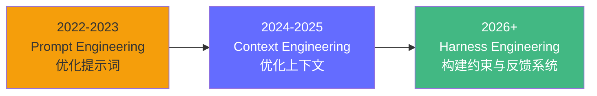
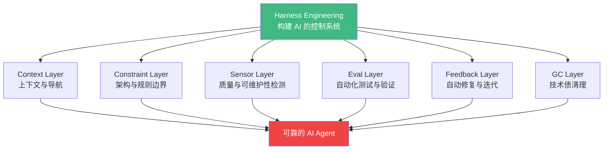
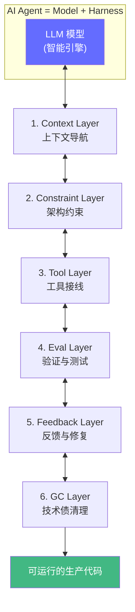
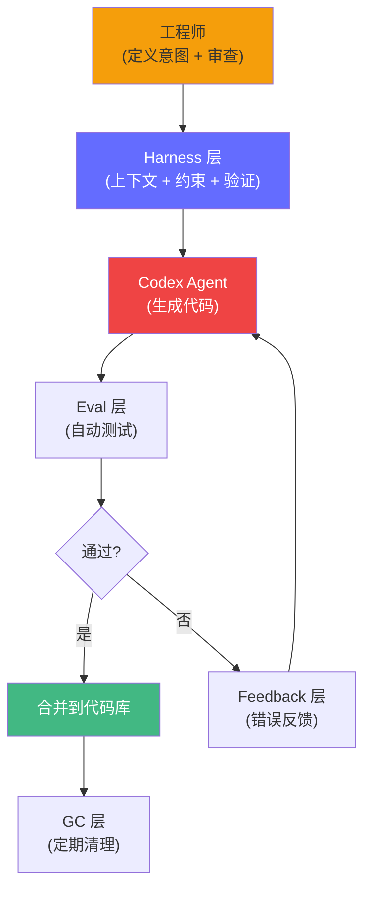
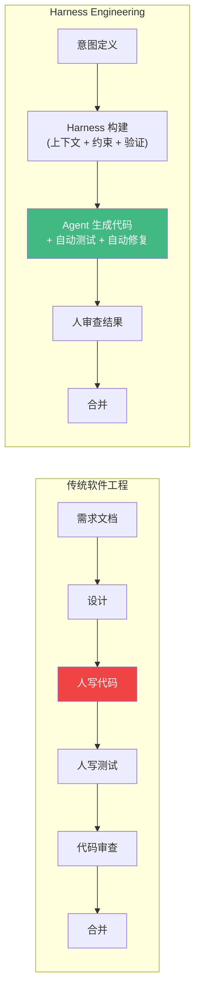

# Harness Engineering——给 AI 套上缰绳

> 2026 年 2 月，Mitchell Hashimoto 命名了一个新范式：**Harness Engineering（驾驭工程）**。随后 OpenAI 的 Ryan Lopopolo 团队用 Codex 在 5 个月内生成了 100 万行代码——**零手写**。Martin Fowler 专文分析。核心洞察：Agent = Model + Harness。如果你不是模型，你就是缰绳的一部分。

## 前置知识

- Context Engineering（上下文设计）
- 基本的 LLM API 调用
- 软件测试基础（单元测试、CI/CD）

## 核心概念

### 三代工程范式演进



| 代 | 范式 | 核心问题 | 典型实践 |
|----|------|---------|----------|
| 第一代 | Prompt Engineering | "怎么问，AI 答得最好？" | Few-shot、CoT、ToT、ReAct |
| 第二代 | Context Engineering | "给 AI 什么上下文，它才能做好？" | RAG、系统提示、知识注入 |
| **第三代** | **Harness Engineering** | **"怎么构建环境、约束和反馈，让 AI 可靠工作？"** | **传感器、验证、约束、自动修复** |



Harness Engineering 的核心理念：**不要优化模型本身，而是优化模型运行的环境。**

### 一个生动的类比

```
马 = AI 模型（智能引擎）
缰绳 = Harness（控制系统）

骑手不直接骑马（不手写代码），
而是通过缰绳控制方向、速度、停止——
这就是 Harness Engineering。
```

| 缰绳组件 | AI 对应物 | 说明 |
|----------|----------|------|
| 方向指引 | Context Engineering | 告诉 Agent 去哪——代码库上下文、架构文档 |
| 刹车 | Constraint Layer | 防止 Agent 跑偏——禁止修改的文件、禁止使用的 API |
| 传感器 | Sensor Layer | 实时监控——代码质量、测试覆盖率、复杂度指标 |
| 终点判定 | Eval Layer | 任务完成了吗？——自动化测试、验收标准 |
| 纠正缰绳 | Feedback Layer | 跑偏了自动纠正——测试失败自动修复 |
| 清洁马蹄 | GC Layer | 定期维护——清理无用代码、重构、格式化 |

---

### Harness 的六层架构



#### 第一层：Context Layer（上下文导航）

不同于 Prompt Engineering 的"写一句好提示词"，Context Engineering 关注**系统性地把正确的信息放到正确的位置**：

```python
# 坏：把一切都塞进 prompt（Context Stuffing）
prompt = """
你是一个 Python 工程师。以下是项目的所有代码（5000 行）...
请修复 auth.py 中的 bug。
[粘贴 5000 行代码]
"""

# 好：系统性地构建上下文（Context Engineering）
class AgentContext:
    """Harness 的上下文层——按需注入信息。"""

    def build_context(self, task: str) -> dict:
        return {
            "task": task,
            # 相关文件（通过语义搜索找到）
            "relevant_files": self.find_relevant_files(task),
            # 架构约束
            "constraints": self.load_constraints(),
            # 编码规范
            "style_guide": self.load_style_guide(),
            # 最近修改（Agent 需要知道当前状态）
            "recent_changes": self.get_recent_git_changes(),
            # 测试信息
            "test_info": self.get_test_info(task),
        }
```

#### 第二层：Constraint Layer（架构约束）

定义 Agent **不能做什么**比定义它能做什么更重要：

```python
# 架构约束清单
CONSTRAINTS = {
    "禁止修改的文件": ["core/db.py", "core/security.py"],
    "禁止使用的 API": ["eval()", "exec()", "os.system()"],
    "必须遵循的模式": [
        "所有数据库操作必须通过 repository 层",
        "所有 API 响应必须用 Pydantic 模型验证",
        "错误必须使用自定义异常类，不能用裸 except",
    ],
    "文件结构约束": [
        "每个文件不超过 300 行",
        "每个函数不超过 50 行",
        "禁止循环导入",
    ],
}

def check_constraints(code_diff: dict) -> list[str]:
    """检查 Agent 的代码修改是否违反约束。"""
    violations = []
    for change in code_diff["changed_files"]:
        if change["path"] in CONSTRAINTS["禁止修改的文件"]:
            violations.append(f"禁止修改文件: {change['path']}")
        if any(bad in change["content"] for bad in CONSTRAINTS["禁止使用的 API"]):
            violations.append("使用了禁止的 API")
        if len(change["content"].split("\n")) > 300:
            violations.append(f"文件超过 300 行: {change['path']}")
    return violations
```

#### 第三层：Tool Layer（工具接线）

这不是"让 Agent 能调用工具"，而是**决定 Agent 能访问哪些工具、以什么权限、在什么条件下**：

```python
class ToolRegistry:
    """Harness 的工具注册表——控制 Agent 的工具权限。"""

    def __init__(self):
        self.tools = {}
        self.permissions = {}

    def register(self, name: str, tool: callable, safe: bool = True):
        """注册工具——标记是否安全（无副作用）。"""
        self.tools[name] = tool
        self.permissions[name] = {"safe": safe}

    def execute(self, name: str, *args, **kwargs) -> dict:
        """执行工具——安全检查 + 权限验证。"""
        if name not in self.tools:
            return {"error": f"未知工具: {name}"}

        perm = self.permissions[name]
        if not perm["safe"]:
            # 不安全操作需要额外确认
            logger.warning(f"执行不安全工具: {name}")

        try:
            result = self.tools[name](*args, **kwargs)
            return {"result": result}
        except Exception as e:
            return {"error": str(e)}

# 注册示例
registry = ToolRegistry()
registry.register("read_file", read_file, safe=True)       # 安全
registry.register("write_file", write_file, safe=False)     # 不安全——有副作用
registry.register("run_tests", run_tests, safe=True)        # 安全
registry.register("git_commit", git_commit, safe=False)     # 不安全
```

#### 第四层：Eval Layer（验证与测试）

**这是 Harness Engineering 最关键的一层。** Agent 生成的代码必须通过验证才能被接受：

```python
class EvalHarness:
    """评估缰绳——Agent 的代码必须通过这组检查才能合并。"""

    def __init__(self):
        self.checks = [
            self.check_syntax,       # 语法检查
            self.check_lint,         # 代码风格
            self.check_type,         # 类型检查
            self.check_unit_tests,   # 单元测试
            self.check_integration,  # 集成测试
            self.check_complexity,   # 复杂度检查
            self.check_security,     # 安全检查
        ]

    def evaluate(self, code_change: dict) -> dict:
        """运行所有检查，返回评估报告。"""
        results = {}
        all_passed = True

        for check in self.checks:
            name = check.__name__.replace("check_", "")
            try:
                passed, detail = check(code_change)
                results[name] = {"passed": passed, "detail": detail}
                if not passed:
                    all_passed = False
            except Exception as e:
                results[name] = {"passed": False, "detail": str(e)}
                all_passed = False

        return {
            "all_passed": all_passed,
            "results": results,
            "summary": f"{sum(1 for r in results.values() if r['passed'])}/{len(results)} 通过",
        }

    def check_complexity(self, change: dict) -> tuple[bool, str]:
        """检查圈复杂度——单函数不超过 10。"""
        import ast
        tree = ast.parse(change["content"])
        for node in ast.walk(tree):
            if isinstance(node, (ast.FunctionDef, ast.AsyncFunctionDef)):
                complexity = self._cyclomatic_complexity(node)
                if complexity > 10:
                    return False, f"函数 {node.name} 圈复杂度 {complexity} > 10"
        return True, "所有函数复杂度在范围内"

    def _cyclomatic_complexity(self, node) -> int:
        """计算圈复杂度。"""
        complexity = 1
        for child in ast.walk(node):
            if isinstance(child, (ast.If, ast.While, ast.For, ast.ExceptHandler,
                                  ast.With, ast.Assert, ast.boolop)):
                complexity += 1
        return complexity
```

#### 第五层：Feedback Layer（反馈与修复）

Harness Engineering 的核心洞察：**让 Agent 自己修复自己的错误**：

```python
class FeedbackLoop:
    """反馈循环——Agent 生成代码 → 验证 → 失败则自动修复。"""

    MAX_ITERATIONS = 3  # 最多自动修复 3 次

    def run_with_feedback(self, agent_fn: callable, task: str) -> dict:
        """运行 Agent 并自动处理失败。"""
        last_error = None

        for attempt in range(self.MAX_ITERATIONS):
            # 1. Agent 生成代码
            result = agent_fn(task, last_error)

            # 2. 验证
            eval_result = self.eval_harness.evaluate(result)

            if eval_result["all_passed"]:
                return {
                    "status": "success",
                    "code": result,
                    "attempts": attempt + 1,
                    "eval": eval_result,
                }

            # 3. 失败——收集错误信息，反馈给 Agent
            last_error = self._format_feedback(eval_result)
            logger.warning(f"第 {attempt + 1} 次尝试失败: {last_error[:100]}")

        return {
            "status": "failed",
            "last_code": result,
            "attempts": self.MAX_ITERATIONS,
            "last_error": last_error,
        }

    def _format_feedback(self, eval_result: dict) -> str:
        """将评估结果格式化为 Agent 可理解的反馈。"""
        feedback_parts = []
        for check_name, result in eval_result["results"].items():
            if not result["passed"]:
                feedback_parts.append(f"- {check_name}: {result['detail']}")
        return "以下检查未通过，请修复后重新提交：\n" + "\n".join(feedback_parts)
```

#### 第六层：GC Layer（技术债清理）

Agent 多次修改后会积累技术债——Harness 需要定期清理：

```python
class GarbageCollector:
    """Harness 的 GC 层——定期清理 Agent 积累的技术债。"""

    def run_cleanup(self, repo_path: str) -> dict:
        """执行清理任务。"""
        actions = []

        # 1. 删除未使用的导入
        actions.append(self.remove_unused_imports(repo_path))

        # 2. 格式化所有文件
        actions.append(self.format_all(repo_path))

        # 3. 检测并标记重复代码
        actions.append(self.detect_duplicates(repo_path))

        # 4. 更新过时的类型注解
        actions.append(self.fix_type_hints(repo_path))

        # 5. 清理临时文件和注释掉的代码
        actions.append(self.clean_commented_code(repo_path))

        return {
            "actions": actions,
            "summary": f"清理完成：{len(actions)} 项操作",
        }
```

---

### OpenAI 的 Harness Engineering 实践

2026 年 2 月，OpenAI 的 Ryan Lopopolo 发表了 [Harness Engineering: Leveraging Codex in an Agent-First World](https://openai.com/index/harness-engineering/)，披露了一个震撼行业的实验：

```
团队规模：3 名工程师
时间：5 个月
产出：100 万行代码
手写代码：0 行

成功因素不是模型有多强，
而是 Harness 设计得有多好。
```

#### OpenAI 的 Harness 架构



**关键洞察**：工程师的时间不再花在"写代码"上，而是花在：
- 定义高层意图（"我们需要一个用户认证模块"）
- 审查 Agent 的输出（"这个方案对吗？"）
- 改进 Harness（"测试覆盖率不够，加更多传感器"）

### Martin Fowler 的分析

Martin Fowler 在 [Harness Engineering for Coding Agent Users](https://martinfowler.com/articles/harness-engineering.html) 中提出了两个关键概念：

#### Guides（导航）和 Sensors（传感器）

```
Guides（导航）= 告诉 Agent 方向的信息
  - 代码库结构
  - 架构文档
  - 编码规范
  - 类似功能的参考实现

Sensors（传感器）= 监控 Agent 健康的指标
  - 测试覆盖率
  - 圈复杂度
  - 代码重复率
  - 依赖新鲜度
  - 构建成功率
```

| Guides（导航） | Sensors（传感器） |
|---------------|-----------------|
| 主动引导 Agent | 被动监控 Agent |
| 类似"GPS 路线" | 类似"仪表盘告警" |
| 告诉 Agent 怎么做 | 告诉人类 Agent 做得怎样 |

---

### Harness vs 传统工程的范式对比



| 维度 | 传统工程 | Harness Engineering |
|------|---------|-------------------|
| **主要执行者** | 人类开发者 | AI Agent |
| **人类角色** | 写实现细节 | 定义意图、审查、改进 Harness |
| **产出瓶颈** | 人类速度（线性） | 验证速度（可并行） |
| **质量保障** | 代码审查（主观） | 自动化测试（客观） |
| **规模化** | 加人 | 加计算资源 |
| **知识传递** | 文档 + 口口相传 | 编码到 Harness 中 |
| **适合场景** | 创造性、探索性 | 重复性、模式化 |

### 生产级 Harness Checklist

```
Context Layer:
  □ 代码库索引（语义搜索 + 关键词搜索）
  □ 架构文档（模块职责、依赖关系）
  □ 编码规范（命名、格式、模式）
  □ 最近变更记录（Agent 知道当前状态）

Constraint Layer:
  □ 禁止修改的文件/目录白名单
  □ 禁止使用的 API/函数黑名单
  □ 代码风格规则（行数限制、复杂度限制）
  □ 依赖管理规则（版本锁定、禁止引入新依赖）

Tool Layer:
  □ 工具注册表（名称、描述、Schema）
  □ 权限分级（安全/不安全操作）
  □ 速率限制（防止无限循环调用）
  □ 超时控制（防止挂起）

Eval Layer:
  □ 语法检查（编译/解析通过）
  □ 代码风格（linting）
  □ 类型检查（mypy/pyright）
  □ 单元测试（现有测试全部通过）
  □ 集成测试（端到端场景）
  □ 复杂度检查（圈复杂度、行数）
  □ 安全检查（注入、权限）

Feedback Layer:
  □ 自动收集失败信息
  □ 格式化反馈给 Agent
  □ 限制修复次数（防止无限循环）
  □ 记录每次修复尝试

GC Layer:
  □ 清理未使用的导入
  □ 格式化代码
  □ 检测重复代码
  □ 清理注释掉的代码
  □ 定期重构
```

## 工程视角

### 构建你的第一个 Harness

以下是一个完整的 Harness 实现，用于让 AI Agent 安全地修改代码：

```python
"""
minimal_harness.py — 最小可用 Harness

这个 Harness 包含了所有六层的核心逻辑：
1. Context：按需注入上下文
2. Constraint：代码约束检查
3. Tool：受控的工具调用
4. Eval：自动化验证
5. Feedback：自动修复循环
6. GC：技术债清理
"""

import ast
import subprocess
from dataclasses import dataclass, field
from typing import Callable

@dataclass
class CodeChange:
    """表示一次代码变更。"""
    file_path: str
    new_content: str
    original_content: str = ""

@dataclass
class EvalReport:
    """评估报告。"""
    passed: bool
    checks: dict = field(default_factory=dict)
    summary: str = ""

class MinimalHarness:
    """最小可用 Harness——六层架构的简化版。"""

    def __init__(self, repo_path: str, agent_fn: Callable):
        self.repo_path = repo_path
        self.agent_fn = agent_fn  # Agent 生成代码的函数
        self.max_feedback_iterations = 3

    # ===== 1. Context Layer =====
    def build_context(self, task: str) -> dict:
        """构建 Agent 需要的上下文。"""
        return {
            "task": task,
            "repo_structure": self._get_repo_structure(),
            "relevant_files": self._find_relevant_files(task),
            "constraints": self._load_constraints(),
            "style_guide": self._load_style_guide(),
        }

    def _get_repo_structure(self) -> str:
        """获取项目文件树。"""
        result = subprocess.run(
            ["find", self.repo_path, "-name", "*.py", "-not", "-path", "*/__pycache__/*"],
            capture_output=True, text=True
        )
        return result.stdout

    def _find_relevant_files(self, task: str) -> list[str]:
        """找到与任务相关的文件（简化版：关键词匹配）。"""
        # 生产环境应使用语义搜索
        result = subprocess.run(
            ["grep", "-rl", task.split()[-1], self.repo_path],
            capture_output=True, text=True
        )
        return result.stdout.strip().split("\n")

    def _load_constraints(self) -> dict:
        return {
            "max_file_lines": 300,
            "max_function_lines": 50,
            "max_complexity": 10,
            "banned_apis": ["eval(", "exec(", "os.system("],
        }

    def _load_style_guide(self) -> str:
        return """
- 使用 4 空格缩进
- 函数名用 snake_case
- 类名用 PascalCase
- 每个函数必须有 docstring
- 优先使用类型注解
"""

    # ===== 2. Constraint Layer =====
    def check_constraints(self, change: CodeChange) -> list[str]:
        """检查是否违反约束。"""
        violations = []
        constraints = self._load_constraints()

        lines = change.new_content.split("\n")
        if len(lines) > constraints["max_file_lines"]:
            violations.append(f"文件 {len(lines)} 行 > {constraints['max_file_lines']}")

        for api in constraints["banned_apis"]:
            if api in change.new_content:
                violations.append(f"使用了禁止的 API: {api}")

        # 语法检查
        try:
            ast.parse(change.new_content)
        except SyntaxError as e:
            violations.append(f"语法错误: {e}")

        return violations

    # ===== 3. Tool Layer =====
    def safe_run_tests(self) -> dict:
        """安全地运行测试——封装测试工具。"""
        try:
            result = subprocess.run(
                ["python", "-m", "pytest", "--tb=short", "-q"],
                cwd=self.repo_path, capture_output=True, text=True, timeout=60
            )
            return {
                "passed": result.returncode == 0,
                "output": result.stdout + result.stderr,
            }
        except subprocess.TimeoutExpired:
            return {"passed": False, "output": "测试超时"}

    # ===== 4. Eval Layer =====
    def evaluate(self, change: CodeChange) -> EvalReport:
        """运行完整的评估流水线。"""
        report = EvalReport(passed=True)

        # 约束检查
        violations = self.check_constraints(change)
        if violations:
            report.checks["constraints"] = {"passed": False, "detail": violations}
            report.passed = False
        else:
            report.checks["constraints"] = {"passed": True, "detail": "无违规"}

        # 测试检查
        test_result = self.safe_run_tests()
        report.checks["tests"] = test_result
        if not test_result["passed"]:
            report.passed = False

        # 复杂度检查
        complexity_ok = self._check_complexity(change)
        report.checks["complexity"] = {"passed": complexity_ok}
        if not complexity_ok:
            report.passed = False

        report.summary = f"{'通过' if report.passed else '未通过'}: {len([k for k,v in report.checks.items() if v.get('passed')])}/{len(report.checks)} 检查通过"
        return report

    def _check_complexity(self, change: CodeChange) -> bool:
        """检查圈复杂度。"""
        try:
            tree = ast.parse(change.new_content)
            for node in ast.walk(tree):
                if isinstance(node, (ast.FunctionDef, ast.AsyncFunctionDef)):
                    complexity = sum(
                        1 for child in ast.walk(node)
                        if isinstance(child, (ast.If, ast.While, ast.For, ast.ExceptHandler, ast.BoolOp))
                    ) + 1
                    if complexity > 10:
                        return False
        except SyntaxError:
            return False
        return True

    # ===== 5. Feedback Layer =====
    def run_with_feedback(self, task: str) -> dict:
        """运行 Agent + 反馈循环。"""
        context = self.build_context(task)
        last_error = None

        for attempt in range(self.max_feedback_iterations):
            # Agent 生成代码
            content = self.agent_fn(context, last_error)
            change = CodeChange(file_path="target.py", new_content=content)

            # 评估
            report = self.evaluate(change)

            if report.passed:
                return {
                    "status": "success",
                    "code": content,
                    "attempts": attempt + 1,
                    "report": report.summary,
                }

            # 反馈
            last_error = self._format_feedback(report)

        return {
            "status": "failed",
            "last_code": content,
            "attempts": self.max_feedback_iterations,
            "last_error": last_error,
        }

    def _format_feedback(self, report: EvalReport) -> str:
        feedback_parts = []
        for check_name, result in report.checks.items():
            if not result.get("passed"):
                detail = result.get("detail", "检查失败")
                if isinstance(detail, list):
                    feedback_parts.extend(detail)
                else:
                    feedback_parts.append(f"{check_name}: {detail}")
        return "请修复以下问题：\n" + "\n".join(feedback_parts)

    # ===== 6. GC Layer =====
    def run_gc(self, file_path: str) -> str:
        """执行清理——去除未使用的导入、格式化等。"""
        try:
            # 使用 autimport 去除未使用的导入
            subprocess.run(["autoflake", "-i", "--remove-all-unused-imports", file_path])
            # 使用 black 格式化
            subprocess.run(["black", "-q", file_path])
            return "清理完成"
        except Exception as e:
            return f"清理失败: {e}"
```

### Harness Engineering 的成本模型

| 阶段 | 传统工程 | Harness Engineering |
|------|---------|-------------------|
| 需求定义 | 10% 时间 | **30% 时间**（意图定义更重要） |
| 编码 | 50% 时间 | **5% 时间**（Agent 自动完成） |
| 测试 | 20% 时间 | **40% 时间**（构建验证管线） |
| 审查 | 10% 时间 | **15% 时间**（审查 Agent 输出） |
| 调试 | 10% 时间 | **10% 时间**（调试 Harness 而非代码） |

**关键转变**：Harness Engineering 把时间从"写代码"转移到"定义意图"和"构建验证"上。

## 面试视角

### Q: 什么是 Harness Engineering？它和 Prompt Engineering 有什么区别？

**满分回答框架**：
- Prompt Engineering 关注"怎么写一句好提示词让 AI 答得好"
- Context Engineering 关注"怎么系统性地给 AI 提供正确的上下文"
- **Harness Engineering 关注"怎么构建约束、验证和反馈系统，让 AI 能可靠地完成任务"**
- 类比：Prompt = 对马喊话，Context = 给马看地图，Harness = 套上缰绳和马鞍
- 核心公式：Agent = Model + Harness。如果你不是模型，你就是缰绳的一部分
- OpenAI 用 Harness Engineering 实现了 3 人 5 个月 100 万行代码零手写

### Q: 一个生产级 Harness 应该包含哪些层？

**满分回答框架**：
1. **Context Layer**：按需注入代码库上下文、架构文档、编码规范
2. **Constraint Layer**：定义禁止操作、代码风格、复杂度上限
3. **Tool Layer**：受控的工具注册表，区分安全/不安全操作
4. **Eval Layer**：自动化验证流水线——语法、风格、类型、测试、安全
5. **Feedback Layer**：自动收集错误、格式化反馈、限制修复次数
6. **GC Layer**：定期清理未用导入、格式化、去重、重构

### Q: 你怎么看待"如果 Harness 设计得好，模型能力要求可以降低"？

**满分回答框架**：
- 同意。好的 Harness 可以补偿模型的不足
- 例如：一个 70B 模型 + 好 Harness > 一个 700B 模型 + 差 Harness
- 原因：Harness 提供了结构化约束（减少犯错空间）、自动化验证（快速发现问题）、反馈循环（自我修复）
- OpenAI 的实验证明——关键是 Harness 质量，不是模型大小
- 实践建议：先投资 Harness，再升级模型

---

## 实战环节：构建一个代码修复 Harness

### 目标

为一个 Python 项目构建 Harness，让它自动修复代码中的 bug，并确保修改后的代码通过所有检查。

### 环境要求

- Python 3.12+
- `uv add pytest black autoflake`
- 一个待修复的 Python 项目（或使用下面的示例）

### 步骤

**1. 创建示例项目（含 bug）**

```python
# buggy_project/calculator.py
def divide(a, b):
    """除法——有 bug：b 为 0 时不处理。"""
    return a / b  # ZeroDivisionError!

def average(numbers):
    """平均值——有 bug：空列表时不处理。"""
    return sum(numbers) / len(numbers)  # ZeroDivisionError!

def find_max(numbers):
    """最大值——有 bug：None 输入不处理。"""
    return max(numbers)  # TypeError: 'NoneType' is not iterable
```

```python
# buggy_project/test_calculator.py
import pytest
from calculator import divide, average, find_max

def test_divide():
    assert divide(10, 2) == 5.0
    assert divide(10, 0) is None  # 应该返回 None 而不是抛异常

def test_average():
    assert average([1, 2, 3]) == 2.0
    assert average([]) is None  # 应该返回 None

def test_find_max():
    assert find_max([1, 2, 3]) == 3
    assert find_max(None) is None  # 应该返回 None
```

**2. 实现 Harness**

```python
# harness.py
import ast
import subprocess
from dataclasses import dataclass, field
from typing import Callable

@dataclass
class CodeChange:
    file_path: str
    new_content: str
    original_content: str = ""

@dataclass
class EvalReport:
    passed: bool
    checks: dict = field(default_factory=dict)
    summary: str = ""

class CodeFixHarness:
    """代码修复 Harness——实战版本。"""

    def __init__(self, project_path: str, agent_fn: Callable):
        self.project_path = project_path
        self.agent_fn = agent_fn
        self.max_iterations = 3

    def build_context(self, bug_report: str) -> dict:
        """构建修复任务的上下文。"""
        # 读取原始代码
        original = open(f"{self.project_path}/calculator.py").read()
        # 读取测试（知道期望行为）
        tests = open(f"{self.project_path}/test_calculator.py").read()
        # 运行测试获取当前失败信息
        test_output = self._run_tests()

        return {
            "bug_report": bug_report,
            "original_code": original,
            "test_code": tests,
            "current_test_output": test_output,
            "instructions": "修复代码使所有测试通过。保持函数签名不变。",
        }

    def _run_tests(self) -> str:
        result = subprocess.run(
            ["python", "-m", "pytest", "-v", f"{self.project_path}/test_calculator.py"],
            capture_output=True, text=True, timeout=30
        )
        return result.stdout + result.stderr

    def check_constraints(self, change: CodeChange) -> list[str]:
        """约束检查。"""
        violations = []
        banned = ["eval(", "exec(", "os.system(", "subprocess."]
        for b in banned:
            if b in change.new_content:
                violations.append(f"禁止使用: {b}")

        try:
            tree = ast.parse(change.new_content)
            # 检查函数签名是否改变
            funcs = {n.name for n in ast.walk(tree) if isinstance(n, ast.FunctionDef)}
            expected = {"divide", "average", "find_max"}
            if funcs != expected:
                violations.append(f"函数列表改变: 期望 {expected}, 实际 {funcs}")
        except SyntaxError as e:
            violations.append(f"语法错误: {e}")

        return violations

    def evaluate(self, change: CodeChange) -> EvalReport:
        """评估变更。"""
        report = EvalReport(passed=True)

        # 写入变更
        with open(f"{self.project_path}/calculator.py", "w") as f:
            f.write(change.new_content)

        # 约束检查
        violations = self.check_constraints(change)
        report.checks["constraints"] = {
            "passed": len(violations) == 0,
            "detail": violations or "无违规",
        }
        if violations:
            report.passed = False

        # 测试检查
        test_output = self._run_tests()
        test_passed = "passed" in test_output and "failed" not in test_output
        report.checks["tests"] = {
            "passed": test_passed,
            "detail": test_output[-500:],  # 最后 500 字符
        }
        if not test_passed:
            report.passed = False

        report.summary = f"{'通过' if report.passed else '未通过'}"
        return report

    def run(self, bug_report: str) -> dict:
        """运行 Harness——主入口。"""
        context = self.build_context(bug_report)
        last_error = None

        for attempt in range(self.max_iterations):
            # Agent 生成修复代码
            content = self.agent_fn(context, last_error)
            change = CodeChange(
                file_path="calculator.py",
                new_content=content,
                original_content=context["original_code"],
            )

            # 评估
            report = self.evaluate(change)

            if report.passed:
                return {
                    "status": "success",
                    "attempts": attempt + 1,
                    "report": report.summary,
                }

            # 反馈
            last_error = self._format_feedback(report)

        return {
            "status": "failed",
            "attempts": self.max_iterations,
            "last_error": last_error,
        }

    def _format_feedback(self, report: EvalReport) -> str:
        parts = []
        for name, result in report.checks.items():
            if not result.get("passed"):
                parts.append(f"- {name}: {result['detail']}")
        return "请修复：\n" + "\n".join(parts)
```

**3. 模拟 Agent（用简单规则代替 LLM）**

```python
# agent.py — 在实际中替换为 LLM 调用
def simple_agent(context: dict, last_error: str | None = None) -> str:
    """模拟 Agent——实际应用中调用 LLM API。"""

    # 第一轮：基于 bug report 尝试修复
    if last_error is None:
        return '''def divide(a, b):
    """除法——处理除零异常。"""
    if b == 0:
        return None
    return a / b

def average(numbers):
    """平均值——处理空列表。"""
    if not numbers:
        return None
    return sum(numbers) / len(numbers)

def find_max(numbers):
    """最大值——处理 None 输入。"""
    if numbers is None:
        return None
    return max(numbers)
'''

    # 后续轮次：基于反馈修复
    # 实际应用中这里调用 LLM，传入错误反馈
    return context["original_code"]  # 简化版：回退原始代码

# 运行 Harness
from harness import CodeFixHarness

harness = CodeFixHarness("buggy_project", simple_agent)
result = harness.run("修复 calculator.py 中的所有 bug，使测试通过")
print(result)
# → {'status': 'success', 'attempts': 1, 'report': '通过'}
```

**4. 运行**

```bash
uv run python harness_demo.py
```

### 验证成功

- [ ] Harness 能识别 `divide(10, 0)` 的 ZeroDivisionError
- [ ] Agent 生成的修复代码通过所有 3 个测试
- [ ] 约束检查未发现违规（无禁止 API、函数签名未改变）
- [ ] 整个修复过程自动完成，无需人工干预

### 思考题

1. 把 `simple_agent` 替换为真实的 LLM（如 GPT-4o），比较修复成功率。
2. 给 Harness 增加"代码审查"步骤——修复后检查代码风格、注释质量。
3. 设计一个多文件的 Harness——当修改一个文件时，自动检查依赖文件的兼容性。

---

*上一阶段：[← Context Engineering](/agentic-ai/03-context-engineering) | [下一阶段：框架与工具 →](/agentic-ai/05-frameworks-tools)*
