# 框架与工具调用——框架为用，架构为主

> 面对 20+ 个 Agent 框架，记住：工具是仆从，架构才是主人。2026 年还要掌握 MCP 协议——Agent 连接工具的行业标准。

## 前置知识

- Context Engineering（系统提示设计）
- LLM 函数调用原理

## 核心概念

### 2026 框架全景

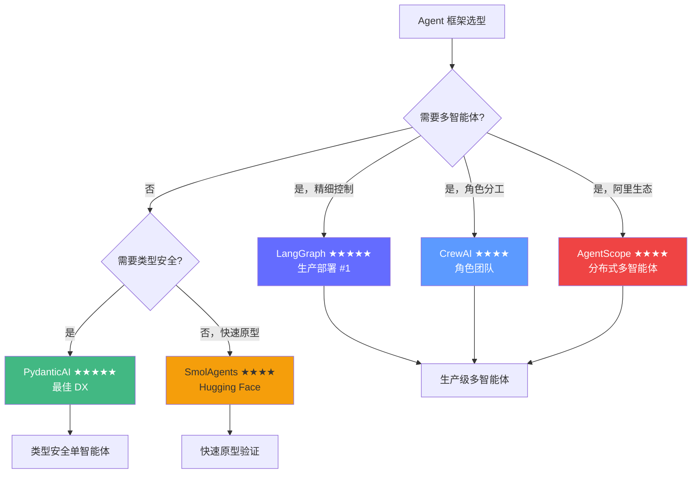

| 框架 | 定位 | 多智能体 | 类型安全 | 分布式 | 学习曲线 | 生产排名 |
|------|------|----------|----------|--------|----------|----------|
| **LangGraph** | 图式工作流 | ★★★★★ | ★★★ | 单机 | 中等 | **#1** |
| **PydanticAI** | 类型安全 Agent | ★☆☆ | ★★★★★ | 否 | 低 | Top 3 |
| **AgentScope** | 分布式多智能体 | ★★★★★ | ★★★ | 原生 gRPC | 中等 | Top 3 |
| **SmolAgents** | 轻量代码 Agent | ★★☆ | ★★☆ | 否 | 极低 | Top 5 |
| CrewAI | 角色团队 | ★★★★★ | ★★☆ | 否 | 低 | 中等 |
| AutoGen | 多智能体对话 | ★★★★★ | ★★★ | 部分 | 中等 | 中等 |
| Google ADK | Google 生态 | ★★★★ | ★★★★ | 否 | 中等 | 上升中 |

---

### 各框架技术原理图

#### 1. LangGraph：显式状态图

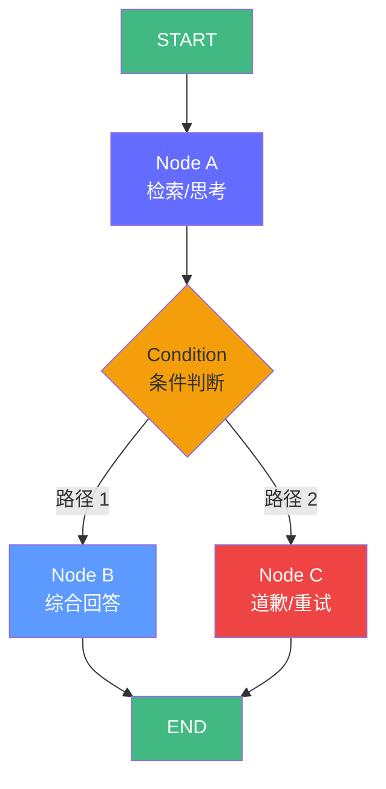

**核心原理**：将 Agent 行为建模为 `StateGraph`——开发者定义状态结构（TypedDict），每个节点是纯函数（输入 State → 输出 State 增量），边决定流转路径。

| 组件 | 说明 |
|------|------|
| `StateGraph` | 图结构容器，定义节点和有向边 |
| `State` (TypedDict) | Agent 的"记忆"，所有节点共享和修改 |
| `Node` | 纯函数：`def node(state) -> dict` |
| `Conditional Edge` | 函数返回字符串，映射到不同目标节点 |
| `MemorySaver` | 检查点机制，支持断点恢复 |

**数据流**：`invoke(state) → 入口节点 → 条件边 → 目标节点 → ... → END`

#### 2. PydanticAI：类型安全 Agent

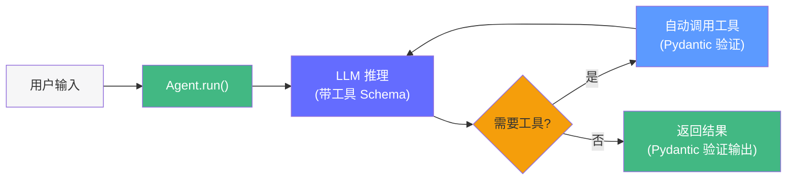

**核心原理**：基于 Pydantic 类型系统构建——`@agent.tool` 装饰器自动从函数签名生成工具 Schema，LLM 的输入/输出/工具调用全部经过 Pydantic 模型验证。

| 组件 | 说明 |
|------|------|
| `Agent` | 核心类，封装 LLM + 工具 + 系统提示 |
| `@agent.tool` | 装饰器，自动从函数签名生成 JSON Schema |
| `RunContext[Deps]` | 依赖注入容器 |
| `Result[OutputT]` | 类型安全的运行结果 |

**数据流**：`Agent.run(input) → LLM(带工具) → 工具调用 → 结果回填 → 最终输出（Pydantic 验证）`

#### 3. AgentScope：消息驱动 + 分布式

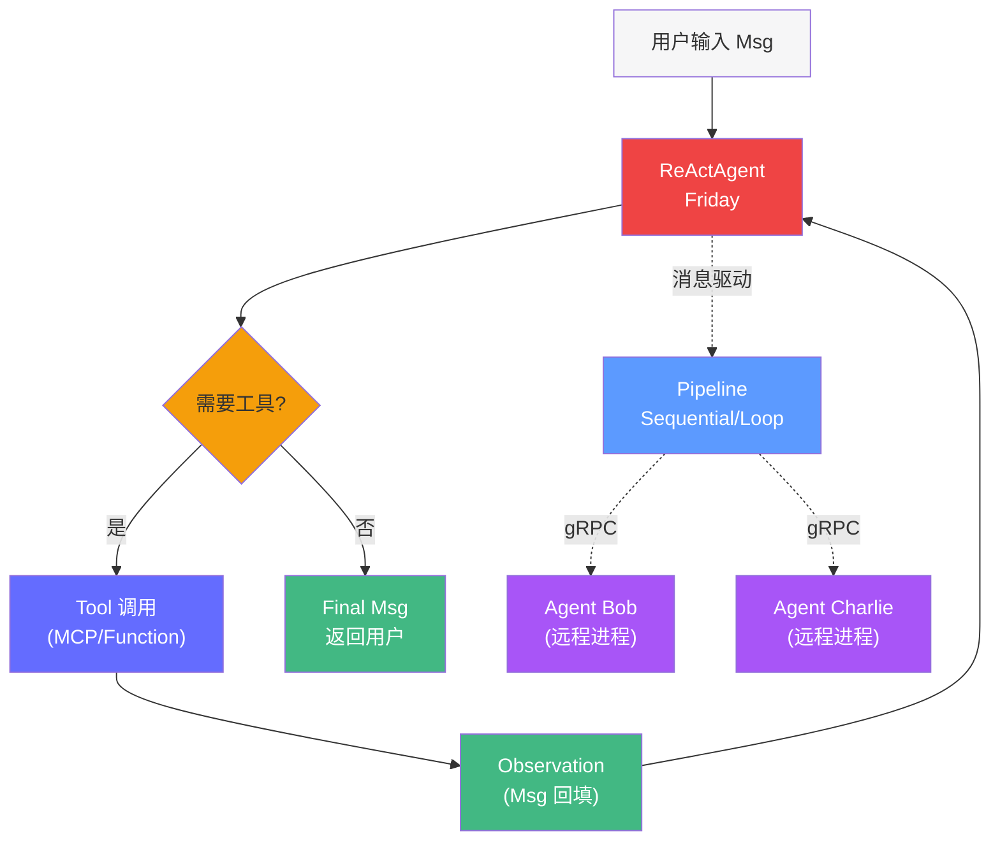

**核心原理**：阿里巴巴通义实验室开源，采用 **Actor 模型 + 消息驱动** 架构——所有 Agent 间通信被抽象为 `Msg` 的发送和接收，Agent 是独立的 Actor，天然支持 gRPC 分布式部署。

| 组件 | 说明 |
|------|------|
| `Msg` | 消息对象：`Msg(name, content, role)`，所有交互的基本单位 |
| `ReActAgent` | 内置 ReAct 循环的智能体：思考 → 行动 → 观察 |
| `ModelWrapper` | 统一模型接口，兼容 17+ LLM 提供商 |
| `Memory` | 短期/长期记忆管理 |
| `Pipeline` | 工作流编排：Sequential/IfElse/WhileLoop/ForLoop |
| `gRPC Runtime` | 分布式部署，Agent 可跨进程/跨机器通信 |

**数据流**：`Msg → ReActAgent(Msg) → 工具调用 → Msg 回填 → Pipeline 编排 → 远程 Agent(gRPC)`

---

### CrewAI 详解（角色团队编排）

#### 核心架构：角色 + 任务 + 团队

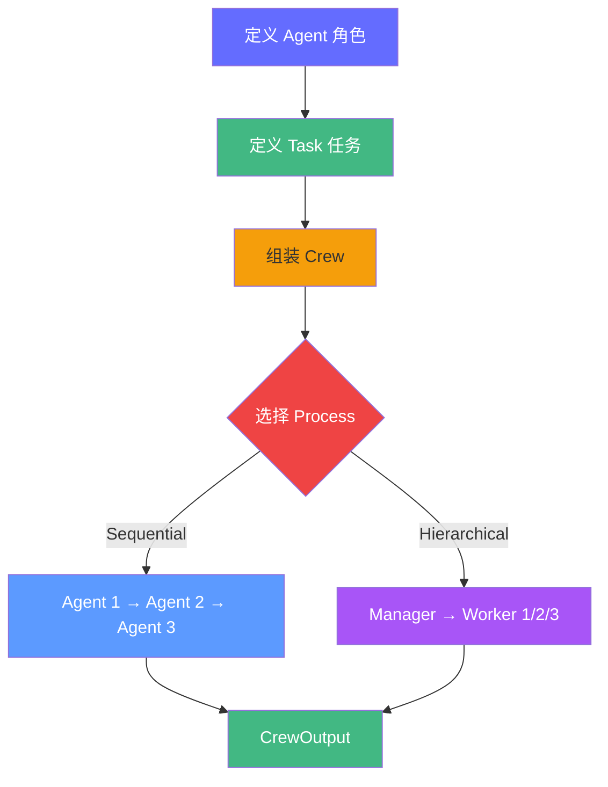

**核心设计哲学**：面向角色的多 Agent 编排——每个 Agent 有明确的角色定义（role, goal, backstory），Task 有清晰的输入输出契约，Crew 负责按 Process 编排。

#### 核心概念详解

| 概念 | 说明 | 类比 |
|------|------|------|
| `Agent` | 带有角色设定的 LLM 智能体 | 团队中的"员工" |
| `Task` | 任务定义，有描述和期望输出 | 分配给员工的"工单" |
| `Crew` | 编排容器，管理多个 Agent 和 Task | "团队管理器" |
| `Process` | 执行模式 | "工作流模式" |

#### 代码示例：技术博客写作团队

```python
from crewai import Agent, Task, Crew, Process
from crewai_tools import SerperDevTool, WebsiteSearchTool
from langchain_openai import ChatOpenAI

# 1. 配置 LLM
llm = ChatOpenAI(model="gpt-4o", temperature=0.7)

# 2. 定义工具
search_tool = SerperDevTool()
web_search = WebsiteSearchTool()

# 3. 定义角色（Agent）
researcher = Agent(
    role="高级技术研究员",
    goal="搜索、收集和分析技术趋势，提取关键洞察。",
    backstory="""你是一位资深技术研究员，10 年科技行业经验。
擅长从海量信息中提炼核心观点，并给出数据支持。""",
    tools=[search_tool, web_search],
    llm=llm,
    verbose=True,
)

writer = Agent(
    role="技术博客作家",
    goal="将研究洞察转化为高质量的技术博客文章。",
    backstory="""你是一位知名技术博主，擅长将复杂概念用通俗语言解释。
你的文章结构清晰、语言生动，深受开发者喜爱。""",
    tools=[],
    llm=llm,
    verbose=True,
)

editor = Agent(
    role="资深编辑",
    goal="审查文章质量，确保准确性、可读性和格式规范。",
    backstory="""你是一位有 15 年经验的资深编辑，
擅长发现文章中的逻辑漏洞、事实错误和表达不清之处。""",
    tools=[],
    llm=llm,
    verbose=True,
)

# 4. 定义任务（Task）
research_task = Task(
    description="调研 vLLM 推理引擎的最新特性，包括 PagedAttention、自动批处理、量化支持等。",
    expected_output="一份结构化的调研报告，包含 5+ 个关键特性和对应的性能数据。",
    agent=researcher,
)

writing_task = Task(
    description="基于调研报告，撰写一篇 2000 字的技术博客，面向中级开发者。",
    expected_output="一篇完整的技术博客文章，包含引言、特性介绍、性能对比和结论。",
    agent=writer,
    context=[research_task],  # 依赖前一个任务的输出
)

editing_task = Task(
    description="审查技术博客，检查事实准确性、逻辑连贯性和格式规范。",
    expected_output="审查后的最终版本文章，附带修改建议。",
    agent=editor,
    context=[writing_task],
)

# 5. 组装 Crew 并运行
crew = Crew(
    agents=[researcher, writer, editor],
    tasks=[research_task, writing_task, editing_task],
    process=Process.sequential,  # 顺序执行
    verbose=True,
)

result = crew.kickoff()
print(result.raw)  # 最终文章
```

#### 两种 Process 模式对比

| 模式 | 工作方式 | 适合场景 |
|------|---------|---------|
| **Sequential** | Agent 1 → Task 1 → Agent 2 → Task 2 → ... | 流水线式工作，任务依赖明确 |
| **Hierarchical** | Manager Agent 分配任务给 Worker Agents | 需要协调多任务、动态分配 |

**Hierarchical 模式额外能力**：Manager Agent 自动规划任务分配和顺序，无需手动定义 context 依赖。

#### CrewAI vs LangGraph 对比

| 维度 | CrewAI | LangGraph |
|------|--------|-----------|
| **核心抽象** | 角色 + 任务 + 团队 | 状态图（节点 + 边） |
| **控制粒度** | 粗（Process 级别） | 细（每一步都可控制） |
| **条件分支** | 不支持（固定流程） | 原生支持（条件边） |
| **循环/重试** | 不支持 | 原生支持 |
| **开发者体验** | 极高（声明式配置） | 中等（需写图逻辑） |
| **适合场景** | 固定流程的内容生产 | 需要条件判断的复杂逻辑 |

#### 生产考量

| 方面 | 说明 |
|------|------|
| Token 成本 | 角色描述会消耗大量 context token（每个 Agent +200-500 token） |
| 并行执行 | Sequential 模式天然串行，Hierarchical 支持部分并行 |
| 错误处理 | 缺乏细粒度错误处理，Task 失败难以恢复 |
| 模型兼容 | 兼容所有 LangChain 支持的模型 |

---

### AutoGen 详解（对话驱动多智能体）

#### 核心架构：对话循环

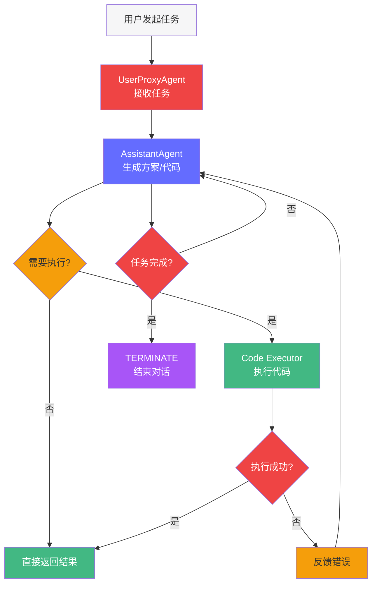

**核心设计哲学**：微软开源，基于**对话驱动**的多 Agent 协作——Agent 之间通过消息对话循环交互，配合代码执行器，让 LLM 自主编写和执行代码。

#### 核心概念详解

| 概念 | 说明 |
|------|------|
| `ConversableAgent` | 基类，所有 Agent 的共同行为 |
| `UserProxyAgent` | 用户代理，可以触发代码执行、人类输入 |
| `AssistantAgent` | AI 助手，响应请求并生成代码/回答 |
| `GroupChat` | 多 Agent 群聊，带管理员调度谁发言 |
| `GroupChatManager` | 群聊管理员，决定下一个发言者 |
| `code_execution_config` | 代码执行配置（本地 Docker/EVE 沙箱） |

#### 代码示例：自动代码生成 + 执行

```python
from autogen import ConversableAgent, UserProxyAgent

# 1. 配置 LLM
llm_config = {
    "config_list": [
        {
            "model": "gpt-4o",
            "api_key": "your-api-key",
        }
    ],
    "temperature": 0,
}

# 2. 定义 Assistant Agent（代码专家）
code_assistant = ConversableAgent(
    name="CodeExpert",
    system_message="""你是一个 Python 专家。根据用户要求编写代码。
要求：
1. 代码必须包含完整的函数定义和类型注解
2. 代码块用 ```python 标记
3. 写完后直接输出，不要解释
4. 如果代码需要依赖，请 import 标准库""",
    llm_config=llm_config,
    human_input_mode="NEVER",  # 不需要人类输入
)

# 3. 定义 UserProxyAgent（带代码执行）
user_proxy = UserProxyAgent(
    name="User",
    system_message="你是一个用户代理，负责发起任务。",
    llm_config=False,  # 不使用 LLM，只转发
    code_execution_config={
        "work_dir": "coding",        # 代码执行目录
        "use_docker": False,         # 是否用 Docker 沙箱
        "timeout": 60,               # 超时时间
    },
    human_input_mode="NEVER",
)

# 4. 发起对话（自动循环执行）
result = user_proxy.initiate_chat(
    code_assistant,
    message="""请编写一个函数，计算两个列表的交集，
并返回一个测试用例验证正确性。""",
    max_turns=5,  # 最大对话轮次
)

# 5. 查看结果
print("对话历史:")
for msg in result.chat_history:
    print(f"[{msg['role']}] {msg['content'][:100]}...")
```

#### GroupChat 多 Agent 协作

```python
from autogen import GroupChat, GroupChatManager

# 定义多个专业 Agent
data_analyst = ConversableAgent(
    name="DataAnalyst",
    system_message="你是一位数据分析师，擅长数据处理和可视化。",
    llm_config=llm_config,
)

reviewer = ConversableAgent(
    name="CodeReviewer",
    system_message="你是一位代码审核员，负责审查代码质量和正确性。",
    llm_config=llm_config,
)

# 创建群聊
group_chat = GroupChat(
    agents=[user_proxy, data_analyst, reviewer],
    messages=[],
    max_round=10,  # 最大发言轮次
)

# 创建管理员（自动调度）
manager = GroupChatManager(
    groupchat=group_chat,
    llm_config=llm_config,
)

# 发起群聊
result = user_proxy.initiate_chat(
    manager,
    message="分析这份销售数据，然后让审核员审查代码。",
)
```

#### AutoGen vs 其他框架对比

| 维度 | AutoGen | CrewAI | LangGraph |
|------|---------|--------|-----------|
| **核心抽象** | 对话循环 | 角色+任务 | 状态图 |
| **代码执行** | 原生支持 | 需外部工具 | 需自定义 |
| **人类输入** | 原生支持 | 不支持 | 需 Interrupt |
| **群聊调度** | 自动（GroupChatManager） | 手动定义 | 手动定义 |
| **适合场景** | 代码生成、研究讨论 | 内容生产流水线 | 精细流程控制 |

#### 生产考量

| 方面 | 说明 |
|------|------|
| 代码安全 | `use_docker=True` 推荐，避免 LLM 生成恶意代码 |
| 对话轮次控制 | `max_turns` 必须设置，否则可能无限循环 |
| Token 成本 | 对话循环中 context 不断增长，成本可能很高 |
| 终止条件 | 依赖 LLM 输出 "TERMINATE" 关键字，可能误判 |

---

### SmolAgents 详解（轻量代码 Agent）

#### 核心架构：代码生成 + 沙箱执行

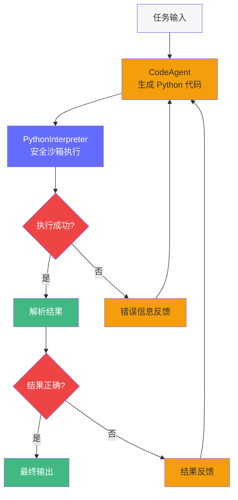

**核心设计哲学**：Hugging Face 出品，极简设计——Agent 不生成工具调用，而是直接生成 Python 代码，在安全沙箱中执行，执行结果作为观察反馈，循环直到成功。

#### 核心概念详解

| 概念 | 说明 |
|------|------|
| `CodeAgent` | 生成 Python 代码而非工具调用的 Agent |
| `Tool` | 简单装饰器定义的工具 |
| `PythonInterpreter` | 安全代码执行沙箱（基于 ` RestrictedPython`） |
| `DuckDuckGoSearchTool` | 内置的网络搜索工具 |

#### 代码示例

```python
from smolagents import CodeAgent, DuckDuckGoSearchTool, HfApiModel

# 1. 配置模型（使用 Hugging Face API）
model = HfApiModel(model_id="meta-llama/Llama-3.1-70B-Instruct")

# 2. 创建 Agent（内置代码生成能力）
agent = CodeAgent(
    tools=[DuckDuckGoSearchTool()],
    model=model,
    max_steps=10,  # 最大执行步数
    verbosity_level=2,  # 详细日志
)

# 3. 运行
result = agent.run(
    "查找 2025 年最火的 5 个 Python 机器学习库，计算它们的 GitHub 星数总和。"
)
print(result)
```

**执行过程**（Agent 内部生成并执行的代码）：

```python
# Agent 内部生成：
code = """
results = duckduckgo_search("2025 most popular Python ML libraries")
print(results[:5])
"""
# 沙箱执行 → 结果回填 → 继续生成下一步

# Agent 内部生成：
code = """
# 基于搜索结果，计算星数总和
star_counts = {"transformers": 130000, "pytorch": 80000, "scikit-learn": 59000}
total = sum(star_counts.values())
print(f"总星数: {total}")
final_answer(f"2025年最火的5个Python ML库总星数: {total}")
"""
# 沙箱执行 → 输出最终结果
```

#### 自定义工具

```python
from smolagents import tool

@tool
def get_stock_price(symbol: str) -> float:
    """获取指定股票的当前价格。

    Args:
        symbol: 股票代码（如 AAPL, GOOGL）
    """
    # 模拟 API 调用
    prices = {"AAPL": 195.50, "GOOGL": 175.30, "MSFT": 420.00}
    return prices.get(symbol, 0.0)

# Agent 可以直接调用 get_stock_price("AAPL")
agent = CodeAgent(tools=[DuckDuckGoSearchTool(), get_stock_price], model=model)
result = agent.run("比较 AAPL 和 GOOGL 的股价，哪个更高？")
```

#### SmolAgents vs 其他框架对比

| 维度 | SmolAgents | LangGraph | AutoGen |
|------|-----------|-----------|---------|
| **核心抽象** | 代码生成+执行 | 状态图 | 对话循环 |
| **工具调用** | 通过 Python 代码调用 | JSON Schema 工具 | 代码块执行 |
| **灵活性** | 最高（可以写任意代码） | 高（自定义节点） | 中（依赖对话） |
| **安全性** | 中（沙箱可能有漏洞） | 高（无代码执行） | 中（Docker 沙箱） |
| **适合场景** | 数据分析、复杂计算 | 生产级业务逻辑 | 代码生成、研究 |

#### 生产考量

| 方面 | 说明 |
|------|------|
| 安全风险 | 沙箱不能完全防止所有恶意代码，不推荐执行未审查的 LLM 代码 |
| Token 成本 | 每次生成+执行都需要新的 LLM 调用，循环次数不可预测 |
| 调试 | 生成的代码不透明，调试困难 |
| 推荐用法 | 用于内部工具、数据分析；生产关键路径推荐 LangGraph |

---

### LangGraph 概述（生产首选框架）

> **LangGraph 的完整深指南已移至独立章节**：[LangGraph 深度指南](./langgraph-deep-dive.md)。本章保留概述，详细内容请前往专章学习。

LangGraph 的核心思想：**将 Agent 的行为建模为显式的状态图**。每个节点做一件事，每条边决定下一步去哪，条件边实现分支逻辑。

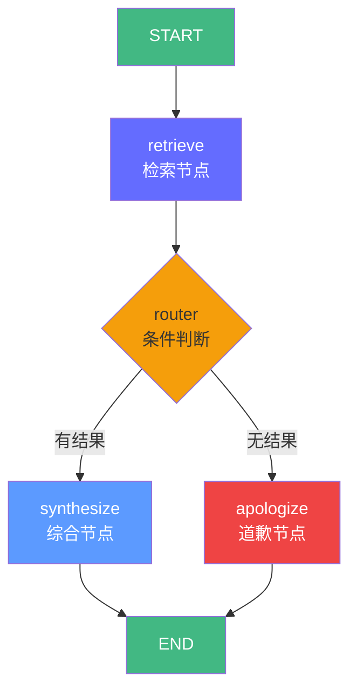

**五大组件：** StateGraph（图容器）、State（Agent 记忆）、Node（节点函数）、Edge（确定边）、Conditional Edge（条件边）。

**为什么 LangGraph 适合生产：**

| 特性 | 说明 | 生产价值 |
|------|------|----------|
| **可观测性** | 每个节点、每条边的执行都有日志 | 问题定位精确到节点 |
| **可恢复性** | MemorySaver/PostgresSaver 检查点 | 长时间运行不丢失状态 |
| **可控性** | 显式条件分支，无黑盒 | 避免死循环、无限重试 |
| **可测试性** | 每个节点是纯函数 | 单元测试覆盖 |
| **多智能体** | 原生支持 supervisor/handoff | 无需换框架 |

**专章内容速览：** 状态设计模式（TypedDict/Reducer）、图结构模式（线性/条件/循环/子图/并行）、Memory 与持久化、Streaming 与可观测、Interrupt 人在回路、多智能体编排、Tool Calling 深度、错误处理与重试、FastAPI 生产部署、完整 RAG Agent 实战、面试考点。详见 [LangGraph 深度指南](./langgraph-deep-dive.md)。

---

### AgentScope 详解（分布式多智能体）

#### 架构总览：三层分离

AgentScope 1.0 将智能体系统抽象为 **四层核心模块 + 三层架构**：

```
┌─────────────────────────────────────────────┐
│           应用层（开发者业务逻辑）              │
│  ReActAgent / Pipeline / 自定义 Agent        │
├─────────────────────────────────────────────┤
│           框架层（核心能力）                    │
│  Message │ ModelWrapper │ Memory │ Tool      │
├─────────────────────────────────────────────┤
│           运行层（基础设施）                    │
│  gRPC 分布式调度 │ 容错重试 │ 资源管理          │
└─────────────────────────────────────────────┘
```

**核心设计哲学**：消息驱动 + Actor 模型。所有 Agent 间通信被抽象为 `Msg` 的发送和接收，Agent 是独立的 Actor，天然支持分布式部署。

#### 核心概念：消息驱动

```python
from agentscope.message import Msg

# 消息是 Agent 间通信的基本单位
msg = Msg(
    name="user",           # 发送者
    content="北京今天天气怎么样？",  # 内容
    role="user",           # 角色：user / assistant / system
)

# 多模态消息
from agentscope.message import TextBlock, ImageBlock

multimodal_msg = Msg(
    name="user",
    role="user",
    content=[
        TextBlock(type="text", text="这张图是什么？"),
        ImageBlock(type="image", url="https://example.com/photo.jpg"),
    ],
)
```

#### ReActAgent 详解

AgentScope 内置了 ReAct（Reasoning + Acting）模式的完整实现：

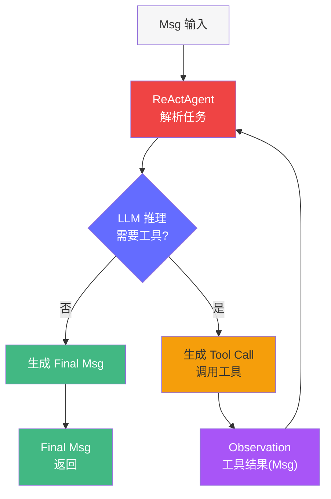

```python
import asyncio
from agentscope.agent import ReActAgent
from agentscope.model import DashScopeChatModel, OpenAIChatModel
from agentscope.formatter import DashScopeChatFormatter, OpenAIChatFormatter
from agentscope.tool import (
    Toolkit,
    execute_python_code,
    execute_shell_command,
)
from agentscope.message import Msg

# 1. 配置模型——统一 ModelWrapper 接口
model = DashScopeChatModel(
    model_name="qwen-max",
    api_key="your-api-key",
)

# 2. 配置格式化器——不同模型的对话格式适配
formatter = DashScopeChatFormatter()

# 3. 注册工具
toolkit = Toolkit()
toolkit.register_tool_function(execute_python_code)
toolkit.register_tool_function(execute_shell_command)

# 4. 创建 ReActAgent
agent = ReActAgent(
    name="Friday",
    sys_prompt="你是一个全能的 AI 助手，擅长编程和数据分析。",
    model=model,
    formatter=formatter,
    toolkit=toolkit,
)

# 5. 运行
async def main():
    msg = Msg(name="user", content="计算 100 以内所有素数的和", role="user")
    response = await agent(msg)
    print(response.content)

asyncio.run(main())
```

#### Pipeline：工作流编排

AgentScope 提供结构化 Pipeline 模块，支持顺序、条件、循环等多种编排模式：

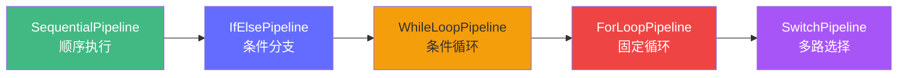

```python
from agentscope.pipeline import (
    SequentialPipeline,
    IfElsePipeline,
    WhileLoopPipeline,
)
from agentscope.agent import ReActAgent

# 创建多个 Agent
researcher = ReActAgent(name="研究员", sys_prompt="...", model=model, formatter=formatter)
analyst = ReActAgent(name="分析师", sys_prompt="...", model=model, formatter=formatter)
writer = ReActAgent(name="作家", sys_prompt="...", model=model, formatter=formatter)

# 顺序 Pipeline：Agent 依次执行
seq_pipeline = SequentialPipeline(agents=[researcher, analyst, writer])
result = await seq_pipeline(initial_msg)

# 条件 Pipeline：根据条件选择执行路径
def is_tech_task(msg) -> bool:
    return "代码" in str(msg.content) or "编程" in str(msg.content)

cond_pipeline = IfElsePipeline(
    condition_fn=is_tech_task,
    true_agents=[researcher, analyst],   # 条件为真时执行
    false_agents=[writer],               # 条件为假时执行
)
result = await cond_pipeline(initial_msg)

# 循环 Pipeline：直到满足退出条件
def should_continue(msg) -> bool:
    return "完成" not in str(msg.content)

loop_pipeline = WhileLoopPipeline(
    condition_fn=should_continue,
    agents=[analyst],
)
result = await loop_pipeline(initial_msg)
```

#### 分布式部署：gRPC Runtime

AgentScope 的原生优势——Agent 可以部署在不同进程或机器上：

```python
# 远程 Agent 端（Server 端）
from agentscope.server import serve

# 启动 gRPC Server，暴露 Agent 为远程服务
async def run_server():
    await serve(
        agent_factory=lambda: ReActAgent(
            name="remote_analyst",
            sys_prompt="你是一个远程数据分析师。",
            model=model,
            formatter=formatter,
        ),
        host="0.0.0.0",
        port=8080,
    )

# 本地 Agent 端（Client 端）
from agentscope.agent import DistAgent

# 连接远程 Agent
async def run_client():
    remote_analyst = await DistAgent.connect(
        "remote_analyst",
        host="192.168.1.100",
        port=8080,
    )
    # 像调用本地 Agent 一样调用远程 Agent
    result = await remote_analyst(Msg(name="user", content="分析这份数据", role="user"))
    print(result.content)
```

#### AgentScope vs LangGraph 对比

| 维度 | AgentScope | LangGraph |
|------|-----------|-----------|
| **核心抽象** | Actor 模型 + 消息驱动 | 状态图（StateGraph） |
| **多智能体** | 原生支持（Msg 传递） | 需手动编排（Supervisor 模式） |
| **分布式** | 原生 gRPC，跨进程/跨机器 | 单机，无原生分布式 |
| **编排方式** | Pipeline（顺序/条件/循环） | 显式图结构（节点+边） |
| **可控性** | ReAct 循环内可实时介入 | 图执行中可通过 Interrupt 介入 |
| **可观测性** | 内置日志和追踪 | 需搭配 LangSmith/Langfuse |
| **生态** | 阿里生态，ModelScope/百炼集成 | 开源社区最大，LangChain 生态 |
| **适合场景** | 分布式多智能体、阿里技术栈 | 生产级单/多智能体、可观测性要求高 |
| **学习曲线** | 中等（概念较多） | 中等（需理解图概念） |

#### 生产考量

| 方面 | 说明 |
|------|------|
| 部署 | 本地模式直接运行，分布式模式需部署 gRPC Server |
| 容错 | 内置重试机制，LLM API 异常自动重试 |
| 多模态 | 原生支持文本、图像、语音消息 |
| 模型兼容 | 统一 ModelWrapper，兼容 17+ 提供商 |
| 工具协议 | 支持 MCP、Function Call、自定义工具 |

---

### MCP 协议（Model Context Protocol）

#### MCP 是什么

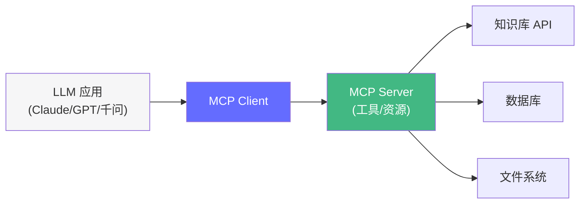

MCP 是 Anthropic 推出的**标准化 Agent-Tool 连接协议**。类比：USB 之于外设，MCP 之于 Agent 工具。

#### 为什么需要 MCP

| 不用 MCP | 用 MCP |
|----------|--------|
| 每个工具需要单独写集成代码 | 标准协议，即插即用 |
| 换模型后工具集成要重写 | 一次实现，多模型通用 |
| 工具发现困难 | 自动发现可用工具 |
| 跨应用不兼容 | 任何 MCP 应用可以互操作 |

#### 创建 MCP Server

```python
# mcp_server.py
from fastmcp import FastMCP

mcp = FastMCP("FDE Knowledge Tools")

@mcp.tool()
def search_knowledge(query: str, limit: int = 5) -> str:
    """搜索 FDE 内部知识库，返回相关文章摘要。

    Args:
        query: 搜索关键词，尽量简洁
        limit: 返回结果数量，默认 5，最大 20
    """
    # 实际实现：调用向量库搜索
    results = vector_store.search(query, limit=limit)
    return format_results(results)

@mcp.tool()
def get_document(doc_id: str) -> str:
    """获取指定文档的完整内容。

    Args:
        doc_id: 文档 ID，从搜索结果中获取
    """
    doc = database.get(doc_id)
    return doc.content

@mcp.resource("docs://{category}/{doc_id}")
def get_doc_resource(category: str, doc_id: str) -> str:
    """将文档作为资源暴露——MCP 的 Resource 能力。"""
    return database.get(f"{category}/{doc_id}").content

@mcp.prompt()
def qa_prompt(query: str) -> str:
    """提供一个标准问答提示模板——MCP 的 Prompt 能力。"""
    return f"""你是 FDE 知识库助手。基于以下信息回答：

{search_knowledge(query)}

问题：{query}
"""

if __name__ == "__main__":
    mcp.run()  # 默认监听 http://localhost:8080
```

#### Agent 连接 MCP Server

```python
# agent_with_mcp.py
from langchain_mcp import MCPClient
from langgraph.graph import StateGraph, END

# 1. 连接 MCP Server，自动发现所有工具和资源
client = MCPClient("http://localhost:8080/mcp")
tools = client.get_tools()  # 自动发现 search_knowledge, get_document

print(f"发现 {len(tools)} 个工具: {[t.name for t in tools]}")

# 2. 将 MCP 工具接入 LangGraph Agent
class MCPState(TypedDict):
    query: str
    answer: str

def agent_node(state: MCPState) -> dict:
    """使用 MCP 工具的智能体节点。"""
    response = llm_with_tools.invoke([
        {"role": "user", "content": state["query"]}
    ])
    # LangChain 自动处理工具调用和结果回填
    return {"answer": response.content}

graph = StateGraph(MCPState)
graph.add_node("agent", agent_node)
graph.set_entry_point("agent")
graph.add_edge("agent", END)

app = graph.compile()
```

**MCP 的核心价值**：你的工具只需要实现一次 MCP Server，就可以被任何 MCP Client（Claude Desktop、LangChain、自定义 Agent）使用。

---

### PydanticAI 详解（最佳开发者体验）

#### 核心架构：类型安全 Agent

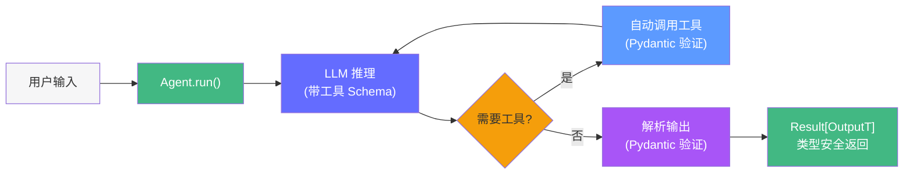

**核心设计哲学**：基于 Pydantic 类型系统构建——所有输入/输出/工具调用都经过严格的类型验证，提供编译期级别的类型安全。

#### 核心概念详解

| 概念 | 说明 |
|------|------|
| `Agent[OutputT, DepsT]` | 核心类，泛型参数保证类型安全 |
| `@agent.tool` | 装饰器，自动从函数签名生成 JSON Schema |
| `RunContext[DepsT]` | 依赖注入容器，传入业务上下文 |
| `Result[OutputT]` | 类型安全的运行结果 |
| `@agent.system_prompt` | 动态系统提示生成 |

#### 代码示例：生产级 Agent

```python
from pydantic_ai import Agent, RunContext
from pydantic import BaseModel, Field
from dataclasses import dataclass
import httpx

# 1. 定义依赖注入（业务上下文）
@dataclass
class AppDeps:
    api_key: str
    db_url: str
    user_id: str

# 2. 定义结构化输出
class WeatherReport(BaseModel):
    city: str = Field(description="城市名称")
    temperature: float = Field(description="摄氏温度")
    humidity: float = Field(description="湿度百分比")
    description: str = Field(description="天气描述")
    recommendation: str = Field(description="出行建议")

# 3. 定义 Agent（带类型参数）
agent = Agent[WeatherReport, AppDeps](
    model="openai:gpt-4o",
    system_prompt="你是一个天气助手。基于工具返回的数据，生成结构化的天气报告。",
    output_type=WeatherReport,  # 类型安全输出！
)

# 4. 定义工具（自动从签名生成 Schema）
@agent.tool
async def fetch_weather(ctx: RunContext[AppDeps], city: str) -> dict:
    """获取指定城市的实时天气数据。

    Args:
        city: 城市名称（中文或英文）
    """
    # 使用依赖注入的 API key
    async with httpx.AsyncClient() as client:
        resp = await client.get(
            f"https://api.weather.com/v3/weather/conditions",
            params={"city": city, "apiKey": ctx.deps.api_key},
        )
        return resp.json()

# 5. 运行（类型安全）
deps = AppDeps(api_key="xxx", db_url="xxx", user_id="user_123")
result = agent.run_sync("北京今天天气怎么样？", deps=deps)

# 编译器知道 result.data 是 WeatherReport 类型！
print(f"{result.data.city}: {result.data.temperature}°C, {result.data.description}")
print(f"建议: {result.data.recommendation}")
```

#### 工具调用原理

PydanticAI 的工具调用流程：

```
1. @agent.tool 装饰器
   → 读取函数签名和类型注解
   → 自动生成 JSON Schema（OpenAI 工具格式）

2. LLM 调用工具时
   → LLM 返回 JSON 参数
   → Pydantic 验证参数类型
   → 执行函数

3. 函数返回
   → Pydantic 验证返回值
   → 回填到 LLM 上下文
```

**与传统框架的对比**：

| 框架 | 工具定义方式 | 类型安全 | 输出验证 |
|------|------------|----------|----------|
| PydanticAI | `@agent.tool`（函数签名） | ✅ 编译期 | ✅ Pydantic |
| LangGraph | 手动写 JSON Schema | ❌ 运行期 | ❌ 需手动验证 |
| CrewAI | 工具装饰器 | ❌ 运行期 | ❌ 字符串 |
| AutoGen | 代码块执行 | ❌ 无 | ❌ 无 |

#### PydanticAI vs LangGraph 对比

| 维度 | PydanticAI | LangGraph |
|------|-----------|-----------|
| **核心抽象** | 类型安全 Agent | 状态图 |
| **类型安全** | ✅ 泛型 + Pydantic 全程验证 | ❌ 运行时验证 |
| **多智能体** | ❌ 需搭配 LangGraph | ✅ 原生支持 |
| **条件分支** | ❌ 不支持 | ✅ 条件边 |
| **代码量** | 极少（5 行起步） | 中等（30+ 行） |
| **适合场景** | 单 Agent、API 封装、类型要求高 | 复杂工作流、多智能体 |
| **学习曲线** | 极低（熟悉 FastAPI 即可） | 中等（需理解图概念） |

#### 组合使用：PydanticAI + LangGraph

```python
from pydantic_ai import Agent, RunContext
from pydantic import BaseModel
from langgraph.graph import StateGraph, END
from typing import TypedDict

# 用 PydanticAI 定义带类型安全的工具
class SearchResult(BaseModel):
    title: str
    url: str
    summary: str

search_agent = Agent[SearchResult, None](
    model="openai:gpt-4o-mini",
    system_prompt="你是一个搜索助手。",
    output_type=SearchResult,
)

@search_agent.tool
async def search_knowledge(query: str) -> list[dict]:
    """搜索内部知识库。"""
    return [{"title": "KV Cache", "url": "...", "summary": "..."}]

# 用 LangGraph 定义复杂工作流
class WorkflowState(TypedDict):
    query: str
    search_results: list
    final_answer: str

def search_node(state: WorkflowState) -> dict:
    # 调用 PydanticAI Agent（类型安全）
    result = search_agent.run_sync(state["query"], deps=None)
    return {"search_results": result.data}

graph = StateGraph(WorkflowState)
graph.add_node("search", search_node)
# ... 继续定义其他节点
```

#### 生产考量

| 方面 | 说明 |
|------|------|
| 类型安全 | 编译期就能发现参数类型不匹配，减少运行期 bug |
| 依赖注入 | `RunContext[DepsT]` 天然支持业务上下文（数据库连接、用户信息等） |
| 流式输出 | 支持 `stream()` 方法，适合长文本生成 |
| 模型兼容 | 支持 OpenAI、Anthropic、Google、Ollama |
| 限制 | 无原生多智能体支持，复杂流程需搭配 LangGraph |

---

### 智能体友好型工具设计

#### 4 大设计原则

| 原则 | 说明 | 好例子 | 坏例子 |
|------|------|--------|--------|
| **命名清晰** | 让模型一眼知道用途 | `search_knowledge_base` | `fn1`, `do_stuff` |
| **目的单一** | 一个工具只做一件事 | `search` + `write` 分开 | `search_and_write` |
| **输入输出结构化** | 方便模型识别 | Pydantic Schema | 自由格式字符串 |
| **失败快速** | 遇到错误及时返回 | `{"error": "超时"}` | 挂起不返回 |

#### 工具设计 Checklist

```
□ 名称动词开头（search_, get_, create_）或名词短语（knowledge_search）
□ 描述包含：用途、适用场景、不适用场景
□ 所有参数有类型注解和 description
□ 必填参数标记 required
□ 有默认值的参数标注 default
□ 返回值有明确的 Schema
□ 错误有结构化的错误格式
□ 有副作用的操作需要确认闸门
```

## 工程视角

### 框架成本对比

以相同的"检索 + 综合"任务为例：

| 框架 | 代码行数 | 运行成本 | 学习成本 | 适合 |
|------|----------|----------|----------|------|
| LangGraph | ~50 | $0.01/次 | 中 | 生产环境、复杂流程 |
| PydanticAI | ~15 | $0.01/次 | 低 | 单智能体、类型安全 |
| AgentScope | ~40 | $0.01/次 | 中 | 分布式多智能体、阿里生态 |
| SmolAgents | ~10 | $0.01/次 | 极低 | 快速原型、探索 |
| CrewAI | ~30 | $0.02/次 | 低 | 角色分工团队 |
| 手写（无框架） | ~80 | $0.01/次 | 高 | 理解原理、定制控制 |

### MCP 协议的生产考量

| 方面 | 考量 |
|------|------|
| 部署 | MCP Server 独立部署为 HTTP/gRPC 服务 |
| 安全 | 工具层做权限控制（tenant_id 过滤） |
| 性能 | MCP 通信开销 ~1-5ms/调用（本地）或 ~10-50ms（远程） |
| 版本 | MCP Server 版本升级不影响 Client（向后兼容） |

## 面试视角

### Q: 什么时候该用框架，什么时候该手写？

**满分回答框架**：
- **原型阶段**：用 SmolAgents 或 PydanticAI，快速验证思路
- **生产环境**：用 LangGraph，需要可观测性、可恢复性、可测试性
- **学习阶段**：手写一次（不调框架），理解工具调用原理
- **核心判断**：你的工作流是否需要**条件分支、多轮迭代、状态恢复**？需要 → LangGraph；不需要 → PydanticAI

### Q: MCP 协议解决了什么问题？

**满分回答框架**：
- 解决了 Agent 和工具之间的**互操作性**问题
- 类比 USB 标准——之前每个外设需要不同的接口，MCP 让所有工具"即插即用"
- 一次实现 MCP Server，可被 Claude、LangChain、自定义 Agent 等多种 Client 使用
- 还统一了工具发现（Client 自动知道 Server 提供了哪些工具）

### Q: AgentScope 和 LangGraph 有什么区别？选型怎么判断？

**满分回答框架**：
- **核心抽象不同**：LangGraph 是显式状态图（节点+边），AgentScope 是 Actor 模型+消息驱动
- **分布式**：AgentScope 原生支持 gRPC 跨进程/跨机器部署；LangGraph 是单机
- **编排方式**：LangGraph 用图结构定义流程，AgentScope 用 Pipeline（顺序/条件/循环）
- **选型判断**：
  - 需要分布式部署、多 Agent 跨机器协作 → AgentScope
  - 需要精细流程控制、可观测性、断点恢复 → LangGraph
  - 阿里技术栈、ModelScope 生态 → AgentScope
  - 开源社区最大、LangChain 生态 → LangGraph

### Q: CrewAI 和 LangGraph 各自适合什么场景？

**满分回答框架**：
- CrewAI 适合**固定流程的内容生产**（如：调研→写作→编辑），声明式配置，开发者体验高
- LangGraph 适合**需要条件判断和循环重试的复杂逻辑**（如：检索失败时重试、根据结果分支）
- CrewAI 不支持条件分支和循环，流程是固定的
- 如果内容生产流程需要"质量检查不通过则重写"→ LangGraph；如果流程固定→ CrewAI

### Q: AutoGen 的对话循环有什么风险？如何控制？

**满分回答框架**：
- 风险 1：**无限循环**——Agent 之间互相回复，可能永远不停止 → 必须设置 `max_turns`
- 风险 2：**Token 爆炸**——对话历史不断增长，每次 LLM 调用的 context 越来越大 → 需要定期清理历史
- 风险 3：**代码安全**——LLM 生成的代码直接执行 → 必须用 `use_docker=True` 沙箱隔离
- 风险 4：**终止条件脆弱**——依赖 LLM 输出 "TERMINATE" 关键字，可能误判 → 需要额外的终止判断逻辑

### Q: SmolAgents 的代码生成方式和传统工具调用有什么区别？

**满分回答框架**：
- 传统方式：LLM 输出 JSON 工具调用 `{"tool": "search", "args": {"query": "..."}}` → 框架解析并执行
- SmolAgents 方式：LLM 直接生成 Python 代码 `results = duckduckgo_search("...")` → 沙箱执行
- 优势：灵活性极高，可以写任意 Python 代码（组合多个工具、循环、条件判断）
- 劣势：安全性差（沙箱可能被绕过），调试困难（生成的代码不透明）
- 适合场景：数据分析、复杂计算、内部工具；不适合：生产关键路径

### Q: PydanticAI 为什么被称为"最佳开发者体验"？

**满分回答框架**：
- 类型安全：泛型参数 `Agent[OutputT, DepsT]` 保证输入/输出/工具调用的类型在编译期就能检查
- `@agent.tool` 装饰器自动从函数签名生成 JSON Schema，无需手写
- Pydantic 模型验证——LLM 输出不合法时自动报错重试
- 依赖注入 `RunContext[DepsT]`——天然支持业务上下文传递
- 最少代码量：5 行代码实现一个带工具的 Agent
- 适合：API 封装、微服务、对类型安全要求高的场景

### Q: 6 大框架中，哪些支持多智能体？它们的多智能体方式有什么不同？

**满分回答框架**：

| 框架 | 多智能体方式 |
|------|-------------|
| LangGraph | 手动编排（Supervisor/Handoff 模式），通过状态图定义 Agent 间关系 |
| AgentScope | 原生支持（Msg 传递 + gRPC），Agent 可跨进程/跨机器 |
| CrewAI | 角色团队（Agent + Task + Crew），固定流程或 Manager 调度 |
| AutoGen | 对话循环（UserProxy ↔ Assistant）或 GroupChat 群聊 |
| PydanticAI | 不支持（单 Agent，需搭配 LangGraph） |
| SmolAgents | 不支持（单 Agent） |

---

## 实战环节：用 LangGraph + MCP 构建一个知识问答 Agent

### 目标

创建一个 MCP Server 暴露搜索工具，用 LangGraph 构建 Agent 连接并调用。

### 环境要求

- Python 3.12+
- `uv add fastmcp langgraph langchain langchain-mcp`

### 步骤

**1. 创建 MCP Server**

```python
# mcp_server.py
from fastmcp import FastMCP

mcp = FastMCP("FDE Knowledge Server")

# 模拟知识库
KNOWLEDGE = {
    "kv-cache": "KV Cache 是大模型推理中的显存优化技术，通过缓存 Key 和 Value 矩阵避免重复计算。",
    "vllm": "vLLM 是一个高性能 LLM 推理引擎，核心创新是 PagedAttention，将 KV Cache 分页管理。",
    "quantization": "量化将 FP16 模型转换为 INT8/INT4，显存减少 2-4 倍，精度损失通常 <1%。",
}

@mcp.tool()
def search_knowledge(query: str, limit: int = 3) -> str:
    """搜索 FDE 知识库，返回与查询相关的文章摘要。"""
    results = []
    for key, content in KNOWLEDGE.items():
        if query.lower() in key.lower() or query.lower() in content.lower():
            results.append({"id": key, "content": content})
    return str(results[:limit])

@mcp.tool()
def get_document(doc_id: str) -> str:
    """获取指定文档的完整内容。"""
    return KNOWLEDGE.get(doc_id, f"文档 {doc_id} 不存在")

if __name__ == "__main__":
    mcp.run()
```

**2. 构建 LangGraph Agent**

```python
# agent.py
from langgraph.graph import StateGraph, END
from langchain_openai import ChatOpenAI
from langchain_mcp import MCPClient
from typing import TypedDict

class AgentState(TypedDict):
    query: str
    answer: str

llm = ChatOpenAI(model="gpt-4o-mini")

# 连接 MCP Server
mcp_client = MCPClient("http://localhost:8080/mcp")
tools = mcp_client.get_tools()
llm_with_tools = llm.bind_tools(tools)

def agent_node(state: AgentState) -> dict:
    messages = [
        {"role": "system", "content": "你是 FDE 知识库助手。基于工具返回的知识回答。"},
        {"role": "user", "content": state["query"]},
    ]
    response = llm_with_tools.invoke(messages)
    return {"answer": response.content}

graph = StateGraph(AgentState)
graph.add_node("agent", agent_node)
graph.set_entry_point("agent")
graph.add_edge("agent", END)

app = graph.compile()
```

**3. 运行**

```bash
# 终端 1：启动 MCP Server
uv run python mcp_server.py

# 终端 2：运行 Agent
uv run python -c "
from agent import app
result = app.invoke({'query': 'KV Cache 是什么？', 'answer': ''})
print(result['answer'])
"
```

### 验证成功

- [ ] MCP Server 启动成功，`http://localhost:8080` 可访问
- [ ] Agent 能调用 `search_knowledge` 工具并返回基于知识的回答
- [ ] Agent 能调用 `get_document` 工具获取文档详情
- [ ] 查询无关话题时返回"暂无相关信息"

### 思考题

1. 如果 MCP Server 挂了，Agent 应该如何优雅降级？
2. 如何让 Agent 在搜索结果为空时，自动尝试换关键词再搜一次？
3. MCP Server 的工具如何添加权限控制（不同用户只能访问不同文档）？

---

## 实战环节（备选）：用 AgentScope 构建多 Agent 协作系统

### 目标

使用 AgentScope 创建 3 个 ReActAgent，用 Pipeline 编排它们完成"调研-分析-写作"任务。

### 环境要求

- Python 3.12+
- `uv add agentscope`

### 步骤

**1. 创建多个 ReActAgent**

```python
import asyncio
from agentscope.agent import ReActAgent
from agentscope.model import DashScopeChatModel
from agentscope.formatter import DashScopeChatFormatter
from agentscope.message import Msg

model = DashScopeChatModel(
    model_name="qwen-max",
    api_key="your-api-key",
)
formatter = DashScopeChatFormatter()

researcher = ReActAgent(
    name="研究员",
    sys_prompt="你是一个研究员，擅长搜索和收集信息。",
    model=model,
    formatter=formatter,
)

analyst = ReActAgent(
    name="分析师",
    sys_prompt="你是一个数据分析师，擅长从信息中提取洞察。",
    model=model,
    formatter=formatter,
)

writer = ReActAgent(
    name="作家",
    sys_prompt="你是一个技术作家，擅长将分析结果写成报告。",
    model=model,
    formatter=formatter,
)
```

**2. 用 SequentialPipeline 编排**

```python
from agentscope.pipeline import SequentialPipeline

async def main():
    pipeline = SequentialPipeline(agents=[researcher, analyst, writer])
    initial_msg = Msg(
        name="user",
        content="调研并撰写一篇关于 vLLM 的技术报告。",
        role="user",
    )
    result = await pipeline(initial_msg)
    print(f"最终报告:\n{result.content}")

asyncio.run(main())
```

### 验证成功

- [ ] 3 个 Agent 依次执行，每个 Agent 收到前一个 Agent 的输出
- [ ] 研究员收集了 vLLM 相关信息
- [ ] 分析师提取了关键洞察
- [ ] 作家生成了完整的技术报告

### 思考题

1. 如果研究员返回的信息不足，如何让 Pipeline 回退重新执行？
2. 如何用 `IfElsePipeline` 根据任务类型路由到不同的 Agent 团队？
3. AgentScope 的分布式模式下，如何将不同 Agent 部署到不同服务器？

---

*上一阶段：[← Harness 工程](/agentic-ai/04-harness-engineering) | [下一阶段：RAG 系统 →](/agentic-ai/06-rag-system)*
