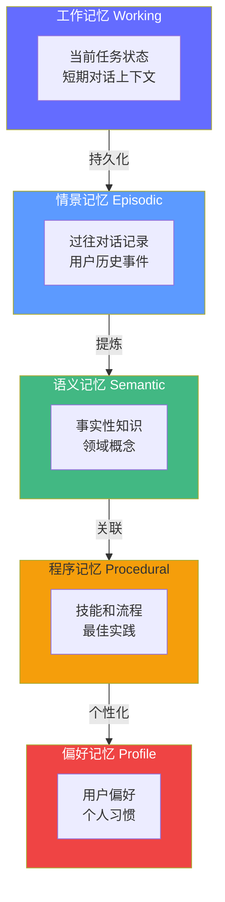

# Agent 记忆工程——让智能体"记住你"

> 2026 年，Agent 记忆已从"context stuffing"发展为**有独立架构、工具和评测标准的工程领域**。Mem0 的诞生、LongMemEval 评测基准的发布、以及 LangGraph 的检查点机制，标志着记忆层正在成为 Agent 系统的标配。

## 前置知识

- Context Engineering（5 层上下文架构）
- LangGraph 状态图基础
- 向量检索概念

## 核心概念

### 为什么需要专门的记忆系统

| 仅用上下文窗口 | 专用记忆层 |
|----------------|------------|
| 随对话结束丢失 | 跨会话持久化 |
| 无结构化存储 | 可按用户/主题/时间检索 |
| 无法自我改进 | 可积累经验、偏好、教训 |
| 上下文窗口有限（128K） | 存储无上限，按需检索注入 |

---

### 记忆架构的 5 个层次



| 层次 | 类比人类 | 存储方式 | 检索方式 | 示例 |
|------|---------|---------|---------|------|
| **工作记忆** | 短期记忆 | LangGraph State | 直接读取 | "正在处理第 2 步" |
| **情景记忆** | 情景回忆 | 向量库（时间索引） | 时间 + 语义检索 | "上周你帮我查过报销" |
| **语义记忆** | 事实知识 | 向量库 | 语义检索 | "差旅上限 800 元/天" |
| **程序记忆** | 技能流程 | 结构化存储 | 关键词检索 | "报销流程：提交→审批→打款" |
| **偏好记忆** | 个人偏好 | 键值 + 向量库 | 用户 ID + 语义检索 | "用户偏好简洁回答" |

---

### 1. 工作记忆——LangGraph 检查点

工作记忆是 Agent 的"当前任务状态"。LangGraph 的检查点机制天然支持跨轮次保留。

#### 两种检查点存储对比

```python
from langgraph.checkpoint.memory import MemorySaver
from langgraph.graph import StateGraph, END
from typing import TypedDict

class AgentState(TypedDict):
    query: str
    answer: str
    history: list[str]

# 方案一：内存检查点（开发环境）
# 进程重启后丢失，但同一进程内可跨轮次保留状态
checkpointer = MemorySaver()

# 方案二：PostgreSQL 检查点（生产环境）
# 持久化到数据库，服务重启后仍能恢复
# pip install langgraph-checkpoint-postgres
# from langgraph.checkpoint.postgres import PostgresSaver
# checkpointer = PostgresSaver.from_conn_string("postgresql://localhost:5432/agent_db")

# 编译图时传入检查点
graph = StateGraph(AgentState)
# ... 添加节点和边 ...
app = graph.compile(checkpointer=checkpointer)

# 使用 thread_id 标识对话会话
config = {"configurable": {"thread_id": "user-session-001"}}

# 第一轮
result1 = app.invoke({
    "query": "帮我查一下公司的报销政策",
    "answer": "",
    "history": [],
}, config)

# 第二轮——Agent 能"记住"之前的内容
result2 = app.invoke({
    "query": "那出差报销呢？",  # 注意：没有重新说"公司的报销政策"
    "answer": "",
    "history": [],
}, config)
# → Agent 知道"那出差报销"指的是"报销政策"的一部分
```

**检查点存储对比**：

| 存储方式 | 持久化 | 并发支持 | 适合场景 |
|----------|--------|---------|----------|
| MemorySaver | 否 | 否 | 开发/测试 |
| PostgresSaver | 是 | 是 | 生产环境 |
| RedisSaver | 是 | 是 | 高并发低延迟 |

**踩坑经验**：MemorySaver 在开发时看起来没问题，但如果你的 Agent 服务用 gunicorn 或 uvicorn --workers 多进程部署，每个进程有独立的 MemorySaver，用户的第二轮请求可能路由到另一个进程，记忆就丢失了。**生产环境必须用 PostgresSaver 或 RedisSaver**。

---

### 2. 长期记忆——Mem0 实战

[Mem0](https://mem0.ai/) 是 2026 年最流行的 Agent 记忆层，提供跨会话的持久化记忆管理。

#### Mem0 的工作原理

Mem0 不是简单的"存储 + 搜索"。它有三个关键能力：

1. **自动提取**：从对话中自动提取结构化事实（不只是存储原始对话）
2. **分类存储**：将提取的事实分为 preference（偏好）、fact（事实）、event（事件）
3. **智能更新**：当新事实与旧记忆冲突时，自动更新而非追加

#### Mem0 完整 API

```python
from mem0 import Memory

memory = Memory()

# 1. 添加记忆——自动提取结构化事实
result = memory.add(
    "张三喜欢用 Python 写代码，最近在学 LangGraph，项目 deadline 是 3 月 15 日",
    user_id="zhangsan",
)
# Mem0 自动提取：
# - {"memory": "张三喜欢用 Python", "category": "preference"}
# - {"memory": "张三在学 LangGraph", "category": "fact"}
# - {"memory": "项目 deadline 是 3 月 15 日", "category": "event"}

# 2. 检索记忆——语义搜索
memories = memory.search("张三最近在学什么？", user_id="zhangsan", limit=3)
for m in memories:
    print(f"[{m['score']:.2f}] {m['memory']}")
    # → [0.92] 张三在学 LangGraph
    # → [0.75] 张三喜欢用 Python

# 3. 更新记忆
memory.update("张三已经掌握了 LangGraph，开始学习多智能体", memory_id=memories[0]["id"])

# 4. 删除过时记忆
memory.delete(memory_id=memories[0]["id"])
```

#### 在 Agent 中的使用模式

```python
from langchain_core.prompts import ChatPromptTemplate
from langchain_openai import ChatOpenAI

class MemoryAgent:
    def __init__(self):
        self.llm = ChatOpenAI(model="gpt-4o-mini")
        self.memory = Memory()

    def chat(self, query: str, user_id: str) -> str:
        # 第一步：检索相关记忆
        relevant_memories = self.memory.search(query, user_id=user_id, limit=5)
        memory_context = "\n".join(f"- {m['memory']}" for m in relevant_memories)

        # 第二步：将记忆注入上下文
        prompt = ChatPromptTemplate.from_template("""你是智能助手。

已知关于用户的信息：
{memory_context}

如果已知信息能帮助你回答问题，请基于这些信息回答。
如果不知道，如实告知用户。

用户问题：{query}""")

        # 第三步：生成回答
        response = self.llm.invoke(
            prompt.format(memory_context=memory_context, query=query)
        )

        # 第四步：从对话中提取新记忆
        extraction_prompt = f"""从以下对话中提取关于用户的事实（5 条以内）：
用户说: {query}
助手回答: {response.content[:500]}

只提取新的、关于用户的信息（偏好、事实、事件）。
不要提取助手的信息或通用知识。
以列表形式返回，每条一行。"""
        facts = self.llm.invoke(extraction_prompt)
        if facts.content.strip():
            self.memory.add(facts.content, user_id=user_id)

        return response.content
```

**成本分析**：每次对话增加两次 LLM 调用（一次提取，一次回答）+ 一次 Mem0 检索。提取用小模型（GPT-4o-mini ~$0.0005），Mem0 检索 ~$0.0001。总计每次对话增加 ~$0.0006。

---

### 3. 对话历史管理——记忆压缩

随着对话变长，必须对历史进行**截断、摘要或压缩**。

#### 4 种策略对比

| 策略 | 方法 | Token 消耗 | 记忆保留度 | 适用场景 |
|------|------|-----------|-----------|----------|
| **固定窗口** | 保留最近 N 轮 | 固定（~2K） | 低 | 简单问答 |
| **滑动摘要** | 早期摘要 + 最近 N 轮原文 | ~3K | 中 | 多轮对话 |
| **重点提取** | 从历史提取事实存入长期记忆 | ~1K | 高 | 长会话 |
| **对话摘要** | 用 LLM 生成会话摘要 | ~2K | 中 | 会话归档 |

```python
from langchain_core.messages import SystemMessage

def compress_history(
    messages: list,
    max_recent_turns: int = 3,
    strategy: str = "sliding_summary",
) -> list:
    """压缩对话历史。"""

    # 最近 N 轮保留原文（6 条消息 = 3 轮 user + assistant）
    recent_count = max_recent_turns * 2
    if len(messages) <= recent_count:
        return messages  # 对话短，不需要压缩

    recent = messages[-recent_count:]

    if strategy == "sliding_summary":
        # 早期对话生成摘要
        early_messages = messages[:-recent_count]
        early_text = "\n".join(
            f"{m.role}: {m.content}" for m in early_messages if hasattr(m, "content")
        )

        summary_prompt = f"用 3 句话总结以下对话的关键信息：\n\n{early_text}"
        summary = llm_small.invoke(summary_prompt)

        # 组合：摘要 + 原文
        return [SystemMessage(content=f"之前的对话摘要: {summary.content}")] + recent

    elif strategy == "extraction":
        # 提取事实存入长期记忆，然后只保留最近 N 轮
        history_text = "\n".join(
            f"{m.role}: {m.content}" for m in messages if hasattr(m, "content")
        )
        extraction_prompt = f"从以下对话中提取关于用户的关键事实：\n\n{history_text}"
        facts = llm_small.invoke(extraction_prompt)
        memory.add(facts.content, user_id=user_id)  # 存入长期记忆
        return recent

    return recent
```

---

### 4. 记忆评估——LongMemEval 基准

2026 年已有成熟的记忆评估基准：

| 基准 | 评测内容 | 测试方法 |
|------|---------|----------|
| **LoCoMo** | 长期一致性 | 多轮对话后，问早期提及的事实 |
| **LongMemEval** | 长期记忆检索准确率 | 在长对话中插入事实，后续随机检索 |
| **BEAM** | 跨会话记忆质量 | 多 session 测试，检查记忆连贯性 |

#### 自建记忆评估脚本

```python
# eval_memory.py
from mem0 import Memory

TEST_SCENARIOS = [
    {
        "user_id": "user_001",
        "inject": "我的名字是张三，我在北京工作",
        "query": "我叫什么名字？我在哪个城市？",
        "expected": ["张三", "北京"],
    },
    {
        "user_id": "user_001",
        "inject": "我的团队有 5 个人，我们使用 Python 开发",
        "distractions": [  # 干扰对话
            "今天天气怎么样？",
            "帮我写一段排序代码",
            "解释一下什么是 RAG",
            "Python 和 Go 有什么区别？",
            "推荐一个 REST 框架",
        ],
        "query": "我的团队有多大？用什么语言开发？",
        "expected": ["5", "Python"],
    },
]

def evaluate_memory():
    memory = Memory()
    results = {"total": 0, "correct": 0}

    for scenario in TEST_SCENARIOS:
        # 注入记忆
        memory.add(scenario["inject"], user_id=scenario["user_id"])

        # 模拟干扰对话
        if "distractions" in scenario:
            for d in scenario["distractions"]:
                memory.add(f"用户问: {d}", user_id=scenario["user_id"])

        # 检索并验证
        memories = memory.search(
            scenario["query"], user_id=scenario["user_id"], limit=5
        )
        retrieved_text = " ".join(m["memory"] for m in memories)

        results["total"] += len(scenario["expected"])
        for expected in scenario["expected"]:
            if expected.lower() in retrieved_text.lower():
                results["correct"] += 1

    accuracy = results["correct"] / results["total"] if results["total"] > 0 else 0
    print(f"记忆检索准确率: {accuracy:.0%} ({results['correct']}/{results['total']})")

evaluate_memory()
```

## 工程视角

### 记忆去重——防止同一事实重复存储

```python
def deduplicate_memory(
    memory: Memory,
    new_text: str,
    user_id: str,
    threshold: float = 0.85,
) -> bool:
    """检查是否已有相似记忆，避免重复存储。"""
    existing = memory.search(new_text, user_id=user_id, limit=3)
    for m in existing:
        if m["score"] >= threshold:
            # 高度相似——更新而非添加
            memory.update(new_text, memory_id=m["id"])
            return True  # 已去重
    return False  # 需要新增

# 使用
if not deduplicate_memory(memory, new_fact, user_id):
    memory.add(new_fact, user_id=user_id)
```

**阈值调优**：
- 0.90+：太严格，相似但不同的事实会被当作新记忆添加
- 0.80-0.85：最佳平衡
- 0.75 以下：太宽松，不同事实可能被误合并

### 记忆过期机制

```python
def expire_old_memories(memory: Memory, user_id: str, max_age_days: int = 90):
    """过期记忆清理——90 天前的非关键记忆标记为过期。"""
    all_memories = memory.get_all(user_id=user_id)
    from datetime import datetime, timedelta
    cutoff = datetime.now() - timedelta(days=max_age_days)

    for m in all_memories:
        created = m.get("created_at")
        if created and created < cutoff.isoformat():
            # 事件类记忆容易过期，事实类保留更久
            if m.get("category") == "event":
                memory.delete(memory_id=m["id"])
```

## 面试视角

### Q: Agent 记忆和 RAG 有什么区别？

**满分回答框架**：
- **RAG** 面向外部知识（文档、FAQ），检索后注入上下文
- **记忆** 面向个人化信息（用户偏好、历史对话、经验教训），跨会话持久化
- 两者互补：RAG 提供"世界知识"，记忆提供"个人知识"
- 技术栈不同：RAG 用向量库 + 混合检索，记忆用 Mem0 + 检查点 + 提取策略

### Q: 如何实现一个跨会话记住用户偏好的 Agent？

**满分回答框架**：
1. 存储层：Mem0 保存用户偏好
2. 检索层：每轮对话前搜索相关记忆
3. 注入层：将记忆注入系统提示
4. 更新层：对话结束后用 LLM 提取新事实
5. 去重层：添加前检查是否已有相似记忆
6. 过期层：定期清理过时记忆

---

## 实战环节：构建一个带记忆的 Agent

### 目标

构建一个能跨会话记住用户信息、偏好和历史对话的 Agent。

### 环境要求

- Python 3.12+
- `uv add mem0 langgraph langchain langchain-openai`

### 步骤

**1. 创建记忆层 Agent**

```python
# memory_agent.py
from mem0 import Memory
from langchain_openai import ChatOpenAI
from langchain_core.prompts import ChatPromptTemplate
from langgraph.checkpoint.memory import MemorySaver
from langgraph.graph import StateGraph, END
from typing import TypedDict

class AgentState(TypedDict):
    query: str
    answer: str
    user_id: str

class MemoryAgent:
    def __init__(self):
        self.llm = ChatOpenAI(model="gpt-4o-mini")
        self.memory = Memory()

        def agent_node(state: AgentState) -> dict:
            # 检索长期记忆
            memories = self.memory.search(
                state["query"], user_id=state["user_id"], limit=5
            )
            memory_context = "\n".join(f"- {m['memory']}" for m in memories)

            prompt = ChatPromptTemplate.from_template(
                "你是智能助手。\n\n"
                "关于用户的信息：\n{memory_context}\n\n"
                "用户问题：{query}\n\n"
                "基于已知信息回答。如果不知道，诚实告知。"
            )

            response = self.llm.invoke(
                prompt.format(memory_context=memory_context, query=state["query"])
            )

            # 提取新记忆
            self.memory.add(
                f"用户: {state['query']}\n助手: {response.content[:200]}",
                user_id=state["user_id"],
            )

            return {"answer": response.content}

        graph = StateGraph(AgentState)
        graph.add_node("agent", agent_node)
        graph.set_entry_point("agent")
        graph.add_edge("agent", END)
        self.app = graph.compile(checkpointer=MemorySaver())

    def chat(self, query: str, user_id: str = "default") -> str:
        config = {"configurable": {"thread_id": f"{user_id}-session"}}
        result = self.app.invoke({
            "query": query, "answer": "", "user_id": user_id,
        }, config)
        return result["answer"]
```

**2. 测试跨会话记忆**

```python
# test_memory.py
from memory_agent import MemoryAgent

agent = MemoryAgent()

print("=== 会话 1 ===")
r1 = agent.chat("我叫张三，在上海工作，喜欢用 Python", user_id="user_001")
print(r1)

print("\n=== 会话 2（新 session）===")
r2 = agent.chat("我叫什么名字？在哪个城市？", user_id="user_001")
print(r2)

print("\n=== 会话 3（更新）===")
r3 = agent.chat("我搬到北京了", user_id="user_001")
print(r3)

print("\n=== 会话 4（验证更新）===")
r4 = agent.chat("我在哪个城市？", user_id="user_001")
print(r4)
```

### 验证成功

- [ ] 会话 2 能正确回答"张三，上海"
- [ ] 会话 4 回答"北京"（记忆已更新）

### 思考题

1. 如果用户有 1000 条记忆，如何确保每次检索都能找到最相关的 5 条？
2. 记忆去重的阈值设为 0.85 是否合理？如何自动找到最优值？

---

*上一阶段：[← RAG 系统](/agentic-ai/06-rag-system) | [下一阶段：多智能体 →](/agentic-ai/08-multi-agent)*
