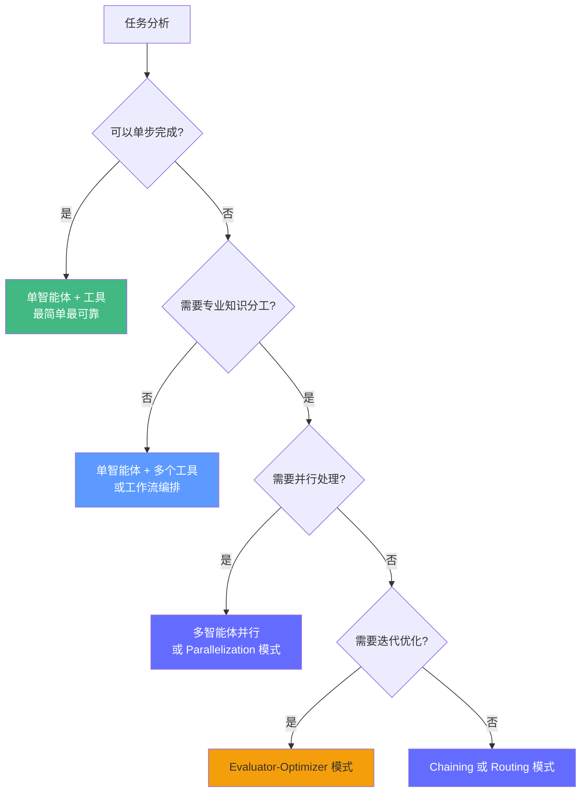
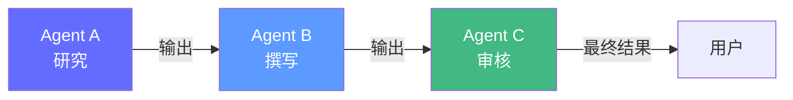
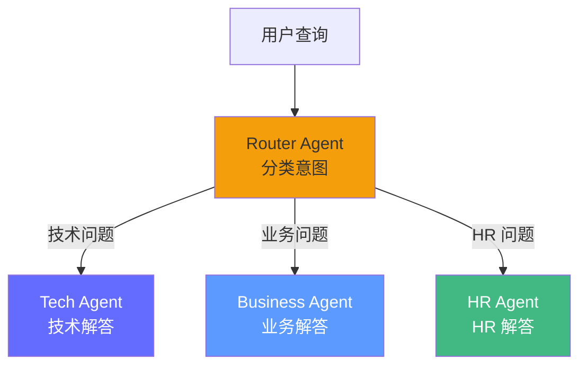
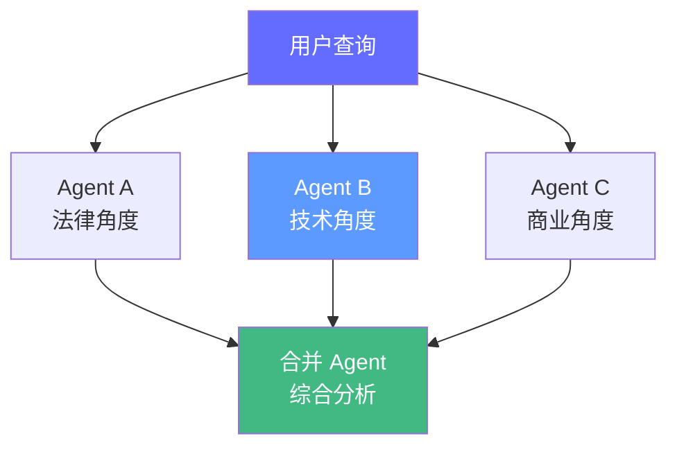
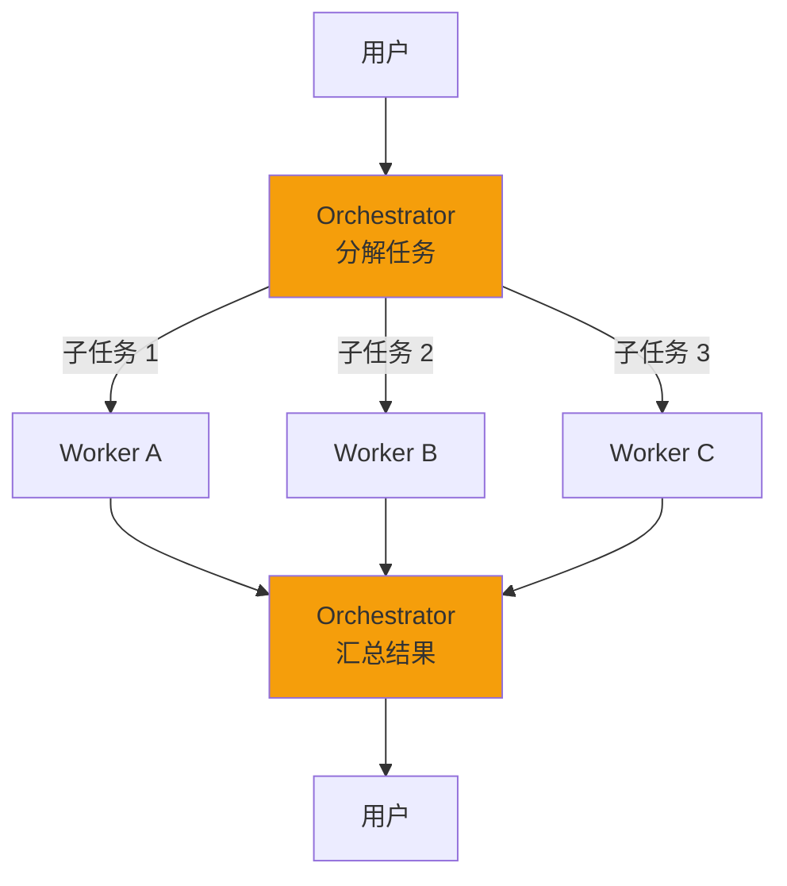
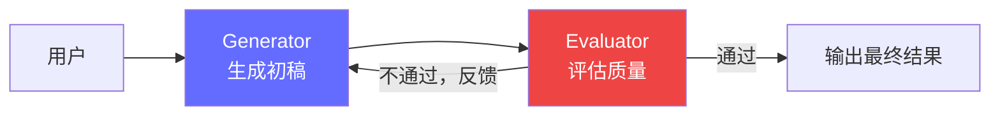
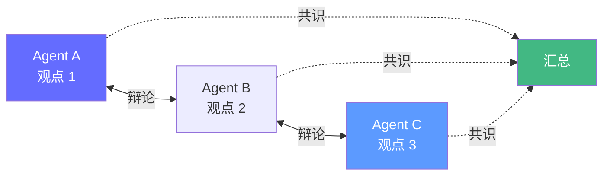
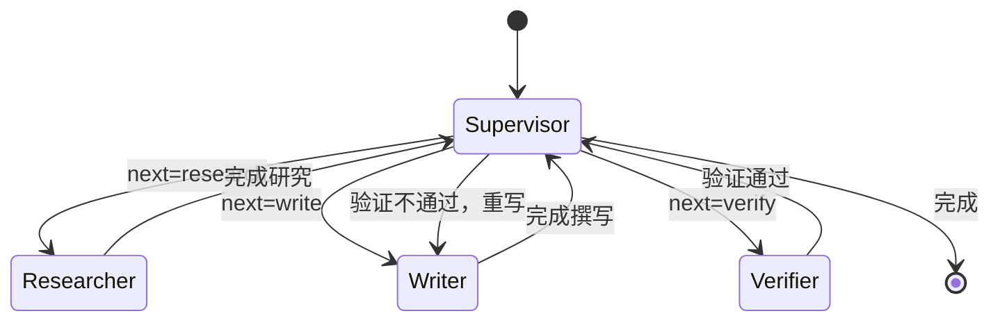
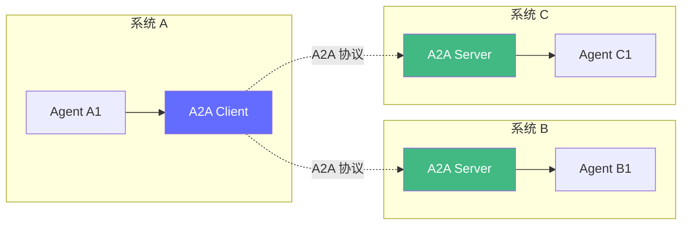

# 多智能体编排——让多个 Agent 协作

> 2026 年，行业正从"单一智能 Agent"转向**分布式、可互操作的多智能体生态系统**。掌握 6 大编排模式和 A2A 协议是进阶关键。但记住：多智能体不是"越多越好"，而是"够用就好"。

## 前置知识

- LangGraph 状态图（节点、边、条件路由）
- 工具调用原理
- 异步编程（asyncio）

## 核心概念

### 何时该用多智能体？



> **核心原则**：多智能体的**复杂度和成本是单智能体的 3-10 倍**。只在任务确实需要分解、单智能体无法完成时，才考虑多智能体。

---

### 6 大多智能体编排模式

#### 模式 1：链式（Chaining）



**特征**：
- 最简单、成本最低
- 固定流程，无分支
- 每个 Agent 的输出作为下一个 Agent 的输入

**适用场景**：数据清洗 → 分析 → 报告生成、翻译 → 润色 → 格式化

```python
# LangGraph 链式实现
graph = StateGraph(AgentState)

graph.add_node("researcher", researcher_node)
graph.add_node("writer", writer_node)
graph.add_node("reviewer", reviewer_node)

graph.set_entry_point("researcher")
graph.add_edge("researcher", "writer")
graph.add_edge("writer", "reviewer")
graph.add_edge("reviewer", END)
```

#### 模式 2：路由（Routing）



**特征**：
- 分类 Agent 决定将任务分发给哪个专业 Agent
- 适合"一个入口，多个专业处理"场景

```python
def router(state: AgentState) -> Literal["tech", "business", "hr"]:
    """分类路由器——可以用 LLM 或规则实现。"""
    # 方法 1：LLM 分类（更灵活）
    # classification = llm.invoke(f"分类以下查询：{state['query']}")

    # 方法 2：规则分类（更快、更确定）
    tech_keywords = ["API", "SDK", "代码", "bug", "部署", "配置"]
    business_keywords = ["营收", "合同", "客户", "市场", "销售"]
    hr_keywords = ["薪资", "福利", "假期", "报销", "考勤"]

    query = state["query"].lower()
    tech_score = sum(1 for kw in tech_keywords if kw in query)
    business_score = sum(1 for kw in business_keywords if kw in query)
    hr_score = sum(1 for kw in hr_keywords if kw in query)

    if max(tech_score, business_score, hr_score) == 0:
        return "tech"  # 默认
    if tech_score >= business_score and tech_score >= hr_score:
        return "tech"
    if business_score >= hr_score:
        return "business"
    return "hr"

graph.add_conditional_edges("router", router, {
    "tech": "tech_agent",
    "business": "business_agent",
    "hr": "hr_agent",
})
```

#### 模式 3：并行（Parallelization）



**特征**：
- 多个 Agent 同时工作，互不依赖
- 适合需要多角度分析的任务
- 可以显著降低延迟（并行执行）

```python
import asyncio

async def parallel_analysis(query: str) -> dict:
    """多个 Agent 并行分析同一问题。"""
    async def legal_analysis():
        return await llm.ainvoke(f"从法律角度分析：{query}")

    async def tech_analysis():
        return await llm.ainvoke(f"从技术角度分析：{query}")

    async def business_analysis():
        return await llm.ainvoke(f"从商业角度分析：{query}")

    # 并行执行——总延迟 = 最慢的那个，而非三者之和
    legal, tech, business = await asyncio.gather(
        legal_analysis(), tech_analysis(), business_analysis(),
    )

    # 合并
    merge_prompt = f"""综合以下三个角度的分析，给出综合结论：

法律角度：{legal.content}
技术角度：{tech.content}
商业角度：{business.content}
"""
    merged = await llm.ainvoke(merge_prompt)
    return {"analysis": merged.content}
```

#### 模式 4：编排者-工人（Orchestrator-Worker）



**特征**：
- 中央调度器动态分配任务
- 工人可以并行或串行工作
- 适合复杂任务需要动态分解的场景

#### 模式 5：评估-优化（Evaluator-Optimizer）



**特征**：
- 一个 Agent 生成，另一个 Agent 批评和优化
- 自动迭代直到满足质量标准
- 必须设置最大迭代次数，防止死循环

```python
class EvaluatorState(TypedDict):
    query: str
    draft: str
    feedback: str
    iteration: int
    passed: bool

def generator(state: EvaluatorState) -> dict:
    """生成器——基于反馈优化草稿。"""
    if state["iteration"] == 0:
        # 第一轮：直接生成
        prompt = f"回答以下问题：{state['query']}"
    else:
        # 后续轮：基于反馈改进
        prompt = f"""原问题：{state['query']}
之前的草稿：{state['draft']}
评审意见：{state['feedback']}

请根据评审意见改进回答。"""
    draft = llm.invoke(prompt)
    return {"draft": draft.content, "iteration": state["iteration"] + 1}

def evaluator(state: EvaluatorState) -> dict:
    """评估者——判断草稿是否达标。"""
    eval_prompt = f"""你是一名严格的评审。评估以下回答是否满足标准：

问题：{state['query']}
回答：{state['draft']}

标准：
1. 回答准确、完整
2. 没有编造信息
3. 逻辑清晰

请以 JSON 格式返回：
{{"passed": true/false, "feedback": "具体的改进意见"}}
"""
    result = llm.invoke(eval_prompt)
    # 解析 JSON
    import json
    eval_result = json.loads(extract_json(result.content))
    return {"passed": eval_result["passed"], "feedback": eval_result["feedback"]}

def should_continue(state: EvaluatorState) -> Literal["generator", "END"]:
    if state["passed"]:
        return "END"
    if state["iteration"] >= 3:  # 最多迭代 3 次
        return "END"  # 超过最大次数，输出当前版本
    return "generator"

graph = StateGraph(EvaluatorState)
graph.add_node("generator", generator)
graph.add_node("evaluator", evaluator)
graph.set_entry_point("generator")
graph.add_edge("generator", "evaluator")
graph.add_conditional_edges("evaluator", should_continue)
```

#### 模式 6：群体/辩论（Swarm/Debate）



**特征**：
- 多个 Agent 无中心协作
- 通过"辩论"达成共识
- 适合创造性任务、多观点分析

```python
async def debate(query: str, n_agents: int = 3, rounds: int = 2) -> str:
    """多个 Agent 辩论后达成共识。"""
    # 初始化每个 Agent 的初始观点
    agents = [
        {"role": "保守派", "prompt": "从保守、谨慎的角度分析"},
        {"role": "创新派", "prompt": "从创新、前瞻的角度分析"},
        {"role": "实用派", "prompt": "从实用、可落地的角度分析"},
    ][:n_agents]

    opinions = []
    for agent in agents:
        opinion = await llm.ainvoke(f"{agent['prompt']}：{query}")
        opinions.append(f"[{agent['role']}] {opinion.content}")

    # 辩论轮次
    for round_i in range(rounds):
        new_opinions = []
        for agent in agents:
            all_opinions = "\n\n".join(opinions)
            debate_prompt = f"""{agent['prompt']}

其他 Agent 的观点：
{all_opinions}

请回应其他观点，并调整你的看法。"""
            response = await llm.ainvoke(debate_prompt)
            new_opinions.append(f"[{agent['role']}] {response.content}")
        opinions = new_opinions

    # 汇总达成共识
    consensus_prompt = f"""综合以下观点，形成一个共识：

{''.join(opinions)}

请给出一个平衡各方观点的综合结论。"""
    consensus = await llm.ainvoke(consensus_prompt)
    return consensus.content
```

---

### LangGraph Supervisor 模式（生产级多智能体）



```python
from langgraph.graph import StateGraph, END
from typing import TypedDict, Literal
from langchain_openai import ChatOpenAI
from pydantic import BaseModel, Field

llm = ChatOpenAI(model="gpt-4o-mini")

class TeamState(TypedDict):
    query: str
    next: str  # 下一步：research, write, verify, END
    research_result: str
    draft: str
    feedback: str
    final_answer: str
    iteration: int

# 结构化输出——Supervisor 的决策
class SupervisorDecision(BaseModel):
    next: str = Field(description="下一步：research, write, verify, 或 END")
    reason: str = Field(description="为什么做这个决定")

def supervisor(state: TeamState) -> dict:
    """监督者——决定下一步由哪个 Agent 执行。"""
    system_prompt = """你是团队监督者。根据当前状态决定下一步：
- 如果需要收集信息，下一步 research
- 如果有研究结果但还没写报告，下一步 write
- 如果有草稿但还没验证，下一步 verify
- 如果验证通过，END
- 如果验证不通过，回写重写"""

    if state["iteration"] == 0:
        user_msg = f"用户请求：{state['query']}"
    elif state.get("feedback"):
        user_msg = f"验证反馈：{state['feedback']}"
    else:
        user_msg = "继续"

    structured_llm = llm.with_structured_output(SupervisorDecision)
    decision = structured_llm.invoke([
        {"role": "system", "content": system_prompt},
        {"role": "user", "content": user_msg},
    ])

    return {"next": decision.next, "iteration": state["iteration"] + 1}

def researcher(state: TeamState) -> dict:
    """研究者——搜索和分析。"""
    research_prompt = f"""你是研究专家。深入研究以下问题，提供详细的分析：

{state['query']}

请提供：事实数据、分析、关键发现。"""
    result = llm.invoke(research_prompt)
    return {"research_result": result.content}

def writer(state: TeamState) -> dict:
    """写作者——基于研究撰写报告。"""
    write_prompt = f"""你是专业写作者。基于以下研究结果撰写报告：

研究结果：
{state['research_result']}

{f'之前的反馈：{state["feedback"]}' if state.get('feedback') else ''}

要求：结构清晰、逻辑严密、引用来源。"""
    draft = llm.invoke(write_prompt)
    return {"draft": draft.content}

def verifier(state: TeamState) -> dict:
    """验证者——检查报告质量。"""

    class VerificationResult(BaseModel):
        passed: bool
        feedback: str = Field(description="如果不通过，给出具体修改建议")

    structured_llm = llm.with_structured_output(VerificationResult)
    result = structured_llm.invoke(f"""你是严格的审稿人。检查以下报告：

问题：{state['query']}
报告：{state['draft']}

检查标准：
1. 是否完整回答了问题
2. 是否有编造信息
3. 逻辑是否一致
4. 是否引用了研究结果""")

    return {"feedback": result.feedback, "next": "END" if result.passed else "write"}

def route_supervisor(state: TeamState) -> Literal["researcher", "writer", "verifier", "finalizer"]:
    """Supervisor 路由——根据 next 字段决定下一步。"""
    mapping = {
        "research": "researcher",
        "write": "writer",
        "verify": "verifier",
        "END": "finalizer",
    }
    return mapping.get(state["next"], "finalizer")

# 构建图
graph = StateGraph(TeamState)
graph.add_node("supervisor", supervisor)
graph.add_node("researcher", researcher)
graph.add_node("writer", writer)
graph.add_node("verifier", verifier)
graph.add_node("finalizer", lambda state: {"final_answer": state["draft"]})

graph.set_entry_point("supervisor")
graph.add_conditional_edges("supervisor", route_supervisor)
graph.add_edge("researcher", "supervisor")
graph.add_edge("writer", "supervisor")
graph.add_edge("verifier", "supervisor")
graph.add_edge("finalizer", END)

app = graph.compile()

# 运行
result = app.invoke({
    "query": "分析 2026 年 LLM 推理部署的最佳实践",
    "next": "",
    "research_result": "",
    "draft": "",
    "feedback": "",
    "final_answer": "",
    "iteration": 0,
})
print(result["final_answer"])
```

---

### A2A 协议（Agent-to-Agent Protocol）

Google 推出的**多智能体互操作协议**，已被 50+ 公司支持。类比：MCP 是 Agent-Tool 的标准，A2A 是 Agent-Agent 的标准。



#### 为什么需要 A2A

| 不用 A2A | 用 A2A |
|----------|--------|
| Agent 之间硬编码连接 | 标准化 HTTP/JSON 通信 |
| 跨系统不兼容 | 任何 A2A Agent 可以互操作 |
| 难以扩展 | 即插即用，发现新 Agent 自动注册 |
| 每个系统有自己的 API | 统一的 Task/Artifact 模型 |

#### A2A 核心概念

```python
# A2A 伪代码——理解概念即可
from a2a import AgentClient, Task, Artifact

# 1. 发现远程 Agent
client = AgentClient("http://agent-b.example.com/a2a")
agent_card = await client.get_agent_card()
print(f"Agent B 支持的任务: {agent_card.capabilities}")

# 2. 发送任务
task = Task(
    task_id="task-001",
    context="分析中国市场 AI 部署趋势",
    artifacts=[Artifact(type="text", data="背景信息...")],
)
result = await client.send_task(task)

# 3. 获取结果
for artifact in result.artifacts:
    print(f"结果: {artifact.data}")
```

#### 2026 框架对比

| 模式 | 推荐框架 | 复杂度 | 场景 |
|------|----------|--------|------|
| Supervisor | LangGraph / AgentScope | ★★★ | 需要精细控制的多智能体 |
| Handoff | LangGraph + OpenAI Agent SDK | ★★ | Agent 交接场景 |
| 角色团队 | CrewAI | ★★ | 定义明确的角色分工 |
| 辩论 | AutoGen | ★★★ | 多角度分析、研究 |
| 跨系统互操作 | A2A 协议 | ★★★★ | 不同系统的 Agent 协作 |
| 分布式协作 | AgentScope (gRPC) | ★★★★ | 多 Agent 跨机器/跨进程协作 |

## 工程视角

### 单智能体 vs 多智能体——成本与效果对比

以"撰写技术报告"任务为例：

| 方案 | LLM 调用次数 | 总延迟 | Token 成本 | 报告质量 |
|------|------------|--------|-----------|----------|
| 单智能体 | 1 次 | ~3s | ~$0.005 | 70 分 |
| 链式（3 Agent） | 3 次 | ~9s | ~$0.015 | 78 分 |
| Supervisor（3 轮） | 6-9 次 | ~18-27s | ~$0.03-0.045 | 85 分 |
| Evaluator-Optimizer（3 轮） | 6 次 | ~18s | ~$0.03 | 88 分 |

**结论**：
- 多智能体质量提升 15-25%，但成本增加 3-9 倍
- **简单任务不值得**用多智能体
- 复杂报告、法律分析、医疗诊断等**高质量要求场景**才值得投入

### 多智能体调试技巧

1. **日志每个 Agent 的输入输出**：用 `structlog` 记录每个节点的 `input → output`
2. **设置 Trace ID**：贯穿所有 Agent 的单次任务运行
3. **限制最大迭代次数**：防止 Supervisor 循环或 Evaluator 无限优化
4. **可视化执行图**：LangGraph 的 `app.get_graph().draw_mermaid()` 生成可视化

## 面试视角

### Q: 什么时候该用多智能体？什么时候不该用？

**满分回答框架**：
- **该用**：任务需要明确的专业分工、需要迭代优化、需要多角度分析
- **不该用**：单步能完成的任务（用多智能体是杀鸡用牛刀）、成本敏感的场景、延迟要求高的场景
- **判断标准**：先尝试单智能体 + 工具，如果效果不达标再考虑多智能体
- **成本意识**：多智能体的成本是单智能体的 3-10 倍，质量提升 15-25%，必须评估 ROI

### Q: Supervisor 模式和 Handoff 模式有什么区别？

**满分回答框架**：
- **Supervisor**：中央调度器决定每一步，所有 Agent 向 Supervisor 汇报。适合需要全局控制的场景
- **Handoff**：Agent A 完成任务后，直接将控制权移交给 Agent B。适合线性流程
- **类比**：Supervisor 是"项目经理"，Handoff 是"流水线交接"
- **Supervisor 更灵活**：可以动态决定下一步，Handoff 是固定的流程

### Q: A2A 协议解决了什么问题？

**满分回答框架**：
- 解决了**跨系统 Agent 互操作**的问题
- MCP 标准化了 Agent-Tool 连接，A2A 标准化了 Agent-Agent 连接
- 一次实现 A2A Client，可以与任何 A2A Server 通信
- 核心价值：**解耦**——Agent 不需要知道对方的实现细节，只需要遵循 Task/Artifact 模型

---

## 实战环节：构建一个 Supervisor 多智能体系统

### 目标

用 LangGraph 构建一个包含 Supervisor + Researcher + Writer + Verifier 的多智能体协作系统。

### 环境要求

- Python 3.12+
- `uv add langgraph langchain langchain-openai pydantic`
- OpenAI API Key

### 步骤

**1. 实现 Supervisor 多智能体**

```python
# multi_agent.py
from langgraph.graph import StateGraph, END
from langchain_openai import ChatOpenAI
from typing import TypedDict, Literal
from pydantic import BaseModel, Field

llm = ChatOpenAI(model="gpt-4o-mini")

class TeamState(TypedDict):
    query: str
    next: str
    research_result: str
    draft: str
    feedback: str
    final_answer: str
    iteration: int

class Decision(BaseModel):
    next: str = Field(description="research, write, verify, 或 END")

def supervisor(state: TeamState) -> dict:
    prompt = f"""你是团队监督。当前状态：
- 研究结果: {'有' if state['research_result'] else '无'}
- 草稿: {'有' if state['draft'] else '无'}
- 验证反馈: {state.get('feedback', '无')}

决定下一步：
{'验证不通过，需要重写' if state.get('feedback') and state['feedback'] != '无' else ''}
"""
    structured_llm = llm.with_structured_output(Decision)
    decision = structured_llm.invoke([
        {"role": "system", "content": "根据当前状态决定下一步。"},
        {"role": "user", "content": prompt},
    ])
    return {"next": decision.next, "iteration": state["iteration"] + 1}

def researcher(state: TeamState) -> dict:
    result = llm.invoke(f"请详细研究并分析：{state['query']}")
    return {"research_result": result.content}

def writer(state: TeamState) -> dict:
    context = state["research_result"]
    if state.get("feedback") and state["feedback"] != "无":
        context += f"\n\n修改建议：{state['feedback']}"
    draft = llm.invoke(f"基于以下内容撰写报告：\n\n{context}")
    return {"draft": draft.content}

def verifier(state: TeamState) -> dict:
    class Verdict(BaseModel):
        passed: bool
        feedback: str

    structured_llm = llm.with_structured_output(Verdict)
    result = structured_llm.invoke(f"""检查报告质量：
问题：{state['query']}
报告：{state['draft'][:2000]}
标准：完整性、准确性、逻辑性。""")
    return {"feedback": result.feedback if not result.passed else "无",
            "next": "END" if result.passed else "write"}

def router(state: TeamState) -> Literal["researcher", "writer", "verifier", "done"]:
    return {"research": "researcher", "write": "writer", "verify": "verifier", "END": "done"}.get(state["next"], "done")

def finalize(state: TeamState) -> dict:
    return {"final_answer": state["draft"]}

# 构建图
graph = StateGraph(TeamState)
for name, func in [("supervisor", supervisor), ("researcher", researcher),
                   ("writer", writer), ("verifier", verifier), ("done", finalize)]:
    graph.add_node(name, func)

graph.set_entry_point("supervisor")
graph.add_conditional_edges("supervisor", router)
for node in ["researcher", "writer", "verifier"]:
    graph.add_edge(node, "supervisor")
graph.add_edge("done", END)

app = graph.compile()
```

**2. 运行**

```python
# run_multi_agent.py
from multi_agent import app

result = app.invoke({
    "query": "2026 年 LLM 推理部署的最佳实践是什么？",
    "next": "", "research_result": "", "draft": "",
    "feedback": "", "final_answer": "", "iteration": 0,
})

print("=== 最终报告 ===")
print(result["final_answer"])
print(f"\n迭代次数: {result['iteration']}")
```

**3. 对比单智能体**

```python
# compare.py
from multi_agent import app
from langchain_openai import ChatOpenAI

llm = ChatOpenAI(model="gpt-4o-mini")

# 单智能体版本
single = llm.invoke("2026 年 LLM 推理部署的最佳实践是什么？")

# 多智能体版本
multi = app.invoke({
    "query": "2026 年 LLM 推理部署的最佳实践是什么？",
    "next": "", "research_result": "", "draft": "",
    "feedback": "", "final_answer": "", "iteration": 0,
})

print("=== 单智能体 ===")
print(single.content)
print(f"\nToken 估算: ~{len(single.content) // 4 * 3} tokens")

print("\n=== 多智能体 ===")
print(multi["final_answer"])
print(f"\n迭代次数: {multi['iteration']}")
print(f"Token 估算: ~{multi['iteration'] * 2000} tokens")
```

### 验证成功

- [ ] Supervisor 正确调度 Researcher → Writer → Verifier
- [ ] Verifier 如果不通过，能回写要求重写
- [ ] 最终报告比单智能体版本更完整、更有条理
- [ ] 能观察到每个 Agent 的输入输出

### 思考题

1. Supervisor 模式中，如果 LLM 分类错误（该 research 时选择了 write），系统会怎样？如何改进 Supervisor 的决策？
2. Evaluator-Optimizer 模式中，如何设定评估标准才能让优化更有效？用结构化输出还是自由文本评估更好？
3. 如果 3 个 Agent 需要并行工作（而非串行），如何用 `asyncio.gather` 改造 Supervisor 模式？

---

*上一阶段：[← 记忆工程](/agentic-ai/07-agent-memory) | [下一阶段：安全与 Guardrails →](/agentic-ai/09-safety-guardrails)*
