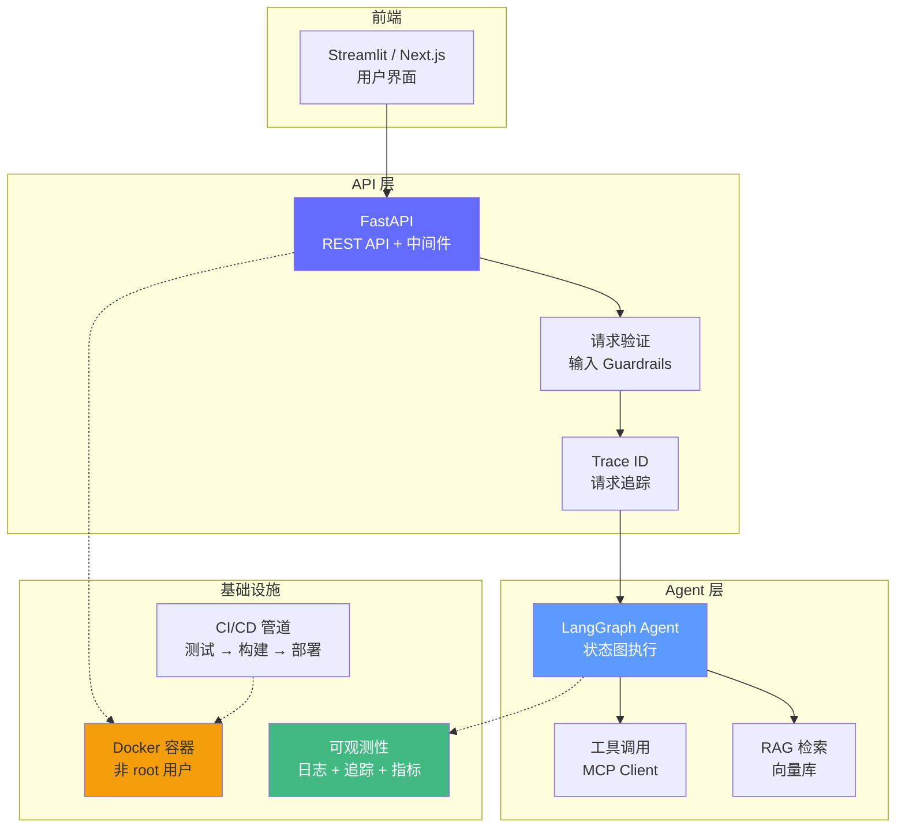
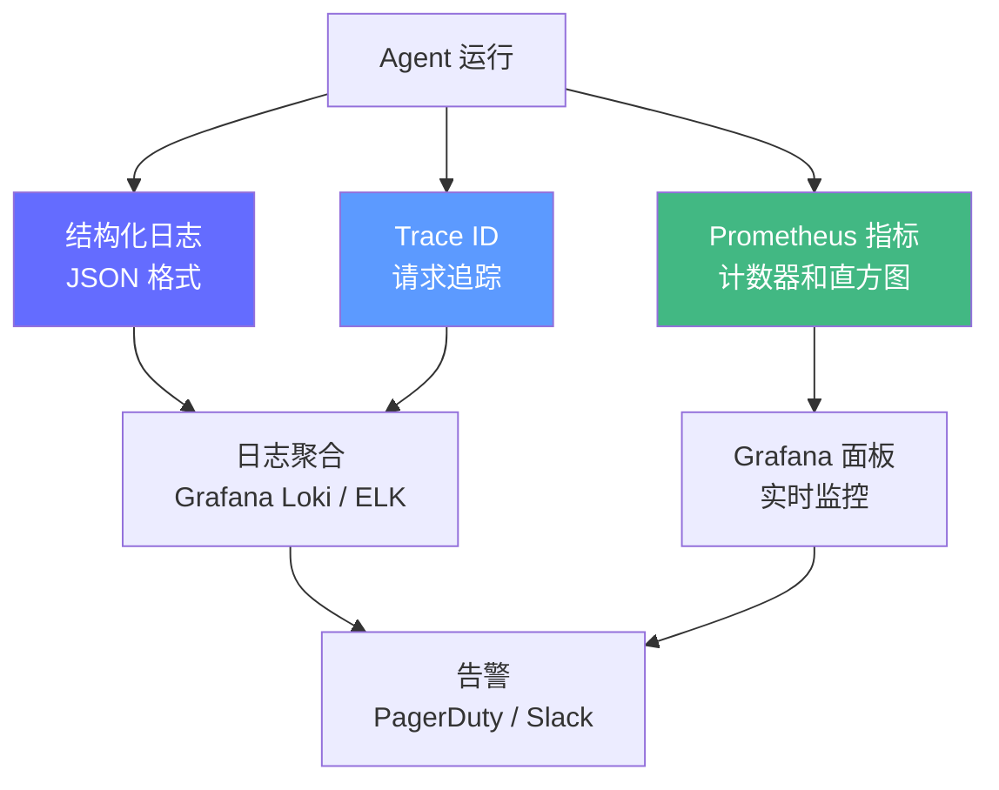

# 生产部署与可观测性——从 Demo 到产品

> 一个能在本地跑通的脚本，距离生产级应用还有巨大鸿沟。2026 年的生产级 Agent 系统需要：API 服务化、容器化、CI/CD、可观测性三件套、以及弹性伸缩。

## 前置知识

- FastAPI 基础（路由、中间件、Pydantic 模型）
- Docker 基础（Dockerfile、docker-compose）
- HTTP 协议基础

## 核心概念

### 生产级技术栈全景



---

### 1. 后端 API：FastAPI

#### 生产级 API 设计

```python
import uuid
import time
from contextlib import asynccontextmanager
from fastapi import FastAPI, HTTPException, BackgroundTasks
from fastapi.middleware.cors import CORSMiddleware
from pydantic import BaseModel, Field
import structlog

logger = structlog.get_logger()

# === 请求/响应模型 ===
class ChatRequest(BaseModel):
    query: str = Field(
        min_length=1,
        max_length=2000,
        description="用户查询",
        examples=["什么是 KV Cache？"],
    )
    session_id: str = Field(
        default="default",
        pattern=r"^[a-zA-Z0-9-]+$",
        max_length=64,
        description="会话 ID",
    )
    user_id: str = Field(
        default="anonymous",
        pattern=r"^[a-zA-Z0-9-]+$",
        max_length=64,
        description="用户 ID",
    )

class ChatResponse(BaseModel):
    answer: str
    sources: list[str] = []
    latency_ms: float
    trace_id: str
    tokens_used: int = 0

class HealthResponse(BaseModel):
    status: str
    version: str
    uptime_seconds: float

# === 应用生命周期 ===
start_time = time.time()

@asynccontextmanager
async def lifespan(app: FastAPI):
    """应用启动和关闭时的生命周期钩子。"""
    # 启动：初始化资源
    logger.info("app_starting", version="1.0.0")
    app.agent = initialize_agent()  # 初始化 LangGraph Agent
    app.vector_store = initialize_vector_store()  # 初始化向量库
    logger.info("app_ready")

    yield

    # 关闭：清理资源
    logger.info("app_shutting_down")
    # 关闭数据库连接、释放资源等

# === 创建应用 ===
app = FastAPI(
    title="Agent API",
    version="1.0.0",
    description="Agentic AI 生产级 API 服务",
    lifespan=lifespan,
)

# CORS 中间件
app.add_middleware(
    CORSMiddleware,
    allow_origins=["http://localhost:3000"],  # 生产环境改为实际域名
    allow_credentials=True,
    allow_methods=["*"],
    allow_headers=["*"],
)

# Trace ID 中间件——每个请求一个唯一 ID
@app.middleware("http")
async def trace_middleware(request, call_next):
    trace_id = str(uuid.uuid4())
    request.state.trace_id = trace_id

    start = time.time()
    response = await call_next(request)
    latency = (time.time() - start) * 1000

    response.headers["X-Trace-Id"] = trace_id
    response.headers["X-Request-Latency"] = f"{latency:.0f}ms"

    return response

# === 路由 ===
@app.get("/health", response_model=HealthResponse)
async def health():
    """健康检查——Docker HEALTHCHECK 和负载均衡器使用。"""
    return HealthResponse(
        status="ok",
        version="1.0.0",
        uptime_seconds=time.time() - start_time,
    )

@app.post("/chat", response_model=ChatResponse)
async def chat(request: ChatRequest):
    """Agent 对话接口。"""
    trace_id = request.state.trace_id

    logger.info(
        "chat_request",
        trace_id=trace_id,
        user_id=request.user_id,
        query_len=len(request.query),
        session_id=request.session_id,
    )

    try:
        config = {"configurable": {"thread_id": request.session_id}}
        start = time.time()

        result = await app.agent.ainvoke({
            "query": request.query,
            "results": [],
            "answer": "",
            "history": [],
        }, config)

        latency = (time.time() - start) * 1000
        tokens_used = estimate_tokens(request.query) + estimate_tokens(result["answer"])

        logger.info(
            "chat_response",
            trace_id=trace_id,
            latency_ms=round(latency, 1),
            tokens_used=tokens_used,
        )

        return ChatResponse(
            answer=result["answer"],
            sources=result.get("sources", []),
            latency_ms=round(latency, 1),
            trace_id=trace_id,
            tokens_used=tokens_used,
        )

    except Exception as e:
        logger.error(
            "chat_error",
            trace_id=trace_id,
            error=str(e),
            error_type=type(e).__name__,
        )
        raise HTTPException(status_code=500, detail="Internal error") from e

@app.get("/metrics")
async def metrics():
    """Prometheus 指标接口。"""
    return {
        "agent_requests_total": REQUEST_COUNT._value.get(),
        "agent_latency_seconds": REQUEST_LATENCY._sum.get(),
        "agent_tokens_total": TOKEN_USAGE._value.get(),
    }

# === 工具函数 ===
def initialize_agent():
    """初始化 LangGraph Agent。"""
    from langgraph.graph import StateGraph, END
    from typing import TypedDict

    class AgentState(TypedDict):
        query: str
        results: list
        answer: str
        history: list

    # ... 构建图 ...
    return graph.compile()

def initialize_vector_store():
    """初始化向量库。"""
    # ... 加载向量库 ...
    pass

def estimate_tokens(text: str) -> int:
    """粗略估算 Token 数（中文 ~1 token/1.5 字）。"""
    return len(text) // 2
```

---

### 2. 可观测性三件套



#### 结构化日志——问题定位的基础

```python
import structlog

# 配置结构化日志
structlog.configure(
    processors=[
        structlog.processors.TimeStamper(fmt="iso"),       # ISO 8601 时间戳
        structlog.processors.add_log_level,                # 日志级别
        structlog.processors.StackInfoRenderer(),          # 堆栈信息
        structlog.processors.format_exc_info,              # 异常格式化
        structlog.processors.JSONRenderer(),               # JSON 输出
    ],
    logger_factory=structlog.PrintLoggerFactory(),
)

logger = structlog.get_logger()

# 使用示例
logger.info(
    "agent_execution_started",
    agent_type="rag",
    version="1.0.0",
    user_id="user-001",
    query="什么是 KV Cache？",
)
# 输出：
# {"event": "agent_execution_started", "agent_type": "rag", "version": "1.0.0",
#  "user_id": "user-001", "query": "什么是 KV Cache？", "timestamp": "2026-01-15T10:30:00Z", "level": "info"}

# 带上下文的日志
with structlog.contextvars.bound_contextvars(trace_id="abc-123"):
    logger.info("step_started", step="retrieve")
    # 自动包含 trace_id
    logger.info("step_completed", step="retrieve", results_count=5)
```

#### 分布式追踪——Trace ID 贯穿全链路

```python
from contextvars import ContextVar
import uuid

# Trace ID 上下文变量
trace_id: ContextVar[str] = ContextVar("trace_id", default="unknown")

@app.middleware("http")
async def trace_middleware(request, call_next):
    tid = str(uuid.uuid4())
    trace_id.set(tid)
    response = await call_next(request)
    response.headers["X-Trace-Id"] = tid
    return response

# 在任何地方都能获取当前请求的 Trace ID
def get_current_trace_id() -> str:
    return trace_id.get()

# 使用场景：复现用户报告的错误
# 用户说："刚才问了个问题，回答不对"
# 查日志：grep "X-Trace-Id: abc-123" → 看到完整的请求路径
```

#### Prometheus 指标监控

```python
from prometheus_client import Counter, Histogram, Gauge, generate_latest, CONTENT_TYPE_LATEST
from fastapi import Response

# 计数器
REQUEST_COUNT = Counter(
    "agent_requests_total",
    "总请求数",
    ["status", "endpoint"],
)

# 直方图——不仅计数，还记录延迟分布
REQUEST_LATENCY = Histogram(
    "agent_latency_seconds",
    "请求延迟",
    ["endpoint"],
    buckets=[0.1, 0.5, 1.0, 2.0, 5.0, 10.0, 30.0],  # 延迟桶
)

# 工具调用计数
TOOL_CALL_COUNT = Counter(
    "agent_tool_calls_total",
    "工具调用次数",
    ["tool", "status"],  # status: success/error
)

# Token 消耗
TOKEN_USAGE = Counter(
    "agent_tokens_total",
    "Token 消耗",
    ["model", "type"],  # type: input/output
)

# 当前活跃请求数
ACTIVE_REQUESTS = Gauge(
    "agent_active_requests",
    "当前活跃请求数",
)

# 在 FastAPI 中暴露 Prometheus 指标
@app.get("/metrics")
async def prometheus_metrics():
    return Response(content=generate_latest(), media_type=CONTENT_TYPE_LATEST)
```

---

### 3. 容器化：Docker

#### 生产级 Dockerfile

```dockerfile
# === 构建阶段 ===
FROM python:3.12-slim AS builder

WORKDIR /app
COPY pyproject.toml uv.lock ./

# 安装 uv 和依赖
RUN pip install --no-cache-dir uv && \
    uv sync --frozen --no-dev --no-install-project

# === 运行阶段 ===
FROM python:3.12-slim

# 非 root 用户——安全最佳实践
RUN groupadd -r agent && useradd -r -g agent -u 1000 agent

WORKDIR /home/agent/app

# 从构建阶段复制依赖
COPY --from=builder --chown=agent:agent /app/.venv ./.venv

# 复制代码
COPY --chown=agent:agent . .

# 环境变量
ENV PYTHONUNBUFFERED=1 \
    PYTHONDONTWRITEBYTECODE=1 \
    PATH="/home/agent/app/.venv/bin:$PATH"

# 健康检查
HEALTHCHECK --interval=30s --timeout=5s --start-period=10s --retries=3 \
  CMD python -c "import urllib.request; urllib.request.urlopen('http://localhost:8000/health')"

EXPOSE 8000

# 启动命令
CMD ["uvicorn", "main:app", "--host", "0.0.0.0", "--port", "8000", \
     "--workers", "4", "--log-level", "info"]
```

#### docker-compose——本地开发和测试

```yaml
version: "3.9"
services:
  api:
    build: .
    ports: ["8000:8000"]
    environment:
      - OPENAI_API_KEY=${OPENAI_API_KEY}
      - DATABASE_URL=postgresql://postgres:password@db:5432/agent_db
      - VECTOR_STORE_PATH=/data/vector_store
    depends_on:
      db:
        condition: service_healthy
    volumes:
      - vector_data:/data/vector_store
    restart: unless-stopped
    healthcheck:
      test: ["CMD", "curl", "-f", "http://localhost:8000/health"]
      interval: 30s
      timeout: 5s
      retries: 3

  db:
    image: postgres:16-alpine
    environment:
      - POSTGRES_PASSWORD=password
      - POSTGRES_DB=agent_db
    volumes:
      - pgdata:/var/lib/postgresql/data
    ports: ["5432:5432"]
    restart: unless-stopped
    healthcheck:
      test: ["CMD-SHELL", "pg_isready -U postgres"]
      interval: 10s
      timeout: 5s
      retries: 5

  prometheus:
    image: prom/prometheus:latest
    ports: ["9090:9090"]
    volumes:
      - ./prometheus.yml:/etc/prometheus/prometheus.yml
      - prom_data:/prometheus
    restart: unless-stopped

  grafana:
    image: grafana/grafana:latest
    ports: ["3000:3000"]
    environment:
      - GF_SECURITY_ADMIN_PASSWORD=admin
    volumes:
      - grafana_data:/var/lib/grafana
    depends_on: [prometheus]
    restart: unless-stopped

volumes:
  pgdata:
  vector_data:
  prom_data:
  grafana_data:
```

---

### 4. CI/CD 管道

```yaml
# .github/workflows/deploy.yml
name: Deploy Agent API

on:
  push:
    branches: [main]
  pull_request:
    branches: [main]

jobs:
  test:
    runs-on: ubuntu-latest
    steps:
      - uses: actions/checkout@v4

      - name: Setup uv
        uses: astral-sh/setup-uv@v3
        with:
          python-version: "3.12"

      - name: Install dependencies
        run: uv sync --frozen

      - name: Lint
        run: uv run ruff check src/

      - name: Type check
        run: uv run mypy src/

      - name: Test
        run: uv run pytest tests/ --cov=src --cov-report=xml
        env:
          OPENAI_API_KEY: ${{ secrets.OPENAI_API_KEY }}

      - name: Upload coverage
        uses: codecov/codecov-action@v4
        with:
          file: coverage.xml

  build:
    needs: test
    runs-on: ubuntu-latest
    if: github.ref == 'refs/heads/main'
    steps:
      - uses: actions/checkout@v4

      - name: Build Docker image
        run: docker build -t ${{ secrets.REGISTRY }}/agent-api:${{ github.sha }} .

      - name: Push to registry
        run: |
          echo ${{ secrets.REGISTRY_PASSWORD }} | docker login ${{ secrets.REGISTRY }} -u ${{ secrets.REGISTRY_USER }} --password-stdin
          docker push ${{ secrets.REGISTRY }}/agent-api:${{ github.sha }}

  deploy:
    needs: build
    runs-on: ubuntu-latest
    if: github.ref == 'refs/heads/main'
    steps:
      - name: Deploy to production
        run: |
          # SSH 到服务器并部署
          ssh ${{ secrets.DEPLOY_HOST }} "cd /opt/agent && docker pull ${{ secrets.REGISTRY }}/agent-api:${{ github.sha }} && docker-compose up -d"
```

---

### 5. 前端演示：Streamlit

```python
"""Streamlit Agent Demo——快速前端界面。"""
import streamlit as st
import requests
import time

API_URL = "http://localhost:8000"

st.set_page_config(page_title="Agent Demo", layout="wide")
st.title("Agentic AI Demo")

# 会话管理
if "messages" not in st.session_state:
    st.session_state.messages = []
if "trace_ids" not in st.session_state:
    st.session_state.trace_ids = []

# 显示历史消息
for i, msg in enumerate(st.session_state.messages):
    with st.chat_message(msg["role"]):
        st.write(msg["content"])
        if msg["role"] == "assistant" and i < len(st.session_state.trace_ids):
            st.caption(f"Trace ID: {st.session_state.trace_ids[i]}")

# 用户输入
if query := st.chat_input("输入问题..."):
    st.session_state.messages.append({"role": "user", "content": query})

    with st.chat_message("user"):
        st.write(query)

    with st.chat_message("assistant"):
        with st.spinner("思考中..."):
            try:
                start = time.time()
                resp = requests.post(
                    f"{API_URL}/chat",
                    json={
                        "query": query,
                        "session_id": st.session_state.get("session_id", "default"),
                    },
                    timeout=30,
                )
                result = resp.json()
                latency = time.time() - start

                st.write(result["answer"])
                st.caption(f"延迟: {result['latency_ms']:.0f}ms | Token: {result['tokens_used']}")

                if result.get("sources"):
                    with st.expander(f"来源 ({len(result['sources'])} 个)"):
                        for i, src in enumerate(result["sources"], 1):
                            st.write(f"{i}. {src}")

                st.session_state.messages.append({"role": "assistant", "content": result["answer"]})
                st.session_state.trace_ids.append(result["trace_id"])

            except requests.exceptions.Timeout:
                st.error("请求超时，请稍后重试")
            except Exception as e:
                st.error(f"错误: {e}")
```

## 工程视角

### 部署架构对比

| 方案 | 适合场景 | 成本 | 复杂度 | 弹性 |
|------|---------|------|--------|------|
| **Docker + docker-compose** | 开发、小团队、MVP | 低 | 低 | 无 |
| **Kubernetes** | 生产、多服务、大规模 | 中-高 | 高 | 自动伸缩 |
| **Serverless（Cloud Run）** | 低流量、按需 | 按使用量 | 中 | 自动伸缩 |
| **托管服务（Modal, Together）** | Agent 工作负载 | 按 Token/时间 | 低 | 自动伸缩 |

### 生产环境 Checklist

```
□ API 服务
  □ 健康检查接口 /health
  □ CORS 配置（限制域名）
  □ 请求验证（Pydantic Schema）
  □ Trace ID 中间件
  □ 错误处理（HTTP 500 + 日志）
  □ 超时设置（30s）

□ 容器化
  □ 非 root 用户运行
  □ HEALTHCHECK 指令
  □ .env 文件不打包
  □ 多阶段构建（减小镜像体积）
  □ 固定 Python 版本（3.12-slim）

□ 可观测性
  □ 结构化日志（JSON）
  □ Trace ID 贯穿全链路
  □ Prometheus 指标（延迟、错误率、Token 消耗）
  □ Grafana 面板
  □ 告警规则（延迟 > 10s、错误率 > 5%）

□ CI/CD
  □ 自动测试（pytest）
  □ Lint 检查（ruff）
  □ Docker 构建
  □ 自动部署
  □ 回滚机制
```

### 成本估算

以 1000 用户/天、每用户 10 次查询为例（1 万次查询/天）：

| 组件 | 成本/月 | 计算方式 |
|------|--------|----------|
| LLM API | ~$360 | 1 万次/天 × 30 天 × $0.0012/次 |
| 嵌入模型（本地） | ~$0 | BGE-M3 本地部署 |
| 服务器（2 核 4G） | ~$50 | 云主机月费 |
| 数据库（PostgreSQL） | ~$30 | 托管数据库 |
| 监控（Grafana + Prometheus） | ~$0 | 自建 |
| **总计** | **~$440/月** | |

### Agent Token 成本优化

2026 年行业数据：**Agent 比聊天多消耗 50 倍 token**。一个开发者 3 天花了 $4,200 的案例已不是孤例。以下是 10 个经实战验证的优化策略。

#### 策略一：模型路由（Model Router）

不同难度的任务用不同模型——**不要所有任务都用 GPT-4o**。

```python
def model_router(task: str) -> str:
    """根据任务复杂度选择模型。"""
    # 简单任务：分类、提取、格式化 → 轻量模型
    simple_tasks = ["分类", "提取", "格式化", "翻译", "总结"]
    if any(t in task for t in simple_tasks):
        return "gpt-4o-mini"  # $0.15/M tokens

    # 中等任务：代码生成、推理、RAG → 中等模型
    if "代码" in task or "分析" in task:
        return "gpt-4o"  # $2.50/M tokens

    # 复杂任务：架构设计、安全审计 → 最强模型
    return "gpt-4o"

# 效果：60-80% 的请求走轻量模型，token 成本降低 40-60%
```

| 模型 | 输入价格 | 适合任务 | 成本占比目标 |
|------|---------|---------|-------------|
| GPT-4o-mini | $0.15/M | 分类、提取、格式化、简单 QA | 60-80% 的请求 |
| Claude Sonnet | $3.00/M | 中等推理、代码 | 10-20% |
| GPT-4o / Opus | $2.50-15/M | 复杂推理、架构、安全 | 5-10% |

#### 策略二：Prompt Caching

OpenAI 和 Anthropic 都支持 prompt caching——**重复的 prompt 前缀缓存后成本降低 50%**。

```python
# 好的做法：系统提示固定，只换用户输入
system_prompt = """你是一个技术助手。遵循以下规则：
1. 回答简洁
2. 提供代码示例
3. 引用文档链接
"""  # ← 这部分会被缓存

# 每个请求只发送变化的部分
user_message = "如何部署 vLLM？"  # ← 只有这部分收费
```

#### 策略三：上下文裁剪（Context Trimming）

**不要把所有历史消息都发给 Agent**。只保留必要上下文。

```python
def trim_context(messages: list, max_tokens: int = 3000) -> list:
    """裁剪上下文到 token 上限。"""
    # 1. 保留系统提示
    system = messages[0]

    # 2. 从最新消息开始保留，直到达到 token 上限
    trimmed = []
    token_count = 0
    for msg in reversed(messages[1:]):
        msg_tokens = estimate_tokens(msg["content"])
        if token_count + msg_tokens > max_tokens:
            break
        trimmed.insert(0, msg)
        token_count += msg_tokens

    return [system] + trimmed

# 效果：将 10k token 的上下文降到 3k，成本降低 70%
```

#### 策略四：输出长度控制

**强制 Agent 简洁回答**，避免啰嗦浪费 token。

```python
response = client.chat.completions.create(
    model="gpt-4o",
    messages=messages,
    max_tokens=500,        # 限制最大输出
    temperature=0.1,       # 低温度减少变化
)

# 在系统提示中加入：
# "回答控制在 200 字以内。代码除外。"
```

#### 策略五：Token 预算告警

```python
class TokenBudget:
    """Token 预算管理——超支自动告警。"""

    def __init__(self, daily_limit: int = 1_000_000):
        self.daily_limit = daily_limit
        self.used_today = 0
        self.alert_threshold = 0.8  # 80% 时告警

    def record_usage(self, tokens: int):
        self.used_today += tokens
        if self.used_today > self.daily_limit * self.alert_threshold:
            print(f"⚠️ Token 使用已达 {self.used_today/self.daily_limit*100:.0f}%！")

    def is_within_budget(self) -> bool:
        return self.used_today < self.daily_limit

# 生产实现：结合 Redis 按用户/团队追踪
```

#### 10 大策略汇总

| # | 策略 | 节省比例 | 实现难度 |
|---|------|---------|---------|
| 1 | 模型路由 | 40-60% | ★ |
| 2 | Prompt Caching | 50%（命中请求） | ★ |
| 3 | 上下文裁剪 | 30-70% | ★ |
| 4 | 输出长度控制 | 20-40% | ★ |
| 5 | Token 预算告警 | 防止意外 | ★ |
| 6 | 结果缓存（相同问题返回同样答案） | 20-30% | ★★ |
| 7 | 批量处理（减少 API 调用次数） | 10-20% | ★★ |
| 8 | 轻量模型做 Reflection | 50% vs 重模型 | ★★ |
| 9 | 向量检索预过滤（减少无关文档注入） | 30-50% | ★★★ |
| 10 | Agent 循环次数限制 | 防止无限消耗 | ★ |

## 面试视角

### Q: 如何将一个本地 Agent 脚本部署到生产环境？

**满分回答框架**：
1. **API 化**：用 FastAPI 包装为 REST 接口
2. **容器化**：编写 Dockerfile，非 root 用户运行
3. **可观测性**：结构化日志 + Trace ID + Prometheus 指标
4. **CI/CD**：自动测试 → 构建 → 部署
5. **安全**：输入验证、租户隔离、环境变量管理
6. **监控**：Grafana 面板 + 告警规则

### Q: 生产环境的 Agent 服务出现偶发超时，如何排查？

**满分回答框架**：
1. **看 Trace ID**：从用户报告的 Trace ID 找到完整请求路径
2. **查日志**：grep trace_id 看到每个步骤的耗时
3. **看指标**：Prometheus 延迟直方图——是普遍超时还是个例？
4. **定位瓶颈**：是 LLM API 慢？向量检索慢？还是重排序慢？
5. **临时修复**：增加超时时间
6. **根本修复**：优化瓶颈步骤（如换轻量重排序模型）

### Q: 如何选择 Agent 服务的部署方案？

**满分回答框架**：
- **MVP 阶段**：docker-compose 单机部署，成本最低
- **生产初期**：Kubernetes 或 Cloud Run，支持自动伸缩
- **大规模**：Kubernetes + 多个副本 + HPA（基于 CPU/延迟自动伸缩）
- **Agent 特化**：Modal、Together 等 Serverless Agent 平台，按 Token/时间计费，无需管理基础设施
- **决策标准**：流量规模、团队运维能力、成本预算

---

## 实战环节：部署一个生产级 Agent 服务

### 目标

将 Agent 系统部署为可监控的 API 服务，包含 Docker 容器、健康检查、结构化日志、Prometheus 指标。

### 环境要求

- Python 3.12+
- `uv add fastapi uvicorn langgraph langchain pydantic structlog prometheus-client`
- Docker Desktop

### 步骤

**1. 创建 FastAPI 应用**

```python
# main.py
import uuid
import time
from fastapi import FastAPI, HTTPException
from pydantic import BaseModel, Field
import structlog

structlog.configure(
    processors=[
        structlog.processors.TimeStamper(fmt="iso"),
        structlog.processors.add_log_level,
        structlog.processors.JSONRenderer(),
    ],
)
logger = structlog.get_logger()

app = FastAPI(title="Agent API", version="1.0.0")

class ChatRequest(BaseModel):
    query: str = Field(min_length=1, max_length=2000)
    session_id: str = Field(default="default", pattern=r"^[a-zA-Z0-9-]+$")

class ChatResponse(BaseModel):
    answer: str
    trace_id: str
    latency_ms: float

@app.middleware("http")
async def trace_middleware(request, call_next):
    tid = str(uuid.uuid4())
    request.state.trace_id = tid
    start = time.time()
    response = await call_next(request)
    latency_ms = (time.time() - start) * 1000
    response.headers["X-Trace-Id"] = tid
    response.headers["X-Latency"] = f"{latency_ms:.0f}ms"
    return response

@app.get("/health")
async def health():
    return {"status": "ok", "version": "1.0.0"}

@app.post("/chat", response_model=ChatResponse)
async def chat(request: ChatRequest):
    trace_id = request.state.trace_id
    logger.info("chat_request", trace_id=trace_id, query=request.query)

    start = time.time()
    # 模拟 Agent 处理
    time.sleep(0.5)
    answer = f"这是关于 '{request.query}' 的回答。"
    latency = (time.time() - start) * 1000

    logger.info("chat_response", trace_id=trace_id, latency_ms=round(latency, 1))

    return ChatResponse(answer=answer, trace_id=trace_id, latency_ms=round(latency, 1))
```

**2. 创建 Dockerfile**

```dockerfile
FROM python:3.12-slim
RUN useradd -r -u 1000 agent
WORKDIR /home/agent/app
COPY . .
RUN pip install --no-cache-dir fastapi uvicorn pydantic structlog prometheus-client
HEALTHCHECK --interval=30s --timeout=5s --retries=3 \
  CMD python -c "import urllib.request; urllib.request.urlopen('http://localhost:8000/health')"
EXPOSE 8000
USER agent
CMD ["uvicorn", "main:app", "--host", "0.0.0.0", "--port", "8000"]
```

**3. 构建并运行**

```bash
# 构建镜像
docker build -t agent-api .

# 运行容器
docker run -d -p 8000:8000 --name agent agent-api

# 验证
curl http://localhost:8000/health
# → {"status":"ok","version":"1.0.0"}

curl -X POST http://localhost:8000/chat \
  -H "Content-Type: application/json" \
  -d '{"query": "什么是 KV Cache？"}'
# → {"answer":"这是关于 '什么是 KV Cache？' 的回答。","trace_id":"abc-123","latency_ms":500}

# 查看日志（JSON 格式）
docker logs agent

# 查看 Trace ID（在响应头中）
curl -v -X POST http://localhost:8000/chat \
  -H "Content-Type: application/json" \
  -d '{"query": "测试"}' 2>&1 | grep -i x-trace-id
```

### 验证成功

- [ ] API 服务启动，`/health` 返回 `{"status":"ok"}`
- [ ] `/chat` 接口返回回答 + trace_id + latency
- [ ] Docker 容器以非 root 用户运行
- [ ] 健康检查通过（`docker ps` 显示 healthy）
- [ ] 日志为 JSON 格式，包含 trace_id

### 思考题

1. 如果 4 个 worker 进程同时运行，Trace ID 还能正确追踪吗？如何确保跨进程的 Trace 传递？
2. Docker 健康检查的 `--start-period=10s` 是什么意思？如果 Agent 初始化需要 30 秒（加载向量模型），应该如何调整？
3. 如果要将服务部署到 Kubernetes，除了 Dockerfile 还需要编写哪些资源文件（Deployment、Service、Ingress）？

---

*上一阶段：[← 安全与 Guardrails](/agentic-ai/09-safety-guardrails) | [下一阶段：检查清单 →](/agentic-ai/11-checklist-interview)*
