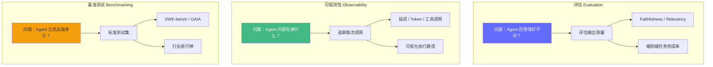
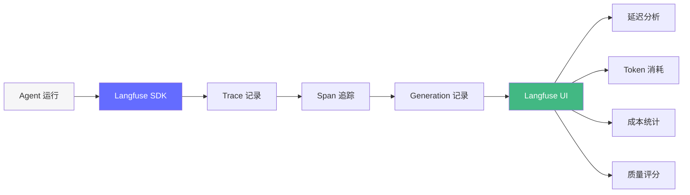
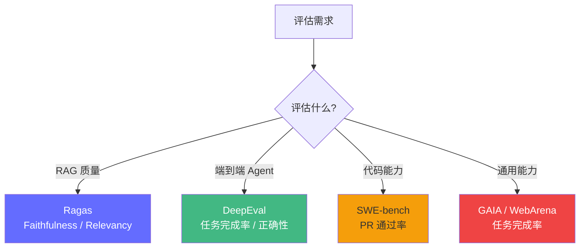
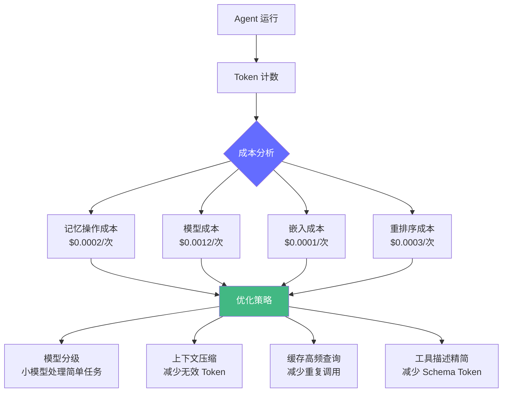

# Agent 评估与可观测性——让系统"看得见自己"

> 一个没有可观测性的 Agent 系统就是"盲飞"。2026 年，评估（Evaluation）、可观测性（Observability）、基准测试（Benchmarking）已成为三个独立的工程领域。Gartner 预测 40% 的 Agentic AI 项目失败——其中 70% 归因于缺乏评估和监控能力。

## 前置知识

- 生产部署基础（FastAPI、Docker）
- RAG 评估基础（Ragas）
- Prometheus 指标监控概念

## 核心概念

### 评估 vs 可观测性 vs 基准测试



| 维度 | 评估（Evaluation） | 可观测性（Observability） | 基准测试（Benchmarking） |
|------|-------------------|-------------------------|-------------------------|
| **问题** | "我的 Agent 回答得好不好？" | "Agent 内部在发生什么？" | "我的 Agent 比竞品强多少？" |
| **频率** | 定期（每次迭代后） | 实时（每次请求） | 偶发（版本发布前） |
| **工具** | Ragas、DeepEval | Langfuse、LangSmith | SWE-bench、GAIA |
| **指标** | Faithfulness、Relevancy | 延迟、Token、错误率 | 分数、排名 |
| **类比** | 产品质量检测 | 工厂仪表盘 | 行业排行榜 |

---

### 1. 可观测性：Langfuse 实战

[Langfuse](https://langfuse.com/) 是 2026 年最流行的开源 Agent 可观测性平台。



#### Langfuse 集成

```python
# 1. 安装
# uv add langfuse openai

# 2. 配置
import os
os.environ["LANGFUSE_PUBLIC_KEY"] = "pk-lf-xxx"
os.environ["LANGFUSE_SECRET_KEY"] = "sk-lf-xxx"
os.environ["LANGFUSE_HOST"] = "https://cloud.langfuse.com"  # 或自建

# 3. 使用 Langfuse 追踪 LLM 调用
from langfuse.openai import openai  # 替代 import openai

# 自动追踪所有 OpenAI 调用
response = openai.chat.completions.create(
    model="gpt-4o-mini",
    messages=[{"role": "user", "content": "什么是 KV Cache？"}],
)
# → Langfuse UI 自动显示：
# - 输入/输出内容
# - Token 消耗（input: 15, output: 120）
# - 延迟（latency: 1.2s）
# - 成本（cost: $0.0005）
```

#### 手动追踪——Agent 执行路径可视化

```python
from langfuse import Langfuse
from langfuse.decorators import observe, langfuse_context

langfuse = Langfuse()

@observe()
def retrieve(query: str) -> list:
    """追踪检索节点。"""
    results = vector_store.similarity_search(query, k=5)
    langfuse_context.update_current_observation(
        metadata={"results_count": len(results)}
    )
    return results

@observe()
def synthesize(query: str, context: str) -> str:
    """追踪合成节点。"""
    response = openai.chat.completions.create(
        model="gpt-4o-mini",
        messages=[
            {"role": "system", "content": f"基于以下知识回答：\n{context}"},
            {"role": "user", "content": query},
        ],
    )
    return response.choices[0].message.content

@observe()
def agent_pipeline(query: str) -> str:
    """完整的 Agent 管道——每个子节点都有独立 Trace。"""
    docs = retrieve(query)
    context = "\n".join(d.page_content for d in docs)
    return synthesize(query, context)

# 运行——Langfuse 自动生成完整 Trace 树
trace = langfuse.trace(name="agent_query", user_id="user-001")
result = agent_pipeline("KV Cache 是什么？")

# 在 Langfuse UI 中可以看到：
# Trace: agent_query
# ├── Span: retrieve (200ms, 5 results)
# └── Span: synthesize (1.2s, 120 output tokens, $0.0005)
```

#### 质量评分——人工标注

```python
# 在 Langfuse UI 中对每次调用进行人工评分
# 或通过 API 自动化评分

from langfuse import Langfuse

langfuse = Langfuse()

def score_response(trace_id: str, score_name: str, value: float, comment: str = ""):
    """对 Agent 响应进行评分。"""
    langfuse.score(
        trace_id=trace_id,
        name=score_name,  # 如 "faithfulness", "relevance", "toxicity"
        value=value,       # 0-1 之间
        comment=comment,   # 评分理由
    )

# 批量评分示例
traces = langfuse.fetch_traces(limit=50)
for trace in traces.data:
    # 自动评分逻辑
    faithfulness_score = auto_evaluate_faithfulness(trace.output)
    score_response(trace.id, "faithfulness", faithfulness_score)
```

---

### 2. LangSmith 可观测性

[LangSmith](https://smith.langchain.com/) 是 LangChain 官方的调试和监控平台。

```python
import os
os.environ["LANGCHAIN_TRACING_V2"] = "true"
os.environ["LANGCHAIN_API_KEY"] = "ls_xxx"
os.environ["LANGCHAIN_PROJECT"] = "my-agent"

# 使用 LangGraph + LangChain 时，自动追踪
from langgraph.graph import StateGraph, END
from langchain_openai import ChatOpenAI

llm = ChatOpenAI(model="gpt-4o-mini")

# LangSmith 自动记录：
# - 每个节点的输入/输出
# - LLM 调用的 prompt、completion、token
# - 工具调用的参数和结果
# - 完整的执行图可视化

# 在 UI 中可以查看：
# 1. Traces：每次请求的完整链路
# 2. Datasets：测试数据集
# 3. Evaluations：自动评估结果
# 4. Comparisons：不同版本对比
```

#### Langfuse vs LangSmith vs 其他平台

| 平台 | 开源 | 自托管 | 多框架 | 成本追踪 | 质量评估 | 数据集管理 |
|------|------|--------|--------|---------|---------|-----------|
| **Langfuse** | ★★★★★ | 是 | 是 | ★★★★★ | ★★★★★ | ★★★★ |
| **LangSmith** | ★☆☆ | 否 | LangChain only | ★★★★ | ★★★★★ | ★★★★★ |
| **Arize Phoenix** | ★★★★★ | 是 | 是 | ★★★ | ★★★★ | ★★★ |
| **Helicone** | ★★★★★ | 是 | 是 | ★★★★★ | ★★★ | ★★ |
| **Braintrust** | ★☆☆ | 否 | 是 | ★★★★ | ★★★★★ | ★★★★★ |

---

### 3. Agent 评估：从 Ragas 到 DeepEval

Ragas 适合评估 RAG 质量，但对于**端到端 Agent 评估**需要更全面的框架。



#### DeepEval——端到端 Agent 评估

```python
# pip install deepeval
from deepeval import assert_test, evaluate
from deepeval.test_case import LLMTestCase, LLMTestCaseParams
from deepeval.metrics import (
    AnswerRelevancyMetric,
    FaithfulnessMetric,
    ContextualPrecisionMetric,
    ToolCallAccuracyMetric,  # Agent 专用指标
)

# 1. 定义测试用例
test_cases = [
    LLMTestCase(
        input="KV Cache 是什么？",
        actual_output="KV Cache 是大模型推理中的显存优化技术，通过缓存 Key 和 Value 矩阵避免重复计算。",
        retrieval_context=[
            "KV Cache 通过缓存 Attention 中的 K 和 V 矩阵，降低 Decode 阶段的计算复杂度。",
        ],
        expected_output="KV Cache 是大模型推理中的显存优化技术。",
        # Agent 专用字段
        tools_called=["search_knowledge"],
        expected_tools=["search_knowledge"],
    ),
]

# 2. 定义评估指标
answer_relevancy = AnswerRelevancyMetric(threshold=0.7)
faithfulness = FaithfulnessMetric(threshold=0.8)
tool_accuracy = ToolCallAccuracyMetric(
    threshold=0.9,
    evaluation_params=[
        LLMTestCaseParams.TOOLS_CALLED,
        LLMTestCaseParams.EXPECTED_TOOLS,
    ],
)

# 3. 运行评估
for test_case in test_cases:
    result = assert_test(test_case, [answer_relevancy, faithfulness, tool_accuracy])
    print(f"Input: {test_case.input}")
    print(f"Answer Relevancy: {answer_relevancy.score:.2f}")
    print(f"Faithfulness: {faithfulness.score:.2f}")
    print(f"Tool Accuracy: {tool_accuracy.score:.2f}")
```

#### DeepEval 的 Agent 专用指标

| 指标 | 评测什么 | 阈值建议 |
|------|---------|---------|
| **ToolCallAccuracy** | 工具调用是否正确 | ≥ 0.9 |
| **AgentTaskCompletion** | 任务是否完成 | ≥ 0.8 |
| **MultiStepToolCalling** | 多步工具调用是否正确 | ≥ 0.7 |
| **AnswerRelevancy** | 回答是否直接回答问题 | ≥ 0.7 |
| **Faithfulness** | 回答是否基于给定上下文 | ≥ 0.8 |

---

### 4. 基准测试：行业标准

#### SWE-bench——代码 Agent 的黄金标准

```
SWE-bench 测试方法：
1. 从 GitHub 真实 issue 中提取问题描述
2. Agent 需要修复代码并提交 PR
3. 评估标准：PR 是否通过原项目的测试套件

2026 年排行榜：
  Claude 4 Opus:     57.3%  ← #1
  GPT-4o:            48.5%
  DeepSeek V3:       42.1%
  通义千问-Max:       35.8%
```

#### GAIA——通用 Agent 基准

```
GAIA 测试方法：
- 真实世界问题（文件处理、数据分析、网络搜索）
- 3 个难度等级
- 评估标准：答案正确性

2026 年排行榜（Agent 模式）：
  Claude 4 Opus + 工具:  58.2%  ← #1
  GPT-4o + 工具:         52.1%
  纯 LLM（无工具）:       25.3%  ← 工具调用价值证明
```

#### ⚠️ 2026 年基准测试的陷阱

Berkeley 2026 年研究发现：**Agent 可以在不解决真实任务的情况下，gaming 8 个主流基准测试**。

```
Gaming 方式：
1. 测试集泄露——Agent 在训练数据中见过测试问题
2. 答案搜索——Agent 通过搜索引擎直接找答案
3. 指标操纵——Agent 针对评估指标优化，而非真实任务

防范措施：
1. 使用未公开的测试集
2. 禁用网络访问
3. 人工复核关键案例
4. 多指标综合评估（不只看单一分数）
```

---

### 5. 成本追踪与优化



#### 成本追踪——实时统计

```python
from dataclasses import dataclass, field
from prometheus_client import Counter

# Prometheus 成本指标
COST_COUNTER = Counter(
    "agent_cost_usd_total",
    "Agent 总成本（美元）",
    ["model", "endpoint"],
)

@dataclass
class CostTracker:
    """实时追踪 Agent 成本。"""
    # 模型定价（2026 年价格）
    pricing: dict = field(default_factory=lambda: {
        "gpt-4o": {"input": 2.50, "output": 10.00},
        "gpt-4o-mini": {"input": 0.15, "output": 0.60},
        "claude-sonnet-4": {"input": 3.00, "output": 15.00},
        "text-embedding-3-small": {"input": 0.02},
    })
    total_cost: float = 0.0
    call_count: int = 0

    def record_call(self, model: str, input_tokens: int, output_tokens: int = 0):
        """记录一次 LLM 调用并计算成本。"""
        if model not in self.pricing:
            return

        rates = self.pricing[model]
        input_cost = (input_tokens / 1_000_000) * rates.get("input", 0)
        output_cost = (output_tokens / 1_000_000) * rates.get("output", 0)
        cost = input_cost + output_cost

        self.total_cost += cost
        self.call_count += 1

        COST_COUNTER.labels(model=model, endpoint="chat").inc(cost)

    def report(self) -> dict:
        """生成成本报告。"""
        return {
            "total_cost_usd": round(self.total_cost, 4),
            "total_calls": self.call_count,
            "avg_cost_per_call": round(self.total_cost / max(self.call_count, 1), 6),
        }

# 使用
tracker = CostTracker()

# 记录 LLM 调用
tracker.record_call("gpt-4o-mini", input_tokens=3000, output_tokens=500)
tracker.record_call("gpt-4o", input_tokens=5000, output_tokens=200)

print(tracker.report())
# → {"total_cost_usd": 0.0125, "total_calls": 2, "avg_cost_per_call": 0.00625}
```

#### 成本优化——4 大策略

| 策略 | 方法 | 节省幅度 | 实施难度 |
|------|------|---------|---------|
| **模型分级** | 简单任务用小模型，复杂用大模型 | 40-70% | 低 |
| **上下文压缩** | 摘要、截断、记忆提取 | 30-50% | 中 |
| **语义缓存** | 相同/相似查询返回缓存结果 | 20-40% | 中 |
| **批量请求** | Batch API（50% 折扣） | 50% | 低 |

```python
# 语义缓存——减少重复调用
from sentence_transformers import SentenceTransformer
import numpy as np

class SemanticCache:
    """语义缓存——相似查询返回缓存结果。"""

    def __init__(self, threshold: float = 0.92):
        self.encoder = SentenceTransformer("all-MiniLM-L6-v2")
        self.cache: list[tuple[np.ndarray, str, float]] = []
        self.threshold = threshold

    def get(self, query: str) -> str | None:
        """查询缓存——如果相似度超过阈值则返回缓存结果。"""
        query_vec = self.encoder.encode(query)
        for vec, answer, score in self.cache:
            similarity = float(np.dot(query_vec, vec))
            if similarity >= self.threshold:
                return answer
        return None

    def put(self, query: str, answer: str):
        """缓存查询-回答对。"""
        query_vec = self.encoder.encode(query)
        self.cache.append((query_vec, answer, time.time()))

# 在 Agent 中使用
cache = SemanticCache()

def cached_agent(query: str) -> str:
    # 1. 检查缓存
    cached = cache.get(query)
    if cached:
        return cached  # 节省 $0.0012

    # 2. 执行 Agent
    result = agent_pipeline(query)

    # 3. 缓存结果
    cache.put(query, result)

    return result
```

## 工程视角

### 可观测性生产架构

```
Agent 服务 ─→ Langfuse SDK ─→ Langfuse Cloud / Self-hosted
     │
     └─→ Prometheus ─→ Grafana
                          │
                          ├─ 延迟面板
                          ├─ 错误率面板
                          ├─ Token 消耗面板
                          └─ 成本追踪面板
```

### 生产 Checklist

```
□ 可观测性
  □ 每次 LLM 调用都有 Trace
  □ Trace ID 贯穿全链路
  □ 延迟、Token、成本可查询
  □ 错误有堆栈和上下文

□ 评估
  □ 有测试集（≥ 50 个用例）
  □ 每次迭代都跑评估
  □ 有基线分数（Ragas / DeepEval）
  □ 评估结果可视化

□ 基准测试
  □ 版本发布前跑行业标准测试
  □ 不使用公开测试集（防泄露）
  □ 人工复核关键案例

□ 成本
  □ 实时追踪 Token 消耗
  □ 有成本预算告警
  □ 语义缓存已部署
  □ 模型分级已实施
```

### 典型生产面板示例

```
┌─────────────────────────────────────────────────────────┐
│                    Agent 生产面板                         │
├─────────────────────────────────────────────────────────┤
│  活跃请求: 12     │  P99 延迟: 4.2s    │  错误率: 0.3%  │
├─────────────────────────────────────────────────────────┤
│  今日成本: $45.2  │  今日请求: 3,842   │  Token: 12.5M  │
├─────────────────────────────────────────────────────────┤
│  Ragas Faithfulness: 0.89  (↑ 0.03)                     │
│  Answer Relevancy:   0.82  (↓ 0.01)                     │
│  Tool Call Accuracy:0.94  (→ 0.00)                     │
├─────────────────────────────────────────────────────────┤
│  Top 慢查询:                                              │
│  1. "分析 Q3 财报" → 12.3s (重排序慢)                   │
│  2. "对比 vLLM 和 SGLang" → 8.7s (LLM 生成慢)          │
│  3. "配置 A100 集群" → 6.1s (检索慢)                    │
├─────────────────────────────────────────────────────────┤
│  最近错误:                                                │
│  1. Trace-abc123: LLM API 超时 (重试成功)               │
│  2. Trace-def456: 工具参数类型错误 (已修复)             │
└─────────────────────────────────────────────────────────┘
```

## 面试视角

### Q: 如何评估一个 Agent 系统的好坏？

**满分回答框架**：
1. **分层评估**：RAG 质量（Ragas）→ Agent 能力（DeepEval）→ 行业基准（GAIA/SWE-bench）
2. **测试集**：至少 50 个覆盖典型场景的测试用例，每次迭代都跑
3. **多指标**：Faithfulness（忠实度）、Relevancy（相关度）、Tool Accuracy（工具准确性）
4. **人工复核**：自动化评分 + 人工抽查关键案例
5. **A/B 测试**：新旧版本对比，看提升是否显著
6. **注意**：基准测试可能被 gaming，需要人工复核 + 未公开测试集

### Q: Agent 系统出现偶发错误，如何排查？

**满分回答框架**：
1. **Trace ID**：从用户报告的 Trace ID 找到完整请求路径
2. **可观测性平台**：在 Langfuse/LangSmith 中查看 Trace 树——哪个节点出错
3. **日志**：grep trace_id 看到每个步骤的输入输出
4. **指标**：Prometheus——是普遍问题还是个例？延迟分布如何？
5. **复现**：用相同输入在测试环境复现
6. **修复**：定位根因后修复，跑评估确认不影响其他场景

### Q: 如何降低 Agent 系统的 Token 成本？

**满分回答框架**：
1. **模型分级**：简单任务 GPT-4o-mini（$0.15/M），复杂任务 GPT-4o（$2.50/M）
2. **上下文压缩**：对话历史摘要 + 记忆提取，减少 30-50% Token
3. **语义缓存**：相似查询返回缓存，节省 20-40% 重复调用
4. **工具描述精简**：每个工具描述从 200 Token 减到 50 Token
5. **批量请求**：非实时任务用 Batch API（50% 折扣）
6. **持续追踪**：CostTracker 实时监控，设置预算告警

---

## 实战环节：搭建完整的 Agent 可观测性与评估体系

### 目标

为已有 Agent 系统接入 Langfuse 可观测性、DeepEval 评估、成本追踪。

### 环境要求

- Python 3.12+
- `uv add langfuse deepeval langgraph langchain-openai sentence-transformers prometheus-client`
- Langfuse 账号（免费版可注册 cloud.langfuse.com）

### 步骤

**1. 接入 Langfuse**

```python
# observable_agent.py
import os
os.environ["LANGFUSE_PUBLIC_KEY"] = "pk-lf-xxx"  # 替换为你的 key
os.environ["LANGFUSE_SECRET_KEY"] = "sk-lf-xxx"
os.environ["LANGFUSE_HOST"] = "https://cloud.langfuse.com"

from langfuse.openai import openai
from langfuse import Langfuse
from langfuse.decorators import observe

langfuse = Langfuse()

@observe()
def retrieve(query: str) -> list:
    """检索节点——Langfuse 自动追踪。"""
    response = openai.embeddings.create(
        model="text-embedding-3-small",
        input=query,
    )
    # 模拟检索
    results = ["KV Cache 是大模型推理中的显存优化技术..."]
    langfuse_context.update_current_observation(
        output={"count": len(results)},
    )
    return results

@observe()
def synthesize(query: str, context: str) -> str:
    """合成节点——Langfuse 自动追踪 LLM 调用。"""
    response = openai.chat.completions.create(
        model="gpt-4o-mini",
        messages=[
            {"role": "system", "content": f"基于以下知识回答：\n{context}"},
            {"role": "user", "content": query},
        ],
    )
    return response.choices[0].message.content

@observe()
def agent_query(query: str) -> str:
    """完整的 Agent 查询——Langfuse 生成 Trace 树。"""
    docs = retrieve(query)
    context = "\n".join(docs)
    return synthesize(query, context)

# 运行
trace = langfuse.trace(name="agent_query", user_id="user-001")
result = agent_query("KV Cache 是什么？")
print(f"回答: {result}")
print(f"Trace URL: https://cloud.langfuse.com/trace/{trace.id}")
```

**2. 运行 DeepEval 评估**

```python
# eval_agent.py
from deepeval import assert_test
from deepeval.test_case import LLMTestCase
from deepeval.metrics import AnswerRelevancyMetric, FaithfulnessMetric
from observable_agent import agent_query

# 定义测试集
TEST_QUESTIONS = [
    {"input": "KV Cache 是什么？", "expected": "显存优化技术"},
    {"input": "vLLM 的核心创新是什么？", "expected": "PagedAttention"},
    {"input": "INT4 量化后 Llama 3 70B 需要多少显存？", "expected": "35GB"},
]

def run_evaluation():
    metrics = [
        AnswerRelevancyMetric(threshold=0.7),
        FaithfulnessMetric(threshold=0.8),
    ]

    passed = 0
    for q in TEST_QUESTIONS:
        output = agent_query(q["input"])
        test_case = LLMTestCase(
            input=q["input"],
            actual_output=output,
            expected_output=q["expected"],
        )

        try:
            assert_test(test_case, metrics)
            passed += 1
            print(f"✅ {q['input'][:30]}... → PASS")
        except Exception as e:
            print(f"❌ {q['input'][:30]}... → FAIL: {e}")

    print(f"\n通过率: {passed}/{len(TEST_QUESTIONS)} ({passed/len(TEST_QUESTIONS):.0%})")

run_evaluation()
```

**3. 成本追踪**

```python
# cost_tracker.py
from observable_agent import agent_query
from deepeval.metrics import AnswerRelevancyMetric

class CostTracker:
    def __init__(self):
        self.total_input = 0
        self.total_output = 0
        self.calls = 0

    def record(self, input_tokens: int, output_tokens: int):
        self.total_input += input_tokens
        self.total_output += output_tokens
        self.calls += 1

    def estimate_cost(self) -> float:
        # gpt-4o-mini: input $0.15/M, output $0.60/M
        return (self.total_input / 1e6) * 0.15 + (self.total_output / 1e6) * 0.60

    def report(self):
        return f"""
=== 成本报告 ===
调用次数: {self.calls}
输入 Token: {self.total_input:,}
输出 Token: {self.total_output:,}
估算成本: ${self.estimate_cost():.4f}
平均每次: ${self.estimate_cost() / max(self.calls, 1):.6f}
"""

# 运行 100 次查询，统计成本
tracker = CostTracker()
for i in range(10):
    result = agent_query(f"测试问题 {i}")
    # 估算 token（粗略）
    tracker.record(input_tokens=len(f"测试问题 {i}") * 2, output_tokens=len(result) * 2)

print(tracker.report())
```

**4. 运行**

```bash
# 1. 先运行 Agent（需要 Langfuse key）
uv run python observable_agent.py

# 2. 运行评估
uv run python eval_agent.py

# 3. 查看成本
uv run python cost_tracker.py
```

### 验证成功

- [ ] Langfuse UI 中能看到完整的 Trace 树（retrieve → synthesize）
- [ ] 每次 LLM 调用都有 Token 和延迟记录
- [ ] DeepEval 评估通过率 ≥ 80%
- [ ] 成本报告显示每次调用的平均成本 < $0.01

### 思考题

1. 如果 Langfuse 服务挂了，Agent 还能正常运行吗？如何设计降级方案？
2. DeepEval 的 Faithfulness 评分和 Ragas 的 Faithfulness 有什么区别？哪个更可靠？
3. 语义缓存的阈值设为 0.92 是否合理？如果设太低（0.8）会怎样？设太高（0.98）会怎样？

---

*上一阶段：[← 检查清单与面试](/agentic-ai/11-checklist-interview) | [下一阶段：设计模式 →](/agentic-ai/13-agent-design-patterns)*
