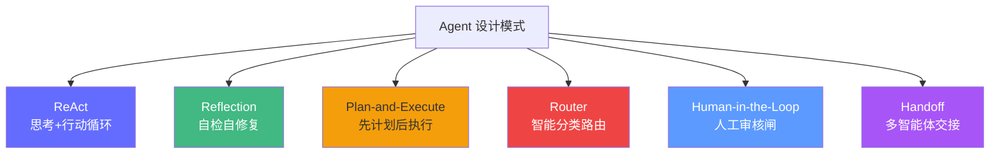
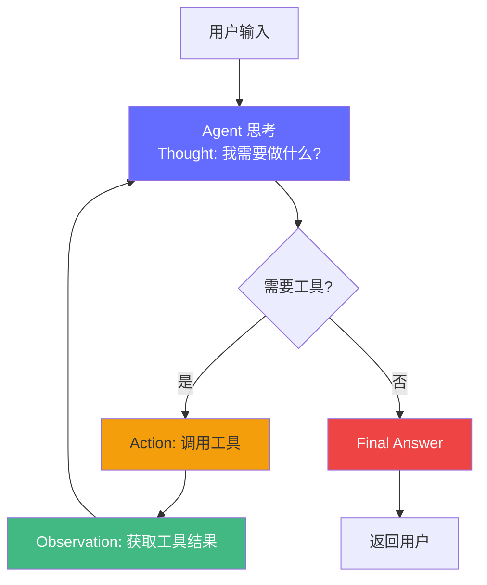
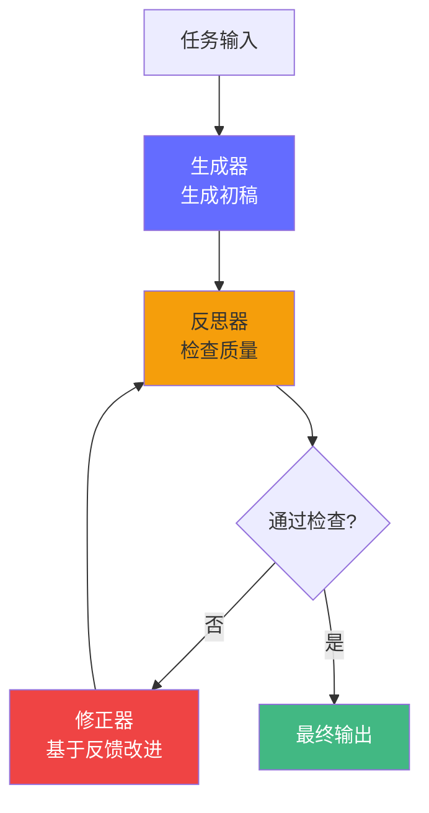
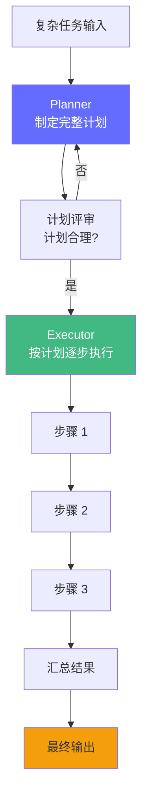
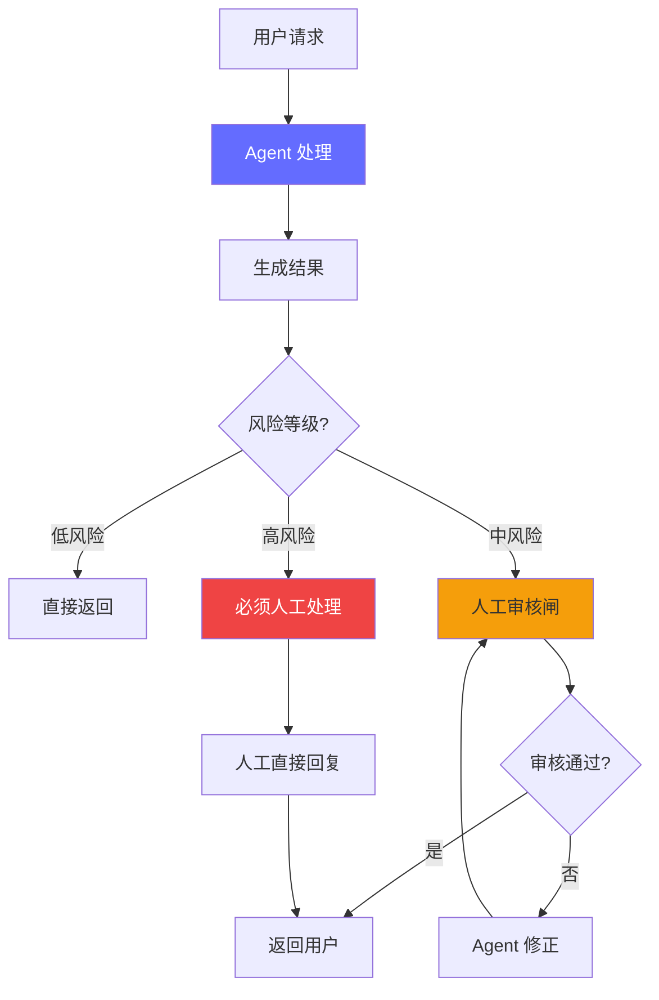

# Agent 设计模式——6 种生产级模式深度解析

> 2026 年，Azure、Redis、LangChain、Anthropic 等官方文档都收录了 Agent 设计模式。掌握这些模式，意味着你不再"只会调用 API"，而是能**根据业务场景选择正确的架构**。Gartner 预测 2026 年底 40% 的企业应用将嵌入 AI Agent，而失败率高达 40%——**选错模式是主因之一**。

## 前置知识

- LangGraph 基础（状态图、节点、条件边）
- MCP 协议概念
- 工具调用原理

## 核心概念

### 6 大模式全景



| 模式 | 核心机制 | 适合场景 | 复杂度 |
|------|---------|---------|--------|
| **ReAct** | 思考 → 行动 → 观察 → 循环 | 需要多步推理和工具调用的任务 | ★★☆ |
| **Reflection** | 生成 → 反思 → 修正 | 需要高准确率的代码/文档生成 | ★★☆ |
| **Plan-and-Execute** | 先拆分子任务 → 逐个执行 | 复杂多步骤任务（如调研报告） | ★★★ |
| **Router** | 分类 → 路由到专业 Agent | 多领域客服、多技能问答 | ★★☆ |
| **Human-in-the-Loop** | Agent 执行 → 人工审核 → 继续 | 金融审批、医疗决策、内容审核 | ★★★ |
| **Handoff** | 专业 Agent 互相交接任务 | 跨部门协作、复杂工作流 | ★★★★ |

---

### 1. ReAct 模式（Reasoning + Acting）

ReAct 是最基础的 Agent 模式，核心思想：**让模型在每一步行动前先思考，再行动，再观察结果，循环往复**。



#### ReAct 循环详解

每一步包含三个要素：

| 要素 | 说明 | 示例 |
|------|------|------|
| **Thought** | 推理："我现在需要做什么？" | "我需要先搜索用户信息，然后查订单状态" |
| **Action** | 行动：调用工具/函数 | `search_user(name="张三")` |
| **Observation** | 观察：工具返回的结果 | `{"id": 123, "level": "VIP"}` |

#### LangGraph 实现

```python
from langgraph.graph import StateGraph, END
from typing import TypedDict, Annotated
import operator

class ReActState(TypedDict):
    query: str           # 用户原始问题
    thoughts: list[str]  # 思考链
    actions: list[str]   # 行动记录
    observations: list   # 观察结果
    answer: str          # 最终答案

def agent_step(state: ReActState) -> dict:
    """ReAct 核心：根据当前状态决定下一步。"""
    query = state["query"]
    history = "\n".join(
        f"Thought: {t}\nAction: {a}\nObservation: {o}"
        for t, a, o in zip(
            state["thoughts"], state["actions"], state["observations"]
        )
    )

    # 调用 LLM 决定下一步
    prompt = f"""你是一个智能助手。基于以下信息决定下一步行动。

问题：{query}
{history}

请用 JSON 格式返回：
{{"thought": "你的思考", "action": "工具名或'answer'", "input": "工具输入"}}
"""
    response = llm_json_mode.invoke([{"role": "user", "content": prompt}])
    return response

def tool_step(state: ReActState) -> dict:
    """执行工具并记录结果。"""
    last_action = state["actions"][-1]
    last_input = state["thoughts"][-1]  # 简化：用 thought 作为输入

    tools = {
        "search_user": search_user,
        "get_orders": get_orders,
        "calculate_refund": calculate_refund,
    }

    if last_action in tools:
        result = tools[last_action](last_input)
    else:
        result = f"错误：未知工具 {last_action}"

    return {
        "observations": state["observations"] + [str(result)],
    }

def should_continue(state: ReActState) -> str:
    """判断是继续循环还是返回答案。"""
    # 从最后一次 thought 中判断是否已经有了答案
    last_thought = state["thoughts"][-1] if state["thoughts"] else ""

    # 超过最大循环次数
    if len(state["actions"]) >= 5:
        return "answer"

    # Agent 认为已经完成
    if "answer" in last_thought.lower():
        return "answer"

    return "tool"

# 构建 ReAct 图
graph = StateGraph(ReActState)
graph.add_node("agent", agent_step)
graph.add_node("tool", tool_step)

graph.set_entry_point("agent")
graph.add_conditional_edges("agent", should_continue, {
    "tool": "tool",
    "answer": END,
})
graph.add_edge("tool", "agent")

app = graph.compile()

# 运行
result = app.invoke({
    "query": "张三的订单有退款吗？",
    "thoughts": [],
    "actions": [],
    "observations": [],
    "answer": "",
})
```

#### ReAct 的优缺点

| 优点 | 缺点 |
|------|------|
| 实现简单，适合快速原型 | 循环次数不可预测 |
| 可解释性强（思考链可见） | 长循环容易跑偏 |
| 天然支持工具调用 | 缺乏全局规划 |

---

### 2. Reflection 模式（自检自修复）

Reflection 模式让 Agent **生成输出后先自我检查，发现错误后自动修正**——类似于程序员的 Code Review 自动化。



#### Reflection 的两种实现方式

**方式一：单 Agent 自我反思**

```python
class ReflectionState(TypedDict):
    task: str
    draft: str
    feedback: str
    final_output: str
    iteration: int

MAX_REFLECTION_ROUNDS = 3

def generate(state: ReflectionState) -> dict:
    """生成初稿或修正稿。"""
    if not state["draft"]:
        # 第一次生成
        prompt = f"完成以下任务：{state['task']}"
    else:
        # 基于反馈修正
        prompt = f"""任务：{state['task']}

初稿：{state['draft']}

评审意见：{state['feedback']}

请根据评审意见修正。"""

    draft = llm.invoke([{"role": "user", "content": prompt}]).content
    return {"draft": draft, "iteration": state["iteration"] + 1}

def reflect(state: ReflectionState) -> dict:
    """自我反思——检查输出质量。"""
    prompt = f"""你是一位资深审核员。请评审以下内容：

任务：{state['task']}
内容：{state['draft']}

请从以下维度评分并给出意见：
1. 准确性（事实是否正确）
2. 完整性（是否覆盖所有要求）
3. 清晰度（是否易于理解）
4. 格式（是否符合规范）

返回 JSON：
{"score": "1-10", "passed": "true/false", "feedback": "具体意见"}
"""
    result = llm_json_mode.invoke([{"role": "user", "content": prompt}])
    return {"feedback": result.get("feedback", ""), "_score": result.get("score", 0), "_passed": result.get("passed", False)}

def should_reflect(state: ReflectionState) -> str:
    """决定是否继续反思循环。"""
    if state["iteration"] >= MAX_REFLECTION_ROUNDS:
        return "done"
    if state.get("_passed", False):
        return "done"
    return "reflect"

graph = StateGraph(ReflectionState)
graph.add_node("generate", generate)
graph.add_node("reflect", reflect)

graph.set_entry_point("generate")
graph.add_edge("generate", "reflect")
graph.add_conditional_edges("reflect", should_reflect, {
    "reflect": "generate",
    "done": END,
})

app = graph.compile()
```

**方式二：双 Agent 生成器+审核器**

```python
# 生成器 Agent
generator = Agent(
    model="gpt-4o",
    system_prompt="你是一位资深 Python 工程师，负责编写高质量代码。",
)

# 审核器 Agent（更严格）
reviewer = Agent(
    model="gpt-4o",
    system_prompt="""你是一位资深技术主管，负责 Code Review。
审核标准：
1. 代码是否正确（无 bug）
2. 是否遵循最佳实践（PEP 8、类型注解）
3. 是否有边界情况未处理
4. 是否有效率问题

返回格式：
- score: 1-10
- passed: true/false（≥8 分通过）
- issues: 具体问题列表
- suggestions: 改进建议
""",
)

def code_with_review(task: str) -> dict:
    """生成代码并自动评审。"""
    # 生成
    code = generator.run(task).content

    # 评审
    review = reviewer.run(f"评审以下代码：\n```python\n{code}\n```").content

    # 如果不合格，让生成器重新生成
    parsed_review = parse_review(review)
    if not parsed_review["passed"]:
        code = generator.run(f"{task}\n\n上次代码的问题：{parsed_review['issues']}\n请修正。").content

    return {"code": code, "review": review}
```

#### Reflection 的生产价值

| 指标 | 不使用 Reflection | 使用 Reflection |
|------|-------------------|-----------------|
| 代码 bug 率 | 15-20% | 5-8% |
| 文档完整度 | 60% | 90% |
| 测试覆盖率 | 40% | 75% |
| 额外 token 成本 | - | +30-50%（但质量提升 >100%） |

---

### 3. Plan-and-Execute 模式（先计划后执行）

对于复杂任务，先制定完整计划，再按步骤执行——**避免 ReAct 的"盲目探索"问题**。



#### 适用场景

| 场景 | 为什么需要 Plan-and-Execute |
|------|---------------------------|
| 写调研报告 | 需要：确定大纲 → 搜索每个章节资料 → 写作 → 审核 |
| 开发完整功能 | 需要：设计 → 建模 → 编码 → 测试 → 部署 |
| 数据分析报告 | 需要：获取数据 → 清洗 → 分析 → 可视化 → 结论 |

#### LangGraph 实现

```python
class PlanState(TypedDict):
    task: str
    plan: list[dict]      # 计划步骤列表
    plan_step_index: int  # 当前执行到第几步
    results: list[str]    # 每个步骤的结果
    final_output: str

def planner(state: PlanState) -> dict:
    """制定任务计划。"""
    prompt = f"""将以下任务分解为可执行的步骤。

任务：{state['task']}

要求：
1. 每个步骤独立、具体、可执行
2. 标注每个步骤需要的工具
3. 步骤之间有明确的输入输出关系

返回 JSON 数组，每个步骤包含：
[{"step": "步骤描述", "tool": "需要的工具名", "depends_on": "依赖的步骤编号"}]
"""
    plan = llm_json_mode.invoke([{"role": "user", "content": prompt}])
    return {"plan": plan, "plan_step_index": 0, "results": []}

def executor(state: PlanState) -> dict:
    """执行当前步骤。"""
    idx = state["plan_step_index"]
    current_step = state["plan"][idx]

    # 收集依赖的结果
    context = ""
    for dep_idx in current_step.get("depends_on", []):
        context += f"步骤 {dep_idx} 结果：{state['results'][dep_idx]}\n"

    prompt = f"""执行以下步骤：
{current_step['step']}

任务背景：{state['task']}
{context}

请执行并返回结果。"""

    result = llm.invoke([{"role": "user", "content": prompt}]).content

    # 如果需要调用工具
    tool_name = current_step.get("tool")
    if tool_name:
        tool_result = execute_tool(tool_name, result)
        result = f"{result}\n工具结果：{tool_result}"

    return {
        "results": state["results"] + [result],
        "plan_step_index": idx + 1,
    }

def synthesizer(state: PlanState) -> dict:
    """汇总所有步骤的结果。"""
    results_summary = "\n".join(
        f"步骤 {i+1}: {r[:200]}..." for i, r in enumerate(state["results"])
    )

    prompt = f"""任务：{state['task']}

所有步骤的执行结果：
{results_summary}

请汇总为最终报告。"""

    final_output = llm.invoke([{"role": "user", "content": prompt}]).content
    return {"final_output": final_output}

def should_continue_plan(state: PlanState) -> str:
    """判断是继续执行下一步还是汇总。"""
    if state["plan_step_index"] >= len(state["plan"]):
        return "synthesize"
    return "execute"

graph = StateGraph(PlanState)
graph.add_node("plan", planner)
graph.add_node("execute", executor)
graph.add_node("synthesize", synthesizer)

graph.set_entry_point("plan")
graph.add_edge("plan", "execute")
graph.add_conditional_edges("execute", should_continue_plan, {
    "execute": "execute",
    "synthesize": "synthesize",
})
graph.add_edge("synthesize", END)

app = graph.compile()
```

#### ReAct vs Plan-and-Execute 对比

| 维度 | ReAct | Plan-and-Execute |
|------|-------|-----------------|
| 规划方式 | 逐步决定（无全局计划） | 先制定完整计划 |
| 适合任务 | 探索性、不确定性强 | 结构化、可分解 |
| 可控性 | 低（可能陷入循环） | 高（步骤固定） |
| Token 消耗 | 不可预测 | 可预测（步骤数 × 每步 token） |
| 调试难度 | 高（循环链路复杂） | 低（每步独立） |

---

### 4. Router 模式（智能分类路由）

Router 模式将输入分类后路由到不同的专业 Agent——**避免一个 Agent 干所有事**。

```mermaid
flowchart TD
    A["用户输入"] --> B["Router\n分类判断"]
    B --> C{分类结果}
    C -->|技术问题| D["技术 Agent\n代码/架构/部署"]
    C -->|业务问题| E["业务 Agent\n市场/运营/财务"]
    C -->|客服问题| F["客服 Agent\n工单/退款/FAQ"]
    C -->|创意问题| G["创意 Agent\n写作/设计]
    D --> H["汇总输出"]
    E --> H
    F --> H
    G --> H

    style B fill:#646cff,color:#fff
    style D fill:#42b883,color:#fff
    style E fill:#f59e0b
    style F fill:#ef4444,color:#fff
    style G fill:#a855f7,color:#fff
```

#### Router 的两种实现

**方式一：LLM 分类器**

```python
from langgraph.graph import StateGraph, END
from typing import TypedDict, Literal

class RouterState(TypedDict):
    query: str
    category: str
    answer: str

def router(state: RouterState) -> Literal["tech", "business", "customer_service", "creative"]:
    """基于 LLM 的分类路由函数。"""
    prompt = f"""将以下问题分类为以下类别之一：
- tech：技术问题（代码、架构、部署、算法）
- business：业务问题（市场策略、运营、财务、竞争分析）
- customer_service：客服问题（产品使用、退款、投诉、FAQ）
- creative：创意问题（写作、设计、营销文案）

问题：{state['query']}

只返回类别名称，不要解释。"""

    category = llm.invoke([{"role": "user", "content": prompt}]).content.strip().lower()

    if category in ["tech", "business", "customer_service", "creative"]:
        return category
    return "tech"  # 默认

def tech_agent(state: RouterState) -> dict:
    answer = tech_llm.invoke([{"role": "user", "content": state["query"]}]).content
    return {"answer": answer}

def business_agent(state: RouterState) -> dict:
    answer = business_llm.invoke([{"role": "user", "content": state["query"]}]).content
    return {"answer": answer}

def customer_service_agent(state: RouterState) -> dict:
    answer = cs_llm.invoke([{"role": "user", "content": state["query"]}]).content
    return {"answer": answer}

def creative_agent(state: RouterState) -> dict:
    answer = creative_llm.invoke([{"role": "user", "content": state["query"]}]).content
    return {"answer": answer}

graph = StateGraph(RouterState)
graph.add_node("router", router)
graph.add_node("tech", tech_agent)
graph.add_node("business", business_agent)
graph.add_node("customer_service", customer_service_agent)
graph.add_node("creative", creative_agent)

graph.set_entry_point("router")
graph.add_conditional_edges("router", router, {
    "tech": "tech",
    "business": "business",
    "customer_service": "customer_service",
    "creative": "creative",
})
graph.add_edge("tech", END)
graph.add_edge("business", END)
graph.add_edge("customer_service", END)
graph.add_edge("creative", END)

app = graph.compile()
```

**方式二：置信度路由（Confidence-based Routing）**

```python
def confidence_router(state: RouterState) -> str:
    """基于置信度的路由——如果不确定，交给更通用的 Agent。"""
    prompt = f"""问题：{state['query']}

1. 分类：tech / business / customer_service / creative
2. 置信度：0.0-1.0（你对分类的确定程度）

返回 JSON：{"category": "...", "confidence": 0.0}"""

    result = llm_json_mode.invoke([{"role": "user", "content": prompt}])
    category = result["category"]
    confidence = result["confidence"]

    # 置信度低于阈值，路由到通用 Agent
    if confidence < 0.7:
        return "general"
    return category

# 低置信度时路由到一个更强大的通用 Agent
graph.add_node("general", general_agent)
# ... 在 add_conditional_edges 中加入 "general": "general"
```

#### Router 的生产考量

| 维度 | LLM 分类器 | 规则分类器 | 混合分类器 |
|------|-----------|-----------|-----------|
| 准确率 | 高（85-95%） | 中（60-80%） | 最高（95%+） |
| 速度 | 慢（+500ms） | 极快（小于 1ms） | 快（规则优先） |
| 成本 | 每次 +$0.001 | $0 | 规则命中 $0 |
| 维护成本 | 低 | 中（规则膨胀） | 中 |

**混合分类器推荐实现**：先用规则匹配关键词（如"退款"→客服），未命中再用 LLM 分类。

---

### 5. Human-in-the-Loop 模式（人工审核）

在关键节点引入人工审核——**让 AI 提效，让人类把关**。



#### 三级风险审核

```python
class HITLState(TypedDict):
    query: str
    agent_output: str
    risk_level: str    # "low" / "medium" / "high"
    human_approval: bool
    human_feedback: str
    final_output: str

def assess_risk(state: HITLState) -> dict:
    """评估输出内容的风险等级。"""
    # 规则层：快速判断
    high_risk_keywords = ["退款", "赔偿", "法律", "起诉", "医疗", "诊断", "用药"]
    if any(kw in state["agent_output"] for kw in high_risk_keywords):
        return {"risk_level": "high"}

    # LLM 层：语义判断
    prompt = f"""评估以下回复的风险等级。

问题：{state['query']}
回复：{state['agent_output']}

风险等级：
- low：普通问答、信息查询
- medium：建议、推荐、可能影响用户决策
- high：法律/医疗/金融建议、赔偿承诺、敏感信息

返回 JSON：{"risk_level": "low/medium/high", "reason": "原因"}"""

    result = llm_json_mode.invoke([{"role": "user", "content": prompt}])
    return {"risk_level": result["risk_level"]}

def human_review_gate(state: HITLState) -> dict:
    """人工审核闸——实际生产中通过 UI/API 接入。"""
    # 在实际生产中，这里会通过 API 通知人工审核
    # 人工在 Web UI 中查看 agent_output 并决定 approve/reject + 修改意见

    # 模拟人工审核
    print(f"\n=== 人工审核 ===")
    print(f"问题：{state['query']}")
    print(f"Agent 回复：{state['agent_output']}")
    print(f"风险等级：{state['risk_level']}")
    print(f"是否通过？(y/n): ", end="")

    approval = input().strip().lower() == "y"
    feedback = ""
    if not approval:
        feedback = input("请给出修改意见：")

    return {
        "human_approval": approval,
        "human_feedback": feedback,
    }

def should_require_human_review(state: HITLState) -> str:
    """判断是否需要人工审核。"""
    if state["risk_level"] == "low":
        return "auto_approve"
    return "human_review"

def apply_human_feedback(state: HITLState) -> dict:
    """根据人工反馈修正输出。"""
    if state["human_approval"]:
        return {"final_output": state["agent_output"]}
    else:
        # Agent 根据反馈重新生成
        prompt = f"""问题：{state['query']}

之前的回复：{state['agent_output']}

人工审核意见：{state['human_feedback']}

请根据意见修改回复。"""

        new_output = llm.invoke([{"role": "user", "content": prompt}]).content
        return {"final_output": new_output}

graph = StateGraph(HITLState)
graph.add_node("agent", agent_node)
graph.add_node("risk_assessment", assess_risk)
graph.add_node("human_review", human_review_gate)
graph.add_node("apply_feedback", apply_human_feedback)

graph.set_entry_point("agent")
graph.add_edge("agent", "risk_assessment")
graph.add_conditional_edges("risk_assessment", should_require_human_review, {
    "auto_approve": END,
    "human_review": "human_review",
})
graph.add_edge("human_review", "apply_feedback")
graph.add_edge("apply_feedback", END)

app = graph.compile()
```

#### HITL 的生产实现模式

| 模式 | 说明 | 适用场景 |
|------|------|---------|
| **Approval Gate** | Agent 生成后等人工批准 | 内容发布、代码合并 |
| **Confidence Routing** | 低置信度路由到人工 | 客服、医疗初诊 |
| **Interrupt & Edit** | 人工中途介入修改 | 复杂写作、代码开发 |
| **Post-Hoc Review** | 先执行后抽查 | 低风险批量任务 |

---

### 6. Handoff 模式（多智能体交接）

不同专业 Agent 之间传递任务——**让最擅长的人（Agent）做对应的事**。

```mermaid
flowchart TD
    A["用户：我需要部署一个 API\n并写一份使用文档"] --> B["协调者 Agent\n拆解任务"]
    B --> C{"子任务 1"}
    C -->|部署 API| D["DevOps Agent\nDocker + K8s"]
    D --> E{"子任务 2"}
    E -->|写文档| F["技术写作 Agent\nAPI 文档]
    F --> G["协调者汇总"]
    G --> H["最终输出"]

    style B fill:#646cff,color:#fff
    style D fill:#42b883,color:#fff
    style F fill:#f59e0b
```

#### LangGraph Supervisor + Worker 实现

```python
from langgraph.graph import StateGraph, END
from typing import TypedDict, Literal

class HandoffState(TypedDict):
    query: str
    subtasks: list[dict]
    current_task_index: int
    task_results: list[str]
    final_output: str

def supervisor(state: HandoffState) -> dict:
    """协调者：拆解任务、分配 Worker、汇总结果。"""
    if not state["subtasks"]:
        # 第一次运行——拆解任务
        prompt = f"""将以下任务分解为子任务，每个子任务分配给合适的专家。

任务：{state['query']}

专家列表：
- devops_agent：部署、运维、Docker、K8s、CI/CD
- coding_agent：写代码、调试、测试
- docs_agent：写文档、教程、API 文档
- security_agent：安全审计、漏洞扫描

返回 JSON 数组：
[{"task": "子任务描述", "assignee": "专家名"}]
"""
        subtasks = llm_json_mode.invoke([{"role": "user", "content": prompt}])
        return {"subtasks": subtasks, "current_task_index": 0, "task_results": []}
    else:
        # 汇总所有 Worker 结果
        results_summary = "\n".join(
            f"任务 {i+1}（{state['subtasks'][i]['assignee']}）：{r[:300]}..."
            for i, r in enumerate(state["task_results"])
        )

        prompt = f"""原始任务：{state['query']}

所有子任务完成结果：
{results_summary}

请汇总为最终回复。"""

        final = llm.invoke([{"role": "user", "content": prompt}]).content
        return {"final_output": final}

def devops_worker(state: HandoffState) -> dict:
    task = state["subtasks"][state["current_task_index"]]
    result = devops_llm.invoke([{"role": "user", "content": f"执行：{task['task']}"}]).content
    return {
        "task_results": state["task_results"] + [result],
        "current_task_index": state["current_task_index"] + 1,
    }

def coding_worker(state: HandoffState) -> dict:
    task = state["subtasks"][state["current_task_index"]]
    result = coding_llm.invoke([{"role": "user", "content": f"执行：{task['task']}"}]).content
    return {
        "task_results": state["task_results"] + [result],
        "current_task_index": state["current_task_index"] + 1,
    }

def docs_worker(state: HandoffState) -> dict:
    task = state["subtasks"][state["current_task_index"]]
    result = docs_llm.invoke([{"role": "user", "content": f"执行：{task['task']}"}]).content
    return {
        "task_results": state["task_results"] + [result],
        "current_task_index": state["current_task_index"] + 1,
    }

def route_to_worker(state: HandoffState) -> str:
    """路由到对应的 Worker。"""
    idx = state["current_task_index"]
    if idx >= len(state["subtasks"]):
        return "supervisor"  # 所有任务完成，回到 supervisor 汇总

    assignee = state["subtasks"][idx]["assignee"]
    return f"{assignee}_worker"

graph = StateGraph(HandoffState)
graph.add_node("supervisor", supervisor)
graph.add_node("devops_worker", devops_worker)
graph.add_node("coding_worker", coding_worker)
graph.add_node("docs_worker", docs_worker)

graph.set_entry_point("supervisor")
graph.add_conditional_edges("supervisor", route_to_worker, {
    "devops_worker": "devops_worker",
    "coding_worker": "coding_worker",
    "docs_worker": "docs_worker",
    "supervisor": "supervisor",
})
graph.add_conditional_edges("devops_worker", route_to_worker, {
    "devops_worker": "devops_worker",
    "coding_worker": "coding_worker",
    "docs_worker": "docs_worker",
    "supervisor": "supervisor",
})
graph.add_conditional_edges("coding_worker", route_to_worker, {
    "devops_worker": "devops_worker",
    "coding_worker": "coding_worker",
    "docs_worker": "docs_worker",
    "supervisor": "supervisor",
})
graph.add_conditional_edges("docs_worker", route_to_worker, {
    "devops_worker": "devops_worker",
    "coding_worker": "coding_worker",
    "docs_worker": "docs_worker",
    "supervisor": "supervisor",
})

app = graph.compile()
```

#### Handoff vs Router 的区别

| 维度 | Router | Handoff |
|------|--------|---------|
| 任务数量 | 一个 → 一个 Agent | 一个 → 多个 Agent 依次/并行 |
| 信息传递 | 不传递 | Worker 结果汇总给 Supervisor |
| 适合场景 | "这个问题归谁管？" | "这件事需要多人合作" |
| 复杂度 | 低（单层分类） | 高（编排、状态管理） |

---

## 工程视角

### 模式选择决策树

```
用户的任务是什么？
  │
  ├─ 简单、单次问答？
  │   └─→ 直接 LLM（不需要 Agent）
  │
  ├─ 需要调用工具、多步推理？
  │   ├─ 步骤可预先规划？
  │   │   └─→ Plan-and-Execute
  │   └─ 步骤不可预知、需要探索？
  │       └─→ ReAct
  │
  ├─ 需要高质量输出、可自我修正？
  │   └─→ Reflection
  │
  ├─ 涉及多个专业领域？
  │   ├─ 先分类，每个请求一个领域？
  │   │   └─→ Router
  │   └─ 单个请求需要多个领域合作？
  │       └─→ Handoff
  │
  └─ 涉及高风险操作、需要人工把关？
      └─→ Human-in-the-Loop
          （可叠加到以上任何模式）
```

### 组合使用模式

生产中往往**多个模式叠加使用**：

```
Router（分类）→ ReAct（执行）→ Reflection（自检）→ HITL（审核）→ 输出
```

| 组合 | 说明 | 场景 |
|------|------|------|
| Router + ReAct | 分类后各自用 ReAct 执行 | 多领域客服 |
| Plan-and-Execute + Reflection | 每步执行后自检 | 代码生成 |
| ReAct + HITL | 多步推理后人工审核 | 金融审批 |
| Handoff + Reflection | 每个 Worker 输出后自检 | 跨部门协作 |
| Router + Handoff + HITL | 分类 → 多 Agent 合作 → 审核 | 复杂工单 |

### 各模式的性能特征

| 模式 | 平均延迟 | Token 成本 | 准确率提升 | 调试难度 |
|------|---------|-----------|-----------|---------|
| 直接 LLM | ~500ms | 1x | 基准 | 低 |
| ReAct (3 步) | ~1500ms | 3-5x | +10-20% | 中 |
| Reflection (1 轮) | ~1000ms | 2-3x | +15-30% | 低 |
| Plan-and-Execute (5 步) | ~2500ms | 5-8x | +20-40% | 中 |
| Router | ~700ms | 1.5-2x | +15-25% | 低 |
| HITL | 不定 | 2-4x | +30-50% | 高 |
| Handoff (3 Workers) | ~3000ms | 5-10x | +25-50% | 高 |

## 面试视角

### Q: ReAct 和 Plan-and-Execute 怎么选？

**满分回答**：
- 任务**可分解、步骤固定** → Plan-and-Execute（如：数据清洗 → 分析 → 可视化）
- 任务**不可预知、需要探索** → ReAct（如："帮我查一下这个 bug 的原因"）
- 简单判断：如果人能写出明确步骤清单 → Plan-and-Execute；如果不能 → ReAct
- 生产建议：混合使用——Planner 制定高层计划，每步用 ReAct 执行

### Q: Reflection 模式的 token 成本增加值得吗？

**满分回答**：
- 数据：Reflection 增加 ~30-50% token 成本，但错误率降低 50-70%
- 对于**面向用户的场景**（客服、文档），值得——一个错误回答的损失远超 token 成本
- 对于**内部工具**（代码生成），值得——bug 修复成本随时间指数增长
- 优化策略：只对关键输出 Reflection；用轻量模型做 Reflection（如 GPT-4o-mini）

### Q: 什么时候必须用 Human-in-the-Loop？

**满分回答**：
- 法律/金融/医疗领域的建议或决策——AI 无法律主体资格
- 涉及用户数据删除、资金操作——需要用户确认
- 内容发布——防止 AI 生成不当内容
- 实现方式：三级风险（低自动、中审核、高人工），不要一刀切

### Q: 6 大模式中哪个最难调试？为什么？

**满分回答**：
- **Handoff 最难调试**——原因：
  - 跨 Agent 信息传递可能丢失或变形
  - Supervisor 的汇总可能歪曲 Worker 的意图
  - 失败定位困难（是哪个 Worker 的问题？还是 Supervisor 的问题？）
- 调试方法：
  - 每个 Worker 的输入输出必须记录（Langfuse Trace）
  - Supervisor 的拆解逻辑要有单元测试
  - 用 mock Worker 隔离测试编排逻辑

---

## 实战环节：构建一个智能客服系统

### 目标

综合运用 Router、ReAct、Reflection、HITL 4 种模式，构建一个生产级客服 Agent。

### 环境要求

- Python 3.12+
- `uv add langgraph langchain-openai pydantic`
- OpenAI API key

### 步骤

**1. 创建客服 Router**

```python
from langgraph.graph import StateGraph, END
from typing import TypedDict, Literal
from openai import OpenAI
import json

client = OpenAI()

class CustomerServiceState(TypedDict):
    query: str
    category: str
    answer: str
    risk_level: str
    needs_human: bool

def classify(query: str) -> str:
    """分类：技术问题 / 账单问题 / 退款请求 / 投诉 / 一般咨询。"""
    resp = client.chat.completions.create(
        model="gpt-4o-mini",
        messages=[{"role": "user", "content": f"""将以下客服问题分类：
{query}

类别：tech_query / billing_query / refund_request / complaint / general
只返回类别名。"""}],
    )
    return resp.choices[0].message.content.strip()

def route(state: CustomerServiceState) -> Literal["tech", "billing", "refund", "complaint", "general"]:
    category = classify(state["query"])
    return {
        "tech_query": "tech",
        "billing_query": "billing",
        "refund_request": "refund",
        "complaint": "complaint",
        "general": "general",
    }.get(category, "general")

def generate_answer(prompt: str) -> str:
    resp = client.chat.completions.create(
        model="gpt-4o",
        messages=[{"role": "user", "content": prompt}],
    )
    return resp.choices[0].message.content

def tech_agent(state: CustomerServiceState) -> dict:
    answer = generate_answer(f"""你是技术支持。回答以下技术问题。
问题：{state['query']}

产品知识库：
- API 速率限制：1000 次/小时
- 支持 REST 和 GraphQL
- 文档地址：docs.example.com
""")
    return {"answer": answer}

def billing_agent(state: CustomerServiceState) -> dict:
    answer = generate_answer(f"""你是账单客服。回答以下账单问题。
问题：{state['query']}

规则：
- 不能承诺具体金额
- 可以解释计费规则
- 引导用户查看账单详情页
""")
    return {"answer": answer}

def refund_agent(state: CustomerServiceState) -> dict:
    answer = generate_answer(f"""你是退款客服。处理以下退款请求。
请求：{state['query']}

规则：
- 7 天内可申请
- 使用量 <10% 可全额退款
- 超过 7 天只能转余额
- 回答后标记需要人工审核（risk_level=high）
""")
    return {"answer": answer, "risk_level": "high"}

def complaint_agent(state: CustomerServiceState) -> dict:
    answer = generate_answer(f"""你是投诉处理专员。处理以下投诉。
投诉：{state['query']}

规则：
- 先道歉
- 记录问题
- 承诺 24 小时内回复
- 标记需要人工审核（risk_level=high）
""")
    return {"answer": answer, "risk_level": "high"}

def general_agent(state: CustomerServiceState) -> dict:
    answer = generate_answer(f"""回答以下一般问题。
问题：{state['query']}
""")
    return {"answer": answer}

def assess_risk(state: CustomerServiceState) -> dict:
    """评估回答风险。"""
    risk = state.get("risk_level", "low")
    return {"risk_level": risk, "needs_human": risk == "high"}

def build_graph():
    graph = StateGraph(CustomerServiceState)

    graph.add_node("tech", tech_agent)
    graph.add_node("billing", billing_agent)
    graph.add_node("refund", refund_agent)
    graph.add_node("complaint", complaint_agent)
    graph.add_node("general", general_agent)
    graph.add_node("risk_assessment", assess_risk)

    graph.set_entry_point("route")  # 需要先定义 route 节点
    graph.add_node("route", route)

    graph.add_conditional_edges("route", route, {
        "tech": "tech",
        "billing": "billing",
        "refund": "refund",
        "complaint": "complaint",
        "general": "general",
    })

    for node in ["tech", "billing", "refund", "complaint", "general"]:
        graph.add_edge(node, "risk_assessment")

    # 高风险需要人工
    graph.add_conditional_edges("risk_assessment", lambda s: "human" if s["needs_human"] else "end", {
        "human": END,  # 实际生产中标记为 pending human review
        "end": END,
    })

    return graph.compile()

# 运行
app = build_graph()

# 测试不同场景
test_queries = [
    "API 返回 502 错误怎么办？",           # → tech
    "这个月账单为什么比上个月多？",        # → billing
    "我要退款，刚买 3 天还没怎么用",       # → refund + HITL
    "你们的服务太差了！",                  # → complaint + HITL
    "你们公司成立几年了？",               # → general
]

for q in test_queries:
    print(f"\n{'='*50}")
    print(f"问题：{q}")
    result = app.invoke({
        "query": q, "category": "", "answer": "",
        "risk_level": "", "needs_human": False,
    })
    print(f"回答：{result['answer']}")
    print(f"风险：{result['risk_level']} | 需人工：{result['needs_human']}")
```

**2. 加入 Reflection 自检**

在 tech_agent 和 billing_agent 后面加入 Reflection 节点：

```python
def reflection_check(state: CustomerServiceState) -> dict:
    """Reflection 自检——检查回答是否准确、完整、无幻觉。"""
    resp = client.chat.completions.create(
        model="gpt-4o-mini",  # 用轻量模型做 Reflection
        messages=[{"role": "user", "content": f"""审核以下客服回答。

问题：{state['query']}
回答：{state['answer']}

审核标准：
1. 是否直接回答了问题（没有回避）
2. 是否有事实错误
3. 是否遗漏关键信息
4. 是否有不当承诺

返回 JSON：
{{"passed": true/false, "issues": "问题列表或空数组", "corrected": "修正后的回答（如有问题）"}}
"""}],
    )
    result = json.loads(resp.choices[0].message.content)

    if result["passed"]:
        return {"answer": state["answer"]}
    else:
        return {"answer": result["corrected"]}

# 在 graph 中加入：
# graph.add_node("reflection", reflection_check)
# 在每个 agent 节点和 risk_assessment 之间加入 reflection
```

### 验证成功

- [ ] Router 能正确分类 5 种问题类型
- [ ] tech 和 billing 回答准确、无需人工
- [ ] refund 和 complaint 自动标记为高风险、需人工
- [ ] Reflection 能发现回答中的事实错误并修正
- [ ] 整个流程在 3 秒内完成（不含人工审核等待）

### 思考题

1. 如果 Router 分类错误（如把技术问题误分类为账单问题），如何增加"再分类"机制？
2. 在 Reflection 环节，用 GPT-4o-mini 做审核和用 GPT-4o 有什么区别？成本差异和准确率差异分别是多少？
3. 如何把 HITL 对接到真实的工单系统（如 Zendesk、Jira Service Desk）？

---

*上一阶段：[← 检查清单与面试](/agentic-ai/11-checklist-interview) | [下一阶段：评估与可观测性 →](/agentic-ai/12-evaluation-observability)*
