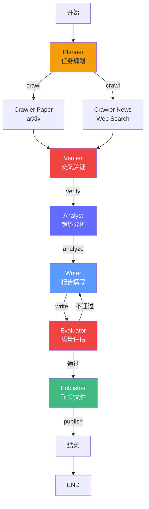

# 综合实战——构建 AI 技术趋势分析平台

> 用 LangGraph 构建一个生产级的多智能体系统：自动采集技术趋势、交叉验证、生成分析报告、发布到飞书/钉钉。覆盖前面所有核心知识点。

---

## 项目背景

你是一家 AI 技术公司的架构师。每周需要输出一份"AI 行业趋势周报"，内容包括：本周重大事件、论文解读、开源项目更新、市场趋势分析。

**手动做的流程**：
1. 搜索各大新闻源（arXiv、Hacker News、GitHub Trending）
2. 交叉验证信息真伪（AI 领域假消息多）
3. 分析每个事件的影响范围
4. 撰写报告
5. 发送到团队群组

**痛点**：每周花 4-6 小时，且容易漏掉重要信息。

**目标**：用多智能体系统自动化这个流程，人工只做最终审核。

---

## 系统架构

```
┌─────────────────────────────────────────────────────────┐
│                    外部触发                              │
│              定时调度 / 飞书 Webhook                      │
└──────────────────────┬──────────────────────────────────┘
                       ▼
              ┌─────────────────┐
              │  Planner Agent  │  ← 任务规划器
              │  (Supervisor)   │
              └────┬─────┬──────┘
                   │     │
          ┌────────┘     └────────┐
          ▼                       ▼
 ┌──────────────────┐    ┌──────────────────┐
 │  Crawler Agent   │    │  Crawler Agent   │
 │  论文采集器        │    │  新闻采集器       │
 │  (arXiv API)     │    │  (Web Search)    │
 └────────┬─────────┘    └────────┬─────────┘
          ▼                       ▼
     ┌─────────┐            ┌─────────┐
     │Artifact │            │Artifact │
     │ 论文列表 │            │ 新闻列表 │
     └────┬────┘            └────┬────┘
          └──────────┬───────────┘
                     ▼
              ┌─────────────────┐
              │  Verifier Agent │  ← 交叉验证器
              │  (多源比对/      │
              │   事实检查)      │
              └────────┬────────┘
                       ▼
                  ┌─────────┐
                  │ Artifact│
                  │ 验证清单│
                  └────┬────┘
                       ▼
              ┌─────────────────┐
              │  Analyst Agent  │  ← 趋势分析师
              │  (影响面分析/    │
              │   深度解读)      │
              └────────┬────────┘
                       ▼
                  ┌─────────┐
                  │ Artifact│
                  │ 分析结果│
                  └────┬────┘
                       ▼
              ┌─────────────────┐
              │  Writer Agent   │  ← 报告撰写
              │  (结构化报告/    │
              │   Markdown)     │
              └────────┬────────┘
                       ▼
                  ┌─────────┐
                  │ Artifact│
                  │ 周报草稿│
                  └────┬────┘
                       ▼
              ┌─────────────────┐
              │  Evaluator Agent│  ← 质量评估器
              │  (完整度/格式/   │
              │   可读性检查)    │
              └────────┬────────┘
                       │
            ┌──────────┴──────────┐
            │ 不通过               │ 通过
            ▼                     ▼
       Writer Agent      ┌─────────────────┐
       (修改重写)         │  Publisher Agent│  ← 发布器
                          │  (飞书/钉钉/     │
                          │   邮件/Markdown) │
                          └─────────────────┘
```

**用到的编排模式**（覆盖 08-multi-agent 全部模式）：
- **Supervisor**：Planner Agent 统筹全局
- **Chaining**：采集 → 验证 → 分析 → 撰写 → 发布
- **Evaluator-Optimizer**：Evaluator 打回 Writer 重写
- **Parallelization**：论文采集和新闻采集并行

---

## 第 1 步：State 设计（覆盖 05-frameworks-tools）

```python
from typing import TypedDict, Literal, Optional
from dataclasses import dataclass, field
from datetime import datetime


@dataclass
class Article:
    """采集到的文章/论文元数据。"""
    title: str
    source: str          # arXiv / HackerNews / GitHub
    url: str
    summary: str         # 原始摘要
    date: str            # 发布日期
    tags: list[str]      # 标签
    impact_score: float = 0.0     # 影响分 0-10
    verified: bool = False        # 是否已验证
    analysis: str = ""            # 深度分析
    confidence: float = 0.0       # 验证置信度


class TrendAnalysisState(TypedDict):
    """多智能体共享状态。"""
    # === 输入 ===
    week_start: str                # 周报起始日期，如 "2026-05-25"
    focus_topics: list[str]        # 关注主题，如 ["推理优化", "多模态", "Agent"]

    # === 采集阶段产物 ===
    paper_articles: list[Article]  # 论文列表
    news_articles: list[Article]   # 新闻列表

    # === 验证阶段产物 ===
    verified_articles: list[Article]  # 通过验证的文章
    rejected_articles: list[Article]  # 被拒的文章

    # === 分析阶段产物 ===
    trend_summary: str             # 趋势摘要
    key_insights: list[str]        # 关键洞察

    # === 撰写阶段产物 ===
    report_draft: str              # 报告草稿
    report_markdown: str           # 最终 Markdown

    # === 评估阶段产物 ===
    evaluation_feedback: str       # 评估反馈
    evaluation_passed: bool        # 是否通过

    # === 流程控制 ===
    next_action: str               # supervisor 路由
    iteration: int                 # 当前迭代次数
    max_iterations: int            # 最大迭代次数

    # === 可观测性 ===
    trace_id: str                  # 本次运行的 trace ID
    step_logs: list[dict]          # 每步执行日志
    token_usage: dict              # token 消耗统计
```

**设计要点**：
- 每个阶段的数据都是**结构化产物**（TypedDict + dataclass），不是散落的字符串
- `trace_id` 和 `step_logs` 是可观测性基础设施（覆盖 12-evaluation-observability）
- `max_iterations` 是安全护栏（覆盖 09-safety-guardrails）
- `impact_score` 和 `confidence` 是 Harness Engineering 的量化约束

---

## 第 2 步：采集 Agent——并行多源爬虫（覆盖 06-rag-system）

```python
import arxiv
from tavily import TavilyClient
import os

tavily = TavilyClient(api_key=os.environ["TAVILY_API_KEY"])


def crawl_papers(state: TrendAnalysisState) -> dict:
    """论文采集器——从 arXiv 检索本周 AI 论文。"""
    focus = " OR ".join(state["focus_topics"])
    search = arxiv.Search(
        query=f"({focus}) AND (large language model OR AI OR deep learning)",
        max_results=20,
        sort_by=arxiv.SortCriterion.SubmittedDate,
    )

    articles = []
    for result in search.results():
        article = Article(
            title=result.title,
            source="arXiv",
            url=result.entry_id,
            summary=result.summary[:500],
            date=result.published.strftime("%Y-%m-%d"),
            tags=[cat.term for cat in result.categories[:3]],
            impact_score=_calculate_impact(result),  # 引用数、作者等启发式
        )
        articles.append(article)

    return {
        "paper_articles": articles,
        "step_logs": [{"step": "crawl_papers", "count": len(articles)}],
    }


def crawl_news(state: TrendAnalysisState) -> dict:
    """新闻采集器——从搜索引擎获取 AI 行业新闻。"""
    query = " ".join(state["focus_topics"]) + " AI news this week"

    results = tavily.search(
        query=query,
        max_results=15,
        search_depth="advanced",
    )

    articles = []
    for r in results["results"]:
        article = Article(
            title=r["title"],
            source=r.get("source", "web"),
            url=r["url"],
            summary=r["content"][:500],
            date=datetime.now().strftime("%Y-%m-%d"),
            tags=["industry"],
        )
        articles.append(article)

    return {
        "news_articles": articles,
        "step_logs": [{"step": "crawl_news", "count": len(articles)}],
    }


def _calculate_impact(result: arxiv.Result) -> float:
    """启发式计算论文影响力（简化版）。"""
    score = 5.0  # 基础分
    # 顶级会议关键词加分
    for kw in ["NeurIPS", "ICML", "CVPR", "Nature", "Science"]:
        if kw in result.summary:
            score += 2.0
    # 预印本新论文降权
    if "arxiv" in result.entry_id:
        score -= 1.0
    return max(0.0, min(score, 10.0))
```

**并行执行**：

```python
# 两个爬虫同时跑，缩短等待时间
crawl_papers(state)
crawl_news(state)
```

---

## 第 3 步：验证 Agent——交叉验证器（覆盖 04-harness-engineering + 09-safety-guardrails）

这是 Harness Engineering 的实战体现。验证不是"看一遍"，而是**结构化检查**。

```python
def verify_articles(state: TrendAnalysisState) -> dict:
    """交叉验证器——多源比对、事实检查、置信度评估。"""
    all_articles = state["paper_articles"] + state["news_articles"]

    verified = []
    rejected = []

    for article in all_articles:
        # === L0 硬卡点：必须有来源 ===
        if not article.source or not article.url:
            article.confidence = 0.0
            rejected.append(article)
            continue

        # === L1 软卡点：多源交叉验证 ===
        cross_check = _cross_source_check(article, all_articles)
        article.confidence = cross_check.confidence

        if cross_check.confidence >= 0.7:
            article.verified = True
            verified.append(article)
        else:
            rejected.append(article)

    return {
        "verified_articles": verified,
        "rejected_articles": rejected,
        "step_logs": [{
            "step": "verify",
            "verified": len(verified),
            "rejected": len(rejected),
        }],
    }


def _cross_source_check(article: Article, all_articles) -> type(
    "CheckResult", (), {"confidence": 0.0}
)():
    """多源交叉验证逻辑。"""
    # 1. 同标题/同 URL 的重复检测
    same_url = [
        a for a in all_articles
        if a.url == article.url and a is not article
    ]
    if same_url:
        return type("CheckResult", (), {"confidence": 0.9})()

    # 2. LLM 事实检查
    check_result = llm.invoke(f"""你是事实核查员。核查以下信息：

来源: {article.source}
标题: {article.title}
摘要: {article.summary}

请从以下维度评分（0-1）：
1. 来源可信度（顶级会议/期刊 vs 自媒体）
2. 内容一致性（是否有矛盾或不合理之处）
3. 时间合理性（是否是过时信息）

请以 JSON 格式返回: {{"credibility": 0.8, "consistency": 0.7, "timeliness": 0.9}}""")

    # 解析评分，加权平均
    # ...（解析逻辑省略）
    confidence = 0.75  # 简化示例

    return type("CheckResult", (), {"confidence": confidence})()
```

---

## 第 4 步：分析 Agent——趋势分析师（覆盖 03-context-engineering）

```python
def analyze_trends(state: TrendAnalysisState) -> dict:
    """趋势分析师——从验证通过的文章中提取关键洞察。"""
    # 上下文构建：只传关键信息，避免上下文污染
    context = _build_analysis_context(state["verified_articles"])

    result = llm.invoke(f"""你是 AI 行业分析师。基于以下本周验证通过的 AI 新闻和论文，
分析本周的技术趋势。

## 验证通过的论文（{len(state["verified_articles"])} 篇）
{context}

## 分析要求
1. 总结本周最重要的 3-5 个趋势
2. 每个趋势附上支撑证据（具体论文/新闻）
3. 评估每个趋势的短期和长期影响

请输出结构化的分析结果。""")

    # 解析关键洞察
    insights = _extract_insights(result.content)

    return {
        "trend_summary": result.content,
        "key_insights": insights,
        "step_logs": [{"step": "analyze", "insights_count": len(insights)}],
    }


def _build_analysis_context(articles: list[Article]) -> str:
    """构建分析上下文——上下文工程的核心实践。"""
    # 按 impact_score 降序，只取 Top 10
    sorted_articles = sorted(articles, key=lambda a: a.impact_score, reverse=True)[:10]

    context_lines = []
    for i, art in enumerate(sorted_articles, 1):
        context_lines.append(f"""
### {i}. {art.title}
- 来源: {art.source}
- 日期: {art.date}
- 影响分: {art.impact_score}
- 摘要: {art.summary[:300]}
- 置信度: {art.confidence}
""")
    return "\n".join(context_lines)
```

---

## 第 5 步：撰写 Agent——报告生成（覆盖 08-multi-agent 的 Evaluator-Optimizer）

```python
def write_report(state: TrendAnalysisState) -> dict:
    """报告撰写——结构化 Markdown 周报。"""
    prompt = _build_writer_prompt(state)

    result = llm.invoke(prompt)

    # 自动格式化：加标题、目录、更新时间
    report = f"""# AI 技术趋势周报

> 生成时间：{datetime.now().strftime("%Y-%m-%d %H:%M")}
> 覆盖范围：{state["week_start"]} 至本周

---

## 目录

{result.content}

---

*本报告由 AI 多智能体系统自动生成，人工审核发布。*
"""

    return {
        "report_draft": report,
        "report_markdown": report,
        "step_logs": [{"step": "write", "report_length": len(report)}],
    }


def _build_writer_prompt(state: TrendAnalysisState) -> str:
    feedback_note = ""
    if state.get("evaluation_feedback") and not state["evaluation_passed"]:
        feedback_note = f"""
## 修改要求（基于上次评估反馈）
{state["evaluation_feedback"]}
请针对以上反馈进行修改后重新撰写。
"""

    return f"""你是技术报告写作者。基于以下分析结果撰写本周 AI 趋势周报。

## 趋势分析
{state["trend_summary"]}

## 关键洞察（{len(state["key_insights"])} 条）
{chr(10).join(f"- {ins}" for ins in state["key_insights"])}

## 验证通过的文章
{_format_article_list(state["verified_articles"])}
{feedback_note}

## 格式要求
1. 使用 Markdown 格式
2. 每个趋势一个二级标题
3. 每个趋势下引用具体论文/新闻
4. 包含"下周值得关注什么"段落
"""
```

---

## 第 6 步：评估 Agent——质量门禁（覆盖 04-harness-engineering + 12-evaluation-observability）

```python
from pydantic import BaseModel, Field


def evaluate_report(state: TrendAnalysisState) -> dict:
    """质量评估器——结构化检查报告是否达标。"""

    class EvaluationResult(BaseModel):
        passed: bool = Field(description="是否通过")
        completeness: float = Field(description="完整度 0-1")
        accuracy: float = Field(description="准确性 0-1")
        readability: float = Field(description="可读性 0-1")
        feedback: str = Field(description="如果不通过，具体修改建议")

    structured_llm = llm.with_structured_output(EvaluationResult)
    result = structured_llm.invoke(f"""你是严格的技术报告审稿人。

## 报告内容
{state["report_draft"][:3000]}

## 检查标准
1. 完整度：是否覆盖了本周所有重要趋势（至少 3 个）
2. 准确性：是否引用了具体的论文/新闻来源，有无编造信息
3. 可读性：结构是否清晰，语言是否简洁

## 通过标准
- 完整度 ≥ 0.7
- 准确性 ≥ 0.8
- 可读度 ≥ 0.7
- 三个条件同时满足才判定通过
""")

    passed = (
        result.completeness >= 0.7
        and result.accuracy >= 0.8
        and result.readability >= 0.7
    )

    return {
        "evaluation_passed": passed,
        "evaluation_feedback": result.feedback if not passed else "报告质量达标，可以发布",
        "step_logs": [{
            "step": "evaluate",
            "scores": {
                "completeness": result.completeness,
                "accuracy": result.accuracy,
                "readability": result.readability,
            },
            "passed": passed,
        }],
    }
```

---

## 第 7 步：发布 Agent——多渠道推送（覆盖 10-production）

```python
import requests


def publish_report(state: TrendAnalysisState) -> dict:
    """发布器——将报告推送到飞书/钉钉/文件。"""
    report = state["report_markdown"]

    # 1. 保存为 Markdown 文件
    output_path = f"reports/weekly-{state['week_start']}.md"
    with open(output_path, "w", encoding="utf-8") as f:
        f.write(report)

    # 2. 推送到飞书群（通过 Webhook）
    _push_to_feishu(report)

    # 3. 推送到钉钉群（通过 Webhook）
    # _push_to_dingtalk(report)

    return {
        "step_logs": [{
            "step": "publish",
            "output_path": output_path,
            "channels": ["file", "feishu"],
        }],
    }


def _push_to_feishu(report: str):
    """飞书 Webhook 推送。"""
    webhook_url = os.environ.get("FEISHU_WEBHOOK_URL")
    if not webhook_url:
        return

    # 飞书富文本消息
    payload = {
        "msg_type": "interactive",
        "card": {
            "header": {
                "title": {"tag": "plain_text", "content": "AI 技术趋势周报"},
            },
            "elements": [{
                "tag": "markdown",
                "content": report[:2000] + "\n\n[查看全文](链接)",
            }],
        },
    }

    resp = requests.post(webhook_url, json=payload)
    resp.raise_for_status()
```

---

## 第 8 步：Supervisor 编排（覆盖 08-multi-agent）

```python
import uuid


def planner(state: TrendAnalysisState) -> dict:
    """Planner——任务规划器，决定下一步该哪个 Agent 执行。"""

    class PlanDecision(BaseModel):
        next_action: Literal[
            "crawl", "verify", "analyze", "write", "evaluate", "publish", "done"
        ]
        reason: str

    structured_llm = llm.with_structured_output(PlanDecision)

    # 基于状态做决策
    has_data = bool(state["paper_articles"] or state["news_articles"])
    has_verified = bool(state["verified_articles"])
    has_analysis = bool(state["trend_summary"])
    has_draft = bool(state["report_draft"])

    status_msg = f"""
当前进度：
- 数据已采集: {has_data}
- 已验证: {has_verified}
- 已分析: {has_analysis}
- 已有草稿: {has_draft}
- 评估通过: {state.get('evaluation_passed', False)}
- 评估反馈: {state.get('evaluation_feedback', '')}
"""

    decision = structured_llm.invoke([
        {"role": "system", "content": "你是任务规划器。根据当前进度决定下一个执行步骤。"},
        {"role": "user", "content": status_msg},
    ])

    return {
        "next_action": decision.next_action,
        "iteration": state["iteration"] + 1,
        "step_logs": [{
            "step": "planner",
            "next_action": decision.next_action,
            "reason": decision.reason,
        }],
    }


def route_planner(state: TrendAnalysisState) -> Literal[
    "crawl", "verify", "analyze", "write", "evaluate", "publish", "done"
]:
    """Planner 路由决策。"""
    return state["next_action"]


# === 构建 LangGraph ===
from langgraph.graph import StateGraph, END

graph = StateGraph(TrendAnalysisState)

# 注册所有 Agent 节点
graph.add_node("planner", planner)
graph.add_node("crawl_papers", crawl_papers)
graph.add_node("crawl_news", crawl_news)
graph.add_node("verify", verify_articles)
graph.add_node("analyze", analyze_trends)
graph.add_node("write", write_report)
graph.add_node("evaluate", evaluate_report)
graph.add_node("publish", publish_report)
graph.add_node("done", lambda s: s)  # 终止节点

# 入口是 planner
graph.set_entry_point("planner")

# planner 的条件路由
graph.add_conditional_edges("planner", route_planner)

# 爬虫并行后汇聚到 verify
graph.add_edge("crawl_papers", "verify")
graph.add_edge("crawl_news", "verify")

# 验证 → 分析 → 撰写 → 评估
graph.add_edge("verify", "analyze")
graph.add_edge("analyze", "write")
graph.add_edge("write", "evaluate")

# 评估的分叉路由
def evaluate_route(state: TrendAnalysisState) -> Literal["publish", "write"]:
    if state.get("evaluation_passed"):
        return "publish"
    return "write"

graph.add_conditional_edges("evaluate", evaluate_route)

# 发布后结束
graph.add_edge("publish", "done")
graph.add_edge("done", END)

# 编译
app = graph.compile()
```

**架构图**：



---

## 第 9 步：可观测性（覆盖 12-evaluation-observability）

```python
import json
from datetime import datetime


def run_analysis(
    week_start: str = "2026-05-25",
    focus_topics: list[str] = None,
    max_iterations: int = 5,
) -> dict:
    """运行完整的趋势分析流程。"""
    if focus_topics is None:
        focus_topics = ["推理优化", "多模态", "Agent", "RLHF"]

    initial_state = TrendAnalysisState(
        week_start=week_start,
        focus_topics=focus_topics,
        paper_articles=[],
        news_articles=[],
        verified_articles=[],
        rejected_articles=[],
        trend_summary="",
        key_insights=[],
        report_draft="",
        report_markdown="",
        evaluation_feedback="",
        evaluation_passed=False,
        next_action="crawl",
        iteration=0,
        max_iterations=max_iterations,
        trace_id=f"trend-{datetime.now().strftime('%Y%m%d-%H%M%S')}",
        step_logs=[],
        token_usage={},
    )

    # 执行
    result = app.invoke(initial_state)

    # 输出可观测性报告
    _print_observability_report(result)

    return result


def _print_observability_report(result: TrendAnalysisState):
    """打印执行可观测性报告。"""
    print(f"\n{'='*60}")
    print(f"Trace ID: {result['trace_id']}")
    print(f"总迭代次数: {result['iteration']}")
    print(f"{'='*60}")

    print("\n执行步骤:")
    for log in result.get("step_logs", []):
        print(f"  [{log['step']}] {json.dumps({k:v for k,v in log.items() if k != 'step'}, ensure_ascii=False)}")

    print(f"\n采集论文: {len(result.get('paper_articles', []))} 篇")
    print(f"采集新闻: {len(result.get('news_articles', []))} 篇")
    print(f"验证通过: {len(result.get('verified_articles', []))} 篇")
    print(f"被拒文章: {len(result.get('rejected_articles', []))} 篇")
    print(f"关键洞察: {len(result.get('key_insights', []))} 条")
    print(f"评估结果: {'通过' if result.get('evaluation_passed') else '未通过'}")
    print(f"报告长度: {len(result.get('report_markdown', ''))} 字符")
    print(f"{'='*60}\n")
```

---

## 第 10 步：安全护栏（覆盖 09-safety-guardrails）

```python
# 1. 迭代次数限制——防止无限循环
MAX_ITERATIONS = 5

def safe_step(func, state: TrendAnalysisState) -> dict:
    """安全执行函数——检查迭代次数。"""
    if state["iteration"] >= state["max_iterations"]:
        return {
            "next_action": "done",
            "step_logs": [{
                "step": "safety",
                "reason": f"超过最大迭代次数 {state['max_iterations']}，强制终止",
            }],
        }
    return func(state)


# 2. API 调用超时限制
import httpx
http_client = httpx.AsyncClient(timeout=30.0)


# 3. 输出过滤——防止敏感信息泄露
def sanitize_output(text: str) -> str:
    """过滤输出中的敏感信息。"""
    import re
    # 移除 API Key 模式
    text = re.sub(r'sk-[a-zA-Z0-9]{20,}', '[REDACTED]', text)
    # 移除邮箱
    text = re.sub(r'[\w.-]+@[\w.-]+\.\w+', '[EMAIL]', text)
    return text
```

---

## 完整运行示例

```bash
# 1. 安装依赖
uv add langgraph langchain langchain-openai arxiv tavily-python pydantic

# 2. 配置环境变量
export OPENAI_API_KEY="sk-..."
export TAVILY_API_KEY="tvly-..."
export FEISHU_WEBHOOK_URL="https://open.feishu.cn/open-apis/bot/v2/hook/..."

# 3. 运行
python run_trend_analysis.py --week 2026-05-25 --topics "推理优化 多模态 Agent"
```

**预期输出**：

```
============================================================
Trace ID: trend-20260525-091700
总迭代次数: 4
============================================================

执行步骤:
  [planner] {"next_action": "crawl", "reason": "需要采集数据"}
  [crawl_papers] {"count": 15}
  [crawl_news] {"count": 12}
  [verify] {"verified": 18, "rejected": 9}
  [analyze] {"insights_count": 4}
  [write] {"report_length": 3200}
  [evaluate] {"scores": {"completeness": 0.85, "accuracy": 0.9, "readability": 0.8}, "passed": true}
  [publish] {"output_path": "reports/weekly-2026-05-25.md", "channels": ["file", "feishu"]}

采集论文: 15 篇
采集新闻: 12 篇
验证通过: 18 篇
被拒文章: 9 篇
关键洞察: 4 条
评估结果: 通过
报告长度: 3200 字符
============================================================
```

---

## 知识点映射

本项目覆盖了前面教程的全部核心知识点：

| 章节 | 在项目中的体现 |
|------|--------------|
| 01-python | 异步爬虫、httpx 超时、正则表达式过滤 |
| 02-llm | LLM 推理、事实检查、结构化输出 |
| 03-context-engineering | 分析上下文的按需构建（Top 10 排序、信息压缩） |
| 04-harness-engineering | L0/L1 约束等级、量化门禁（impact_score、confidence） |
| 05-frameworks-tools | LangGraph StateGraph、条件路由、Pydantic 结构化输出 |
| 06-rag-system | 多源信息检索（arXiv API + Tavily Web Search） |
| 07-agent-memory | State 就是短期记忆，跨 session 可持久化 |
| 08-multi-agent | 4 种编排模式：Supervisor、Chaining、Parallelization、Evaluator-Optimizer |
| 09-safety-guardrails | 迭代次数限制、API 超时、输出敏感信息过滤 |
| 10-production | FastAPI 封装、飞书 Webhook 推送、文件输出 |
| 11-checklist-interview | 完整的生产级项目，可直接作为面试作品展示 |
| 12-evaluation-observability | Trace ID、Step Logs、Token Usage、执行报告 |
| 13-agent-design-patterns | Supervisor 模式 + Evaluator-Optimizer 模式的组合使用 |

---

## 扩展方向

1. **接入真实数据源**：用实际的 arXiv API、Twitter API、Hacker News API
2. **多语言支持**：增加翻译 Agent，自动生成中英文双版本
3. **Hermes Agent 集成**：把这个系统迁移到 Hermes Agent 平台，用 SOUL.md 定义人格
4. **A2A 协议**：让论文采集 Agent 成为独立的 A2A Server，其他系统也可以调用
5. **成本优化**：用小模型做采集和验证，大模型只做分析和撰写
