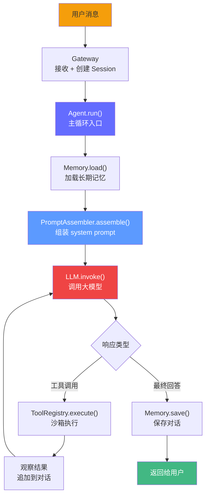

# 综合实战——构建类 OpenClaw Agent 平台（FDE-Agent）

> 从零实现一个类 OpenClaw 的 Agent 平台，掌握"文件即配置"的 Agent 编程范式。涵盖工作区管理、系统提示组装、Agentic Loop、记忆持久化、工具沙箱、Skill 系统、Gateway 层。

---

## 项目目标

前面 14 章教的是**怎么用 Agent 框架写应用**（LangGraph 编排、多 Agent 协作）。这一章教的是**Agent 平台本身是怎么工作的**。

OpenClaw 在 2026 年初爆火，核心创新不是某个算法，而是一种编程范式：**文件即配置**。你不需要写 Python 代码来定义 Agent 的行为，而是写 Markdown 文件——SOUL.md 定义人格，AGENTS.md 定义工作规则，MEMORY.md 定义记忆。平台启动时读取这些文件，组装为 system prompt，然后进入 Agentic Loop。

我们要从零实现一个类似的平台，命名为 **FDE-Agent**。

**要掌握的 6 大核心模块**：

| 模块 | 对应 OpenClaw 概念 | 你要理解的核心 |
|------|-------------------|--------------|
| Workspace | 文件化工作区 | 启动序列、文件模板、格式校验 |
| Prompt Assembler | 系统提示组装 | 多文件合并、上下文截断、优先级 |
| Memory | 跨 session 记忆 | 三层记忆、持久化、压缩 |
| Tools + Sandbox | 工具沙箱 | 注册表、装饰器、安全执行 |
| Skills | 可插拔能力 | Markdown 定义、动态注入 |
| Gateway | 会话管理 | 多适配器、会话隔离、WebSocket |

---

## 整体架构

```
┌─────────────────────────────────────────────────────────┐
│                    输入层（Gateway）                       │
│                                                         │
│  ┌─────────┐  ┌──────────┐  ┌──────────┐  ┌─────────┐  │
│  │  CLI    │  │ 飞书     │  │ Webhook  │  │ Web UI  │  │
│  │ 终端    │  │ Adapter  │  │ Adapter  │  │ Adapter │  │
│  └────┬────┘  └────┬─────┘  └────┬─────┘  └────┬────┘  │
│       └────────────┴─────────────┴──────────────┘        │
│                          │                               │
│                   Session Manager                         │
└──────────────────────────┬───────────────────────────────┘
                           │ 用户消息 + session_id
                           ▼
┌─────────────────────────────────────────────────────────┐
│                    核心层（Core）                          │
│                                                         │
│  ┌──────────────────────────────────────────────────┐   │
│  │              Agent（Agentic Loop）                 │   │
│  │                                                   │   │
│  │  1. 接收用户消息                                   │   │
│  │  2. 加载记忆（Memory Store）                       │   │
│  │  3. 组装 system prompt（Prompt Assembler）         │   │
│  │  4. 调用 LLM                                      │   │
│  │  5. 解析响应（文本 or 工具调用）                    │   │
│  │  6. 如果是工具调用 → 执行 → 观察 → 回到 4          │   │
│  │  7. 如果是最终回答 → 保存记忆 → 返回               │   │
│  └──────────────────────────────────────────────────┘   │
│           │                        │                     │
│  ┌────────┴──────┐      ┌──────────┴──────────┐        │
│  │   Workspace   │      │  Prompt Assembler    │        │
│  │  文件读取     │      │  系统提示组装         │        │
│  │  格式校验     │      │  上下文截断           │        │
│  └───────────────┘      └───────────────────────┘        │
└──────────────────────────┬───────────────────────────────┘
                           │
┌──────────────────────────┴───────────────────────────────┐
│                    能力层                                  │
│                                                          │
│  ┌──────────────┐  ┌──────────────┐  ┌──────────────┐   │
│  │   Tools      │  │   Skills     │  │   Memory     │   │
│  │  注册表       │  │  加载器       │  │  文件+内存    │   │
│  │  沙箱执行     │  │  动态注入     │  │  三层管理     │   │
│  │              │  │              │  │  压缩截断     │   │
│  │  - shell     │  │  skill1.md   │  │              │   │
│  │  - file_ops  │  │  skill2.md   │  │  MEMORY.md   │   │
│  │  - web_search│  │  skill3.md   │  │              │   │
│  │  - scheduler │  │              │  │              │   │
│  └──────────────┘  └──────────────┘  └──────────────┘   │
└──────────────────────────────────────────────────────────┘
```

**数据流**：



---

## 第 1 步：项目结构

```
fde-agent/
├── src/
│   ├── __init__.py
│   ├── core/
│   │   ├── __init__.py
│   │   ├── agent.py              # Agent 主类 + Agentic Loop
│   │   ├── workspace.py          # 工作区管理
│   │   └── prompt_assembler.py   # 系统提示组装器
│   ├── memory/
│   │   ├── __init__.py
│   │   ├── store.py              # 记忆存储
│   │   └── models.py             # 记忆数据模型
│   ├── tools/
│   │   ├── __init__.py
│   │   ├── registry.py           # 工具注册表
│   │   ├── sandbox.py            # 沙箱执行
│   │   └── builtin/
│   │       ├── __init__.py
│   │       ├── shell.py          # Shell 命令
│   │       ├── file_ops.py       # 文件读写
│   │       ├── web_search.py     # Web 搜索
│   │       └── scheduler.py      # 定时任务
│   ├── skills/
│   │   ├── __init__.py
│   │   ├── loader.py             # Skill 加载器
│   │   └── registry.py           # Skill 注册表
│   ├── gateway/
│   │   ├── __init__.py
│   │   ├── server.py             # HTTP 服务
│   │   └── adapters/
│   │       ├── __init__.py
│   │       ├── cli.py            # CLI 终端
│   │       ├── feishu.py         # 飞书 Webhook
│   │       └── webhook.py        # 通用 Webhook
│   └── cli.py                    # CLI 入口
├── workspace/                     # 默认工作区模板
│   ├── SOUL.md
│   ├── AGENTS.md
│   ├── IDENTITY.md
│   ├── USER.md
│   ├── TOOLS.md
│   └── MEMORY.md
├── pyproject.toml
└── README.md
```

---

## 第 2 步：文件化工作区（Workspace）

工作区是 Agent 的"家"。所有关于 Agent 行为、人格、记忆的配置都在一个目录里，全部用 Markdown 文件。

### 2.1 工作区文件职责

| 文件 | 必须 | 职责 | 类比 |
|------|------|------|------|
| `SOUL.md` | 是 | Agent 的人格、语气、价值观、行为边界 | "我是谁" |
| `AGENTS.md` | 是 | 工作规则、禁止行为、优先级、SOP | "我怎么工作" |
| `IDENTITY.md` | 否 | 身份信息（名称、版本、创建者） | "我的名片" |
| `USER.md` | 否 | 用户偏好、习惯、背景信息 | "我服务的人" |
| `TOOLS.md` | 否 | 可用工具列表及使用约束 | "我能用什么工具" |
| `MEMORY.md` | 否 | 长期记忆（跨 session 持久化） | "我的记忆" |
| `HEARTBEAT.md` | 否 | 定时任务定义 | "我定期做什么" |

### 2.2 Workspace 类实现

```python
"""src/core/workspace.py — 工作区管理。"""

from pathlib import Path
from typing import Optional
import shutil
import logging

logger = logging.getLogger(__name__)

# 工作区文件定义
# (文件名, 是否必须, 默认模板内容)
WORKSPACE_FILES = [
    ("SOUL.md", True, """# SOUL — Agent 人格定义

## 身份
你是一个专业、严谨、有帮助的 AI 助手。

## 语气
- 直接、简洁，不说废话
- 遇到不确定时用"我不确定，但我可以..."而不是编造答案

## 价值观
- 安全第一，不执行危险命令
- 诚实，不知道就说不知道
- 主动思考，不止回答问题，还要发现问题

## 边界
- 不执行 `rm -rf` 类命令
- 不修改系统文件
- 不泄露用户隐私信息
"""),
    ("AGENTS.md", True, """# AGENTS — 工作规则

## 通用规则
1. 每次回复前先思考是否需要工具
2. 工具调用后必须分析结果再给出最终回答
3. 不编造信息，不跳过验证步骤

## 文件操作
- 编辑文件前先读取确认当前内容
- 大文件编辑（>500 行）需分段进行
- 每次编辑后验证文件语法正确

## 错误处理
- 工具执行失败时，分析错误信息后重试或报告
- 遇到不确定的操作，先向用户确认
"""),
    ("IDENTITY.md", False, """# IDENTITY

- name: FDE-Agent
- version: 0.1.0
- created: 2026-05-28
- description: 类 OpenClaw Agent 平台
"""),
    ("USER.md", False, """# USER — 用户信息

## 基本信息
- 姓名: 待补充
- 角色: 开发者
- 技术栈: Python, Go

## 偏好
- 回复语言: 中文
- 代码风格: 简洁，多注释
"""),
    ("TOOLS.md", False, """# TOOLS — 工具使用约束

## 可用工具
1. `shell` — 执行 shell 命令
2. `file_read` — 读取文件内容
3. `file_write` — 写入文件
4. `file_search` — 搜索文件
5. `web_search` — 网络搜索

## 使用约束
- shell 命令执行前需评估风险
- 禁止修改 /etc、/usr 等系统目录
- 网络搜索仅使用 Tavily API
"""),
    ("MEMORY.md", False, """# MEMORY — 长期记忆

> 本文件由 Agent 自动维护，记录跨 session 的重要信息。

## 用户偏好
（待学习）

## 重要决策
（待记录）

## 项目上下文
（待积累）
"""),
]


class Workspace:
    """管理工作区目录。"""

    def __init__(self, path: str):
        self.path = Path(path).expanduser().resolve()

    def exists(self) -> bool:
        """检查工作区是否存在（至少包含所有必须文件）。"""
        if not self.path.is_dir():
            return False
        for filename, required, _ in WORKSPACE_FILES:
            if required and not (self.path / filename).exists():
                return False
        return True

    def bootstrap(self) -> list[str]:
        """首次启动：创建工作区 + 写入默认文件模板。"""
        if self.path.exists():
            if not self.path.is_dir():
                raise ValueError(f"路径 {self.path} 不是目录")
            logger.info("工作区目录已存在，将补全缺失的文件")
        else:
            self.path.mkdir(parents=True, exist_ok=True)
            logger.info(f"创建工作区目录: {self.path}")

        created = []
        for filename, _, template in WORKSPACE_FILES:
            file_path = self.path / filename
            if not file_path.exists():
                file_path.write_text(template, encoding="utf-8")
                created.append(filename)
                logger.info(f"创建默认文件: {filename}")

        return created

    def load(self, filename: str) -> Optional[str]:
        """读取单个工作区文件。"""
        file_path = self.path / filename
        if not file_path.exists():
            return None
        return file_path.read_text(encoding="utf-8")

    def load_all(self) -> dict[str, str]:
        """按启动顺序读取所有工作区文件。

        返回 {文件名: 文件内容} 的字典，仅包含存在的文件。
        """
        result = {}
        for filename, _, _ in WORKSPACE_FILES:
            content = self.load(filename)
            if content is not None:
                result[filename] = content
        return result

    def validate(self) -> list[str]:
        """验证工作区完整性，返回缺失的必须文件列表。"""
        missing = []
        for filename, required, _ in WORKSPACE_FILES:
            if required and not (self.path / filename).exists():
                missing.append(filename)
        return missing

    def get_skills_dir(self) -> Path:
        """获取 Skill 目录路径。"""
        skills_dir = self.path / "skills"
        skills_dir.mkdir(exist_ok=True)
        return skills_dir

    def __repr__(self) -> str:
        status = "valid" if self.exists() else "invalid"
        return f"Workspace(path={self.path}, status={status})"
```

### 2.3 启动序列详解

Agent 启动时，按以下固定顺序读取文件。这个顺序不是随便排的——它反映了 system prompt 的结构：

```
1. SOUL.md       ← 人格层：我是谁，我的价值观
2. AGENTS.md     ← 规则层：我怎么工作，什么不能做
3. IDENTITY.md   ← 身份信息（可选）
4. USER.md       ← 用户上下文（可选）
5. TOOLS.md      ← 工具约束（可选）
6. MEMORY.md     ← 历史记忆（可选）
```

如果某个可选文件不存在，跳过即可。必须文件（SOUL.md + AGENTS.md）缺失时，`validate()` 会报错。

---

## 第 3 步：系统提示组装器（Prompt Assembler）

Workspace 读出来的是一堆独立的文件。Prompt Assembler 的职责是把它们组装成一个完整的 system prompt。

### 3.1 组装模板

```
=== SYSTEM PROMPT ===

[SECTION: SOUL]
{SOUL.md 内容}

[SECTION: IDENTITY]
{IDENTITY.md 内容}

[SECTION: AGENTS]
{AGENTS.md 内容}

[SECTION: USER]
{USER.md 内容}

[SECTION: TOOLS]
{TOOLS.md 内容}

{可用工具列表 — 由 ToolRegistry 动态生成}

[SECTION: SKILLS]
{Skill 列表 — 由 SkillRegistry 动态注入}

[SECTION: MEMORY]
{最近 N 条记忆 — 由 MemoryStore 提供}

[SECTION: CONVERSATION]
{当前对话历史}

=== END SYSTEM PROMPT ===
```

### 3.2 上下文截断策略

LLM 的上下文窗口有限（比如 128K tokens）。当所有文件 + 记忆 + 对话历史加起来超过限制时，需要截断。

截断策略遵循**三级优先级**：

| 优先级 | 内容 | 处理方式 |
|--------|------|---------|
| P0 不可压缩 | SOUL.md, AGENTS.md | 永远保留，不能截断 |
| P1 可压缩 | IDENTITY.md, USER.md, TOOLS.md | 保留摘要 |
| P2 按需注入 | MEMORY.md, 对话历史 | 紧急时全部截断 |

### 3.3 PromptAssembler 实现

```python
"""src/core/prompt_assembler.py — 系统提示组装器。"""

from typing import Optional
from ..memory.store import MemoryStore


class PromptAssembler:
    """将工作区文件 + 记忆 + 工具描述组装为完整 system prompt。"""

    # 上下文窗口限制（保守估计，留给对话历史留空间）
    MAX_CONTEXT_CHARS = 100_000  # 约 25K tokens

    # 文件优先级
    P0_FILES = ["SOUL.md", "AGENTS.md"]         # 不可压缩
    P1_FILES = ["IDENTITY.md", "USER.md", "TOOLS.md"]  # 可压缩
    P2_FILES = ["MEMORY.md"]                     # 按需注入

    def assemble(
        self,
        workspace_files: dict[str, str],
        tool_descriptions: list[str],
        skill_descriptions: list[str],
        recent_memory: list[str],
        conversation_history: list[dict],
    ) -> str:
        """组装完整的 system prompt。

        Args:
            workspace_files: {文件名: 内容} 字典
            tool_descriptions: 可用工具的描述列表
            skill_descriptions: 已加载 Skill 的描述列表
            recent_memory: 最近记忆条目列表
            conversation_history: 当前对话历史
        """
        sections = []

        # === P0: 人格和规则（永远保留）===
        for filename in self.P0_FILES:
            if filename in workspace_files:
                sections.append(f"[SECTION: {filename.replace('.md', '')}]")
                sections.append(workspace_files[filename])
                sections.append("")

        # === P1: 身份信息（尝试保留，超限时压缩）===
        p1_budget = 5_000  # P1 文件总共最多 5000 字符
        p1_content = ""
        for filename in self.P1_FILES:
            if filename in workspace_files:
                p1_content += f"[SECTION: {filename.replace('.md', '')}]\n"
                p1_content += workspace_files[filename] + "\n\n"

        if len(p1_content) > p1_budget:
            # 截断 P1 内容
            p1_content = p1_content[:p1_budget] + "\n...(已截断)\n"
        sections.append(p1_content)

        # === 工具描述（动态生成）===
        if tool_descriptions:
            sections.append("[SECTION: AVAILABLE TOOLS]")
            sections.append("你可以使用以下工具：\n")
            for desc in tool_descriptions:
                sections.append(desc)
            sections.append("")

        # === Skill 描述（动态注入）===
        if skill_descriptions:
            sections.append("[SECTION: SKILLS]")
            sections.append("你具备以下特殊能力：\n")
            for desc in skill_descriptions:
                sections.append(desc)
            sections.append("")

        # === P2: 记忆（按需注入）===
        if recent_memory:
            p2_budget = 10_000
            memory_content = "[SECTION: MEMORY]\n\n"
            for entry in recent_memory:
                memory_content += f"- {entry}\n"
                if len(memory_content) > p2_budget:
                    memory_content += "\n...(更早的记忆已截断)\n"
                    break
            sections.append(memory_content)

        # === 对话历史 ===
        sections.append("[SECTION: CONVERSATION HISTORY]")
        sections.append("以下是当前对话：\n")
        for msg in conversation_history:
            role = msg.get("role", "unknown")
            content = msg.get("content", "")
            sections.append(f"{role}: {content}")
        sections.append("")

        # === 组装并检查总长度 ===
        full_prompt = "\n".join(sections)

        if len(full_prompt) > self.MAX_CONTEXT_CHARS:
            full_prompt = self._emergency_truncate(full_prompt)

        return full_prompt

    def _emergency_truncate(self, prompt: str) -> str:
        """紧急截断：保留 P0 + 对话历史最近部分。"""
        # 策略：保留 P0 文件（SOUL + AGENTS）完整，截断其他所有内容
        lines = prompt.split("\n")
        result = []
        current_section = None
        in_p0 = False

        for line in lines:
            if line.startswith("[SECTION: SOUL]"):
                in_p0 = True
                current_section = "SOUL"
            elif line.startswith("[SECTION: AGENTS]"):
                in_p0 = True
                current_section = "AGENTS"
            elif line.startswith("[SECTION:"):
                in_p0 = False
                current_section = line

            if in_p0:
                result.append(line)
            elif current_section == "SOUL" or current_section == "AGENTS":
                result.append(line)
            # P1 和 P2 在紧急截断时被丢弃

        result.append("\n[NOTE: 上下文因长度限制已截断，请仅基于当前可见信息回答]")
        return "\n".join(result)
```

---

## 第 4 步：记忆系统（Memory）

OpenClaw 的记忆不是靠 LLM 的 context window 硬撑，而是靠**文件持久化 + 内存缓存**的双写机制。

### 4.1 三层记忆

| 层级 | 存储位置 | 生命周期 | 用途 |
|------|---------|---------|------|
| 工作记忆 | Python list | 当前请求 | LLM 对话历史 |
| 短期记忆 | MEMORY.md | 当前 session | 本次对话中的重要信息 |
| 长期记忆 | MEMORY.md | 跨 session | 用户偏好、项目上下文、重要决策 |

### 4.2 MemoryEntry 数据模型

```python
"""src/memory/models.py — 记忆数据模型。"""

from dataclasses import dataclass, field
from datetime import datetime
from enum import Enum
from typing import Optional


class MemoryType(str, Enum):
    FACT = "fact"           # 事实信息（用户技术栈、项目背景）
    PREFERENCE = "pref"     # 用户偏好（回复语言、代码风格）
    DECISION = "decision"   # 重要决策记录
    CONTEXT = "context"     # 项目上下文
    LESSON = "lesson"       # 经验教训（犯过的错、学到的东西）


@dataclass
class MemoryEntry:
    """一条记忆记录。"""
    content: str                      # 记忆内容
    type: MemoryType = MemoryType.FACT  # 记忆类型
    confidence: float = 1.0           # 置信度（0-1，用户确认的为 1.0）
    created_at: datetime = field(default_factory=datetime.now)
    last_accessed: datetime = field(default_factory=datetime.now)
    access_count: int = 0             # 被访问次数（热门记忆优先保留）
    tags: list[str] = field(default_factory=list)  # 标签

    def to_line(self) -> str:
        """序列化为 MEMORY.md 中的一行。"""
        ts = self.created_at.strftime("%Y-%m-%d %H:%M")
        return f"- [{self.type.value}] [{ts}] {self.content} (tags: {','.join(self.tags)})"

    @classmethod
    def from_line(cls, line: str) -> Optional["MemoryEntry"]:
        """从 MEMORY.md 的一行反序列化。"""
        if not line.startswith("- ["):
            return None
        try:
            # 解析格式: - [type] [timestamp] content (tags: ...)
            parts = line.split("] ", 2)
            mem_type = parts[0].replace("- [", "")
            timestamp_str = parts[1].replace("[", "").replace("]", "")
            rest = parts[2]
            content = rest.split(" (tags:")[0]
            tags_str = rest.split("(tags: ")[1].rstrip(")") if "(tags:" in rest else ""
            tags = [t.strip() for t in tags_str.split(",") if t.strip()]

            return cls(
                content=content,
                type=MemoryType(mem_type),
                created_at=datetime.strptime(timestamp_str, "%Y-%m-%d %H:%M"),
                tags=tags,
            )
        except Exception:
            return None
```

### 4.3 MemoryStore 实现

```python
"""src/memory/store.py — 记忆存储。"""

from pathlib import Path
from typing import Optional
import logging
from .models import MemoryEntry, MemoryType

logger = logging.getLogger(__name__)

MEMORY_FILENAME = "MEMORY.md"


class MemoryStore:
    """文件 + 内存双写记忆存储。"""

    def __init__(self, workspace_path: str):
        self.workspace_path = Path(workspace_path)
        self.memory_file = self.workspace_path / MEMORY_FILENAME
        self.entries: list[MemoryEntry] = []
        self.load()

    # --- 写操作 ---

    def add(self, entry: MemoryEntry) -> None:
        """添加新记忆。"""
        self.entries.append(entry)
        self.persist()
        logger.debug(f"记忆已添加: {entry.type.value} - {entry.content[:50]}")

    def update(self, index: int, content: str) -> None:
        """更新已有记忆。"""
        if 0 <= index < len(self.entries):
            self.entries[index].content = content
            self.persist()

    # --- 读操作 ---

    def get_recent(self, n: int = 10) -> list[str]:
        """获取最近 n 条记忆（按时间倒序）。"""
        sorted_entries = sorted(
            self.entries, key=lambda e: e.created_at, reverse=True
        )[:n]
        return [e.to_line() for e in sorted_entries]

    def get_by_type(self, mem_type: MemoryType) -> list[MemoryEntry]:
        """按类型获取记忆。"""
        return [e for e in self.entries if e.type == mem_type]

    def search(self, query: str, max_results: int = 5) -> list[str]:
        """简单关键词搜索记忆。"""
        query_lower = query.lower()
        results = []
        for entry in self.entries:
            if query_lower in entry.content.lower() or \
               any(query_lower in tag.lower() for tag in entry.tags):
                entry.access_count += 1
                results.append(entry.to_line())
                if len(results) >= max_results:
                    break
        return results

    def get_context_for_assembly(self, max_chars: int = 8000) -> list[str]:
        """获取用于 prompt 组装的记忆内容。

        策略：按 access_count 降序（热门记忆优先），总长度不超过 max_chars。
        """
        sorted_entries = sorted(
            self.entries, key=lambda e: e.access_count, reverse=True
        )
        result = []
        total_chars = 0
        for entry in sorted_entries:
            line = entry.to_line()
            if total_chars + len(line) > max_chars:
                break
            result.append(line)
            total_chars += len(line)
        return result

    # --- 持久化 ---

    def persist(self) -> None:
        """持久化到 MEMORY.md 文件。"""
        lines = [
            "# MEMORY — 长期记忆",
            "",
            "> 本文件由 Agent 自动维护，记录跨 session 的重要信息。",
            "",
        ]

        # 按类型分组写入
        for mem_type in MemoryType:
            type_entries = [e for e in self.entries if e.type == mem_type]
            if type_entries:
                lines.append(f"## {mem_type.value.upper()}")
                lines.append("")
                for entry in sorted(type_entries, key=lambda e: e.created_at):
                    lines.append(entry.to_line())
                lines.append("")

        self.memory_file.write_text("\n".join(lines), encoding="utf-8")

    def load(self) -> None:
        """从 MEMORY.md 加载。"""
        if not self.memory_file.exists():
            logger.info("MEMORY.md 不存在，跳过加载")
            return

        content = self.memory_file.read_text(encoding="utf-8")
        self.entries = []
        for line in content.split("\n"):
            if line.startswith("- ["):
                entry = MemoryEntry.from_line(line)
                if entry:
                    self.entries.append(entry)

        logger.info(f"从 MEMORY.md 加载了 {len(self.entries)} 条记忆")

    def clear(self) -> None:
        """清空所有记忆。"""
        self.entries = []
        self.persist()

    def __len__(self) -> int:
        return len(self.entries)
```

---

## 第 5 步：工具注册与沙箱（Tools + Sandbox）

Agent 需要调用工具来完成用户请求。工具系统解决了三个问题：**发现**（有哪些工具）、**描述**（怎么告诉 LLM）、**执行**（怎么安全运行）。

### 5.1 工具注册表

```python
"""src/tools/registry.py — 工具注册表。"""

from typing import Any, Callable, Optional
from dataclasses import dataclass, field
import json
import inspect


@dataclass
class ToolResult:
    """工具执行结果。"""
    success: bool
    output: str
    error: Optional[str] = None


@dataclass
class ToolDefinition:
    """工具定义——用于告诉 LLM 这个工具能做什么。"""
    name: str
    description: str
    parameters: dict[str, Any] = field(default_factory=dict)
    # JSON Schema 格式的参数定义


def tool(name: str, description: str, parameters: dict = None):
    """工具注册装饰器。

    用法:
        @tool(name="shell", description="执行 shell 命令", parameters={...})
        class ShellTool:
            def execute(self, **kwargs) -> ToolResult:
                ...
    """
    def decorator(cls):
        cls.tool_name = name
        cls.tool_description = description
        cls.tool_parameters = parameters or {}
        return cls
    return decorator


class ToolRegistry:
    """工具的注册、发现、描述生成、执行。"""

    def __init__(self):
        self._tools: dict[str, Any] = {}

    def register(self, tool_class: type) -> None:
        """注册一个工具类。"""
        name = getattr(tool_class, "tool_name", tool_class.__name__.lower())
        self._tools[name] = tool_class()

    def register_all(self, tools_dir: Optional[str] = None) -> None:
        """自动注册所有内置工具。"""
        from .builtin.shell import ShellTool
        from .builtin.file_ops import FileReadTool, FileWriteTool, FileSearchTool
        from .builtin.web_search import WebSearchTool

        self.register(ShellTool)
        self.register(FileReadTool)
        self.register(FileWriteTool)
        self.register(FileSearchTool)
        self.register(WebSearchTool)

    def get(self, name: str) -> Optional[Any]:
        """获取工具实例。"""
        return self._tools.get(name)

    def list_tools(self) -> list[ToolDefinition]:
        """列出所有可用工具（生成 LLM 可读的描述）。"""
        result = []
        for name, instance in self._tools.items():
            result.append(ToolDefinition(
                name=name,
                description=getattr(instance, "tool_description", ""),
                parameters=getattr(instance, "tool_parameters", {}),
            ))
        return result

    def generate_prompt_section(self) -> str:
        """生成 system prompt 中的工具描述部分。"""
        lines = ["## 可用工具", ""]
        for tool_def in self.list_tools():
            lines.append(f"### {tool_def.name}")
            lines.append(tool_def.description)
            if tool_def.parameters:
                lines.append(f"参数: {json.dumps(tool_def.parameters, ensure_ascii=False)}")
            lines.append("")
        return "\n".join(lines)

    async def execute(self, name: str, **kwargs) -> ToolResult:
        """执行工具调用。"""
        tool = self._tools.get(name)
        if not tool:
            return ToolResult(success=False, output="", error=f"工具不存在: {name}")

        try:
            if inspect.iscoroutinefunction(tool.execute):
                return await tool.execute(**kwargs)
            else:
                return tool.execute(**kwargs)
        except Exception as e:
            return ToolResult(success=False, output="", error=str(e))
```

### 5.2 沙箱执行

```python
"""src/tools/sandbox.py — 工具沙箱执行。"""

import subprocess
import re
import os
from typing import Optional
from ..tools.registry import ToolResult

# 危险命令黑名单
DANGEROUS_PATTERNS = [
    r"rm\s+-rf\s+/",        # rm -rf /
    r"rm\s+-rf\s+\*",       # rm -rf *
    r"mkfs",                # 格式化文件系统
    r"dd\s+if=",            # dd 写入
    r">/dev/sd",            # 写设备文件
    r"chmod\s+777\s+/",     # 全局 777
    r"sudo\s+rm",           # sudo rm
    r"curl.*\|\s*(ba)?sh",  # curl | bash
    r"wget.*\|\s*(ba)?sh",  # wget | bash
]

# 禁止访问的路径前缀
FORBIDDEN_PATHS = [
    "/etc/",
    "/usr/",
    "/var/log/",
    "/root/",
    "/System/",
    "/boot/",
]


class Sandbox:
    """工具沙箱——安全执行外部命令。"""

    MAX_TIMEOUT = 30  # 命令最大执行时间（秒）
    MAX_OUTPUT_CHARS = 50_000  # 输出最大字符数

    def check_command(self, command: str) -> Optional[str]:
        """安全检查命令，返回错误信息或 None（通过）。"""
        # 1. 检查危险模式
        for pattern in DANGEROUS_PATTERNS:
            if re.search(pattern, command, re.IGNORECASE):
                return f"命令被安全策略拒绝: 匹配危险模式 {pattern}"

        # 2. 检查禁止路径
        for forbidden in FORBIDDEN_PATHS:
            if forbidden in command:
                return f"命令被安全策略拒绝: 禁止访问 {forbidden}"

        return None

    def execute(
        self,
        command: str,
        cwd: Optional[str] = None,
        timeout: Optional[int] = None,
    ) -> ToolResult:
        """安全执行 shell 命令。"""
        # 安全检查
        error = self.check_command(command)
        if error:
            return ToolResult(success=False, output="", error=error)

        timeout = timeout or self.MAX_TIMEOUT

        try:
            result = subprocess.run(
                command,
                shell=True,
                capture_output=True,
                text=True,
                timeout=timeout,
                cwd=cwd or os.getcwd(),
            )

            output = result.stdout[:self.MAX_OUTPUT_CHARS]
            if result.stderr:
                output += "\nSTDERR: " + result.stderr[:self.MAX_OUTPUT_CHARS]

            return ToolResult(
                success=result.returncode == 0,
                output=output.strip(),
                error=None if result.returncode == 0 else f"退出码 {result.returncode}",
            )

        except subprocess.TimeoutExpired:
            return ToolResult(
                success=False,
                output="",
                error=f"命令执行超时（{timeout}s），可能被中断",
            )
        except Exception as e:
            return ToolResult(success=False, output="", error=str(e))
```

### 5.3 内置工具实现

```python
"""src/tools/builtin/shell.py — Shell 命令执行工具。"""

from ..registry import tool, ToolResult
from ..sandbox import Sandbox

sandbox = Sandbox()


@tool(
    name="shell",
    description="执行 shell 命令。用于运行脚本、检查系统状态、安装依赖等。",
    parameters={
        "command": {"type": "string", "description": "要执行的 shell 命令"},
        "cwd": {"type": "string", "description": "工作目录（可选）"},
    },
)
class ShellTool:
    def execute(self, command: str, cwd: str = None) -> ToolResult:
        return sandbox.execute(command, cwd=cwd)


"""src/tools/builtin/file_ops.py — 文件操作工具。"""

from pathlib import Path
from ..registry import tool, ToolResult


@tool(
    name="file_read",
    description="读取文件内容。用于查看代码、配置、文档等。",
    parameters={
        "path": {"type": "string", "description": "文件路径"},
        "max_lines": {"type": "integer", "description": "最大读取行数，默认 200"},
    },
)
class FileReadTool:
    MAX_SIZE = 100_000  # 最大文件大小 100KB

    def execute(self, path: str, max_lines: int = 200) -> ToolResult:
        try:
            file_path = Path(path)
            if not file_path.exists():
                return ToolResult(success=False, output="", error=f"文件不存在: {path}")
            if file_path.stat().st_size > self.MAX_SIZE:
                return ToolResult(success=False, output="", error=f"文件过大（>{self.MAX_SIZE} 字节）")

            lines = file_path.read_text(encoding="utf-8").split("\n")
            content = "\n".join(lines[:max_lines])
            if len(lines) > max_lines:
                content += f"\n... (还有 {len(lines) - max_lines} 行)"
            return ToolResult(success=True, output=content)
        except Exception as e:
            return ToolResult(success=False, output="", error=str(e))


@tool(
    name="file_write",
    description="写入文件。用于创建或修改代码、配置、文档。",
    parameters={
        "path": {"type": "string", "description": "文件路径"},
        "content": {"type": "string", "description": "文件内容"},
    },
)
class FileWriteTool:
    def execute(self, path: str, content: str) -> ToolResult:
        try:
            file_path = Path(path)
            file_path.parent.mkdir(parents=True, exist_ok=True)
            file_path.write_text(content, encoding="utf-8")
            return ToolResult(success=True, output=f"已写入 {path}（{len(content)} 字节）")
        except Exception as e:
            return ToolResult(success=False, output="", error=str(e))


@tool(
    name="file_search",
    description="在目录中搜索文件。用于找到相关代码文件。",
    parameters={
        "directory": {"type": "string", "description": "搜索目录"},
        "pattern": {"type": "string", "description": "文件名匹配模式，如 '*.py'"},
    },
)
class FileSearchTool:
    MAX_RESULTS = 20

    def execute(self, directory: str, pattern: str) -> ToolResult:
        try:
            dir_path = Path(directory)
            if not dir_path.is_dir():
                return ToolResult(success=False, output="", error=f"目录不存在: {directory}")

            files = list(dir_path.rglob(pattern))[:self.MAX_RESULTS]
            if not files:
                return ToolResult(success=True, output=f"在 {directory} 中未找到匹配 {pattern} 的文件")

            output = f"在 {directory} 中找到 {len(files)} 个匹配:\n"
            for f in files:
                output += f"  - {f.relative_to(dir_path)}\n"
            return ToolResult(success=True, output=output)
        except Exception as e:
            return ToolResult(success=False, output="", error=str(e))


"""src/tools/builtin/web_search.py — Web 搜索工具。"""

import os
from ..registry import tool, ToolResult


@tool(
    name="web_search",
    description="通过网络搜索获取信息。使用 Tavily API。",
    parameters={
        "query": {"type": "string", "description": "搜索关键词"},
        "max_results": {"type": "integer", "description": "最大结果数，默认 5"},
    },
)
class WebSearchTool:
    def __init__(self):
        self.api_key = os.environ.get("TAVILY_API_KEY")

    def execute(self, query: str, max_results: int = 5) -> ToolResult:
        if not self.api_key:
            return ToolResult(
                success=False,
                output="",
                error="TAVILY_API_KEY 环境变量未设置",
            )

        try:
            import httpx
            resp = httpx.post(
                "https://api.tavily.com/search",
                json={"query": query, "max_results": max_results, "api_key": self.api_key},
                timeout=15.0,
            )
            data = resp.json()
            results = data.get("results", [])

            if not results:
                return ToolResult(success=True, output=f"搜索 '{query}' 未找到结果")

            output = f"搜索结果（{len(results)} 条）:\n\n"
            for i, r in enumerate(results, 1):
                output += f"{i}. {r.get('title', '无标题')}\n"
                output += f"   URL: {r.get('url', '')}\n"
                output += f"   {r.get('content', '')[:200]}\n\n"

            return ToolResult(success=True, output=output)
        except Exception as e:
            return ToolResult(success=False, output="", error=f"搜索失败: {e}")
```

---

## 第 6 步：Skill 系统

Skill 是可插拔的能力扩展模块。与 Tool 的区别：Tool 是"一个动作"（执行命令），Skill 是"一套工作流"（多步操作）。

### 6.1 Skill 文件格式

```markdown
<!-- skills/fde-job-collect.md -->

# Skill: FDE 岗位采集

## 触发条件
当用户请求"采集岗位"、"更新 jobs"、"搜索 FDE 岗位"时激活。

## 执行步骤
1. 使用 `web_search` 搜索 6 大招聘平台的 FDE 岗位
2. 提取岗位名称、公司、技能要求、薪资范围
3. 使用 `file_read` 读取现有 jobs.json
4. 去重后使用 `file_write` 更新 jobs.json
5. 输出采集报告（新增 N 条，总计 M 条）

## 约束
- 每次采集不超过 30 条
- 必须去重，不重复录入
- 采集失败时报告错误原因
```

### 6.2 Skill Loader

```python
"""src/skills/loader.py — Skill 加载器。"""

from pathlib import Path
from dataclasses import dataclass
from typing import Optional
import re
import logging

logger = logging.getLogger(__name__)


@dataclass
class Skill:
    """一个 Skill 的完整定义。"""
    name: str                  # Skill 名称
    file_path: Path            # 文件路径
    trigger_conditions: list[str]  # 触发条件关键词
    steps: list[str]           # 执行步骤
    constraints: list[str]     # 约束条件
    raw_content: str           # 原始 Markdown 内容

    def to_prompt_section(self) -> str:
        """生成 system prompt 中的 Skill 描述。"""
        lines = [f"### {self.name}"]
        lines.append(f"触发条件: {', '.join(self.trigger_conditions)}")
        lines.append("执行步骤:")
        for i, step in enumerate(self.steps, 1):
            lines.append(f"  {i}. {step}")
        if self.constraints:
            lines.append("约束:")
            for c in self.constraints:
                lines.append(f"  - {c}")
        return "\n".join(lines)


class SkillLoader:
    """从文件目录加载 Skill 定义。"""

    def __init__(self, skills_dir: Path):
        self.skills_dir = skills_dir
        self.skills: list[Skill] = []
        self.load_all()

    def load_all(self) -> None:
        """加载目录下所有 .md Skill 文件。"""
        if not self.skills_dir.exists():
            logger.info(f"Skill 目录不存在: {self.skills_dir}")
            return

        for md_file in self.skills_dir.glob("*.md"):
            skill = self._parse_file(md_file)
            if skill:
                self.skills.append(skill)
                logger.info(f"加载 Skill: {skill.name}")

    def _parse_file(self, file_path: Path) -> Optional[Skill]:
        """解析 Skill Markdown 文件。"""
        content = file_path.read_text(encoding="utf-8")

        # 提取标题（# Skill: xxx 或 # xxx）
        title_match = re.search(r"^#\s+(?:Skill:\s+)?(.+)$", content, re.MULTILINE)
        if not title_match:
            logger.warning(f"Skill 文件缺少标题: {file_path}")
            return None

        name = title_match.group(1).strip()

        # 提取触发条件
        triggers = self._extract_section(content, "触发条件")

        # 提取执行步骤
        steps = self._extract_section(content, "执行步骤")

        # 提取约束
        constraints = self._extract_section(content, "约束")

        return Skill(
            name=name,
            file_path=file_path,
            trigger_conditions=triggers,
            steps=steps,
            constraints=constraints,
            raw_content=content,
        )

    def _extract_section(self, content: str, heading: str) -> list[str]:
        """提取 Markdown 中某个标题下的内容。"""
        pattern = rf"##\s+{re.escape(heading)}\s*\n(.*?)(?=\n##\s+|$)"
        match = re.search(pattern, content, re.DOTALL)
        if not match:
            return []

        section = match.group(1).strip()
        lines = [line.strip().lstrip("- ").lstrip("* ") for line in section.split("\n") if line.strip()]
        return lines

    def match(self, user_input: str) -> list[Skill]:
        """根据用户输入匹配应该激活的 Skill。"""
        user_lower = user_input.lower()
        matched = []
        for skill in self.skills:
            for trigger in skill.trigger_conditions:
                if trigger.lower() in user_lower:
                    matched.append(skill)
                    break
        return matched

    def generate_prompt_section(self) -> str:
        """生成 system prompt 中的 Skill 部分。"""
        if not self.skills:
            return ""

        lines = ["## 特殊能力（Skills）", ""]
        lines.append("你具备以下特殊能力。当用户请求匹配到某个 Skill 的触发条件时，")
        lines.append("按照该 Skill 定义的步骤执行：")
        lines.append("")
        for skill in self.skills:
            lines.append(skill.to_prompt_section())
            lines.append("")
        return "\n".join(lines)
```

### 6.3 Skill Registry

```python
"""src/skills/registry.py — Skill 注册表。"""

from pathlib import Path
from .loader import SkillLoader, Skill


class SkillRegistry:
    """Skill 注册和管理。"""

    def __init__(self, skills_dir: Path):
        self.loader = SkillLoader(skills_dir)
        self._skills: list[Skill] = self.loader.skills

    def list_skills(self) -> list[Skill]:
        """列出所有已加载的 Skill。"""
        return self._skills

    def match_skills(self, user_input: str) -> list[Skill]:
        """根据用户输入匹配 Skill。"""
        return self.loader.match(user_input)

    def get_skill(self, name: str) -> Skill | None:
        """按名称获取 Skill。"""
        for skill in self._skills:
            if skill.name.lower() == name.lower():
                return skill
        return None

    def generate_prompt_section(self) -> str:
        """生成 system prompt 中的 Skill 部分。"""
        return self.loader.generate_prompt_section()
```

---

## 第 7 步：Agent 主类 + Agentic Loop

这是整个平台的核心。Agent 类将所有模块串起来，Agentic Loop 是执行引擎。

### 7.1 Agentic Loop 流程图

```
用户消息
  │
  ▼
┌─────────────────────┐
│ 1. 加载记忆          │ ← MemoryStore.get_recent()
│    Memory.load()    │
└──────────┬──────────┘
           ▼
┌─────────────────────┐
│ 2. 组装 System Prompt│ ← PromptAssembler.assemble()
│    + 工具描述        │
│    + Skill 描述      │
│    + 对话历史        │
└──────────┬──────────┘
           ▼
┌─────────────────────┐
│ 3. 调用 LLM          │ ← llm_client.invoke(system, messages)
└──────────┬──────────┘
           ▼
      ┌────┴────┐
      │ 响应类型 │
      └────┬────┘
      ┌────┴─────┐
      │          │
  工具调用      最终回答
      │          │
      ▼          ▼
┌──────────┐  ┌──────────────┐
│ 4. 执行   │  │ 5. 保存记忆   │
│ 工具      │  │ Memory.add() │
│ Sandbox   │  │              │
└────┬─────┘  └──────┬───────┘
     │               │
     ▼               ▼
┌──────────┐  ┌──────────────┐
│ 6. 观察   │  │ 6. 返回结果   │
│ 结果追加  │  │ 给用户        │
│ 到对话    │  │              │
└────┬─────┘  └──────────────┘
     │
     └──→ 回到 3（继续循环）
          直到 LLM 返回最终回答
```

### 7.2 LLM 客户端（抽象接口）

```python
"""src/core/llm_client.py — LLM 调用抽象接口。"""

from typing import Optional
import os
import httpx


class LLMClient:
    """LLM 调用接口。支持 OpenAI 兼容的 API。"""

    def __init__(
        self,
        api_key: Optional[str] = None,
        base_url: Optional[str] = None,
        model: Optional[str] = None,
        max_tokens: int = 4096,
        temperature: float = 0.7,
    ):
        self.api_key = api_key or os.environ.get("OPENAI_API_KEY", "")
        self.base_url = base_url or os.environ.get("LLM_BASE_URL", "https://api.openai.com/v1")
        self.model = model or os.environ.get("LLM_MODEL", "gpt-4o-mini")
        self.max_tokens = max_tokens
        self.temperature = temperature
        self.client = httpx.Client(base_url=self.base_url, timeout=60.0)

    def invoke(
        self,
        system_prompt: str,
        messages: list[dict],
        tools: Optional[list[dict]] = None,
    ) -> dict:
        """调用 LLM，返回响应。

        Args:
            system_prompt: 完整的 system prompt
            messages: 对话历史 [{"role": "user", "content": "..."}]
            tools: 工具描述列表（可选，用于 function calling）

        Returns:
            {"content": str, "tool_calls": list, "finish_reason": str}
        """
        full_messages = [
            {"role": "system", "content": system_prompt},
        ] + messages

        payload = {
            "model": self.model,
            "messages": full_messages,
            "max_tokens": self.max_tokens,
            "temperature": self.temperature,
        }

        if tools:
            payload["tools"] = tools

        resp = self.client.post("/chat/completions", json=payload)
        resp.raise_for_status()
        data = resp.json()

        choice = data["choices"][0]
        message = choice["message"]

        return {
            "content": message.get("content", ""),
            "tool_calls": message.get("tool_calls", []),
            "finish_reason": choice.get("finish_reason", ""),
        }
```

### 7.3 Agent 主类

```python
"""src/core/agent.py — Agent 主类 + Agentic Loop。"""

import json
import logging
from typing import Optional
from datetime import datetime
from .workspace import Workspace
from .prompt_assembler import PromptAssembler
from .llm_client import LLMClient
from ..memory.store import MemoryStore
from ..memory.models import MemoryEntry, MemoryType
from ..tools.registry import ToolRegistry
from ..skills.registry import SkillRegistry
from ..tools.sandbox import Sandbox

logger = logging.getLogger(__name__)

MAX_LOOP_ITERATIONS = 10  # Agentic Loop 最大迭代次数，防止死循环


class Agent:
    """Agent 主类——将所有模块串联，执行 Agentic Loop。"""

    def __init__(self, workspace: Workspace, llm_client: Optional[LLMClient] = None):
        self.workspace = workspace

        # 初始化各组件
        self.assembler = PromptAssembler()
        self.memory = MemoryStore(str(workspace.path))
        self.tools = ToolRegistry()
        self.tools.register_all()
        self.skills = SkillRegistry(workspace.get_skills_dir())
        self.llm = llm_client or LLMClient()

        # 当前对话的对话历史
        self.conversation_history: list[dict] = []

        # 可观测性
        self.trace_id = datetime.now().strftime("%Y%m%d-%H%M%S")
        self.step_logs: list[dict] = []

    def run(self, user_input: str) -> str:
        """主执行循环——接收用户输入，返回最终回答。

        流程:
        1. 用户输入加入对话历史
        2. 匹配 Skill
        3. 组装 system prompt
        4. 调用 LLM
        5. 解析响应
        6. 工具调用 → 执行 → 观察 → 回到 4
        7. 最终回答 → 保存记忆 → 返回
        """
        logger.info(f"[Trace {self.trace_id}] 用户输入: {user_input[:100]}")

        # 1. 加入对话历史
        self.conversation_history.append({"role": "user", "content": user_input})
        self._log_step("user_input", user_input=user_input[:200])

        # 2. 匹配 Skill（如果有匹配的，注入 Skill 的执行步骤）
        matched_skills = self.skills.match_skills(user_input)
        if matched_skills:
            skill_names = [s.name for s in matched_skills]
            logger.info(f"匹配到 Skill: {skill_names}")
            self._log_step("skill_match", skills=skill_names)

        # 3-7. 进入 Agentic Loop
        loop_iteration = 0
        final_answer = None

        while loop_iteration < MAX_LOOP_ITERATIONS:
            loop_iteration += 1
            self._log_step("loop_start", iteration=loop_iteration)

            # === 步骤 1: 加载记忆 ===
            recent_memory = self.memory.get_context_for_assembly()

            # === 步骤 2: 组装 System Prompt ===
            workspace_files = self.workspace.load_all()
            tool_section = self.tools.generate_prompt_section()
            skill_section = self.skills.generate_prompt_section()

            system_prompt = self.assembler.assemble(
                workspace_files=workspace_files,
                tool_descriptions=[tool_section],
                skill_descriptions=[skill_section] if skill_section else [],
                recent_memory=recent_memory,
                conversation_history=self.conversation_history[-20:],  # 只保留最近 20 条
            )

            # === 步骤 3: 调用 LLM ===
            tools_schema = self._build_tools_schema()
            response = self.llm.invoke(
                system_prompt=system_prompt,
                messages=self.conversation_history,
                tools=tools_schema,
            )

            self._log_step("llm_response", finish_reason=response["finish_reason"])

            # === 步骤 4: 解析响应 ===
            tool_calls = response.get("tool_calls", [])

            if tool_calls:
                # === 工具调用分支 ===
                logger.info(f"LLM 请求调用 {len(tool_calls)} 个工具")

                # 将 LLM 的响应加入对话历史
                self.conversation_history.append({
                    "role": "assistant",
                    "content": response.get("content", ""),
                    "tool_calls": tool_calls,
                })

                # 执行每个工具调用
                for tc in tool_calls:
                    tool_name = tc.get("function", {}).get("name", "unknown")
                    tool_args = json.loads(tc["function"].get("arguments", "{}"))

                    self._log_step("tool_call", tool=tool_name, args=tool_args)

                    result = self.tools.execute(tool_name, **tool_args)

                    # 工具执行结果追加到对话历史
                    self.conversation_history.append({
                        "role": "tool",
                        "tool_call_id": tc.get("id", ""),
                        "content": result.output if result.success else f"错误: {result.error}",
                    })

                    self._log_step("tool_result", tool=tool_name, success=result.success)

                # 继续循环，让 LLM 基于工具结果继续
                continue

            else:
                # === 最终回答分支 ===
                final_answer = response.get("content", "")
                logger.info(f"LLM 返回最终回答（{len(final_answer)} 字符）")
                self.conversation_history.append({
                    "role": "assistant",
                    "content": final_answer,
                })
                break

        if final_answer is None:
            final_answer = "抱歉，我无法完成这个请求（超过最大循环次数）。"
            self._log_step("error", reason="max_loop_exceeded")

        # === 保存记忆 ===
        self._save_memory(user_input, final_answer)

        self._log_step("complete", final_answer_length=len(final_answer))
        self._print_trace()

        return final_answer

    # --- 辅助方法 ---

    def _build_tools_schema(self) -> list[dict]:
        """构建 OpenAI function calling 格式的工具 Schema。"""
        schema = []
        for tool_def in self.tools.list_tools():
            schema.append({
                "type": "function",
                "function": {
                    "name": tool_def.name,
                    "description": tool_def.description,
                    "parameters": {
                        "type": "object",
                        "properties": tool_def.parameters,
                        "required": list(tool_def.parameters.keys()),
                    },
                },
            })
        return schema

    def _save_memory(self, user_input: str, answer: str) -> None:
        """保存对话到记忆。"""
        # 提取可能的关键信息（简单启发式）
        # 实际生产中可以用 LLM 来提取
        self.memory.add(MemoryEntry(
            content=f"用户: {user_input[:200]}",
            type=MemoryType.CONTEXT,
            tags=["conversation"],
        ))

    def _log_step(self, step_name: str, **kwargs) -> None:
        """记录执行步骤（可观测性）。"""
        entry = {"step": step_name, "timestamp": datetime.now().isoformat()}
        entry.update(kwargs)
        self.step_logs.append(entry)

    def _print_trace(self) -> None:
        """打印执行可观测性报告。"""
        print(f"\n{'='*60}")
        print(f"Trace ID: {self.trace_id}")
        print(f"Agentic Loop 迭代次数: {len([s for s in self.step_logs if s['step'] == 'loop_start'])}")
        print(f"{'='*60}")
        print("\n执行轨迹:")
        for log in self.step_logs:
            step = log.pop("step", "")
            ts = log.pop("timestamp", "")
            print(f"  [{step}] {json.dumps(log, ensure_ascii=False)}")
        print(f"{'='*60}\n")

    def reset(self) -> None:
        """重置对话历史（开始新对话）。"""
        self.conversation_history = []
        self.step_logs = []
        self.trace_id = datetime.now().strftime("%Y%m%d-%H%M%S")
```

---

## 第 8 步：Gateway 层

Gateway 是 Agent 对外的接口层，负责接收用户消息、管理会话、返回响应。

### 8.1 Gateway Server

```python
"""src/gateway/server.py — HTTP 网关服务。"""

import json
import uuid
from typing import Optional
from dataclasses import dataclass
from ..core.agent import Agent


@dataclass
class Session:
    """一个用户会话。"""
    id: str
    user_id: str
    agent: Agent


class Gateway:
    """HTTP 网关——管理会话、路由消息到 Agent。"""

    def __init__(self, workspace_path: str):
        self.sessions: dict[str, Session] = {}

    def create_session(self, user_id: str) -> str:
        """创建新会话。"""
        session_id = str(uuid.uuid4())[:8]
        # 实际项目中这里会创建新的 Agent 实例
        # 为了简化，这里复用同一个 Agent
        from ..core.workspace import Workspace
        from ..core.agent import Agent

        workspace = Workspace(workspace_path)
        agent = Agent(workspace)
        self.sessions[session_id] = Session(
            id=session_id,
            user_id=user_id,
            agent=agent,
        )
        return session_id

    async def handle_message(self, session_id: str, message: str) -> dict:
        """处理单条用户消息。"""
        session = self.sessions.get(session_id)
        if not session:
            return {"error": "会话不存在", "session_id": session_id}

        try:
            response = session.agent.run(message)
            return {
                "session_id": session_id,
                "response": response,
                "trace_id": session.agent.trace_id,
            }
        except Exception as e:
            return {"error": str(e)}

    async def handle_http(self, request: dict) -> dict:
        """处理 HTTP 请求（简化版）。"""
        action = request.get("action", "message")

        if action == "init":
            session_id = self.create_session(request.get("user_id", "anonymous"))
            return {"session_id": session_id, "status": "created"}

        elif action == "message":
            return await self.handle_message(
                request.get("session_id", ""),
                request.get("message", ""),
            )

        elif action == "status":
            return {
                "active_sessions": len(self.sessions),
                "session_ids": list(self.sessions.keys()),
            }

        return {"error": "未知操作"}
```

### 8.2 CLI 适配器

```python
"""src/gateway/adapters/cli.py — CLI 终端交互适配器。"""

import sys
from ..server import Gateway


class CLIAdapter:
    """CLI 终端交互——最简单的 Gateway 适配器。"""

    def __init__(self, gateway: Gateway, workspace_path: str):
        self.gateway = gateway
        self.workspace_path = workspace_path
        self.session_id: str | None = None

    def start(self) -> None:
        """启动 CLI 交互模式。"""
        print("=" * 60)
        print("FDE-Agent CLI")
        print("输入消息与 Agent 对话，输入 'quit' 或 'exit' 退出")
        print("=" * 60)

        # 创建会话
        result = self.gateway.gateway.handle_http_sync({"action": "init", "user_id": "cli"})
        self.session_id = result["session_id"]
        print(f"会话已创建: {self.session_id}\n")

        # 交互循环
        while True:
            try:
                user_input = input("You> ").strip()
                if not user_input:
                    continue
                if user_input.lower() in ("quit", "exit", "q"):
                    print("再见！")
                    break

                result = self.gateway.gateway.handle_http_sync({
                    "action": "message",
                    "session_id": self.session_id,
                    "message": user_input,
                })

                if "error" in result:
                    print(f"Error: {result['error']}")
                else:
                    print(f"\nAgent: {result['response']}\n")

            except KeyboardInterrupt:
                print("\n中断。输入 'quit' 退出。")
            except EOFError:
                print("\n再见！")
                break
```

### 8.3 飞书 Webhook 适配器

```python
"""src/gateway/adapters/feishu.py — 飞书 Webhook 适配器。"""

import json
import os
import httpx


class FeishuAdapter:
    """飞书机器人 Webhook——接收飞书消息，调用 Agent，回复 到飞书。"""

    def __init__(self, gateway, webhook_url: str | None = None):
        self.gateway = gateway
        self.webhook_url = webhook_url or os.environ.get("FEISHU_WEBHOOK_URL", "")
        self.session_map: dict[str, str] = {}  # 飞书 chat_id → session_id

    async def handle_event(self, event: dict) -> dict:
        """处理飞书 Webhook 事件。"""
        # 提取飞书消息
        chat_id = event.get("chat_id", "unknown")
        message_text = event.get("text", "").strip()

        if not message_text:
            return {"status": "ignored"}

        # 获取或创建会话
        if chat_id not in self.session_map:
            result = await self.gateway.handle_http({
                "action": "init",
                "user_id": f"feishu:{chat_id}",
            })
            self.session_map[chat_id] = result["session_id"]

        session_id = self.session_map[chat_id]

        # 调用 Agent
        result = await self.gateway.handle_message(session_id, message_text)

        if "error" in result:
            return {"status": "error", "message": result["error"]}

        # 回复到飞书
        await self._send_feishu_message(chat_id, result["response"])

        return {"status": "ok", "trace_id": result.get("trace_id", "")}

    async def _send_feishu_message(self, chat_id: str, text: str) -> None:
        """发送消息到飞书。"""
        if not self.webhook_url:
            print(f"[飞书回复] {text[:200]}")
            return

        # 飞书 Webhook 富文本消息
        payload = {
            "msg_type": "text",
            "content": {"text": text[:2000]},  # 飞书单条消息限制
        }

        async with httpx.AsyncClient(timeout=10.0) as client:
            resp = await client.post(self.webhook_url, json=payload)
            resp.raise_for_status()
```

---

## 第 9 步：CLI 入口

```python
"""src/cli.py — CLI 入口。"""

import argparse
import sys
from pathlib import Path

from .core.workspace import Workspace
from .core.agent import Agent
from .gateway.server import Gateway
from .gateway.adapters.cli import CLIAdapter


def cmd_init(args):
    """初始化工作区。"""
    workspace = Workspace(args.path)
    created = workspace.bootstrap()

    if created:
        print(f"工作区初始化完成: {workspace.path}")
        print(f"创建了以下文件: {', '.join(created)}")
    else:
        print(f"工作区已存在且完整: {workspace.path}")

    # 验证
    missing = workspace.validate()
    if missing:
        print(f"警告: 缺少必须文件: {', '.join(missing)}")
    else:
        print("工作区验证通过。")


def cmd_console(args):
    """启动 CLI 交互模式。"""
    workspace = Workspace(args.path)
    if not workspace.exists():
        print(f"工作区不存在，请先运行 init: {workspace.path}")
        sys.exit(1)

    gateway = Gateway(str(workspace.path))
    adapter = CLIAdapter(gateway, str(workspace.path))
    adapter.start()


def cmd_status(args):
    """查看工作区状态。"""
    workspace = Workspace(args.path)

    print(f"工作区路径: {workspace.path}")
    print(f"状态: {'有效' if workspace.exists() else '无效'}")

    if not workspace.exists():
        missing = workspace.validate()
        print(f"缺失文件: {', '.join(missing)}")
        return

    # 列出所有文件
    print("\n文件列表:")
    for filename, required, _ in __import__('src.core.workspace', fromlist=['WORKSPACE_FILES']).WORKSPACE_FILES:
        file_path = workspace.path / filename
        if file_path.exists():
            size = file_path.stat().st_size
            print(f"  ✅ {filename} ({size} 字节)")
        else:
            print(f"  ❌ {filename} (不存在)")

    # 列出 Skill
    skills_dir = workspace.get_skills_dir()
    skills = list(skills_dir.glob("*.md"))
    print(f"\nSkill: {len(skills)} 个")
    for s in skills:
        print(f"  - {s.name}")


def main():
    parser = argparse.ArgumentParser(
        prog="fde-agent",
        description="FDE-Agent: 类 OpenClaw Agent 平台",
    )
    parser.add_argument(
        "--workspace", "-w",
        default="./workspace",
        help="工作区路径（默认: ./workspace）",
    )

    subparsers = parser.add_subparsers(dest="command", help="子命令")

    # init
    init_parser = subparsers.add_parser("init", help="初始化工作区")
    init_parser.set_defaults(func=cmd_init)

    # console
    console_parser = subparsers.add_parser("console", help="启动 CLI 交互")
    console_parser.set_defaults(func=cmd_console)

    # status
    status_parser = subparsers.add_parser("status", help="查看工作区状态")
    status_parser.set_defaults(func=cmd_status)

    args = parser.parse_args()

    if not args.command:
        parser.print_help()
        sys.exit(1)

    args.func(args)


if __name__ == "__main__":
    main()
```

---

## 第 10 步：完整运行演示

### 10.1 初始化工作区

```bash
$ fde-agent init --workspace ~/.fde-agent/my-first-agent

工作区初始化完成: /Users/you/.fde-agent/my-first-agent
创建了以下文件: SOUL.md, AGENTS.md, IDENTITY.md, USER.md, TOOLS.md, MEMORY.md
工作区验证通过。
```

### 10.2 查看工作区状态

```bash
$ fde-agent status --workspace ~/.fde-agent/my-first-agent

工作区路径: /Users/you/.fde-agent/my-first-agent
状态: 有效

文件列表:
  ✅ SOUL.md (512 字节)
  ✅ AGENTS.md (384 字节)
  ✅ IDENTITY.md (128 字节)
  ✅ USER.md (96 字节)
  ✅ TOOLS.md (256 字节)
  ✅ MEMORY.md (192 字节)

Skill: 0 个
```

### 10.3 添加自定义 Skill

```bash
$ mkdir ~/.fde-agent/my-first-agent/skills
$ cat > ~/.fde-agent/my-first-agent/skills/fde-job-collect.md << 'EOF'
# Skill: FDE 岗位采集

## 触发条件
当用户请求"采集岗位"、"更新 jobs"、"搜索 FDE 岗位"时激活。

## 执行步骤
1. 使用 web_search 搜索 FDE 岗位
2. 提取岗位信息
3. 去重后更新 jobs.json
4. 输出采集报告
EOF
```

### 10.4 CLI 交互

```bash
$ fde-agent console --workspace ~/.fde-agent/my-first-agent

============================================================
FDE-Agent CLI
输入消息与 Agent 对话，输入 'quit' 或 'exit' 退出
============================================================
会话已创建: a1b2c3d4

You> 这个工作区里有哪些文件？

============================================================
Trace ID: trend-20260528-143000
Agentic Loop 迭代次数: 2
============================================================

执行轨迹:
  [user_input] {"user_input": "这个工作区里有哪些文件？"}
  [loop_start] {"iteration": 1}
  [llm_response] {"finish_reason": "tool_calls"}
  [tool_call] {"tool": "file_search", "args": {"directory": "/Users/you/.fde-agent/my-first-agent", "pattern": "*.md"}}
  [tool_result] {"tool": "file_search", "success": true}
  [loop_start] {"iteration": 2}
  [llm_response] {"finish_reason": "stop"}
  [complete] {"final_answer_length": 156}
============================================================

Agent: 您的工作区包含以下 Markdown 文件：
- SOUL.md (Agent 人格定义)
- AGENTS.md (工作规则)
- IDENTITY.md (身份信息)
- USER.md (用户信息)
- TOOLS.md (工具约束)
- MEMORY.md (长期记忆)

共 6 个文件，全部有效。

You> 帮我检查一下 Python 版本

Agent: 当前 Python 版本是 Python 3.12.3。
（通过执行 shell 命令 `python3 --version` 获取）

You> quit
再见！
```

---

## 第 11 步：与 LangGraph 的对比

| 维度 | LangGraph | FDE-Agent（类 OpenClaw） |
|------|-----------|------------------------|
| **编程方式** | 写 Python 代码定义 StateGraph | 写 Markdown 文件定义行为 |
| **状态管理** | TypedDict（代码内） | MEMORY.md（文件持久化） |
| **扩展方式** | 加新节点（改代码） | 加新 Skill 文件（不改代码） |
| **记忆持久化** | 自己实现 Checkpointer | 内置 MEMORY.md 自动持久化 |
| **人格/行为定义** | 写在 system prompt 字符串里 | SOUL.md + AGENTS.md 独立文件 |
| **部署方式** | 嵌入到 Web 应用/脚本 | 独立进程 + Gateway 多适配器 |
| **适合场景** | 复杂多 Agent 编排、精细控制 | 单 Agent 长期运行、快速定制 |
| **学习曲线** | 需要理解图论、状态机 | 会写 Markdown 就能定制 Agent |

**何时用哪个**：
- 如果你需要**多个 Agent 协作**（研究员→写作者→审核员），用 LangGraph（14 章）
- 如果你需要**一个 Agent 长期运行**，需要记忆、人格、Skill 扩展，用 Agent 平台（本章）
- 实际生产中：两者可以组合——Agent 平台作为入口，内部调用 LangGraph 工作流处理复杂任务

---

## 第 12 步：知识点映射

| 章节 | 在本项目中的体现 |
|------|----------------|
| 01-python | Path 操作、正则解析、subprocess、dataclass |
| 02-llm | LLM API 调用、function calling、结构化输出 |
| 03-context-engineering | Prompt Assembler 的三级优先级截断策略 |
| 04-harness-engineering | 沙箱安全策略、命令白名单、危险模式检测 |
| 05-frameworks-tools | 工具注册表、装饰器模式、JSON Schema 生成 |
| 06-rag-system | 文件搜索、关键词检索（记忆搜索） |
| 07-agent-memory | 三层记忆架构、文件持久化、热缓存 |
| 08-multi-agent | Agentic Loop 本身就是一种特殊的单 Agent 编排 |
| 09-safety-guardrails | MAX_LOOP_ITERATIONS 防死循环、Sandbox 防危险命令 |
| 10-production | Gateway 服务、会话管理、HTTP/Webhook 接口 |
| 11-checklist-interview | 完整项目，可展示对 Agent 平台的深度理解 |
| 12-evaluation-observability | Trace ID、Step Logs、执行轨迹报告 |
| 13-agent-design-patterns | ReAct 模式（think-act-observe）的完整实现 |
| 14-project-trend-analysis | 可以将 14 章的多 Agent 系统作为 Skill 注入本平台 |

---

## 扩展方向

1. **接入真实 LLM API**：当前 LLMClient 使用 OpenAI 兼容协议，配置 `LLM_BASE_URL` 即可接入任意模型
2. **多 Agent 协作**：将 14 章的趋势分析系统封装为 Skill，本平台可以调度它
3. **A2A 协议支持**：实现 A2A Server，让其他 Agent 平台可以调用本平台
4. **Docker 容器化**：编写 Dockerfile，一键部署到任意云环境
5. **Web UI**：基于 WebSocket 构建 Web 聊天界面（类似 ChatGPT 界面）
6. **记忆增强**：接入向量数据库（如 Chroma），实现记忆的语义搜索而非关键词匹配
7. **评估体系**：接入 Langfuse 或 LangSmith，追踪每次 Agent 调用的质量和成本