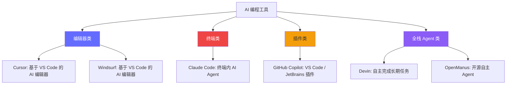
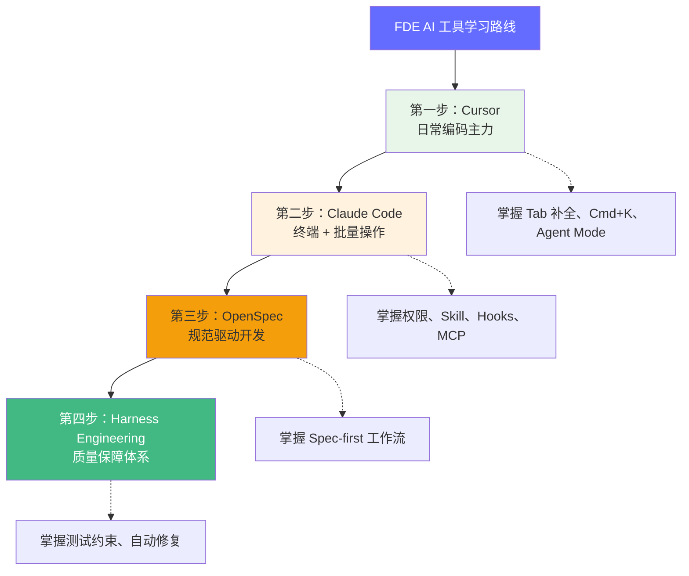

# AI 编程工具对比

> Cursor vs Claude Code vs GitHub Copilot vs Windsurf，FDE 应该选哪个？

---

## 工具定位速览

---

## 详细对比

### Cursor

| 维度 | 说明 |
|------|------|
| **定位** | 独立的 AI 代码编辑器 |
| **基础** | VS Code Fork |
| **核心优势** | Tab 补全 + Cmd+K + Agent Mode 三合一 |
| **代码库理解** | 深度索引，支持 @Codebase 全文搜索 |
| **多文件编辑** | Agent Mode 支持 |
| **价格** | Pro $20/月，Business $40/月/人 |
| **适合** | 日常编码、源码阅读、文档编写 |

### Claude Code

| 维度 | 说明 |
|------|------|
| **定位** | 终端内 AI 编程 Agent |
| **基础** | 独立 CLI 工具 |
| **核心优势** | 文件系统直接访问 + 45+ 内置工具 |
| **代码库理解** | 通过文件读取，无专门索引 |
| **多文件编辑** | 原生支持，批量操作能力强 |
| **价格** | 按 API 用量计费 |
| **适合** | 批量修改、DevOps、脚本生成 |

### GitHub Copilot

| 维度 | 说明 |
|------|------|
| **定位** | 代码补全插件 |
| **基础** | VS Code / JetBrains / Vim 插件 |
| **核心优势** | 无缝集成现有编辑器 |
| **代码库理解** | @workspace 引用 |
| **多文件编辑** | Agent Mode（有限） |
| **价格** | Pro $10/月，Business $19/月/人 |
| **适合** | 不想换编辑器、轻度 AI 辅助 |

### Windsurf

| 维度 | 说明 |
|------|------|
| **定位** | 独立的 AI 代码编辑器 |
| **基础** | VS Code Fork |
| **核心优势** | Cascade（深度代码流）、多模型切换 |
| **代码库理解** | 代码库索引 |
| **多文件编辑** | 支持 |
| **价格** | 免费 + Pro $15/月 |
| **适合** | 想尝试 Cursor 的替代方案 |

---

## 适用场景矩阵

| 场景 | Cursor | Claude Code | Copilot | Windsurf |
|------|--------|-------------|---------|----------|
| **日常编码** | ★★★★★ | ★★★ | ★★★★ | ★★★★ |
| **源码阅读** | ★★★★★ | ★★★ | ★★★ | ★★★★ |
| **批量重命名** | ★★★ | ★★★★★ | ★★ | ★★★ |
| **脚本生成** | ★★★ | ★★★★★ | ★★ | ★★★ |
| **DevOps/CI** | ★★★ | ★★★★★ | ★★ | ★★★ |
| **AI 文档编写** | ★★★★★ | ★★★★ | ★★★ | ★★★★ |
| **大项目重构** | ★★★★ | ★★★★★ | ★★★ | ★★★★ |
| **新手上手** | ★★★★★ | ★★★ | ★★★★★ | ★★★★ |

---

## 性能对比

### 代码生成质量

根据 2026 年初的社区 benchmark：

| 工具 | 模型 | 代码质量 | 上下文理解 | 多文件能力 |
|------|------|---------|-----------|-----------|
| Cursor | Claude 3.5 Sonnet / Opus | ★★★★★ | ★★★★★ | ★★★★ |
| Claude Code | Claude 3.5/4 Sonnet / Opus | ★★★★★ | ★★★★ | ★★★★★ |
| Copilot | GPT-4o / Claude 3.5 | ★★★★ | ★★★★ | ★★★ |
| Windsurf | Claude 3.5 / GPT-4 | ★★★★ | ★★★★ | ★★★★ |

**关键发现**：
- Cursor 和 Claude Code 都使用 Claude 系列模型，代码质量接近
- Cursor 的优势在于**图形界面 + 深度索引**
- Claude Code 的优势在于**终端集成 + 批量操作**
- Copilot 的优势在于**零学习成本**

---

## 价格对比

| 工具 | 免费额度 | Pro 价格 | 企业价格 | API 用量 |
|------|---------|---------|---------|---------|
| Cursor | 50 次慢速请求/月 | $20/月 | $40/月/人 | 不限 |
| Claude Code | 无（按 API 计费） | - | - | 按 Anthropic API 定价 |
| Copilot | 有限 | $10/月 | $19/月/人 | 不限 |
| Windsurf | 免费基础额度 | $15/月 | - | 不限 |

**性价比建议**：
- 个人学习：Cursor Pro（$20/月，性价比最高）
- 团队开发：Cursor Business（$40/月/人，统一配置）
- 批量操作：Claude Code（按量付费，灵活）

---

## FDE 学习推荐路线

**分阶段说明**：

| 阶段 | 工具 | 学习目标 | 对应文档 |
|------|------|---------|---------|
| L1 基础 | Cursor | Tab 补全、Chat、Cmd+K | [Cursor 教程](/tools/cursor-guide) |
| L2 进阶 | Cursor + Claude Code | Agent Mode、批量操作 | [Claude Code 指南](/tools/claude-code-guide) |
| L3 高级 | OpenSpec + AI | Spec-first 开发 | [OpenSpec 工作流](/tools/openspec-workflow) |
| L4 专家 | Harness Engineering | 测试约束、自动化 | [Harness Engineering](/agentic-ai/04-harness-engineering) |

---

## 常见误区

### ❌ "一个工具就够了"

**正解**：不同场景用不同工具。
- 写代码用 Cursor
- 批量操作用 Claude Code
- 团队协作看 Copilot（如果公司已有 GitHub Enterprise）

### ❌ "AI 生成的代码不用审查"

**正解**：Karpathy 本人也从"完全信任"转向了"需要审查"。
- 所有 AI 生成的代码必须审查
- 关键逻辑必须手写测试
- Harness Engineering 是保障

### ❌ "免费版功能不够学"

**正解**：Cursor Pro $20/月的成本低于一顿饭钱，但带来的效率提升是 2-5 倍。对于准备 FDE 面试的投入产出比极高。

---

## 总结

| 如果你是... | 推荐工具 | 理由 |
|------------|---------|------|
| FDE 初学者 | Cursor Pro | 学习曲线平缓，功能全面 |
| 终端重度用户 | Claude Code | 无缝集成终端工作流 |
| 公司已有 GitHub Enterprise | Copilot | 零额外成本 |
| 想尝试新工具 | Windsurf | 免费额度充足 |

---

*上一节：[Claude Code 使用指南](/tools/claude-code-guide) | 下一节：[Karpathy 的 AI 生码观点](/tools/karpathy-ai-coding)*
