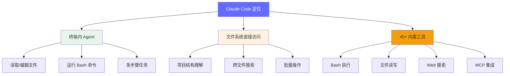
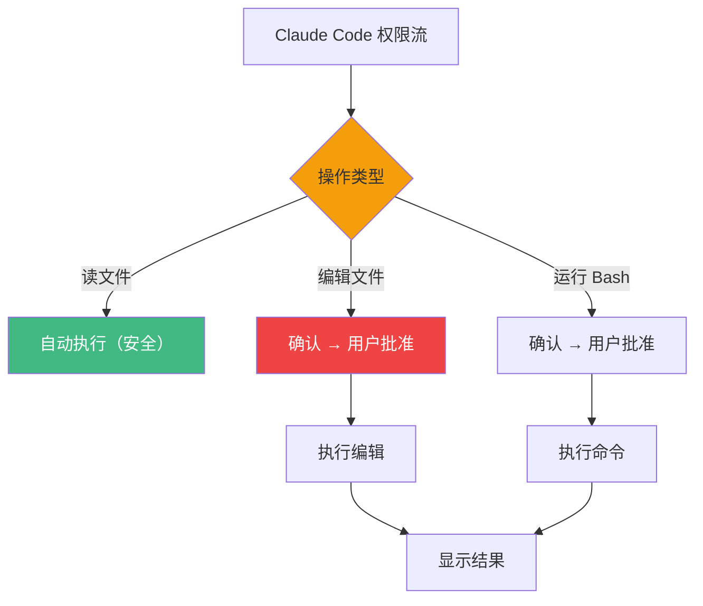
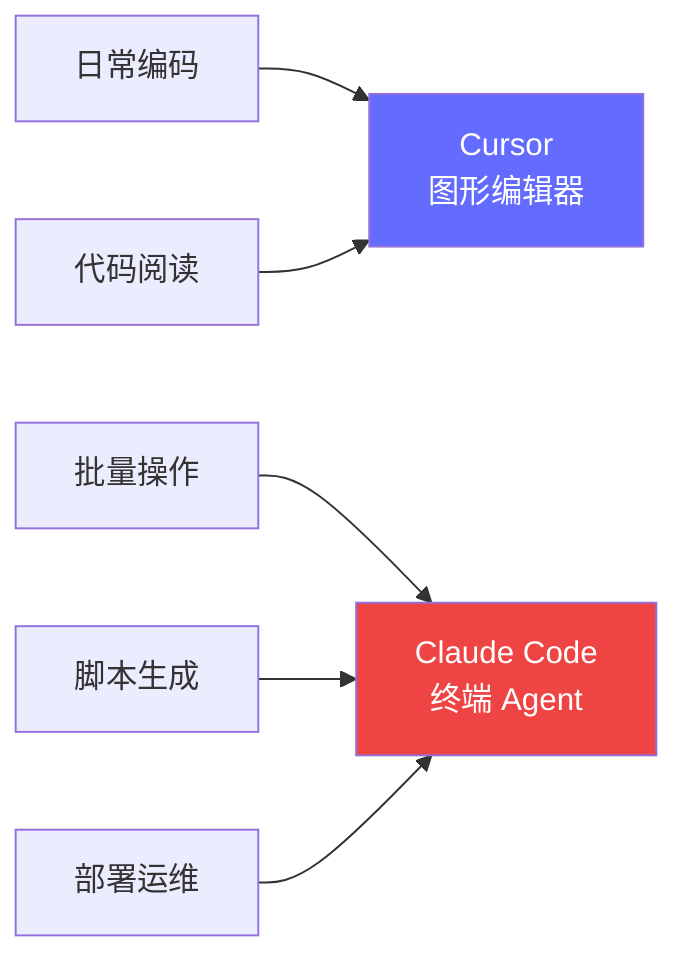

# Claude Code 使用指南

> 终端内的 AI 编程助手。与 Cursor（图形编辑器）不同，Claude Code 直接在终端中工作，适合脚本、批量操作、和已有项目的快速迭代。

**官网**: https://claude.ai/code

---

## 什么是 Claude Code

Claude Code 是 Anthropic 出品的**终端内 AI 编程助手**。它不是一个编辑器，而是一个运行在终端中的 Agent，可以读取、编辑、执行代码。



**与 Cursor 的核心区别**：

| 维度 | Cursor | Claude Code |
|------|--------|-------------|
| **形态** | 独立图形编辑器 | 终端内 CLI 工具 |
| **交互方式** | 图形界面 + Chat | 命令行对话 |
| **优势** | 代码编辑体验好 | 文件操作、脚本执行灵活 |
| **适合场景** | 日常编码、阅读源码 | 批量修改、DevOps、CI/CD |
| **权限模型** | 编辑确认 | 命令确认（可配置自动） |

**什么时候用 Claude Code**：
- 批量重命名文件/变量
- 生成和运行脚本（数据处理、benchmark）
- CI/CD pipeline 编写
- 配置文件修改（Dockerfile、K8s yaml）
- 代码库级别的搜索和理解

---

## 快速上手

### 安装

```bash
# npm 安装
npm install -g @anthropic-ai/claude-code

# 或直接使用 npx
npx @anthropic-ai/claude-code
```

> 📷 [截图标注] Claude Code 启动界面
> 应该包含：
> - 终端窗口中的欢迎信息
> - 项目路径确认
> - 权限提示

### 首次对话

```bash
# 进入项目目录
cd /path/to/your/project

# 启动 Claude Code
claude

# 对话示例
> 这个项目的结构是什么？
# Claude Code 会读取文件树，分析项目结构

> 把所有 Python 文件的 print 改成 logging
# Claude Code 会列出修改计划，确认后执行
```

### 权限模型

Claude Code 有三层权限：

| 权限级别 | 行为 | 适用场景 |
|---------|------|---------|
| **Ask** | 每次操作前确认 | 默认，最安全 |
| **Auto-approve** | 自动批准安全操作 | 信任环境，加速开发 |
| **Dangerously-skip-approval** | 跳过所有确认 | 仅用于 CI/CD，风险高 |



**安全建议**：
- 日常开发用 `Ask` 模式
- 批量编辑用 `--dangerously-skip-approval` + 代码审查
- 生产环境永远不要跳过审批

---

## 核心功能

### 1. `/` 命令系统

Claude Code 内置多个斜杠命令：

| 命令 | 功能 | 示例 |
|------|------|------|
| `/help` | 帮助信息 | 查看所有可用命令 |
| `/clear` | 清空对话历史 | 开始新话题 |
| `/compact` | 压缩上下文 | 对话太长，释放 token 预算 |
| `/cost` | 查看本次会话消耗 | 监控 API 用量 |
| `/doctor` | 诊断问题 | 排查配置/权限问题 |
| `/init` | 初始化项目规则 | 生成 CLAUDE.md |
| `/terminal-setup` | 终端集成设置 | 配置 shell 集成 |

---

### 2. Skill 系统

Skill 是 Claude Code 的可复用能力模块。用户可以在 `.claude/skills/` 目录下定义自定义 Skill。

```
.claude/
└── skills/
    ├── job-collector.md      # 岗位采集 Skill（已存在）
    ├── deploy-vllm.md        # 自定义：vLLM 部署流程
    └── benchmark-runner.md   # 自定义：跑 benchmark
```

**定义一个 Skill**：
```markdown
<!-- .claude/skills/deploy-vllm.md -->
# vLLM 部署 Skill

当用户请求部署 vLLM 服务时：
1. 检查 GPU 可用性：nvidia-smi
2. 生成部署配置：tensor_parallel_size、max_model_len
3. 创建 systemd service 文件
4. 启动并验证健康检查
```

**使用 Skill**：
```
> /deploy-vllm
# Claude Code 按照定义的流程执行
```

---

### 3. Hooks 系统

Hooks 是在特定事件触发时自动执行的脚本或检查。

```json
// .claude/settings.json
{
  "hooks": {
    "PreToolUse": {
      "command": "echo '即将执行工具，请确认'"
    },
    "PostToolUse": {
      "command": "echo '工具执行完成'"
    }
  }
}
```

**常用 Hooks**：
- `PreToolUse`：在工具执行前验证参数
- `PostToolUse`：在工具执行后检查结果
- `UserPromptSubmit`：在用户发送消息前预处理

---

### 4. MCP 集成（Model Context Protocol）

Claude Code 支持 MCP 协议，可以连接外部数据源和工具。

```json
// .claude/settings.json
{
  "mcpServers": {
    "filesystem": {
      "command": "npx",
      "args": ["-y", "@modelcontextprotocol/server-filesystem", "/path/to/project"]
    },
    "github": {
      "command": "npx",
      "args": ["-y", "@modelcontextprotocol/server-github"]
    }
  }
}
```

**MCP 应用场景**：
- 连接 GitHub API → 自动创建 PR、查看 Issue
- 连接数据库 → 查询和验证数据
- 连接监控面板 → 检查部署健康度

---

### 5. 记忆系统

Claude Code 有文件化的记忆系统，位于 `.claude/projects/*/memory/`。

```
.claude/projects/
└── memory/
    ├── user.md          # 用户偏好（角色、知识水平）
    ├── feedback.md      # 行为反馈（"不要做 X"、"保持做 Y"）
    ├── project.md       # 项目信息（目标、进度、决策）
    └── reference.md     # 外部资源链接
```

**与 CLAUDE.md 的区别**：
- `CLAUDE.md`：项目级配置（静态规则）
- `memory/`：个人级记忆（动态学习）

---

## FDE 实战场景

### 场景 1：用 Claude Code 生成推理优化代码

```
> 写一个 Python 脚本，对比 vLLM 和 TensorRT-LLM 的推理延迟：
> - 加载同一个 7B 模型
> - 测试 batch_size = [1, 4, 8, 16, 32]
> - 测量 TTFT 和 TPOT
> - 输出 CSV 结果
```

**Claude Code 会**：
1. 检查当前目录结构
2. 生成完整的 benchmark 脚本
3. 安装必要的依赖
4. 运行脚本（需确认）
5. 分析结果

---

### 场景 2：用 Claude Code 管理 Docusaurus 站点

```
> 这个 Docusaurus 项目新增了 docs-tools/ 目录，
> 请在 sidebars.js 中添加对应的侧边栏配置。
```

**Claude Code 会**：
1. 读取 sidebars.js
2. 理解现有结构
3. 读取 docs-tools/ 目录下的所有 .md 文件
4. 生成对应的侧边栏配置
5. 执行编辑

> 这个任务我们之前手动做过，Claude Code 可以自动化这类重复操作。

---

### 场景 3：用 Claude Code 跑批量脚本

```
> 把 docs/ 目录下所有 .md 文件中的 "/01-ai-basics/" 替换为 "/01-basics/"，
> 列出所有被修改的文件。
```

**Claude Code 会**：
1. 用 grep 找到所有包含旧路径的文件
2. 逐个用 sed 替换
3. 列出修改清单
4. 等待确认

---

## 与 Cursor 的对比与协同

**最佳实践**：两个工具配合使用。



**推荐工作流**：
1. **Cursor**：日常写代码、阅读源码、写文档
2. **Claude Code**：批量重命名、CI 配置、脚本生成、文件搜索
3. 两者共享同一个 `.cursorrules` / `CLAUDE.md` 配置

---

## 安全最佳实践

### ⚠️ 永远不要做的

- 在生产服务器上跳过审批
- 让 Claude Code 直接修改数据库
- 不审查就提交 AI 生成的 commit

### ✅ 推荐的做法

- 用 `--dry-run` 先预览操作
- 所有 AI 生成的代码先跑测试
- 敏感操作（删除文件、force push）手动执行
- 定期清理 `.claude/` 中的过期记忆

---

## 面试视角

| 面试问题 | Claude Code 相关回答 |
|---------|-------------------|
| "你在终端里怎么用 AI？" | Claude Code，适合批量操作和脚本生成，与 Cursor 互补 |
| "怎么保证 AI 生成的代码可靠？" | 1. Ask 模式逐条确认 2. 单元测试验证 3. Harness Engineering 约束 |
| "AI 编程工具怎么集成到团队工作流？" | CLAUDE.md 统一团队规范，Skill 系统封装常用流程，MCP 连接 CI/CD |

---

*上一节：[Cursor 使用教程](/tools/cursor-guide) | 下一节：[AI 编程工具对比](/tools/ai-coding-comparison)*
