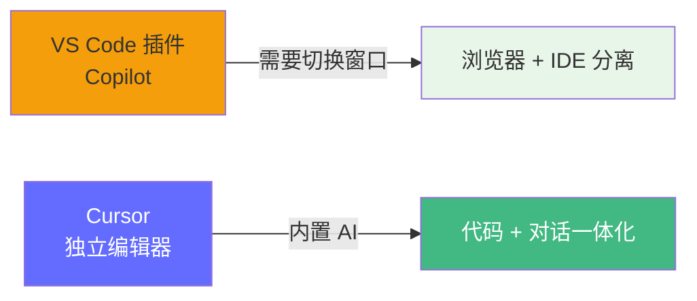
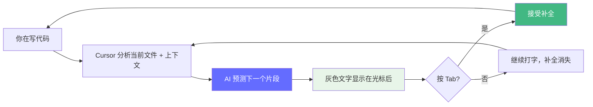
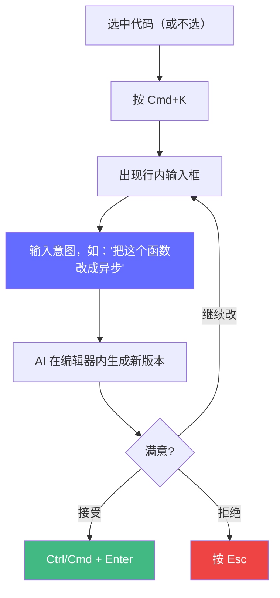
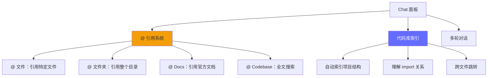
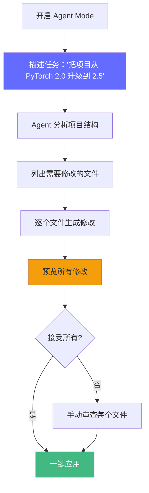
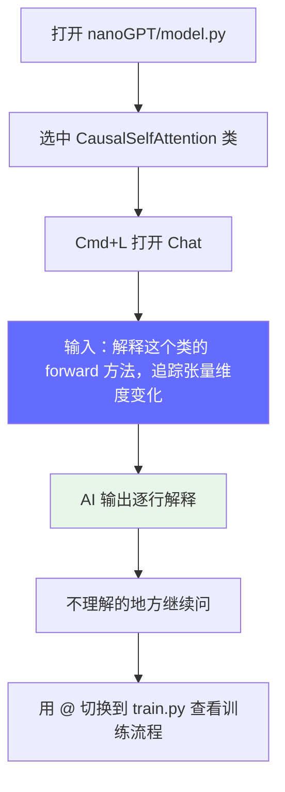

# Cursor 使用教程

> AI 代码编辑器的核心功能和高效使用技巧。Karpathy 在 2025 年称 Cursor Tab 补全为他的 "bread & butter"，75% 的代码靠它完成。

**官网**: https://cursor.com

---

## 什么是 Cursor

Cursor 是一个基于 VS Code 的 AI 代码编辑器。它不是 VS Code 插件，而是一个**独立的编辑器**，完全兼容 VS Code 插件生态。



**核心优势**：
- **深度代码理解**：索引整个代码库，不只是当前文件
- **原生集成**：AI 不是插件，而是编辑器的核心能力
- **多文件编辑**：Agent Mode 可以同时修改多个文件
- **上下文感知**：自动理解项目结构、依赖关系

---

## 界面概览

> 📷 [截图标注] Cursor 主界面
> 应该包含以下区域：
> - 左侧：文件树（Explorer）
> - 中央：代码编辑器
> - 右侧：Chat 面板（Cmd+L 打开）
> - 底部：终端

```
┌─────────────────────────────────────────────────────────┐
│  Cursor 主界面布局                                      │
├──────────┬─────────────────────────┬────────────────────┤
│  文件树   │    代码编辑器区域        │   Chat 面板        │
│          │                         │   (Cmd+L)          │
│  src/    │   import torch          │   Q: 解释这段代码   │
│  model.py│   class GPT(nn.Module): │   A: 这是一个...   │
│  train.py│       ...               │                    │
│  sample.py│                        │   [Tab 补全提示]   │
│          │                         │   按 Tab 接受      │
│          │                         │                    │
│          │   ┌─────────────────┐   │                    │
│          │   │ Cmd+K 行内编辑   │   │   [Agent Mode 开关]│
│          │   │ 在光标处直接生成  │   │                    │
│          │   └─────────────────┘   │                    │
├──────────┴─────────────────────────┴────────────────────┤
│  终端 (Cmd+`)                                            │
│  $ python train.py                                      │
└─────────────────────────────────────────────────────────┘
```

**关键区域标注**：
- ① **Tab 补全提示**：编辑时灰色文字显示 AI 建议
- ② **Cmd+K 行内编辑**：选中代码后按 Cmd+K，直接在编辑器内生成
- ③ **Chat 面板**：右侧对话窗口，支持代码库上下文
- ④ **Agent Mode 切换**：右上角开关，切换到多文件编辑模式

---

## 核心功能详解

### 1. Tab 补全（Bread & Butter）

这是 Cursor 最常用的功能，也是 Karpathy 最推崇的功能。

**工作原理**：


**使用技巧**：
- 写注释描述意图 → Tab 自动补全代码
- 定义函数名 → Tab 自动补全函数体
- 写 import 语句 → Tab 自动补全后续导入
- 写类方法 → Tab 自动补全方法签名

**示例**：
```python
# 你写的注释：# calculate attention scores
# Cursor 的 Tab 补全（灰色显示）：
def calculate_attention_scores(query, key, head_size):
    """Calculate scaled dot-product attention scores."""
    scores = torch.matmul(query, key.transpose(-2, -1))
    scores = scores / math.sqrt(head_size)
    return scores
```

**面试考点**：Karpathy 在 2025 年 8 月表示，他 ~75% 的代码来自 Cursor Tab 补全。这不是"偷懒"，而是**把心智从语法细节解放到架构设计**。

---

### 2. Cmd+K 行内编辑

当 Tab 补全不够精确时，用 Cmd+K 直接描述你的意图。

**操作流**：


**常用场景**：
- "给这个函数加类型注解"
- "把这段代码改成 PyTorch 2.0 风格"
- "添加错误处理"
- "重构为函数式"
- "写单元测试"

---

### 3. Chat 侧边栏（Cmd+L）

Chat 是 Cursor 的对话窗口，支持**代码库级别的上下文理解**。

**核心能力**：


**实战示例**：
```
你：@Codebase 这个项目的训练流程是怎么组织的？

AI：（分析整个项目后回答）
训练流程在 train.py 中组织：
1. 数据加载：get_batch() 从 shakespeare_char 目录读取
2. 前向传播：model(x, y) 返回 logits 和 loss
3. 反向传播：scaler.scale(loss).backward()
4. 梯度裁剪：clip_grad_norm_
5. 参数更新：scaler.step(optimizer)
...
```

---

### 4. Agent Mode（多文件编辑）

Agent Mode 是 Cursor 的高级功能，可以**同时修改多个文件**。

**对比 Tab/Cmd+K/Agent 三种模式**：

| 维度 | Tab 补全 | Cmd+K 行内编辑 | Agent Mode |
|------|---------|---------------|------------|
| **编辑范围** | 当前光标位置 | 选中区域 | 整个项目 |
| **文件数量** | 1 个 | 1 个 | 多个 |
| **交互方式** | 按键接受 | 意图描述 | 对话驱动 |
| **适用场景** | 写代码时自动补全 | 修改特定代码片段 | 大型重构、跨文件修改 |
| **控制力度** | 最高 | 中等 | 最低（但效率最高） |

**Agent Mode 使用流**：


**⚠️ 注意事项**：
- Agent Mode 可能误改不相关的文件 → 务必预览所有修改
- 大项目可能消耗大量 token → 先用 @ 引用缩小范围
- 适合明确任务，不适合探索性开发

---

### 5. @ 符号引用系统

@ 是 Cursor 的上下文指定机制，是精确控制 AI 行为的关键。

**常用 @ 类型**：

| @ 符号 | 作用 | 示例 |
|--------|------|------|
| `@Codebase` | 全文搜索整个项目 | `@Codebase KV Cache 在哪里实现的？` |
| `@文件夹` | 引用特定目录 | `@src/models 这些模型有什么共同点？` |
| `@文件.py` | 引用特定文件 | `@model.py 解释 CausalSelfAttention` |
| `@Docs` | 引用官方文档 | `@PyTorch docs 怎么实现自定义 autograd Function？` |
| `@Terminal` | 引用终端输出 | `@Terminal 这个错误怎么修？` |
| `@Web` | 搜索网络 | `@Web vLLM 最新版本是什么？` |

---

## FDE 实战场景

### 场景 1：用 Cursor 阅读 nanoGPT 源码

**目标**：快速理解 nanoGPT 的模型架构。



**推荐提问模板**：
```
@model.py 请从 FDE 的视角解释：
1. CausalSelfAttention 的 QKV 是怎么计算的？
2. 每一步的张量维度变化是什么？
3. 这和工业级推理引擎（如 vLLM）的实现有什么不同？
```

---

### 场景 2：用 Cursor 部署 vLLM 服务

**目标**：快速搭建 vLLM 推理服务。

**操作流**：
```python
# 1. 创建文件 deploy.py
# 2. 按 Cmd+K，输入：

"""写一个 vLLM 部署脚本：
- 加载 Qwen2.5-7B 模型
- 启用 FP16
- 设置 max_model_len=4096
- 提供 OpenAI 兼容 API
"""

# 3. AI 生成：
from vllm import LLM, SamplingParams
from vllm.entrypoints.openai.api_server import run_server

llm = LLM(
    model="Qwen/Qwen2.5-7B-Instruct",
    dtype="float16",
    max_model_len=4096,
    tensor_parallel_size=1,  # 单卡
)

# 启动 OpenAI 兼容 API 服务
# ...

# 4. 审查、微调、运行
```

---

### 场景 3：用 Cursor 写技术文档

**目标**：用 Cursor 辅助写 Mermaid 图表和技术文档。

```markdown
# 1. 打开 .md 文件
# 2. 按 Cmd+K，输入：

"""画一个 Transformer 推理两阶段的 Mermaid 流程图：
- Prefill 阶段：一次性处理所有 prompt token
- Decode 阶段：自回归生成，每次一个 token
- 标注两个阶段的计算特点和显存占用
"""

# 3. AI 生成 Mermaid 代码：
# ```mermaid
# flowchart LR
#     A["Prompt: Hello"] -->|Prefill| B["一次性处理所有 token"]
#     B -->|Decode| C["自回归: 输出 ' world'"]
#     C -->|Decode| D["自回归: 输出 '!'"]
#     B -.-> E["计算密集, 显存: 权重+激活"]
#     C -.-> F["显存密集, 显存: 权重+KV Cache"]
# ```
```

---

## 高效使用技巧

### .cursorrules 配置

在项目根目录创建 `.cursorrules` 文件，定义 AI 的行为规范：

```
# FDE 项目规则

## 代码风格
- Python 用类型注解
- 函数必须有 docstring
- 优先使用 PyTorch 2.0+ API

## 架构偏好
- 推理优化相关的代码必须包含 profiling
- 所有 GPU 相关操作必须检查 CUDA 可用性
- 模型加载必须支持 tensor_parallel

## 回答风格
- 解释技术概念时，先从面试视角给出要点
- 涉及性能时，给出具体的数据和 benchmark
- 不确定时，明确标注 "不确定"
```

**面试考点**：.cursorrules 本质上是 **Context Engineering** 的实践 —— 通过规则文件给 AI 提供精确的上下文约束。

---

### 常用快捷键速查

| 快捷键 | 功能 | 场景 |
|--------|------|------|
| `Tab` | 接受 AI 补全 | 写代码时 |
| `Esc` | 拒绝 AI 补全 | 补全不满意时 |
| `Cmd+K` | 行内编辑 | 修改特定代码 |
| `Cmd+L` | 打开 Chat | 提问/对话 |
| `Cmd+I` | 快速 AI 操作 | 右键菜单替代 |
| `Cmd+Shift+K` | 生成终端命令 | 运维操作 |
| `@Codebase` | 全文搜索 | 跨文件查询 |

---

## 面试视角

| 面试问题 | Cursor 相关回答 |
|---------|----------------|
| "你平时怎么提升开发效率？" | 用 Cursor Tab 补全减少样板代码，用 Agent Mode 做大型重构，.cursorrules 约束 AI 行为 |
| "AI 会替代程序员吗？" | AI 替代的是语法层面的工作，架构设计、系统思考、质量判断这些能力反而更重要（参考 Karpathy 的 Agentic Engineering 观点） |
| "你怎么保证 AI 生成的代码质量？" | 1. 代码审查（逐行检查 AI 输出）2. 单元测试覆盖 3. Harness Engineering 约束（见 Harness Engineering 章节） |
| "你用过哪些 AI 编程工具？" | Cursor（主力）、Claude Code（终端脚本）、对比过 Copilot，详见 [工具对比](/tools/ai-coding-comparison) |

---

*上一节：[工具教程总览](/tools/) | 下一节：[Claude Code 使用指南](/tools/claude-code-guide)*
