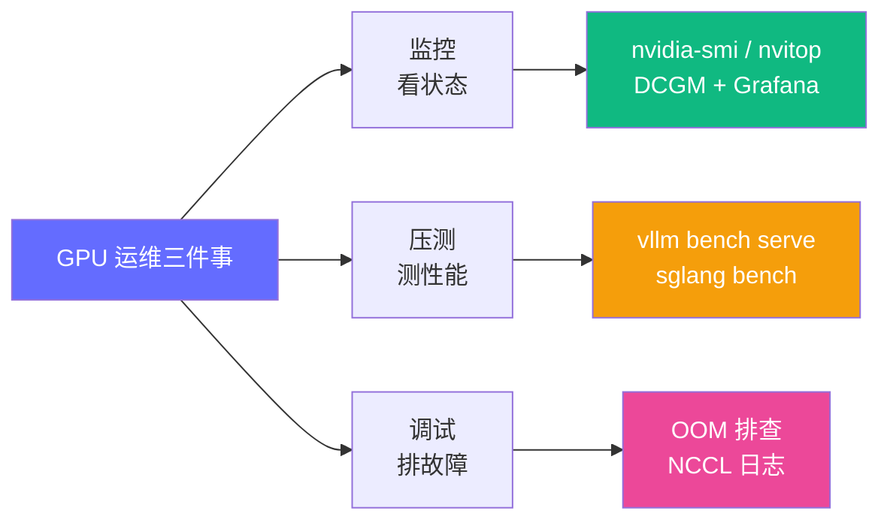

# GPU / 推理服务运维工具链

> FDE 日常运维速查：监控、压测、调试三件套。vLLM 的完整部署流程在[动手实验](/09-labs/vllm-7b-deploy)中，本页只做工具选型与命令速查。

---

## 工具全景



---

## 一、监控

| 工具 | 场景 | 命令速查 |
|---|---|---|
| `nvidia-smi` | 单次看卡 | `watch -n 1 nvidia-smi`；`nvidia-smi dmon -s pucm` 流式看利用率 |
| `nvitop` | 交互式进程级监控（推荐替代 watch） | `pip install nvitop && nvitop` |
| `dcgm-exporter` | 生产监控（容器/K8s） | 配合 Prometheus + Grafana，官方 dashboard ID 12239 |
| `nvidia-smi nvlink` | 多卡拓扑 | `nvidia-smi topo -m` 看 TP 组卡间互联 |

**关键指标**：GPU 利用率（≠ 显存占用）、SM 占用率、功耗墙、ECC 错误、显存碎片。

---

## 二、压测

```bash
# vLLM 官方压测（新版本内置 bench 子命令）
vllm bench serve \
  --model Qwen/Qwen2.5-7B-Instruct \
  --dataset-name random --random-input-len 512 --random-output-len 256 \
  --num-prompts 200

# 核心输出指标：
#   TTFT  —— 首 token 延迟（交互体验）
#   TPOT / ITL —— 每 token 延迟（生成流畅度）
#   Throughput —— 整体吞吐（成本效率）
```

| 工具 | 适用 |
|---|---|
| `vllm bench serve` | vLLM 服务标准压测 |
| `sglang bench` | SGLang 服务 / 对比测试 |
| `genai-perf`（NVIDIA） | 多后端通用（TRT-LLM 等） |

---

## 三、调试速查

### OOM（显存溢出）

```bash
# vLLM 常用三参数，按顺序排查：
--gpu-memory-utilization 0.90   # ① 显存预算（KV Cache 占比）
--max-model-len 8192            # ② 上下文上限（直接决定 KV Cache 峰值）
--max-num-seqs 64               # ③ 并发序列数
```

深入排查思路见 [OOM 故障排查实验](/09-labs/oom-troubleshooting)。

### NCCL / 多卡通信

```bash
NCCL_DEBUG=INFO                 # 打开 NCCL 日志
NCCL_P2P_DISABLE=1              # P2P 异常时降级排查（性能会降，仅诊断用）
```

### 服务健康

```bash
curl localhost:8000/health      # vLLM 就绪探针
curl localhost:8000/v1/models   # 模型加载确认
```

---

## 选型建议

- **本地/单机**：`nvitop` + `vllm bench serve` 够用
- **生产/K8s**：DCGM exporter + Prometheus + Grafana 面板，压测纳入上线前 CI
- **多卡推理**：先看 `topo -m` 确认 NVLink 拓扑再定 TP 并行度

## 相关页面

- [Docker GPU 环境搭建](/tools/docker-gpu-setup) —— 本工具链的运行前提
- [vLLM 7B 部署实验](/09-labs/vllm-7b-deploy) —— 完整部署流程
- [性能调优实验](/09-labs/batching-tuning) —— Batching 与吞吐调优
