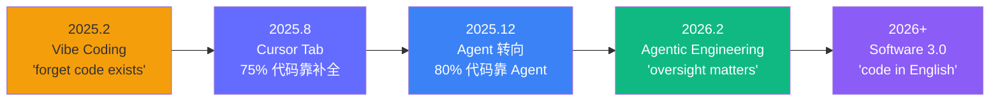
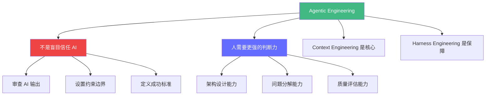

# Karpathy 的 AI 生码观点

> Andrej Karpathy 是 "Vibe Coding" 的发明者，也是 AI 编程领域最有影响力的声音之一。他的观点从 2025 年到 2026 年经历了三次重大转变。

---

## 核心概念速览



---

## 1. Vibe Coding（2025 年 2 月）

**起源**：Karpathy 在 X (Twitter) 上发布了一条 viral tweet：

> *"There's a new kind of coding I call 'vibe coding', where you fully give in to the vibes, embrace exponentials, and forget that the code even exists."*

**核心定义**：
```
Vibe Coding = "I just see stuff, say stuff, run stuff, and copy-paste stuff, and it mostly works."
```

**特征**：
- 不关心代码细节，只看结果
- 用自然语言描述意图，AI 生成代码
- 遇到错误就告诉 AI 修
- 适合个人项目、原型验证

**影响力**：这个词在 2025 年被选为 **Collins Dictionary 年度词汇**。

**Karpathy 后来的反思**（2026 年初）：
> *"Vibe coding is fine for prototypes and personal tools, but serious teams need something more rigorous."*

---

## 2. Cursor Tab 补全阶段（2025 年 8 月）

Karpathy 在 2025 年 8 月分享了他的实际工作流：

| 编码方式 | 占比 | 说明 |
|---------|------|------|
| **Cursor Tab 补全** | ~75% | "bread & butter"，写代码时的自动补全 |
| **手动编写** | ~15% | 核心逻辑、关键算法 |
| **Agent 委托** | ~10% | 重复性任务（测试、文档） |

**为什么是 Tab 而不是 Agent**：
- Tab 补全保留了人的**控制力**和**判断力**
- Agent 在那个时候还经常跑偏
- "writing code with tab completion felt more natural than full agent delegation"

**面试考点**：这体现了 Karpathy 对**人机协作平衡**的理解 —— 不是完全交给 AI，也不是完全手写，而是找到中间态。

---

## 3. Agent 转向（2025 年 11-12 月）

这是 Karpathy 最大的一次观点转变。

**转折点**：2025 年 11-12 月，他从 ~80% 手动编码转向 ~80% AI Agent 生成。

**关键数据**：
- 到 2026 年 2 月，他已经 **3 个月没有手写过代码**
- 他的项目（llm.c 等）80% 的代码由 AI Agent 生成
- 他承认："I am starting to atrophy my ability to write code by hand"

**2025 年度总结**（bearblog）：
- "Cursor's most notable contribution was demonstrating a new layer of LLM apps through **context engineering**"
- "the idea that managing context window is the new paradigm"

**面试考点**：一个顶级工程师从"手写为主"到"Agent 为主"的转变，说明了工具能力的跃升，而不是程序员能力的贬值。

---

## 4. Agentic Engineering（2026 年 2 月）

Karpathy 在 2026 年 2 月提出了新范式：**Agentic Engineering（智能体工程）**。



**核心观点**：
> *"The agentic engineer does not blindly trust the AI. They understand the code well enough to know when it's wrong."*

**与 Harness Engineering 的关系**：
- Mitchell Hashimoto 命名的 "Harness Engineering" 侧重**约束与反馈系统**
- Karpathy 的 "Agentic Engineering" 侧重**人的判断力提升**
- 两者互补：Harness 是系统层面的保障，Agentic 是人层面的能力

---

## 5. Software 3.0 愿景

Karpathy 在 Sequoia Ascent 2026 上提出了 **Software 3.0**：

| 代 | 范式 | 编程语言 | 执行方式 |
|----|------|---------|---------|
| Software 1.0 | 传统编程 | C/Java/Python | CPU 执行编译代码 |
| Software 2.0 | 神经网络 | 梯度下降 + 数据 | GPU 训练模型 |
| **Software 3.0** | **自然语言编程** | **英语/中文** | **AI 模型解释并执行** |

**Software 3.0 的特征**：
- 程序用自然语言描述（Spec）
- AI 模型负责翻译为可执行代码
- 人类负责审查和优化
- 迭代速度比传统开发快 10-100 倍

---

## 对 FDE 学习者的启示

### 1. 代码能力不是贬值，而是升值

```
过去：写代码的速度决定产出
现在：判断代码质量的能力决定产出

不是"不用学代码了"，
而是"更需要懂代码才能判断 AI 生成的对不对"。
```

### 2. Context Engineering 是核心技能

```
给 AI 的上下文质量，直接决定输出质量。

Context Engineering 包括：
- 项目结构文档（CLAUDE.md / .cursorrules）
- 明确的 Spec（OpenSpec）
- 约束和边界（Harness Engineering）
- 反馈循环（测试 + 评估）
```

### 3. Harness Engineering 是安全保障

```
AI Agent = Model + Harness

没有 Harness 的 Agent 就像没有刹车的赛车 ——
可能很快，但不可靠。

FDE 需要掌握的 Harness 技能：
- 自动化测试编写
- CI/CD pipeline 配置
- 代码质量门禁
- 渐进式部署
```

---

## 面试应用

### 问题："AI 会替代程序员吗？"

**满分回答框架**：

```
1. 引用 Karpathy 的观点演进：
   - 从 Vibe Coding 到 Agentic Engineering
   - 他本人从 80% 手写 → 80% Agent 生成 → 但仍需要深度审查

2. 给出判断：
   - 替代的是"语法层面"的工作（样板代码、模板）
   - 但"架构设计"、"问题分解"、"质量判断"这些能力反而更重要

3. 结合 FDE 岗位：
   - FDE 的核心价值不是写推理代码，而是设计推理系统
   - AI 可以生成 vLLM 配置，但不能决定该用 vLLM 还是 TRT-LLM
   - AI 可以写 benchmark 脚本，但不能设计 benchmark 指标

4. 结论：
   - 不是"AI vs 程序员"，而是"会用 AI 的程序员 vs 不会用的"
   - Karpathy 的 Agentic Engineering 就是这个意思
```

### 问题："你平时怎么用 AI 提升开发效率？"

**满分回答框架**：

```
1. 日常编码：Cursor Tab 补全（减少样板代码）
2. 批量操作：Claude Code（文件重命名、CI 配置）
3. 规范驱动：OpenSpec（先写 Spec，再让 AI 执行）
4. 质量保障：Harness Engineering（测试 + 约束 + 反馈）

引用 Karpathy 的数据：75% 的代码可以通过 AI 辅助完成，
但剩下 25% 的架构决策和质量判断，是人的核心价值。
```

---

*上一节：[OpenSpec 项目开发](/tools/openspec-workflow) | [返回工具教程总览](/tools/)*
