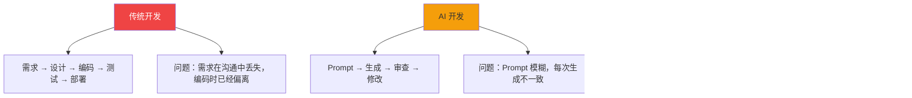
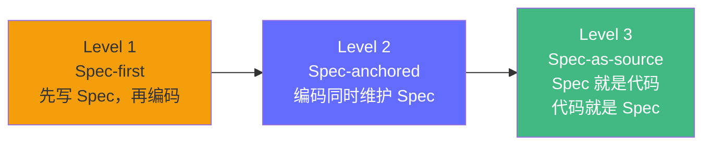
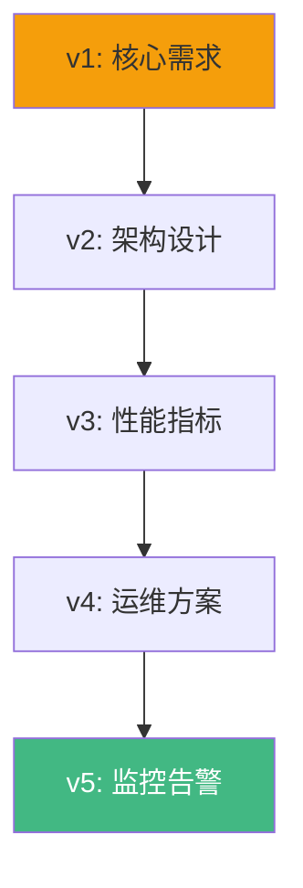
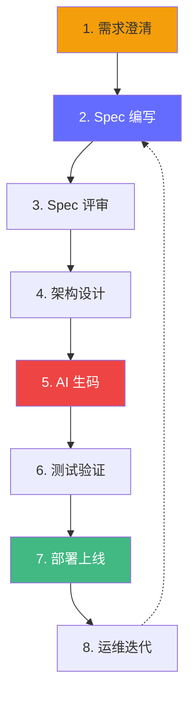
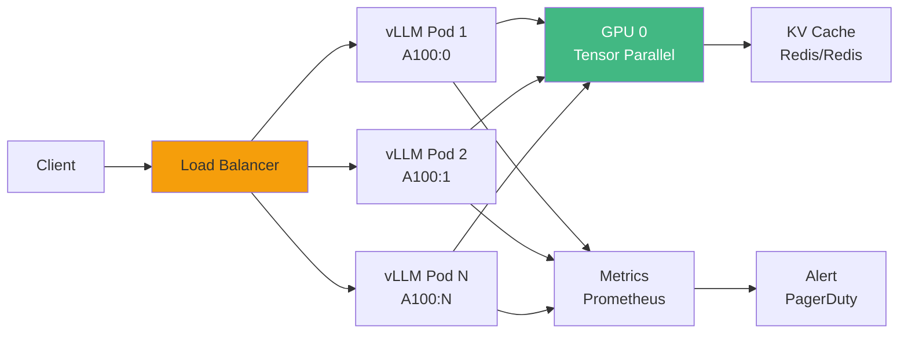
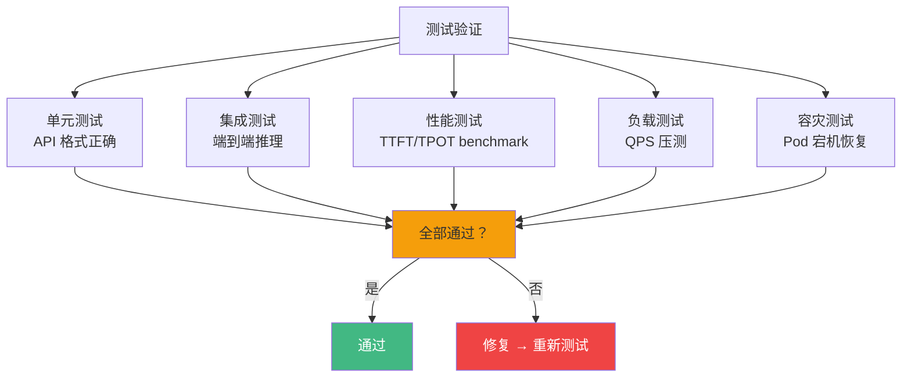
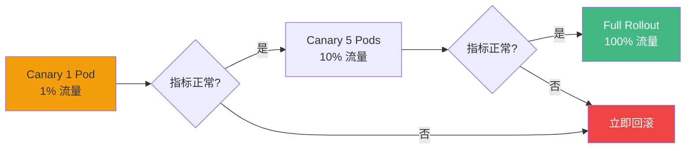

# OpenSpec 项目开发工作流

> 如何结合 OpenSpec 和 AI 编程工具，完成一个完整的 FDE 项目。Spec-Driven Development 是 AI 生码时代的工程最佳实践。

**OpenSpec**: https://github.com/Fission-AI/OpenSpec

---

## 什么是 OpenSpec

OpenSpec 是一个 **Spec-Driven Development（规范驱动开发）** 框架，专为 AI 编程时代设计。



**核心问题**：AI 编程最大的挑战不是"生成能力"，而是"上下文一致性"。

```
问题场景：
1. 你告诉 AI "部署一个 70B 模型推理服务"
2. AI 生成了一堆配置
3. 你审查后发现有些不符合你的要求
4. 你修改后，下次让 AI 改别的，AI 又忘了你的要求

根源：没有单一的、结构化的 Spec 作为信息源。
```

---

## 为什么需要 Spec

### AI 编程的三个痛点

| 痛点 | 描述 | Spec 的解法 |
|------|------|------------|
| **Prompt 模糊** | "部署模型"太笼统，AI 不知道用 vLLM 还是 TRT-LLM | Spec 明确技术选型和参数 |
| **上下文丢失** | AI 每次对话的上下文有限，长项目容易遗忘 | Spec 持久化，AI 随时读取 |
| **结果不一致** | 同一条 prompt，不同时间生成不同代码 | Spec 提供确定性约束 |

### Spec 的三个层级



| 层级 | 做法 | 适合 |
|------|------|------|
| **Spec-first** | 先写完整 Spec，再让 AI 按 Spec 执行 | 新项目、大型重构 |
| **Spec-anchored** | 边编码边更新 Spec，Spec 作为参考 | 迭代开发、bug 修复 |
| **Spec-as-source** | Spec 和代码自动同步，Spec 即文档 | 成熟项目、长期维护 |

**推荐起点**：FDE 学习者从 **Spec-first** 开始，养成"先想清楚再动手"的习惯。

---

## OpenSpec 核心概念

### Single Source of Truth

Spec 是项目唯一的、权威的信息源。所有 AI 生成的代码都应该以 Spec 为依据。

```
specs/
├── api/
│   ├── inference-endpoint.md     # 推理接口 Spec
│   └── health-check.md           # 健康检查 Spec
├── architecture/
│   ├── deployment-topology.md    # 部署拓扑
│   └── data-flow.md             # 数据流
├── performance/
│   ├── latency-slo.md           # 延迟 SLA
│   └── throughput-target.md     # 吞吐目标
└── operations/
    ├── rollout-plan.md          # 发布计划
    └── rollback-procedure.md    # 回滚流程
```

### 增量式 Spec

Spec 不是一次性写完的，而是**渐进式补充**：



每次迭代只补充新的 Spec，不修改已有的。

---

## 完整项目工作流（7 步）



### Step 1: 需求澄清

**输入**：业务需求（"我们需要上线一个 70B 模型的推理服务"）

**产出**：需求文档（需求方确认）

```markdown
# 需求：70B 模型推理服务上线

## 背景
- 业务方需要调用 Qwen2.5-72B 模型进行文本生成
- 预计日均调用量 100 万次
- 峰值 QPS 50

## 约束
- 预算：每月 GPU 成本 < $5000
- 延迟：TTFT < 2s, TPOT < 100ms
- 可用性：99.9%
```

### Step 2: Spec 编写

**工具**：Cursor 辅助编写（Cmd+K 生成框架）

```markdown
# specs/inference-service.md

## 技术选型
- 推理引擎：vLLM（生态成熟、Continuous Batching）
- 模型：Qwen/Qwen2.5-72B-Instruct
- GPU：2 × A100 80GB（Tensor Parallel）
- 量化：INT8 KV Cache（减少显存）

## 接口定义
```text
POST /v1/chat/completions
Request: { model, messages, max_tokens, temperature }
Response: { id, choices: [{ message, finish_reason }], usage }
```

## 性能指标
- TTFT: P50 < 500ms, P99 < 2s
- TPOT: < 100ms/token
- 最大 batch: 64
- 最大上下文: 32K tokens

## 部署配置
- 容器：Docker + vLLM 官方镜像
- 编排：Kubernetes
- 扩缩容：基于 QPS 的 HPA（5-20 副本）
- 容灾：多可用区部署
```

### Step 3: Spec 评审

**参与方**：技术负责人 + FDE + 业务方

**评审要点**：
- Spec 是否覆盖了所有需求？
- 技术选型是否合理？
- 性能指标是否可达？
- 预算是否超支？

### Step 4: 架构设计

**工具**：Cursor 生成 Mermaid 图



### Step 5: AI 生码

**工具**：Cursor Agent Mode + Claude Code

**操作**：
```
> @specs/inference-service.md
> 根据这个 Spec，生成 vLLM 部署配置和 Dockerfile。

# AI 会读取 Spec，生成：
# - docker-compose.yml
# - Dockerfile
# - k8s/deployment.yaml
# - k8s/hpa.yaml
# - k8s/service.yaml
# - config/vllm-config.json
```

**审查要点**：
- 每个生成的文件是否符合 Spec？
- 参数是否正确（GPU 数量、模型名、端口）？
- 安全配置是否到位（TLS、认证）？

### Step 6: 测试验证

**Harness Engineering 约束**：



**Benchmark 脚本**（用 Claude Code 生成）：
```
> 写一个 benchmark 脚本，测试：
> 1. TTFT: 发送 100 个请求，测量首 token 时间
> 2. TPOT: 测量每 token 生成时间
> 3. 在不同 prompt 长度下（100, 1000, 10000 tokens）
> 4. 输出 CSV 格式结果
```

### Step 7: 部署上线

**分阶段发布**：



### Step 8: 运维迭代

**Spec 同步更新**：
- 线上发现问题 → 更新 Spec 中的性能指标
- 新模型发布 → 更新 Spec 中的模型版本
- 流量增长 → 更新 Spec 中的扩缩容策略

---

## 完整案例：从 0 到 1 的 OpenSpec 工作流

### 案例背景

> 你需要在 2 周内部署一个 Qwen2.5-7B 的推理服务，支持 100 QPS，预算 $500/月。

### 第 1-2 天：Spec 编写

用 Cursor 生成 Spec 框架，填充具体参数。

### 第 3-5 天：AI 生码

用 Claude Code 批量生成配置文件，Cursor 审查和微调。

### 第 6-7 天：本地测试

在单卡上验证功能正确性。

### 第 8-10 天：云上部署

在 GPU 云上部署，跑 benchmark。

### 第 11-14 天：优化迭代

根据 benchmark 结果调整参数（batch size、量化方案）。

---

## 与 Harness Engineering 的关系

OpenSpec 是 Harness Engineering 的 **Constraint Layer**（约束层）：

```
Harness Engineering 六层：
┌─────────────────────────────────────────────┐
│ Context Layer    ← Spec 提供上下文           │
│ Constraint Layer ← Spec 提供边界约束        │
│ Sensor Layer     ← benchmark 提供传感器      │
│ Eval Layer       ← 测试用例提供验证          │
│ Feedback Layer   ← CI/CD 提供反馈            │
│ GC Layer         ← Spec 更新提供维护         │
└─────────────────────────────────────────────┘
```

---

## 面试视角

### 问题："你怎么管理一个 AI 辅助的开发项目？"

**满分回答框架**：

```
1. Spec-first 方法论：
   - 先写 Spec，再让 AI 执行
   - Spec 是单一信息源，避免上下文丢失

2. Harness Engineering 保障：
   - Constraint：Spec 定义边界
   - Sensor：benchmark 监控性能
   - Eval：自动化测试验证
   - Feedback：CI/CD 快速反馈

3. 工具链：
   - Spec 编写：Cursor
   - AI 生码：Cursor + Claude Code
   - 测试验证：自动化脚本
   - 部署：K8s + HPA

4. 风险控制：
   - 所有 AI 生成代码必须审查
   - 灰度发布，Canary 验证
   - 一键回滚
```

---

*上一节：[AI 编程工具对比](/tools/ai-coding-comparison) | 下一节：[Karpathy 的 AI 生码观点](/tools/karpathy-ai-coding)*
