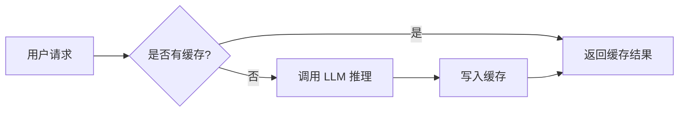

# FDE 学习中心 · 新人小白上手指南

> **本指南面向第一次接触本项目的新人**，假设你几乎不懂前端、不懂 Docusaurus、甚至不太会用命令行。
> 读完并跟着做，你将能够：**看懂项目在干嘛 → 把网站跑起来 → 在浏览器里浏览全部功能 → 学会改内容 → 知道怎么发布上线**。
>
> 最后更新：2026-09-02（基于项目实际状态核实）

---

## 目录

1. [项目到底是什么（一句话讲明白）](#1-项目到底是什么)
2. [技术栈与架构设计（用大白话讲）](#2-技术栈与架构设计)
3. [目录结构详解（哪些重要，哪些别碰）](#3-目录结构详解)
4. [环境检查与启动项目（手把手）](#4-环境检查与启动项目)
5. [网站功能使用说明（读者视角）](#5-网站功能使用说明)
6. [如何添加和修改内容（维护者视角）](#6-如何添加和修改内容)
7. [构建与部署（怎么发到线上）](#7-构建与部署)
8. [常见问题 FAQ](#8-常见问题-faq)
9. [新人第一周上手清单](#9-新人第一周上手清单)

---

## 1. 项目到底是什么

### 1.1 一句话解释

**FDE 学习中心**是一个**静态文档网站**——你可以把它理解成一本"放在网上的技术书"，所有内容都是 Markdown 文件，改文件就等于改网站。

它的主题是 **AI 前沿部署工程师（Frontier Deployment Engineer，简称 FDE）** 的系统学习，覆盖从 AI 基础理论到生产部署、再到面试通关的全链路内容。

### 1.2 线上地址

| 地址 | 说明 |
|------|------|
| **https://fde.pojuai.com** | 正式线上地址（自定义域名，推荐访问） |
| https://fde-academy-ba6.pages.dev | Cloudflare 默认备用地址，同样可访问 |
| http://localhost:3000 | 本地启动后访问（第 4 节会教） |

### 1.3 网站有哪些板块

| 板块 | 网址路径 | 内容 | 文章数 |
|------|----------|------|--------|
| FDE 系统学习 | `/`（首页即入口） | 17 个阶段：AI 基础 → 模型架构 → GPU → 推理优化 → 分布式 → 生产部署 → 面试 | 99 篇 |
| Agentic AI 系统学习 | `/agentic-ai/` | Python 基础 → LLM → LangGraph → RAG → 多智能体 → 实战 → 面试 | 20 篇 |
| 开源源码解读 | `/opensource/` | nanoGPT、llm.c、llama.cpp、vLLM、SGLang、Claude Code 架构 | 39 篇 |
| 工具教程 | `/tools/` | Cursor、Claude Code、Karpathy AI 编程、OpenSpec 等 | 8 篇 |
| 博客 | `/blog/` | 深度技术文章 | 9 篇 |
| AI 行业趋势 | `/trends/` | 行业动态数据看板，带 S/A/B/C 影响分级筛选 | 数据驱动 |
| GitHub 趋势 | `/github-trends/` | 热门开源项目追踪 | 数据驱动 |
| AI 应用趋势 | `/ai-applications/` | 新兴 AI 产品盘点 | 数据驱动 |
| FDE 招聘动态 | `/jobs/` | 真实岗位列表、薪酬区间、热门技能 | 数据驱动 |

> **核心认知**：这是一个"内容即代码"的项目。你不需要写 HTML、CSS、JavaScript 就能维护网站——你只需要会写 Markdown（一种纯文本格式，比 Word 还简单）。

---

## 2. 技术栈与架构设计

### 2.1 用大白话解释技术栈

| 技术 | 版本 | 它是干嘛的（人话版） |
|------|------|----------------------|
| **Docusaurus** | 3.10.x | 网站的"发动机"。Facebook 出的工具，你把 Markdown 文件丢进去，它自动生成一个带导航、搜索、侧边栏、暗色模式的漂亮网站。 |
| **React** | 19 | 前端 UI 框架。Docusaurus 底层用它来渲染页面，你一般不需要直接碰。 |
| **MDX** | 3 | 让 Markdown 里可以嵌入 React 组件。简单说就是"Markdown 增强版"。 |
| **Mermaid** | - | 用文字画流程图/架构图的工具。项目里的架构图都是用它画的。 |
| **Node.js** | ≥ 18（推荐 20+） | 运行环境。相当于"发动机需要的电"，没有它网站跑不起来。 |
| **npm** | ≥ 9 | 包管理器。相当于"应用商店"，用来安装项目需要的各种工具包。 |
| **Cloudflare Pages** | - | 托管平台。把代码推上去，它自动帮你构建并发布到网上，免费。 |

### 2.2 整体架构图

```
                        ┌──────────────────────────────────────┐
                        │       docusaurus.config.js           │
                        │    （站点总配置：导航栏/页脚/插件）     │
                        └───────────────┬──────────────────────┘
                                        │ 注册
        ┌──────────────┬────────────────┼────────────────┬──────────────┐
        ▼              ▼                ▼                ▼              ▼
   ┌─────────┐   ┌──────────┐    ┌────────────┐   ┌──────────┐   ┌─────────┐
   │  learn  │   │ agentic- │    │ opensource │   │  tools   │   │  blog   │
   │ 主文档  │   │ ai 文档  │    │  源码解读  │   │ 工具教程 │   │  博客   │
   └────┬────┘   └────┬─────┘    └─────┬──────┘   └────┬─────┘   └────┬────┘
        │             │                 │                │              │
        ▼             ▼                 ▼                ▼              ▼
    docs/       docs-agentic-      docs-opensource/  docs-tools/     blog/
   (99篇)        ai/ (20篇)          (39篇)           (8篇)         (9篇)
        │             │                 │
        └──────┬──────┴────────┬───────┘
               ▼               ▼
        sidebars/*.js    （每个文档系统对应一个侧边栏配置文件）
               │
               ▼
   ┌─────────────────────────────────────────────┐
   │          src/pages/ 自定义 React 页面         │
   │  index.js（首页）  trends.tsx（行业趋势）      │
   │  jobs.tsx（招聘）  github-trends.tsx          │
   │  ai-applications.tsx（应用趋势）               │
   └──────────────┬──────────────────────────────┘
                  │ 读取数据
                  ▼
        static/data/*.json  （趋势/招聘的 JSON 数据文件）
```

### 2.3 最核心的设计：一套框架，四套文档系统

这是本项目**最独特、也最需要理解**的架构设计。用大白话讲：

> Docusaurus 默认只能管理"一套文档"（比如一个产品的使用手册）。但本项目有四条完全独立的学习线——FDE 系统学习、Agentic AI、源码解读、工具教程。它们各自有自己的目录编号、侧边栏结构和网址路径。
>
> 怎么办？项目在 `docusaurus.config.js` 里**额外注册了 3 套文档插件**，加上默认的 1 套，一共 4 套，互不干扰。

| 插件 ID | 内容放在哪个目录 | 网址前缀 | 侧边栏配置文件 |
|---------|-----------------|----------|---------------|
| `learn`（主文档，默认） | `docs/` | `/`（根路径） | `sidebars/learn.js` |
| `agentic-ai` | `docs-agentic-ai/` | `/agentic-ai/` | `sidebars/agentic-ai.js` |
| `opensource` | `docs-opensource/` | `/opensource/` | `sidebars/opensource.js` |
| `tools` | `docs-tools/` | `/tools/` | `sidebars/tools.js` |

**文件路径 → 网址的对应规则**（举例）：

| Markdown 文件路径 | 对应网址 |
|-------------------|----------|
| `docs/01-basics/01-what-is-fde.md` | `http://localhost:3000/01-basics/01-what-is-fde` |
| `docs-agentic-ai/01-python-fundamentals.md` | `http://localhost:3000/agentic-ai/01-python-fundamentals` |
| `docs-opensource/vllm.md` | `http://localhost:3000/opensource/vllm` |
| `docs-tools/cursor.md` | `http://localhost:3000/tools/cursor` |

> **为什么这样设计？** 因为四条学习线是独立的，各自有自己的编号体系和侧边栏。分成四套插件后，改其中一套不会影响另外三套，维护起来非常清晰。

### 2.4 内容与数据分离

网站有 4 个"数据看板"页面（行业趋势、招聘动态、GitHub 趋势、AI 应用趋势），它们采用了**数据和展示分开**的设计：

```
static/data/trends.json   ──→  src/pages/trends.tsx（渲染行业趋势页面）
static/data/jobs.json     ──→  src/pages/jobs.tsx  （渲染招聘动态页面）
```

- **页面代码**（`.tsx` 文件）只负责"怎么展示"（筛选、分类、样式）
- **数据文件**（`.json` 文件）只负责"展示什么"（具体的岗位信息、趋势条目）
- 改数据不需要改代码，改代码不需要改数据，各司其职

### 2.5 开发与部署流程

```
写 Markdown 文件
    │
    ▼
npm start（本地开发服务器，自动热更新）
    │
    ▼
浏览器里实时看到效果
    │
    ▼
git push origin master（推送到 GitHub）
    │
    ▼
Cloudflare Pages 自动拉取代码 → 自动构建 → 自动发布
    │
    ▼
线上站点 https://fde.pojuai.com（约 1~3 分钟后生效）
```

> **热更新**：开发服务器运行时，你保存 Markdown 文件，浏览器会自动刷新，不需要手动重启服务器，所见即所得。

---

## 3. 目录结构详解

### 3.1 完整目录树

```
fde-learning-master/
│
├── docusaurus.config.js       ★★ 站点总配置（最重要的配置文件，改导航/页脚/插件都在这里）
├── package.json               ★ 依赖包和命令定义
├── babel.config.js            编译配置（一般不用改）
│
├── docs/                      ★★ 主文档：FDE 系统学习（99 篇，最核心的内容）
│   ├── 01-basics/             入门：什么是 FDE（当前使用的目录）
│   ├── 02-model-architecture/ 模型架构（Transformer/KV Cache/MoE...）
│   ├── 03-gpu-basics/         GPU 底层原理
│   ├── 04-inference-optimization/ 推理优化（vLLM/量化/投机解码...）
│   ├── 05-distributed-inference/ 分布式推理（TP/PP/MoE 并行）
│   ├── 06-ai-engineering/     LLM 应用构建（RAG/Agent/评估）
│   ├── 07-production-deployment/ 生产部署架构（PD分离/扩缩容/可观测...）
│   ├── 08-cost-operations/    成本与运营
│   ├── 09-labs/               动手实验（7 个实操教程）
│   ├── 10-business-workflows/ AI 驱动业务流程
│   ├── 11-compliance-security/ 合规与安全
│   ├── 12-interview/          面试答题方法
│   ├── 13-change-adoption/    变更管理与组织采纳
│   ├── 14-team-building/      团队管理与建设
│   └── 15-resources/          术语与资源
│
├── docs-agentic-ai/           ★ Agentic AI 系统学习（20 篇）
├── docs-opensource/           ★ 开源源码解读（39 篇，含 claude-code/ 子目录）
├── docs-tools/                ★ 工具教程（8 篇）
├── blog/                      ★ 博客文章（9 篇）
│
├── sidebars/                  ★★ 侧边栏配置（4 个 js 文件对应 4 套文档）
│   ├── learn.js                FDE 系统学习的侧边栏
│   ├── agentic-ai.js           Agentic AI 的侧边栏
│   ├── opensource.js           源码解读的侧边栏
│   └── tools.js                工具教程的侧边栏
│
├── src/
│   ├── pages/                 ★ 自定义 React 页面
│   │   ├── index.js            首页（技能卡片、学习路径、统计数据）
│   │   ├── trends.tsx          行业趋势看板（读 trends.json）
│   │   ├── jobs.tsx            招聘动态看板（读 jobs.json）
│   │   ├── github-trends.tsx   GitHub 趋势看板
│   │   └── ai-applications.tsx AI 应用趋势看板
│   ├── components/             自定义组件（如 DocCard 双栏卡片）
│   └── css/custom.css          全局自定义样式
│
├── static/
│   ├── data/                  ★ 数据文件
│   │   ├── trends.json         行业趋势数据
│   │   ├── jobs.json           招聘岗位数据
│   │   └── history/            岗位数据历史快照
│   ├── img/                    Logo、favicon 等图片
│   └── screenshots/            README 用的截图
│
├── scripts/                    辅助脚本
│   ├── collect_jobs.py         岗位数据自动采集脚本（Python）
│   ├── generate-logo-assets.ps1  Logo 资源生成脚本（PowerShell）
│   ├── rebuild-launcher.bat    启动器重新编译脚本
│   └── start-fde.cs            一键启动器源码（C#）
│
├── .claude/                    Claude Code 的项目配置与自动化技能
├── .docusaurus/                Docusaurus 构建缓存（不要手动改）
├── build/                      构建产物（npm run build 后生成，不要手动改）
├── node_modules/               依赖包（npm install 后生成，不要手动改）
│
├── FDE一键启动.exe             ★ 本地一键启动器（双击即可启动网站）
│
├── 新手使用指南.md              旧版指南（本文档为更新版）
├── 项目状态文档.md              项目当前状态记录（接续开发时先读）
├── 项目经验文档.md              踩坑经验记录
├── README.md                   项目简介
└── 新人小白使用指南.md          本文档（你正在读的）
```

### 3.2 重要程度标记说明

| 标记 | 含义 |
|------|------|
| ★★ | **核心文件**，日常维护经常需要改 |
| ★ | **重要文件**，特定场景下需要改 |
| 无标记 | 一般不用改，了解即可 |
| ⚠ | **不要手动编辑**，是自动生成的缓存或构建产物 |

### 3.3 特别注意：容易混淆的地方

#### （1）根目录的 `sidebars.js` 是旧文件，不要用！

项目根目录有一个 `sidebars.js`，但**当前实际使用的侧边栏配置在 `sidebars/` 目录下**（`learn.js`、`agentic-ai.js` 等）。根目录的 `sidebars.js` 是早期版本遗留，已经不被 `docusaurus.config.js` 引用了。

> **改侧边栏 → 永远改 `sidebars/` 目录下对应的文件。**

#### （2）`docs/` 里有两个"01开头"的目录

`docs/` 目录下同时存在 `01-ai-basics/` 和 `01-basics/`。**当前使用的是 `01-basics/`**（在 `sidebars/learn.js` 中引用）。`01-ai-basics/` 是旧版目录遗留，不再出现在网站侧边栏中。

同理，`06-production-deployment/` 也是旧版遗留，当前使用的是 `06-ai-engineering/` 和 `07-production-deployment/`。

> **判断一个目录是否在用：看 `sidebars/learn.js` 里有没有引用它。没引用的就是历史遗留，不要在里面写新内容。**

#### （3）根目录没有 `.github/workflows/`

项目早期用过 GitHub Actions 部署，后来迁移到了 Cloudflare Pages，`.github/workflows/deploy.yml` 已经删除。**现在的部署完全由 Cloudflare Pages 自动完成**，不需要任何 CI 配置文件。

---

## 4. 环境检查与启动项目

### 4.1 环境要求

| 软件 | 最低要求 | 推荐版本 | 检查命令 |
|------|----------|----------|----------|
| Node.js | ≥ 18.0 | 20.x 或 22.x（LTS） | `node --version` |
| npm | ≥ 9 | 随 Node 附带 | `npm --version` |

> **只需要 Node.js 这一个软件！** 不需要安装 Python、不需要数据库、不需要任何其他环境。Python 仅在运行岗位数据采集脚本时才用到，普通使用和写文档完全不需要。

### 4.2 第一步：检查环境是否就绪

打开命令行（Windows 按 `Win + R`，输入 `cmd` 回车，或者用 PowerShell），输入：

```bash
node --version
npm --version
```

如果看到类似下面的输出，说明环境 OK：

```
v22.23.2
10.9.8
```

如果提示"不是内部或外部命令"，说明 Node.js 没装。去 [nodejs.org](https://nodejs.org/) 下载 **LTS 版本**（长期支持版，最稳定），双击安装，一路下一步即可。安装完重新打开命令行再检查。

### 4.3 第二步：进入项目目录

```bash
cd F:\AICoding\fde-learning-master
```

> 把路径换成你实际存放项目的路径。如果项目在其他盘，先输入盘符如 `D:` 再 `cd`。

### 4.4 第三步：安装依赖（仅首次需要）

```bash
npm install
```

这一步会下载项目需要的所有工具包到 `node_modules/` 目录。**首次运行需要 2~5 分钟**（取决于网速），以后启动不需要再跑这一步。

如果下载很慢或失败，切换国内镜像源再试：

```bash
npm config set registry https://registry.npmmirror.com
npm install
```

> **怎么判断依赖已经装好了？** 项目目录下出现 `node_modules/` 文件夹，且里面有很多子文件夹（本项目约 850+ 个包）。

### 4.5 第四步：启动网站

#### 方式 A：命令行启动（推荐学习用）

```bash
npm start
```

首次启动需要编译，约 30 秒~2 分钟。看到下面这行就说明启动成功了：

```
[SUCCESS] Docusaurus website is running at: http://localhost:3000/
```

然后打开浏览器，访问 **http://localhost:3000/**

#### 方式 B：一键启动器（推荐纯小白）

直接双击项目根目录的 **`FDE一键启动.exe`**，它会自动完成：

- 检查 Node.js 环境（缺失时给出安装指引）
- 检查项目依赖（首次运行自动执行 `npm install`）
- 自动选择可用端口（3000 被占用时自动改用 3001 等）
- 启动开发服务器，编译完成后**自动打开浏览器**
- 重复双击时检测到已在运行的服务器，直接打开浏览器，不会重复启动

> 停止服务器：关闭启动器窗口（或在命令行里按 `Ctrl + C`）。

### 4.6 启动成功的验证清单

打开浏览器访问 http://localhost:3000/ 后，确认以下几点：

- [ ] 页面顶部有导航栏：**FDE 学习中心 | 系统学习 | 源码解读 | 工具教程 | 博客 | AI 趋势 | FDE 招聘动态 | GitHub**
- [ ] 页面大标题显示 **"AI 前沿部署工程师 系统学习路径"**
- [ ] 能看到统计数字：**17 学习阶段 / 63 技术文档 / 15K+ 行深度内容 / 40+ 架构图**
- [ ] 能看到"选择你的学习路径"板块，有两张卡片（核心路径 / Agentic AI）
- [ ] 右上角有**暗色模式切换按钮**（太阳/月亮图标）
- [ ] 点击导航栏的"系统学习"→"FDE 系统学习"，能进入文档页，左侧有可折叠的侧边栏

如果以上都满足，恭喜，项目成功运行了！

### 4.7 常用命令速查表

| 命令 | 作用 | 什么时候用 |
|------|------|-----------|
| `npm start` | 启动开发服务器（带热更新） | **日常写作用这个** |
| `npm run build` | 构建生产版本到 `build/` 目录 | 发布前验证、部署时自动执行 |
| `npm run serve` | 本地预览构建产物（模拟线上效果） | 构建后想看看线上效果时 |
| `npm run clear` | 清理 Docusaurus 缓存 | 构建异常、页面显示奇怪时先试这个 |
| `npx docusaurus start --port 3001` | 指定端口启动 | 3000 端口被占用时 |

---

## 5. 网站功能使用说明

### 5.1 作为读者：怎么在网站上学习

#### 推荐学习路径

1. **先搞懂这个岗位**：打开首页 → 点击"开始学习"→ 读《什么是 FDE》
2. **按阶段系统学**：在文档页左侧边栏，按 **L1 基础 → L2 进阶 → L3 应用 → L4 实战 → L5 面试** 的顺序往下学
3. **边学边练**：学到推理优化章节时，搭配 `09-labs/` 的 7 个动手实验实操
4. **准备面试**：直达 `12-interview/` 的面试答题框架和真题问答

#### 侧边栏分级说明

| 分级 | 包含内容 |
|------|----------|
| **L1 基础** | 入门认知（什么是 FDE）+ 模型架构（Transformer/KV Cache/MoE/训练） |
| **L2 进阶** | GPU 底层 + 推理引擎与量化（vLLM/TRT-LLM/SGLang）+ 分布式推理 |
| **L3 应用** | LLM 应用构建（Prompt/RAG/Agent/评估）+ 生产部署架构 |
| **L4 实战** | 成本运营 + 动手实验 + 业务流程 + 合规安全 |
| **L5 面试** | 面试答题方法 + 变更管理与组织采纳 |
| **附录** | 团队建设 + 前沿技术参考 + 术语与资源 |

#### 其他板块入口（顶部导航栏）

| 导航菜单 | 子菜单 | 适合什么人 |
|----------|--------|-----------|
| 系统学习 | FDE 系统学习 / Agentic AI 系统学习 | 想系统学习的人 |
| 源码解读 | 导航图 / nanoGPT / llm.c / llama.cpp / vLLM / SGLang / Claude Code | 想深入理解底层原理的人 |
| 工具教程 | 全部工具 | 想提升 AI 编程效率的人 |
| 博客 | — | 想看深度技术文章的人 |
| AI 趋势 | 行业趋势 / 应用趋势 / GitHub 趋势 | 想把握行业方向的人 |
| FDE 招聘动态 | 岗位列表 / 岗位知识图谱 | 正在求职或想了解市场的人 |

#### 网站小技巧

- **暗色模式**：右上角太阳/月亮图标，一键切换
- **回到顶部**：页面右下角有回到顶部按钮
- **搜索**：Docusaurus 自带搜索框（导航栏上方），可快速定位内容
- **上一篇/下一篇**：文档页底部有导航按钮，按顺序阅读很方便

### 5.2 作为维护者：数据看板怎么更新

行业趋势和招聘动态两个页面由 JSON 数据驱动，更新方式如下：

| 页面 | 数据文件 | 更新方式 |
|------|----------|----------|
| AI 行业趋势 `/trends/` | `static/data/trends.json` | 手动编辑 JSON，或使用 `.claude/skills/trend-collector.md` 定义的采集流程 |
| FDE 招聘动态 `/jobs/` | `static/data/jobs.json` | 手动编辑 JSON，或运行 `python scripts/collect_jobs.py` 自动采集 |

JSON 文件保存后，开发服务器会自动刷新页面，立即看到新数据。

> **招聘数据自动更新**：项目已配置定时自动化（每周一 9:30 自动采集岗位 → 更新 `jobs.json` → git push 自动部署）。触发时需要本机开机且自动化客户端运行。若停更超过 30 天，页面会显示数据新鲜度警示。

---

## 6. 如何添加和修改内容

### 6.1 修改一篇已有文档（最常见的操作）

直接用文本编辑器（推荐 VS Code）打开 `docs/` 下对应的 `.md` 文件，修改内容，保存即可。

**举例**：修改"什么是 FDE"这篇文章：

```
文件路径：docs/01-basics/01-what-is-fde.md
对应网址：http://localhost:3000/01-basics/01-what-is-fde
```

保存后浏览器自动刷新，立即看到修改效果。

> **Markdown 是什么？** 一种纯文本格式，用简单的符号控制排版。`#` 是标题，`**文字**` 是加粗，`` `代码` `` 是行内代码，``` ``` ``` 包裹的是代码块。比 Word 简单 10 倍，学 5 分钟就会。

### 6.2 新增一篇文档（3 步走）

#### 第 1 步：创建 Markdown 文件

在对应目录下创建 `.md` 文件。例如想在"推理优化"分类下加一篇文章：

文件路径：`docs/04-inference-optimization/my-new-topic.md`

文件内容模板：

```markdown
---
sidebar_position: 10
---

# 我的新主题

> 一句话导读，会显示在文档标题下方

---

## 第一节

正文内容，支持标准 Markdown 语法。

### 1.1 子标题

可以写代码块：

\`\`\`python
print("Hello FDE")
\`\`\`

可以写表格：

| 列1 | 列2 |
|-----|-----|
| A   | B   |
```

- `sidebar_position`：数字越小，在侧边栏排得越靠前
- 文档内可以正常使用代码块、表格、Mermaid 图表、图片

#### 第 2 步：挂到侧边栏

打开 `sidebars/learn.js`，找到对应分类，把文档 ID 加进 `items` 数组：

```javascript
{
  type: 'category',
  label: '让推理变快：推理引擎与量化',
  items: [
    '04-inference-optimization/vllm-deep-dive',
    '04-inference-optimization/my-new-topic',   // ← 新增这一行
    // ...
  ],
},
```

> **文档 ID 规则**：去掉 `.md` 后缀的相对路径，且不带 `docs/` 前缀。
> 例如 `docs/04-inference-optimization/my-new-topic.md` → ID 是 `04-inference-optimization/my-new-topic`

#### 第 3 步：保存，看效果

保存两个文件，浏览器自动刷新，侧边栏出现新文档，点击即可阅读。

> **注意**：如果改了 `sidebars/learn.js` 但侧边栏没变化，**重启开发服务器**（`Ctrl + C` 后重新 `npm start`）。侧边栏配置文件不支持热更新。

### 6.3 新增一篇博客

在 `blog/` 目录创建 `.md` 文件：

```markdown
---
title: 我的博客文章标题
date: 2026-09-02
---

> 文章导读引言。

<!-- truncate -->

正文从这里开始……
```

- `<!-- truncate -->` 之前的内容会作为博客列表页的摘要
- 博客**不需要配置侧边栏**，按日期自动排列
- 文件名建议用 `YYYY-MM-DD-文章标题.md` 格式

### 6.4 在文档里画架构图（Mermaid）

项目已启用 Mermaid 支持，直接在 Markdown 里写：

````markdown

````

保存后网站会自动渲染成漂亮的流程图。支持的图表类型：`flowchart`（流程图）、`sequenceDiagram`（时序图）、`classDiagram`（类图）、`pie`（饼图）、`gantt`（甘特图）等。

### 6.5 修改导航栏 / 页脚 / 站点名称

编辑 `docusaurus.config.js`：

| 配置项 | 位置 | 作用 |
|--------|------|------|
| `title` | 顶层 | 站点名称（浏览器标签显示） |
| `tagline` | 顶层 | 站点口号 |
| `themeConfig.navbar` | themeConfig 内 | 顶部导航栏菜单 |
| `themeConfig.footer` | themeConfig 内 | 页脚链接 |
| `url` | 顶层 | 线上域名（一般不要改） |

> **重要**：修改 `docusaurus.config.js` 后**必须重启开发服务器**才能生效（配置文件不支持热更新）。

### 6.6 修改首页或数据看板页面

这些是 React 页面，在 `src/pages/` 下：

| 文件 | 页面 | 数据来源 |
|------|------|----------|
| `index.js` | 首页 | 数据直接写在文件开头的常量里（技能卡片、学习路径、统计数字） |
| `trends.tsx` | 行业趋势 | 读取 `static/data/trends.json` |
| `jobs.tsx` | 招聘动态 | 读取 `static/data/jobs.json` |
| `github-trends.tsx` | GitHub 趋势 | 数据直接内嵌在文件中 |
| `ai-applications.tsx` | AI 应用趋势 | 数据直接内嵌在文件中 |

修改 `.tsx` / `.js` 文件需要懂一点 React 语法。如果只是改数据，优先改对应的 JSON 文件或文件内的常量数组。

### 6.7 替换站点 Logo / 图标

1. 准备一张 1024×1024 像素、带透明背景的 PNG 图标，替换项目根目录的 `logo.png`
2. 运行图标生成脚本：

```powershell
powershell -ExecutionPolicy Bypass -File scripts\generate-logo-assets.ps1
```

脚本会自动生成：
- `static/img/logo.png`（导航栏 Logo，128×128）
- `static/img/favicon.ico`（浏览器标签图标，多尺寸）

3. 重新编译启动器（让 exe 图标也更新）：双击 `scripts\rebuild-launcher.bat`
4. 重启开发服务器，全部生效

---

## 7. 构建与部署

### 7.1 本地构建验证

提交代码前，建议先在本地构建一次，确认没有致命错误：

```bash
npm run build
```

构建成功后，产物输出到 `build/` 目录。然后可以本地预览构建结果：

```bash
npm run serve
```

浏览器访问 http://localhost:3000/ 查看模拟线上的效果。

> **关于 WARNING**：构建时可能出现一些警告（如 Markdown 链接未解析、博客缺少 truncate 标记）。项目配置为 `warn` 级别，**这些警告不会导致构建失败**，可以放心忽略。如果出现 `ERROR` 才需要处理。

### 7.2 自动部署（Cloudflare Pages）

代码仓库：**https://github.com/xiaoka6688/fde-academy**

部署已经完全自动化，**你只需要 git push**：

```
git add -A
git commit -m "描述你的改动"
git push origin master
    ↓ 自动触发
Cloudflare Pages 拉取代码 → npm install → npm run build
    ↓
线上站点 https://fde.pojuai.com（约 1~3 分钟后生效）
```

- **生产部署**：推送 `master` 分支 → 发布到正式域名 https://fde.pojuai.com
- **预览部署**：推送其他分支（如 `feature/xxx`）→ 自动生成 `https://<分支名>.fde-academy-ba6.pages.dev` 独立预览链接，不影响线上。改完可以直接发预览链接给别人看效果
- 构建进度和预览链接在 Cloudflare 控制台查看：Workers & Pages → fde-academy → Deployments

### 7.3 贡献代码的标准流程

```bash
# 1. 从 master 创建特性分支
git checkout -b feature/your-feature

# 2. 修改内容，npm start 本地验证效果

# 3. 提交并推送
git add <你改的文件>
git commit -m "描述你的改动"
git push origin feature/your-feature

# 4. 在 GitHub 上发起 Pull Request，预览链接会自动生成
```

---

## 8. 常见问题 FAQ

### Q1：`npm start` 报端口被占用（EADDRINUSE）怎么办？

3000 端口被其他程序占用了。换个端口启动：

```bash
npx docusaurus start --port 3001
```

然后访问 `http://localhost:3001/`。

> 使用 `FDE一键启动.exe` 则完全不用担心——它会自动检测端口占用并改用可用端口，浏览器也会打开正确的地址。

### Q2：浏览器打开 localhost:3000 显示的不是 FDE 学习中心？

说明 3000 端口被其他软件占用了，浏览器连到了别的服务。解决方法同 Q1，换端口启动。

### Q3：改了 Markdown 文件但网站没变化？

按以下顺序排查：

1. 确认改的是 `docs/`（或 `docs-agentic-ai/`、`docs-opensource/`、`docs-tools/`）下的文件，**不是其他目录的旧文件**
2. 确认你改的文件在 `sidebars/` 对应的配置文件里被引用了（没引用的文件不会出现在网站上）
3. 确认命令行里的 `npm start` 还在运行（没有被关掉）
4. 实在不行：`Ctrl + C` 停掉，重新 `npm start`

### Q4：改了 `docusaurus.config.js` 或 `sidebars/*.js` 没生效？

配置文件**不支持热更新**，必须重启开发服务器：`Ctrl + C` 后重新 `npm start`。

### Q5：构建（`npm run build`）报错怎么办？

先清理缓存再试：

```bash
npm run clear
npm run build
```

仍失败则看报错信息：
- `Broken link` 类错误：文档里链接了不存在的文件，检查链接路径
- 确认 `sidebars/*.js` 里引用的文档 ID 都真实存在（文件路径去掉 `.md`）
- 确认 Markdown 语法没有错误（如未闭合的代码块）

### Q6：`npm install` 很慢或失败？

切换国内镜像源：

```bash
npm config set registry https://registry.npmmirror.com
npm install
```

### Q7：Node 版本不满足要求？

本项目要求 Node ≥ 18。用 `node --version` 检查。过低请到 [nodejs.org](https://nodejs.org/) 安装 LTS 版本。Windows 用户推荐用 [nvm-windows](https://github.com/coreybutler/nvm-windows) 管理多版本。

### Q8：想新增一整套自己的文档板块（第五套文档）？

在 `docusaurus.config.js` 的 `plugins` 数组里，仿照 `agentic-ai` 的配置再注册一个 `@docusaurus/plugin-content-docs` 实例：

```javascript
[
  '@docusaurus/plugin-content-docs',
  {
    id: 'my-new-section',
    path: 'docs-my-new-section',
    routeBasePath: 'my-new-section',
    sidebarPath: './sidebars/my-new-section.js',
    numberPrefixParser: false,
    sidebarCollapsed: true,
  },
],
```

然后创建 `docs-my-new-section/` 目录和 `sidebars/my-new-section.js` 配置文件即可。

### Q9：启动时出现很多 WARNING，正常吗？

正常。项目配置了 `onBrokenLinks: 'warn'` 和 `onBrokenMarkdownLinks: 'warn'`，一些历史文档里的链接可能指向已移动或删除的文件，这些只会警告不会导致启动失败。博客缺少 `<!-- truncate -->` 标记也是警告级别。不影响使用。

### Q10：怎么停止开发服务器？

- 命令行启动的：在命令行窗口按 `Ctrl + C`，然后按 `Y` 确认（如果提示的话）
- 一键启动器启动的：直接关闭启动器窗口即可

---

## 9. 新人第一周上手清单

按顺序完成以下任务，你就完全掌握这个项目了：

- [ ] **通读本指南第 2 节**，理解"一套框架、四套文档系统"的架构设计
- [ ] **检查环境**：运行 `node --version`，确认 ≥ 18
- [ ] **安装依赖**：在项目目录运行 `npm install`（如果还没装过）
- [ ] **启动网站**：运行 `npm start`，浏览器打开 http://localhost:3000/
- [ ] **验证启动成功**：对照第 4.6 节的验证清单逐项确认
- [ ] **浏览全站**：点击导航栏的每个菜单，看看都有什么内容
- [ ] **体验热更新**：随便挑一篇文档（如 `docs/01-basics/01-what-is-fde.md`），改一句话，保存，观察浏览器自动刷新
- [ ] **找到自己最感兴趣的板块**，通读它的 `index.md` 或第一篇文章
- [ ] **尝试新增一篇测试文档**（参考第 6.2 节），挂到侧边栏，验证后删除
- [ ] **运行一次 `npm run build`**，确认能构建成功
- [ ] **了解部署流程**：知道 `git push origin master` 后会自动发布到 https://fde.pojuai.com
- [ ] **读一遍 `项目状态文档.md`**，了解项目当前状态和待办事项
- [ ] **读一遍 `项目经验文档.md`**，了解前人踩过的坑，避免重复踩

完成以上清单，你就已经具备独立维护本项目的全部基础能力了。

---

## 附：关键文件速查表

| 你想做什么 | 改哪个文件 |
|-----------|-----------|
| 改网站标题/导航栏/页脚 | `docusaurus.config.js` |
| 改 FDE 系统学习的侧边栏 | `sidebars/learn.js` |
| 改 Agentic AI 的侧边栏 | `sidebars/agentic-ai.js` |
| 改源码解读的侧边栏 | `sidebars/opensource.js` |
| 改工具教程的侧边栏 | `sidebars/tools.js` |
| 改/加 FDE 系统学习的文章 | `docs/` 目录下对应 `.md` |
| 改/加 Agentic AI 的文章 | `docs-agentic-ai/` 目录下对应 `.md` |
| 改/加源码解读的文章 | `docs-opensource/` 目录下对应 `.md` |
| 改/加工具教程的文章 | `docs-tools/` 目录下对应 `.md` |
| 改/加博客文章 | `blog/` 目录下对应 `.md` |
| 改首页内容 | `src/pages/index.js` |
| 改行业趋势数据 | `static/data/trends.json` |
| 改招聘动态数据 | `static/data/jobs.json` |
| 改全局样式 | `src/css/custom.css` |
| 换 Logo | 替换根目录 `logo.png` → 运行 `scripts/generate-logo-assets.ps1` |

---

> **遇到问题怎么办？**
> 1. 先查本指南的 FAQ（第 8 节）
> 2. 再查 `项目经验文档.md`（前人踩坑记录）
> 3. 最后看 `项目状态文档.md`（项目当前状态）
> 4. 都解决不了？在项目 GitHub 仓库提 Issue：https://github.com/xiaoka6688/fde-academy

祝学习顺利，欢迎成为 FDE 学习中心的贡献者！
