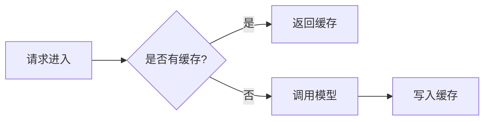

# FDE 学习中心 · 新手使用指南

> 本指南面向第一次接触本项目的新人，帮助你快速理解项目架构、跑起来项目、并学会日常使用和维护。
> 阅读完本指南，你将能够：**看懂项目结构 → 本地启动网站 → 浏览全部功能 → 增删改内容 → 构建部署**。

---

## 目录

1. [项目是什么](#1-项目是什么)
2. [技术栈一览](#2-技术栈一览)
3. [系统架构与设计](#3-系统架构与设计)
4. [目录结构详解](#4-目录结构详解)
5. [环境准备与本地启动](#5-环境准备与本地启动)
6. [网站功能使用说明](#6-网站功能使用说明)
7. [如何添加和修改内容](#7-如何添加和修改内容)
8. [构建与部署](#8-构建与部署)
9. [常见问题 FAQ](#9-常见问题-faq)

---

## 1. 项目是什么

**FDE 学习中心** 是一个面向 **AI 前沿部署工程师（Frontier Deployment Engineer，简称 FDE）** 的系统性学习平台，本质上是一个**静态文档网站**。

它把学习内容组织成 8 大板块：

| 板块 | 网站路由 | 内容 | 文档数 |
|------|----------|------|--------|
| FDE 系统学习 | `/` | 15 个阶段：AI 基础 → 模型架构 → GPU → 推理优化 → 分布式 → 生产部署 → 面试 | 99 篇 |
| Agentic AI 系统学习 | `/agentic-ai/` | Python 基础 → LLM → LangGraph → RAG → 多智能体 → 实战 | 20 篇 |
| 开源源码解读 | `/opensource/` | nanoGPT、llm.c、llama.cpp、vLLM、SGLang、Claude Code 架构 | 39 篇 |
| 工具教程 | `/tools/` | Cursor、Claude Code、Karpathy AI 编程、OpenSpec 工作流 | 6 篇 |
| 博客 | `/blog/` | 深度技术文章 | 9 篇 |
| AI 行业趋势 | `/trends/` | 30+ 条行业动态，S/A/B/C 四级影响评估 | 数据驱动 |
| GitHub 趋势 / AI 应用趋势 | `/github-trends/`、`/ai-applications/` | 热门开源项目与新兴 AI 产品 | 数据内置 |
| FDE 招聘动态 | `/jobs/` | 5 大类别真实岗位列表与薪酬洞察 | 数据驱动 |

**一句话总结**：这是一个"内容即代码"的网站——所有学习内容都是 Markdown 文件，改文件就等于改网站。

---

## 2. 技术栈一览

| 技术 | 版本 | 作用 |
|------|------|------|
| [Docusaurus](https://docusaurus.io/) | 3.10.x | 核心框架，Facebook 出品的静态文档站点生成器 |
| React | 19 | 前端 UI 框架（Docusaurus 基于 React） |
| MDX | 3 | 让 Markdown 里可以写 React 组件 |
| Mermaid | - | 用文本语法画流程图/架构图（`@docusaurus/theme-mermaid`） |
| Node.js | ≥ 18（推荐 20+） | 运行环境 |
| npm | ≥ 9 | 包管理器 |
| Cloudflare Pages | - | 自动构建部署 + 分支预览链接（连接 GitHub 仓库） |

**为什么选 Docusaurus？**
- 写 Markdown 就能生成网站，不用写 HTML
- 自带侧边栏、导航、搜索、暗色模式
- 支持多套文档（本项目用它同时跑了 4 套文档系统）
- 原生支持 Mermaid 图表、版本管理、博客

---

## 3. 系统架构与设计

### 3.1 整体架构图

```
                        ┌─────────────────────────────────────┐
                        │         docusaurus.config.js        │
                        │      （站点总配置：导航栏/页脚/插件）   │
                        └──────────────┬──────────────────────┘
                                       │ 注册
        ┌──────────────┬───────────────┼───────────────┬──────────────┐
        ▼              ▼               ▼               ▼              ▼
   ┌─────────┐   ┌──────────┐   ┌────────────┐   ┌──────────┐   ┌─────────┐
   │ learn    │   │ agentic- │   │ opensource │   │ tools    │   │  blog   │
   │ 文档插件 │   │ ai 插件  │   │ 文档插件    │   │ 文档插件 │   │ 博客插件│
   └────┬────┘   └────┬─────┘   └─────┬──────┘   └────┬─────┘   └────┬────┘
        │             │               │               │              │
        ▼             ▼               ▼               ▼              ▼
   docs/         docs-agentic-    docs-          docs-tools/     blog/
   (99篇)        ai/ (20篇)       opensource/    (6篇)           (9篇)
        │             │          (39篇)
        │             │               │
        └──────┬──────┴───────┬───────┘
               ▼              ▼
        sidebars/*.js    （每个插件对应一个侧边栏配置）
               │
               ▼
   ┌─────────────────────────────────────────────┐
   │            src/pages/ 自定义 React 页面       │
   │  index.js(首页)  trends.tsx  jobs.tsx        │
   │  github-trends.tsx  ai-applications.tsx      │
   └──────────────┬──────────────────────────────┘
                  │ 读取
                  ▼
        static/data/*.json  （趋势/招聘数据）
                  │
                  ▼
        scripts/collect_jobs.py  （数据采集脚本）
```

### 3.2 核心设计思想：一套 Docusaurus，四套文档系统

这是本项目**最独特**的架构设计，理解它就理解了整个项目：

Docusaurus 的 `preset-classic` 默认自带一套文档系统，本项目在 `docusaurus.config.js` 中又通过 `@docusaurus/plugin-content-docs` **额外注册了 3 套文档插件**，每套都有独立的：

- **内容目录**（放 Markdown 的地方）
- **路由前缀**（URL 路径）
- **侧边栏配置**（`sidebars/` 目录下对应的 js 文件）

| 插件 ID | 内容目录 | URL 前缀 | 侧边栏配置 |
|---------|----------|----------|------------|
| `learn`（主文档） | `docs/` | `/` | `sidebars/learn.js` |
| `agentic-ai` | `docs-agentic-ai/` | `/agentic-ai/` | `sidebars/agentic-ai.js` |
| `opensource` | `docs-opensource/` | `/opensource/` | `sidebars/opensource.js` |
| `tools` | `docs-tools/` | `/tools/` | `sidebars/tools.js` |

**路由规则举例**：
- `docs/01-basics/01-what-is-fde.md` → 网址 `/01-basics/01-what-is-fde`
- `docs-agentic-ai/01-python-fundamentals.md` → 网址 `/agentic-ai/01-python-fundamentals`
- `docs-opensource/vllm.md` → 网址 `/opensource/vllm`

> **为什么这样设计？** 因为 FDE 系统学习、Agentic AI、源码解读、工具教程是四条独立的学习线，各自有自己的目录编号体系和侧边栏结构。分成四套插件后互不干扰，维护清晰。

### 3.3 内容与数据分离

网站有两类"动态"页面采用了**数据与展示分离**的设计：

```
static/data/trends.json  ──→  src/pages/trends.tsx（渲染行业趋势页面）
static/data/jobs.json    ──→  src/pages/jobs.tsx  （渲染招聘动态页面）
```

- 页面代码（`.tsx`）只负责展示逻辑（筛选、分类、样式）
- 数据（`.json`）可以单独更新，改数据不用改代码
- `scripts/collect_jobs.py` 可自动采集岗位数据更新 `jobs.json`
- `.claude/skills/` 中定义了配套的自动采集工作流（岗位每周一、趋势每周三）

### 3.4 开发与部署流程

```
写 Markdown ──→ npm start（本地实时预览）──→ git push ──→ Cloudflare Pages 自动构建
                                                          │
                                                          ▼
                                              线上站点 https://fde-academy-ba6.pages.dev
                                              （其他分支推送 → 自动生成独立预览链接）
```

开发服务器支持**热更新**：你保存 Markdown 文件后，浏览器会自动刷新，所见即所得。

---

## 4. 目录结构详解

```
fde-learning/
│
├── docs/                      ★ 主文档：FDE 系统学习（99 篇，最重要）
│   ├── 01-basics/             入门：什么是 FDE
│   ├── 02-model-architecture/ 模型架构（Transformer/KV Cache/MoE...）
│   ├── 03-gpu-basics/         GPU 底层
│   ├── 04-inference-optimization/ 推理优化（vLLM/量化/投机解码...）
│   ├── 05-distributed-inference/ 分布式推理（TP/PP/MoE 并行）
│   ├── 06-ai-engineering/     LLM 应用构建（RAG/Agent/评估）
│   ├── 07-production-deployment/ 生产部署（PD 分离/扩缩容/可观测...）
│   ├── 08-cost-operations/    成本与运营
│   ├── 09-labs/               动手实验（7 个实操）
│   ├── 10-business-workflows/ 业务流程
│   ├── 11-compliance-security/ 合规与安全
│   ├── 12-interview/          面试答题方法
│   ├── 13-change-adoption/    变更管理
│   ├── 14-team-building/      团队建设
│   └── 15-resources/          术语与资源
│
├── docs-agentic-ai/           ★ Agentic AI 系统学习（20 篇）
├── docs-opensource/           ★ 开源源码解读（39 篇，含 claude-code/ 子目录）
├── docs-tools/                ★ 工具教程（6 篇）
├── blog/                      ★ 博客文章（9 篇）
│
├── sidebars/                  ★ 侧边栏配置（4 个 js 文件对应 4 套文档）
├── src/
│   ├── pages/                 ★ 自定义 React 页面（首页/趋势/招聘等）
│   └── css/custom.css         全局自定义样式
├── static/
│   ├── data/                  ★ 趋势与招聘的 JSON 数据
│   ├── img/                   Logo 等静态图片
│   └── screenshots/           README 截图
├── scripts/collect_jobs.py    岗位数据采集脚本（Python）
├── .claude/                   Claude Code 的项目配置与自动化技能
│
├── docusaurus.config.js       ★★ 站点总配置（最重要的配置文件）
├── package.json               ★ 依赖与命令定义
├── .github/workflows/deploy.yml  自动部署流水线
│
├── 01-ai-basics/ ~ 17-open-source-deep-dive/  ⚠ 历史构建产物（HTML）
├── index.html / 404.html / sitemap.xml        ⚠ 历史构建产物
└── 新手使用指南.md             本文档
```

> **★ = 日常需要编辑的地方，⚠ = 不要编辑**
>
> 特别注意：**根目录下的 `01-ai-basics/`、`02-model-architecture/` 等编号文件夹和 `index.html`、`sitemap.xml` 是早期版本构建生成的静态网页残留**，当前部署流程（GitHub Actions）根本不使用它们。真正的内容源文件在 `docs/` 等目录里。新人最常见的错误就是改了根目录的 HTML 却发现网站没变化——请永远编辑 `docs/` 下的 Markdown。

---

## 5. 环境准备与本地启动

### 5.1 环境要求

| 软件 | 要求 | 检查命令 |
|------|------|----------|
| Node.js | ≥ 18（推荐 20 或 22） | `node --version` |
| npm | ≥ 9（随 Node 附带） | `npm --version` |

到 [nodejs.org](https://nodejs.org/) 下载 LTS 版本安装即可，无需其他环境。
（`scripts/collect_jobs.py` 需要 Python，但仅在做岗位数据采集时才用到，普通使用和写文档完全不需要。）

### 5.2 启动方式

**方式一：一键启动（推荐新手）**

双击项目根目录的 **`FDE一键启动.exe`**，无需任何命令行操作。它会自动完成：

- 检查 Node.js 环境（缺失时给出安装指引）
- 检查项目依赖（首次运行自动执行 `npm install`）
- 自动选择可用端口（3000 被占用时自动改用 3001 等，无需操心端口冲突）
- 启动开发服务器，等编译完成后**自动打开浏览器**
- 重复双击时会检测到已在运行的服务器，直接打开浏览器，不会重复启动

停止服务器：关闭启动器窗口（或在其中按 `Ctrl + C`）即可。

> 启动器源码在 `scripts/start-fde.cs`（C#，用 Windows 自带的 .NET Framework 编译）。修改源码后双击 `scripts/rebuild-launcher.bat` 即可重新生成 exe。

**方式二：命令行启动**

```bash
# 第 1 步：进入项目目录
cd fde-academy

# 第 2 步：安装依赖（首次运行需要，约 2~5 分钟）
npm install

# 第 3 步：启动开发服务器（首次启动需编译，约 1~2 分钟）
npm start
```

看到下面的输出就是启动成功：

```
[SUCCESS] Docusaurus website is running at: http://localhost:3000/
```

然后在浏览器打开：**http://localhost:3000/**

### 5.3 启动后如何确认一切正常

1. 首页能看到"FDE 学习中心"大标题和 12 级技能卡片
2. 顶部导航栏可以切换"系统学习 / 源码解读 / 工具教程 / 博客 / AI 趋势 / FDE 招聘动态"
3. 左侧有可折叠的文档侧边栏（按 L1 基础 → L5 面试分级）
4. 右上角可切换暗色模式

> **修改内容后**：开发服务器会自动热更新，保存文件后浏览器自动刷新，无需重启。
>
> **停止服务器**：在终端按 `Ctrl + C`。

### 5.4 常用命令速查

| 命令 | 作用 |
|------|------|
| `npm start` | 启动开发服务器（带热更新，日常写作用这个） |
| `npm run build` | 构建生产版本到 `build/` 目录 |
| `npm run serve` | 本地预览构建产物（模拟线上效果） |
| `npm run clear` | 清理 Docusaurus 缓存（构建异常时先试这个） |
| `npx docusaurus start --port 3001` | 换端口启动（3000 被占用时） |

---

## 6. 网站功能使用说明

### 6.1 作为读者：怎么学

**入门推荐路径**（对应首页"核心路径"卡片）：

1. 先读 `/01-basics/01-what-is-fde` —— 搞懂 FDE 是什么岗位
2. 按左侧边栏 **L1 基础 → L2 进阶 → L3 应用 → L4 实战 → L5 面试** 的顺序往下学
3. 学到推理章节时，搭配 `/09-labs/` 的 7 个动手实验实操
4. 准备面试时直达 `/12-interview/interview-framework` 答题框架

**侧边栏分级说明**：

| 分级 | 内容 |
|------|------|
| L1 基础 | 入门认知 + 模型架构（Transformer/KV Cache/MoE） |
| L2 进阶 | GPU 底层 + 推理引擎与量化 + 分布式推理 |
| L3 应用 | LLM 应用构建（RAG/Agent）+ 生产部署架构 |
| L4 实战 | 成本运营 + 动手实验 + 业务流程 + 合规安全 |
| L5 面试 | 面试答题方法 + 变更管理 |
| 附录 | 团队建设 + 前沿参考 + 术语资源 |

**其他板块入口**（顶部导航栏）：
- **源码解读**：想深入理解 vLLM/SGLang/llama.cpp 底层实现，或研究 Claude Code 的架构设计
- **工具教程**：想提升 AI 编程效率（Cursor、Claude Code 用法）
- **AI 趋势**：三个数据看板——行业趋势（带 S/A/B/C 影响分级筛选）、GitHub 热门项目、AI 应用产品
- **FDE 招聘动态**：按类别浏览岗位、查看薪酬区间和热门技能

### 6.2 作为维护者：数据如何更新

招聘和趋势两个页面由 JSON 数据驱动：

| 页面 | 数据文件 | 更新方式 |
|------|----------|----------|
| AI 行业趋势 `/trends/` | `static/data/trends.json` | 手动编辑 JSON，或使用 `.claude/skills/trend-collector.md` 定义的采集流程 |
| FDE 招聘动态 `/jobs/` | `static/data/jobs.json` | 手动编辑 JSON，或运行 `python scripts/collect_jobs.py` |

JSON 更新保存后，开发服务器自动刷新页面，立即看到新数据。

---

## 7. 如何添加和修改内容

### 7.1 修改一篇已有文档（最常见）

直接编辑 `docs/` 下对应的 `.md` 文件即可。例如修改"什么是 FDE"：

```bash
# 文件路径
docs/01-basics/01-what-is-fde.md
# 对应网址
http://localhost:3000/01-basics/01-what-is-fde
```

保存后浏览器自动刷新。

### 7.2 新增一篇文档

**第 1 步**：在对应目录创建 Markdown 文件，例如 `docs/04-inference-optimization/my-new-topic.md`：

```markdown
---
sidebar_position: 5
---

# 我的新主题

> 一句话导读，会显示在文档顶部

---

## 第一节

正文内容，支持标准 Markdown 语法。
```

- `sidebar_position`：数字越小排在侧边栏越前面
- 文档内可以正常使用代码块、表格、Mermaid 图表

**第 2 步**：把它挂到侧边栏。打开 `sidebars/learn.js`，找到对应分类，把文档 ID 加进去：

```js
{
  type: 'category',
  label: '让推理变快：推理引擎与量化',
  items: [
    '04-inference-optimization/vllm-deep-dive',
    '04-inference-optimization/my-new-topic',   // ← 新增这一行
    // ...
  ],
},
```

> 文档 ID 规则：**去掉 `.md` 后缀的相对路径**。docs 目录下的文件 ID 不带 `docs/` 前缀。

**第 3 步**：保存两个文件，浏览器自动刷新，侧边栏出现新文档。

### 7.3 新增一篇博客

在 `blog/` 目录创建 `.md` 文件：

```markdown
# 文章标题

> 文章导读引言。

<!-- truncate -->

正文从这里开始……
```

`<!-- truncate -->` 之前的内容会作为列表页的摘要，博客**不需要配置侧边栏**，按日期自动排列。

### 7.4 Mermaid 图表写法

项目启用了 Mermaid 支持，直接在文档里写：

````markdown

````

### 7.5 修改导航栏 / 页脚 / 站点信息

编辑 `docusaurus.config.js`：
- `title` / `tagline`：站点名称和口号
- `themeConfig.navbar`：顶部导航栏
- `themeConfig.footer`：页脚链接
- 修改后**需要重启** `npm start` 才能生效（配置文件不热更新）

### 7.6 修改首页或趋势/招聘页面

这些是 React 页面，在 `src/pages/` 下：
- `index.js`：首页（技能等级卡片、学习路径等数据就写在文件开头的常量里）
- `trends.tsx` / `jobs.tsx`：读取 `static/data/*.json` 渲染
- `github-trends.tsx` / `ai-applications.tsx`：数据直接内嵌在文件常量中

### 7.7 替换站点 Logo / 图标

站点的品牌图标统一从项目根目录的 `logo.png` 生成（建议使用 1024x1024 带透明背景的方形图标）：

```powershell
# 替换根目录 logo.png 后，运行一次即可重新生成全部图标资源：
powershell -ExecutionPolicy Bypass -File scripts\generate-logo-assets.ps1
```

脚本会自动生成：

| 产物 | 用途 |
|------|------|
| `static/img/logo.png` | 导航栏 Logo（128x128 高质量缩放，浅色/深色主题通用） |
| `static/img/favicon.ico` | 浏览器标签图标 + 网站固定到任务栏时的图标（16~256 多尺寸） |

然后双击 `scripts\rebuild-launcher.bat` 重新编译启动器，新图标会同时嵌入 `FDE一键启动.exe`（资源管理器、任务栏窗口显示的图标）。最后重启开发服务器即可看到全部生效。

图标引用关系（已在 `docusaurus.config.js` 中配置好，一般无需改动）：`favicon: 'img/favicon.ico'`、导航栏 `logo.src: 'img/logo.png'`。

---

## 8. 构建与部署

### 8.1 本地构建验证

提交代码前建议先本地构建一次，确认没有致命错误：

```bash
npm run build     # 产物输出到 build/ 目录
npm run serve     # 本地预览构建结果 http://localhost:3000/
```

> 构建时会出现一些 `WARNING`（如 Markdown 链接未解析、博客缺少 truncate 标记），这些**不会导致构建失败**，项目配置为 `warn` 级别，可以放心忽略。

### 8.2 自动部署（Cloudflare Pages）

代码仓库：**https://github.com/xiaoka6688/fde-academy**（远程 origin 已配置好）

部署已经完全自动化，**你只需要 git push**：

```
git push origin master
    ↓ 自动触发
Cloudflare Pages 拉取仓库（npm ci + npm run build）
    ↓
线上站点 https://fde-academy-ba6.pages.dev/   （约 1~3 分钟后生效）
```

- **生产部署**：推送 `master` 分支即发布到生产域名
- **预览部署**：推送其他分支（如 `git push origin feature/xxx`）会自动生成 `https://<分支名>.fde-academy-ba6.pages.dev` 独立预览链接，不影响线上——改完直接发链接给别人看效果
- 构建进度和预览链接在 Cloudflare 控制台（Workers & Pages → fde-academy → Deployments）查看

**首次接入 Cloudflare Pages（一次性）**：

1. 注册 [Cloudflare 账号](https://dash.cloudflare.com/sign-up)（免费）
2. 控制台 → **Workers & Pages** → **Create** → **Pages** → **Connect to Git**
3. 授权 GitHub，选中 `fde-academy` 仓库
4. 构建配置（一般会自动识别 Docusaurus，没有就手动填）：
   - Framework preset：`Docusaurus`
   - Build command：`npm run build`
   - Build output directory：`build`
   - 环境变量：`NODE_VERSION` = `22`
5. 点击 **Save and Deploy**，首次构建完成后即上线

**绑定自定义域名**（腾讯云域名）：

1. Cloudflare Pages → fde-academy → **Custom domains** → **Set up a custom domain**
2. 按提示到腾讯云 DNS 解析控制台，添加 CNAME 记录指向 `fde-academy-ba6.pages.dev`
3. SSL 证书由 Cloudflare 自动签发，无需操作
4. 把 `docusaurus.config.js` 里的 `url` 改成 `https://你的域名` 并推送，即完成切换

### 8.3 贡献流程（提 PR）

```bash
git checkout -b feature/your-feature   # 1. 建特性分支
# 2. 修改内容，npm start 本地验证
git add <你改的文件>
git commit -m "描述你的改动"
git push origin feature/your-feature   # 3. 推送（自动生成预览链接）
# 4. 在 GitHub 上发起 Pull Request，预览链接可在 PR 里查看
```

---

## 9. 常见问题 FAQ

**Q1：`npm start` 报端口被占用（EADDRINUSE）？**

3000 端口被其他程序占用（本机曾有 MuseBox 软件占用 IPv4 的 3000 端口）。换个端口启动：

```bash
npx docusaurus start --port 3001
```

然后访问 `http://localhost:3001/`。

> 使用 `FDE一键启动.exe` 则完全不用担心此问题：它会自动检测端口占用并改用可用端口，浏览器也会打开正确的地址。

> 注意：如果 Docusaurus 提示运行在 3000 但浏览器打开异常，可能是本机其他软件（如 MuseBox）也在 3000 端口响应。用 `--port 3001` 换一个干净的端口即可彻底解决。

**Q2：浏览器打开 `localhost:3000` 显示的不是 FDE 学习中心？**

说明 3000 端口的 IPv4 侧被其他软件占用，浏览器连到了别的服务。解决方法同 Q1，换端口启动。

**Q3：改了 Markdown 但网站没变化？**

- 确认改的是 `docs/`（或其他 `docs-*` 目录）下的文件，**不是根目录下的 HTML 文件**（那些是历史构建产物）
- 确认终端里的 `npm start` 还在运行
- 实在不行 `Ctrl+C` 停掉后重新 `npm start`

**Q4：改了 `docusaurus.config.js` 或 `sidebars/*.js` 没生效？**

配置文件不支持热更新，**重启开发服务器**：`Ctrl+C` 后重新 `npm start`。

**Q5：构建（`npm run build`）报错怎么办？**

先清理缓存再试：

```bash
npm run clear
npm run build
```

仍失败则看报错信息：`Broken link` 类错误通常是文档里链接了不存在的文件；确认 `sidebars/*.js` 里引用的文档 ID 都真实存在。

**Q6：`npm install` 很慢或失败？**

切换国内镜像源：

```bash
npm config set registry https://registry.npmmirror.com
npm install
```

**Q7：想新增一整套自己的文档板块（第五套文档）？**

在 `docusaurus.config.js` 的 `plugins` 数组里仿照 `agentic-ai` 再注册一个 `@docusaurus/plugin-content-docs` 实例，指定新的 `path`（内容目录）、`routeBasePath`（URL 前缀）、`sidebarPath`（侧边栏配置），然后创建对应目录和侧边栏文件即可。

**Q8：Node 版本不满足要求？**

本项目要求 Node ≥ 18。用 `node --version` 检查，过低请到 [nodejs.org](https://nodejs.org/) 安装 LTS 版本，或使用 [nvm](https://github.com/nvm-sh/nvm) / [nvm-windows](https://github.com/coreybutler/nvm-windows) 管理多版本。

---

## 附：新人第一周上手清单

- [ ] 通读本指南第 3 节，理解"四套文档系统"的架构
- [ ] 双击 `FDE一键启动.exe` 成功启动，浏览器自动打开首页
- [ ] 随便挑一篇文档改一句话，观察浏览器热更新
- [ ] 在侧边栏找到自己最感兴趣的板块，通读它的 `index.md`
- [ ] 尝试新增一篇测试文档并挂到侧边栏（参考 7.2 节），验证后删除
- [ ] 运行一次 `npm run build`，确认能构建成功

完成以上清单，你就已经具备维护本项目的全部基础能力了。祝学习顺利！
